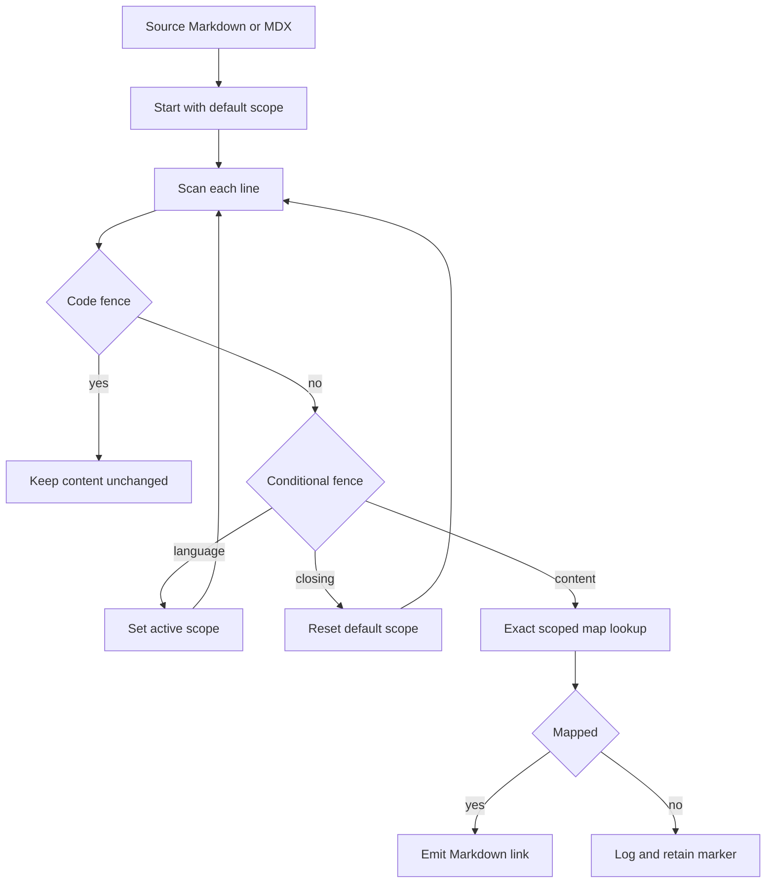

# Cross-References

`@[ref]` is source-level Markdown/MDX syntax for a semantic API-reference link. Rather than hard-coding a destination URL into every page, authors name an API symbol and preprocessing resolves it from the map for the active language scope. This keeps destination ownership in `pipeline/preprocessors/link_map.py` and lets shared content point at different Python and JavaScript reference sites.

## Two complementary checks

Cross-reference validation and rendered Mintlify link validation answer different questions:

- `make check-cross-refs` reads authored `.md` and `.mdx` below `src/` and verifies that each symbolic `@[...]` lookup exists in every scope in which that source can be built. It validates the source name against the local map; it does not build the site or follow the final URL.
- `make broken-links` builds `build/` and runs `mint broken-links --check-redirects` against that rendered tree, after filtering documented exclusions. It checks ordinary rendered links and redirect destinations, but cannot establish whether source-level symbolic references were complete before preprocessing. Use `make broken-links-with-anchors` when anchors also matter.

Run `make check-cross-refs` whenever changing a reference or map entry. Run a Mintlify check when changing ordinary links, routes, redirects, or anchors. A passing check in either category is not a substitute for the other.

## Authoring references

Outside a regular fenced code block, the resolver recognizes these forms:

```markdown
Use @[StateGraph] to define a graph.
Read @[the graph reference][StateGraph].
Pass @[`StateGraph`] to make code formatting part of the link text.
```

<!-- openwiki: broken internal link [url] file "url" does not exist. Fix the href or restore the target, then delete this comment. -->
<!-- openwiki: broken internal link [url] file "url" does not exist. Fix the href or restore the target, then delete this comment. -->
A successful lookup emits `[title](url)`. The first form uses `StateGraph` as its title, the second uses the supplied title, and the simple backticked form emits ``[`StateGraph`](url)``. A titled reference may wrap its lookup name in backticks, but that does not add backticks to the custom title.

Use a backslash when the marker itself must be shown rather than resolved:

```markdown
Write \@[StateGraph] when documenting the syntax.
```

The resolver does not transform an escaped marker, then its final unescape pass removes the backslash. The rendered result is literal `@[StateGraph]`, including when the escaped marker occurs in a fenced code block.

## Resolution lifecycle and exact scoped lookup

`preprocess_markdown()` determines a target language from its explicit argument, otherwise `TARGET_LANGUAGE`, otherwise `python`. That target is the default reference scope unless a separate `default_scope` is supplied. It resolves references **before** CTA UTM decoration and conditional rendering, because it must read conditional fences before rendering removes non-target branches.


```mermaid
flowchart TD
    Input["Source Markdown or MDX"] --> Initial["Start with default scope"]
    Initial --> Scan["Scan each line"]
    Scan --> Code{"Code fence"}
    Code -->|"yes"| Preserve["Keep content unchanged"]
    Code -->|"no"| Conditional{"Conditional fence"}
    Conditional -->|"language"| SetScope["Set active scope"]
    Conditional -->|"closing"| Reset["Reset default scope"]
    Conditional -->|"content"| Lookup["Exact scoped map lookup"]
    SetScope --> Scan
    Reset --> Scan
    Lookup --> Found{"Mapped"}
    Found -->|"yes"| Link["Emit Markdown link"]
    Found -->|"no"| Literal["Log and retain marker"]
```

This shows the line-oriented resolver before conditional rendering selects content for one language.

A line matching `:::python` or `:::js` changes the scope for following lines; a bare `:::` resets it to the default. The fence remains for the later conditional-rendering pass. Lookup is an exact dictionary lookup: spelling and case must match the map key. Different maps may intentionally associate the same name with different URLs. Repair a moved API destination in the map rather than replacing semantic references across consumer pages.

### MCP aliases in Python and JavaScript branches

MCP documentation is a representative shared-page case. Both scoped maps define `MCPAdapter`, so @[`MCPAdapter`] can be used in each language branch and resolve to that language's reference site. Method names are deliberately language-specific: use @[`MCPAdapter.list_tools`] in a `:::python` block and @[`MCPAdapter.listTools`] in a `:::js` block. The MCP overview and tools pages follow this pattern alongside `create_agent` and `createAgent` references.

Do not place a Python-only method alias in an unfenced shared OSS paragraph: the validator requires shared unfenced references to resolve in both maps. Put language-specific API names in their corresponding conditional block. Conversely, adding a common alias to both maps is appropriate only when the same authored semantic name is intended to work in both builds.

Do not author a `global` scope. If it reaches the resolver, it logs an error and falls back to the Python map; a combined global resolver is not implemented.

### Code-fence boundary

The resolver checks for a stripped line beginning with three or more backticks or tildes and toggles an in-code state for every such line. It leaves fence lines and enclosed content unchanged, so a conditional-looking line in a code sample cannot alter the active scope. This is a simple toggle rather than full fence matching: delimiters need not match by character or length, and an unclosed recognized fence prevents resolution for the rest of the file. Keep fences balanced.

## Link-map ownership and changes

`LINK_MAPS` is the editable registry. Each entry supplies a `scope`, a `host`, and a `links` dictionary of author-facing names to paths or URLs. At import time, `_enumerate_links()` combines entries for each supported scope into `SCOPE_LINK_MAPS`: it prefixes a relative value with that entry's host and retains values beginning with `http` as absolute URLs. The resolver reads only the flattened Python or JS map.

To add or correct a destination:

1. Determine the API destination and the scope or scopes that should resolve it.
2. Add the exact symbolic name under the applicable `LINK_MAPS` entry in `pipeline/preprocessors/link_map.py`. Prefer a path relative to that entry's host; use an absolute URL only for a destination outside it.
3. For an unfenced shared `oss/` page, ensure the name exists in both language maps. If it is language-specific, put the use inside the corresponding `:::python` or `:::js` block.
4. Run the source validator and focused tests.

An unresolved reference does not stop preprocessing. `_transform_link()` writes an info-level log with the file path, line, name, and active scope, then leaves the original marker unchanged. This makes a build inspectable, but it is not a successful documentation change.

## Source validation gate

```bash
make check-cross-refs
```

The target runs `scripts/check_cross_refs.py`, which recursively scans `.md` and `.mdx` files under `src/`. It reports each unresolved item with source-relative file, line, reference name, and applicable scopes, then exits 1; it exits 0 with no errors. The `check-cross-refs` CI job installs the test dependency group and runs this command.

### Checker scope rules

The checker derives defaults from the source-relative path rather than a build environment:

| Location | Required scope for an unfenced reference |
| --- | --- |
| `oss/python/` | `python` |
| `oss/javascript/` | `js` |
| Other `oss/` content | both `python` and `js` |
| Non-OSS content | `python` |

A `:::python` or `:::js` fence narrows checking to that supported scope. A closing or unsupported conditional fence restores the file's default scopes. Shared unfenced OSS content must resolve in **all** applicable maps—not merely one—because it is built for both variants.

The checker reuses the resolver's reference and code-fence patterns. It ignores escaped markers and content inside recognized regular code fences, skips `snippets/code-samples/` and paths containing `node_modules`, and warns then skips files that are not valid UTF-8. An unclosed recognized code fence therefore excludes the rest of that file from validation as well. Put deliberately unknown example markers in a code fence or escape them.

## Related build behavior

Cross-reference resolution produces an API-reference URL; it is separate from the builder's rewriting of authored site routes. After markdown preprocessing, a language-targeted build rewrites Markdown and HTML links to ordinary absolute `/oss/...` routes as `/oss/python/...` or `/oss/javascript/...`. It does not add a second language segment to an already-prefixed route and keeps `/oss/deepagents/code/...` and `/oss/openwiki/...` language-agnostic. Use `@[Name]` for a mapped API destination and ordinary Markdown links for documentation routes.

Shared MDX snippets are processed once per target language and emitted under `build/snippets/python/` and `build/snippets/javascript/`; their `/oss/` links become absolute language-prefixed routes. Versioned pages importing an unprefixed `/snippets/` `.md` or `.mdx` file are redirected to the matching copy, while the original snippet path keeps Python-targeted content for unversioned importers.

## Focused checks and troubleshooting

When changing the resolver, map, fence behavior, route rewriting, snippets, or validator, run:

```bash
uv run pytest tests/unit_tests/test_handle_auto_links.py tests/unit_tests/test_check_cross_refs.py tests/unit_tests/test_builder.py -vv
make check-cross-refs
```

The resolver tests cover replacement outside fences, preservation inside backtick and tilde fences, conditional-looking text in code, escapes, and unclosed fences. The checker tests cover path and fenced scope selection, shared-OSS all-scope checking, titled and backticked syntax, multiple references on one line, and exclusions. Builder tests cover language route insertion, preserved language-agnostic and already-prefixed routes, and language-specific snippet copies and imports.

| Symptom | Action |
| --- | --- |
| Literal `@[Name]` and an info log after preprocessing | Correct the name, select the intended scope, or add the scoped map entry. |
| Shared OSS reference fails validation | Add the name to both maps or put language-specific use in a language fence. |
| MCP method reference fails in one branch | Use `MCPAdapter.list_tools` in Python and `MCPAdapter.listTools` in JavaScript, then verify the corresponding map entry. |
| Example marker linked or failed validation | Escape it as `\@[Name]` or place it in a recognized code fence. |
| Later markers were not resolved | Look for an unclosed regular code fence earlier in the file. |
| A name resolves to the wrong destination | Correct the scoped `LINK_MAPS` entry; do not hard-code URLs in consuming pages. |
| Mintlify passes but a symbolic name fails | Run `make check-cross-refs`; rendered-link checking and map validation are separate gates. |

For pipeline ordering and conditional-content semantics, see [Documentation Preprocessing](/openwiki/concepts/preprocessing.md). For versioned route behavior, see [Versioning](/openwiki/concepts/versioning.md). For authoring workflow, see [Adding and Modifying Documentation Pages](/openwiki/operations/adding-pages.md). For the complete test strategy, see [Test Overview](/openwiki/testing/test-overview.md).
