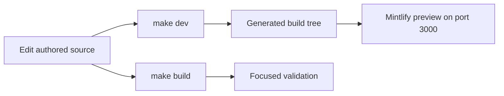

# Quickstart

This repository builds the Mintlify site at `docs.langchain.com` from authored `src/` content into generated `build/` output. The builder clears and recreates output for Python and JavaScript OSS variants, unversioned OpenWiki and Deep Agents Code, LangSmith, Managed Deep Agents variants, and shared files. **Edit `src/`, never `build/`.** When generated output is wrong, fix its authored source, configuration, or generator—not the artifact.

`reference.langchain.com` is a separate generated API-reference site and is not built here. Report a reference-site issue with this repository's reference-docs issue template rather than looking for a reference build output in this checkout.

## Start the local loop

The project requires Python 3.13 or later, Node.js, and `uv`. From a clone, install all dependency groups, project npm dependencies, and the global Mintlify CLI, then run the preview:

```bash
git clone https://github.com/langchain-ai/docs.git
cd docs
make install
make dev
```

Open <http://localhost:3000>. The development command runs an initial build unless `--skip-build` is supplied, starts a watcher for `src`, and runs `mint dev --port 3000` from `build`. It exits instead of serving stale output if the initial build fails. Use `--skip-build` only when a suitable existing build tree is intentional. If `mint` is missing, rerun `make install` or use `npm install -g mint@latest`.



This loop keeps editable source separate from disposable preview output.

## Route the change before editing

`src/docs.json` owns Mintlify site configuration, navigation, and redirects. It has two navigation products—**AGENT DEVELOPMENT LIFECYCLE** and **PRODUCTS AND SETUP**—whose visible labels do not always mirror source directories. For an ordinary page addition or move, find its precise product, menu item, language dropdown where applicable, tab, and group; update that route entry and preserve a redirect when a public URL changes.

| Change you are making | Start with | Also use |
| --- | --- | --- |
| Find an authored domain, emitted route family, navigation location, snippet boundary, or OpenAPI boundary | [Source Directory Map](/openwiki/architecture/source-map.md) | `src/docs.json` |
| Add, move, retire, or redirect a page | [Adding and Modifying Documentation Pages](/openwiki/operations/adding-pages.md) | `make build` and a route inspection |
| Change an ordinary LangSmith page, LLM Gateway, or Fleet / **No-code agents** page | `src/langsmith/`; Fleet remains under `src/langsmith/fleet/` | The exact lifecycle or setup navigation entry |
| Change shared OSS LangChain, LangGraph, or Deep Agents documentation | `src/oss/` | Verify Python and JavaScript output |
| Change OpenWiki or Deep Agents Code | `src/oss/openwiki/` or `src/oss/deepagents/code/` | Verify the one unversioned route family |
| Change a reusable fragment, image, or standalone example | `src/snippets/`, `src/images/`, or `src/code-samples/` | Do not register imported inputs as ordinary pages |
| Change a generated integration table or an external integration record | [Adding and Modifying Documentation Pages](/openwiki/operations/adding-pages.md) | [Testing Overview](/openwiki/testing/test-overview.md) |
| Change pipeline behavior, watcher behavior, links, cross-references, tracing guidance, or CI | [Testing Overview](/openwiki/testing/test-overview.md) | [GitHub Actions and CI/CD](/openwiki/integrations/github-actions.md) for workflow boundaries |

Most OSS documentation is generated into Python and JavaScript route variants, while OpenWiki and Deep Agents Code are unversioned output exceptions. Do not copy shared content into generated language directories. For the complete owner-to-route map, including Managed Deep Agents language variants, use [Source Directory Map](/openwiki/architecture/source-map.md).

Generated integration work has a different lifecycle from authored prose. CI regenerates `src/oss/python/integrations/providers/overview.mdx`; change `packages.yml` or `pipeline/tools/partner_pkg_table.py`, regenerate, and commit the result rather than editing that overview by hand. External-listing `docs_url` metadata has its own offline safety check.

## Validate the contract you changed

Run `make build` and inspect the relevant rendered route and navigation for any page, route, navigation, asset, shared-input, or preprocessing change. Then choose the narrowest additional check that reaches the affected contract:

| Change boundary | Run | What a pass establishes |
| --- | --- | --- |
| Generated pages, routes, links, or anchors | `make broken-links-with-anchors` | Builds first, then checks actionable generated links and anchors. Use `make broken-links` when anchors are out of scope. |
| Source `@[ref]` references | `make check-cross-refs` | Source references resolve in their applicable language-aware link-map scopes. |
| Pipeline, parser, routing, watcher, or repository-wide documentation contract | `make test` | Pytest runs `tests/unit_tests` with network sockets disabled except Unix sockets. Narrow a regression with `make test TEST_FILE=tests/unit_tests/test_builder.py`. |
| OpenTelemetry or OTLP guidance | `make test` | Authored MDX endpoint rules and mocked exporter behavior remain valid without a network request. |
| Runnable material in `src/code-samples/` | `make test-code-samples FILES="src/code-samples/langchain/return-a-string.py"` | The selected sample runs in its real toolchain and environment. Omit `FILES` for all eligible samples. |
| Python tooling or spelling | `make lint` | Ruff format/check, `ty`, and Codespell pass. |
| Prose | `make lint_prose` | The repository-pinned Vale binary validates source prose. |
| External integration-listing `docs_url` metadata | `uv run python scripts/refresh_integration_downloads.py --check-docs-urls` | URL schemes are safe; this operation makes no network requests or writes. |
| Generated Python provider overview | `uv run python pipeline/tools/partner_pkg_table.py` | The committed overview agrees with the generator and package metadata. |

The OpenTelemetry test scans every authored `.mdx` file. A generic `OTEL_EXPORTER_OTLP_ENDPOINT` must be a base URL, not a URL with `/v1/traces`, `/v1/metrics`, or `/v1/logs`; a Collector trace URL uses `traces_endpoint` rather than generic `endpoint`. Mocked exporter cases ensure that the generic base receives `/v1/traces` exactly once, while `OTEL_EXPORTER_OTLP_TRACES_ENDPOINT` preserves a complete traces URL.

Core CI runs on pull requests, pushes to `main`, and manual dispatch. It runs test, lint, and link workflows and separately checks cross-references, external integration URLs, generated files, and merge-conflict markers. Reproduce a failed CI gate with its corresponding local target; see [Testing Overview](/openwiki/testing/test-overview.md) for its boundaries and failure meaning.

## Integration and CI boundaries

Integration-listing automation is maintainer-gated: manual dispatch or an `integration-run` label event starts it, the workflow verifies that the triggering actor has admin, maintain, or write permission, and it opens a review pull request only when the agent produced changes. Use [GitHub Actions and CI/CD](/openwiki/integrations/github-actions.md) before changing an event trigger, permissions, checkout behavior, or a workflow that writes GitHub state.

## Before opening a pull request

- Confirm every edit is at its source owner under `src/`, a documented generator/configuration owner, or a pipeline/script owner—never `build/`.
- For a new, moved, or removed page, update the exact `src/docs.json` entry and redirect retired public URLs.
- Run `make build`, inspect the emitted route and navigation, and run the focused checks in the matrix.
- Add or update focused tests for pipeline behavior and repository-wide documentation contracts; preview rendering alone does not establish them.
- Test code examples before publishing and keep secrets out of pages, commands, issues, and commits.
