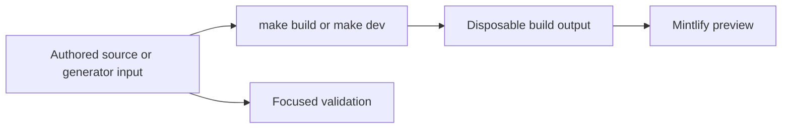

# Quickstart

This repository builds the Mintlify site at [docs.langchain.com](https://docs.langchain.com) from authored inputs in `src/`. The build pipeline recreates `build/`, which Mintlify serves and deploys: **never edit `build/`**. API reference at [reference.langchain.com](https://reference.langchain.com/python/) is generated outside this repository; use the [reference documentation issue template](https://github.com/langchain-ai/docs/issues/new?template=04-reference-docs.yml) to report a problem there.



This flow separates editable inputs from derived preview and publication artifacts.

## Set up and preview

Use Python 3.13 or later, Node.js, and `uv`:

```bash
git clone https://github.com/langchain-ai/docs.git
cd docs
make install
make dev
```

`make install` synchronizes all Python dependency groups, installs project npm dependencies and the global Mintlify CLI, and links Claude Code skills. Open <http://localhost:3000>. `make dev` performs an initial build, watches `src/`, and launches `mint dev --port 3000` from `build/`. It exits if that initial build fails, rather than serving stale output. Use `uv run pipeline dev --skip-build` only when a suitable existing build already exists. Use `make build` when navigation, configuration, a generator input, or a broad route change calls for a clean reconstruction.

Read `AGENTS.md` before editing. It contains the repository-wide rules; task-specific procedures are in `.agents/skills/*/SKILL.md`. Claude Code reads linked skills under `.claude/skills/`, so run `make skills` after adding or renaming a skill.

## Find the owning input

`src/` is the authored tree, but source location, emitted URL, and navigation placement are separate concerns. `src/docs.json` is the Mintlify configuration, navigation, redirect, and configured-OpenAPI source of truth. Add a new authored route there; when a public route moves or is removed, maintain a redirect instead of leaving a duplicate page.

| Change | Edit this owner | Route or boundary to check |
| --- | --- | --- |
| Shared LangChain, LangGraph, or most Deep Agents content | `src/oss/` | The builder emits Python and JavaScript variants under `/oss/python/...` and `/oss/javascript/...`. Inspect both. |
| Language-specific integrations or content | `src/oss/python/` or `src/oss/javascript/` | Only the matching language route is emitted; the source language directory is not repeated in the output route. |
| OpenWiki | `src/oss/openwiki/` | One unversioned `/oss/openwiki/...` route. Conditional content resolves as Python. |
| Deep Agents Code | `src/oss/deepagents/code/` | One unversioned `/oss/deepagents/code/...` route. Conditional content resolves as Python. |
| Ordinary LangSmith documentation | `src/langsmith/` | One unversioned `/langsmith/...` route. Navigation labels can differ from directories: **No-code agents** is sourced from `langsmith/fleet/`. |
| Managed Deep Agents | Direct `src/langsmith/managed-deep-agents*.mdx` files | Python and JavaScript `/langsmith/...` variants; unversioned URLs redirect to Python. |
| Reusable content or static assets | `src/snippets/`, `src/images/`, `src/fonts/`, or shared root inputs | Shared build inputs, not ordinary public pages. Verify consumers after a build. |
| Mintlify API endpoint reference | An OpenAPI spec or its configured remote source | Mintlify creates endpoint pages during deployment, not as authored MDX or local `build/` pages. |

The current navigation has two products. **AGENT DEVELOPMENT LIFECYCLE** contains Home, Build, Test, Deploy, and Monitor. **PRODUCTS AND SETUP** contains LangSmith setup, LLM Gateway, No-code agents, Engine, and Deep Agents Code. Build mixes OSS and LangSmith sources and has Python and TypeScript dropdowns; do not infer a source directory from a menu label. Find a neighboring entry in the relevant `docs.json` group and update that placement deliberately.

For the complete source-to-route and navigation map, see [Source Directory Map](/openwiki/architecture/source-map.md). For a page add, move, or retirement procedure, see [Adding and Maintaining Documentation Pages](/openwiki/operations/adding-pages.md).

## Change derived content at its input

`build/` is always generated. A few committed source-tree files are also derived; change their owner and regenerate them rather than hand-editing their output.

- **Python provider overview:** `src/oss/python/integrations/providers/overview.mdx` is generated from `packages.yml` and `pipeline/tools/partner_pkg_table.py`. Change an input, then run:

  ```bash
  uv run python pipeline/tools/partner_pkg_table.py
  ```

  CI regenerates it and rejects a diff, so a direct edit will not pass.

- **Runnable samples and snippets:** Author runnable files in `src/code-samples/`. `make test-code-samples` executes those source files; `make code-snippets` extracts an intermediate and generates importable MDX snippets. Do not hand-edit the generated snippet output. For example:

  ```bash
  make test-code-samples FILES="src/code-samples/langchain/return-a-string.py"
  make code-snippets
  ```

- **Integration listings:** Hosted integration frontmatter and external metadata feed generated discovery tables. Validate permitted documentation URL schemes without writing with:

  ```bash
  uv run python scripts/refresh_integration_downloads.py --check-docs-urls
  ```

- **API reference:** The public reference site is outside this repository. For Mintlify OpenAPI sections, change the committed or configured specification—not generated endpoint pages.

## Run the smallest relevant check

Build and inspect the affected route after changing authored pages, navigation, assets, preprocessors, or generator inputs. Then choose the narrowest validation boundary; a passing unrelated check does not establish the changed boundary.

| Boundary | Command | What it checks |
| --- | --- | --- |
| Pipeline, parser, watcher, or generator | `make test TEST_FILE=tests/unit_tests/path_or_test.py` | Pytest with network sockets disabled except Unix sockets. Omit `TEST_FILE` for the unit-test tree. |
| Finished prose | `make lint_prose FILES="src/path/to/page.mdx"` | Vale with the pinned binary. |
| Python tooling and spelling | `make lint` | Ruff formatting and checks, `ty`, and Codespell. |
| Built routes, links, anchors, and redirects | `make broken-links-with-anchors` | A fresh build followed by Mintlify link, anchor, and redirect checking. |
| Authored `@[ref]` references | `make check-cross-refs` | Source reference mappings, independently of rendered-link checking. |
| Runnable sample and generated snippet | `make test-code-samples FILES="..."`; `make code-snippets` | The executable input, then regenerated snippet MDX. |
| Integration external metadata | `uv run python scripts/refresh_integration_downloads.py --check-docs-urls` | Permitted `docs_url` schemes without writes. |
| Provider overview | `uv run python pipeline/tools/partner_pkg_table.py` | Output agrees with generator inputs. |

Core CI runs on pushes to `main`, pull requests, and manual dispatch. It includes unit testing, linting, anchor-aware link checking, source cross-reference validation, external integration URL validation, generated provider-overview verification, and merge-conflict-marker detection.

## Before opening a pull request

- Confirm every change is in authored content, configuration, metadata, or a generator input—not `build/` or a generated API endpoint page.
- Add navigation for each new authored page in `src/docs.json`; add redirects for a moved or retired public route.
- Inspect every emitted language variant required by the source family.
- Regenerate and review derived files after changing their inputs.
- Run focused checks and disclose any unavailable credentials or live-service dependency.

## Task-routing map

Use the focused page for the problem at hand:

- [Build System Architecture](/openwiki/architecture/build-system.md) — build order, routing, preprocessing, and incremental rebuilds.
- [Source Directory Map](/openwiki/architecture/source-map.md) — source domains, routes, navigation, redirects, and generated API surfaces.
- [Local Development Workflow](/openwiki/workflows/local-development.md) — watch/preview lifecycle, recovery, and route inspection.
- [Adding and Maintaining Documentation Pages](/openwiki/operations/adding-pages.md) — page ownership, navigation, redirects, and generated-content procedures.
- [Testing Overview](/openwiki/testing/test-overview.md) — test boundaries and failure semantics.
- [GitHub Actions and CI/CD](/openwiki/integrations/github-actions.md) — CI gates and trusted automation.
