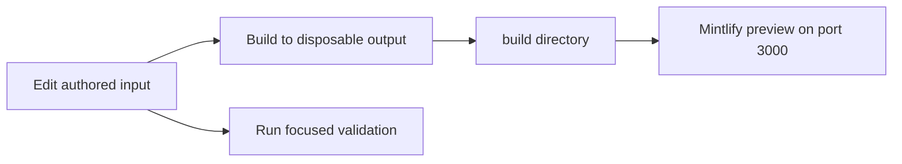

# Quickstart

Use this page to choose the right starting point, not as a replacement for the detailed workflow pages. This repository builds the Mintlify site at `docs.langchain.com`: authored inputs in `src/` flow through the pipeline to disposable `build/` output. Edit the authored source, configuration, or generator that owns a change—**never `build/` or another generated artifact**.

## Start a local preview

Python 3.13 or later, Node.js, and `uv` are required. From a clone:

```bash
git clone https://github.com/langchain-ai/docs.git
cd docs
make install
make dev
```

`make install` synchronizes all Python dependency groups, installs npm dependencies and the global Mintlify CLI, and links skills for Claude Code. Open <http://localhost:3000> after `make dev` starts. The command builds first, watches `src/`, and runs `mint dev --port 3000` from `build`; an initial build failure stops the command rather than serving stale output. Use `--skip-build` only when deliberately reusing an existing build tree.



This flow separates editable inputs from generated preview output.

For watcher behavior, full-build recovery, direct CLI entrypoints, and Mint command working-directory rules, see [Local Development Workflow](/openwiki/workflows/local-development.md).

## Route the change before editing

First read `AGENTS.md`: it contains rules that apply to every edit, including the `src/`/`build/` boundary and the requirement to update `src/docs.json` for a new page. Then select the task-specific procedure in the canonical `.agents/skills/` tree. Most supported agents discover that tree directly; Claude Code reads linked skills under `.claude/skills/`, which `make skills` creates and maintains. `AGENTS.md` and its byte-identical `CLAUDE.md` own universal rules; skills own conditional procedures.

| If the task is... | Start here | Work at the owner |
| --- | --- | --- |
| Add, move, rename, delete, redirect, or navigate a page | [`add-docs-page` and Adding and Modifying Documentation Pages](/openwiki/operations/adding-pages.md) | The source MDX, exact `src/docs.json` entry, and redirects for retired public URLs |
| Revise existing prose or review a working-tree/PR change | `docs-edit`, `docs-team-voice`, or `docs-review` | The authored page and its task procedure |
| Find the source behind a visible route or product label | [Source Directory Map](/openwiki/architecture/source-map.md) | The actual source owner; navigation labels do not determine directories |
| Change standard shared OSS content | [Source Directory Map](/openwiki/architecture/source-map.md) | `src/oss/`; inspect Python and JavaScript output |
| Change OpenWiki or Deep Agents Code | [Source Directory Map](/openwiki/architecture/source-map.md) | `src/oss/openwiki/` or `src/oss/deepagents/code/`; each is an unversioned route family |
| Change LangSmith or No-code agents content | [Source Directory Map](/openwiki/architecture/source-map.md) | `src/langsmith/`; No-code agents is sourced from `src/langsmith/fleet/` |
| Change a runnable example | `docs-code-samples` and [Testing Overview](/openwiki/testing/test-overview.md) | `src/code-samples/`, then regenerate derivative snippets |
| Change an integration listing, generated provider overview, pipeline, or CI | [Integration Listing Automation](/openwiki/workflows/integration-listing-automation.md), [Testing Overview](/openwiki/testing/test-overview.md), or [GitHub Actions and CI/CD](/openwiki/integrations/github-actions.md) | The metadata/generator, `pipeline/`, `scripts/`, or workflow—not its generated result |
| Add or revise an agent procedure | [Agent Authoring Skills](/openwiki/operations/agent-skills.md) | `.agents/skills/<name>/SKILL.md` and its catalogue/structural checks |

`src/docs.json` is the source of truth for Mintlify site configuration, navigation, and redirects. It is distinct from source ownership: select the authored directory and emitted route model first, then register the page in its exact configuration location. Most OSS material produces Python and JavaScript variants; OpenWiki and Deep Agents Code intentionally build once without a language segment.

## Respect generated-input boundaries

A generated file can be a review artifact or a committed output, but it is not automatically its own authoring surface.

- **Build output:** `DocumentationBuilder` clears and recreates `build/`, emitting language variants, unversioned OpenWiki and Deep Agents Code, LangSmith content, Managed Deep Agents variants, and shared files.
- **Runnable samples:** execute changed source below `src/code-samples/` with `make test-code-samples FILES="..."`, then run `make code-snippets`. The latter generates `src/code-samples-generated/` and importable MDX below `src/snippets/code-samples/`; edit neither derivative.
- **Python provider overview:** change `packages.yml` or `pipeline/tools/partner_pkg_table.py`, run `uv run python pipeline/tools/partner_pkg_table.py`, and commit the regenerated overview. CI rejects a resulting diff when the overview was changed by hand.

Sample execution is deliberately separate from the socket-isolated unit suite: it executes selected supported source files in their real toolchains and inherited environment, and can need provider credentials or PostgreSQL. The code-sample workflow skips fork pull requests because secrets are unavailable; internal pull requests run changed supported samples, while scheduled or manual full runs test all samples, enable tracing, regenerate snippets after success, and may update the trace-refresh pull request. Follow the detailed testing workflow before changing tracing or write-capable automation.

## Validate the boundary you changed

Build and inspect the affected route after a content, navigation, routing, shared-input, or preprocessing change. Then run the narrowest repository-defined check that covers the changed contract.

| Change boundary | Run |
| --- | --- |
| Pipeline, parser, watcher, skill contract, or repository rule | `make test` (narrow with `TEST_FILE=...`) |
| Generated routes, links, and anchors | `make broken-links-with-anchors` |
| Source `@[ref]` references | `make check-cross-refs` |
| Runnable sample | `make test-code-samples FILES="..."` |
| Changed sample presentation | `make code-snippets` |
| Python tooling and source spelling | `make lint` |
| Authored prose | `make lint_prose` |
| Provider overview | `uv run python pipeline/tools/partner_pkg_table.py` |

`make test` runs pytest against `tests/unit_tests` with network sockets disabled except Unix sockets. `make broken-links-with-anchors` builds first, then checks generated links and anchors; `make check-cross-refs` checks source references separately. `make lint` runs Ruff, `ty`, and Codespell, while `make lint_prose` installs and runs the pinned Vale binary on source prose.

Core CI runs on pull requests, pushes to `main`, and manual dispatch. It invokes the test target alongside separate lint, link, cross-reference, generated-file, external-URL, and merge-conflict checks. Reproduce the applicable gate locally; do not expand a narrow prose-only edit into every expensive validation target without a changed boundary that needs it.

## Next pages

- [Source Directory Map](/openwiki/architecture/source-map.md) — authored ownership, emitted routes, navigation, and redirects.
- [Adding and Modifying Documentation Pages](/openwiki/operations/adding-pages.md) — page lifecycle, redirects, and generated-input procedures.
- [Agent Authoring Skills](/openwiki/operations/agent-skills.md) — skill selection, discovery, and maintenance.
- [Local Development Workflow](/openwiki/workflows/local-development.md) — preview lifecycle and recovery.
- [Testing Overview](/openwiki/testing/test-overview.md) — focused tests, live samples, and CI triage.
- [GitHub Actions and CI/CD](/openwiki/integrations/github-actions.md) — workflow boundaries and operational permissions.
