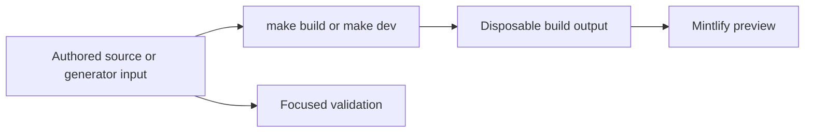

# Quickstart

This repository builds the Mintlify site at [docs.langchain.com](https://docs.langchain.com) from authored inputs in `src/`. The pipeline recreates `build/`, so it is a disposable preview and deployment artifact, **not an editing surface**. API reference at [reference.langchain.com](https://reference.langchain.com/python/) is generated outside this repository; report problems through the [reference documentation issue template](https://github.com/langchain-ai/docs/issues/new?template=04-reference-docs.yml).



This flow separates durable inputs from derived preview and publication artifacts.

## Set up and preview

Use Python 3.13 or later, Node.js, and `uv`:

```bash
git clone https://github.com/langchain-ai/docs.git
cd docs
make install
make dev
```

`make install` synchronizes all Python dependency groups, installs project npm dependencies and the global Mintlify CLI, and links Claude Code skills. Open <http://localhost:3000>. `make dev` performs an initial build, watches `src/`, and starts `mint dev --port 3000` from `build/`. It exits rather than serving stale output when the initial build fails. Use `uv run pipeline dev --skip-build` only when a suitable build already exists; use `make build` for a clean reconstruction.

Read `AGENTS.md` before editing. It is the repository-wide authoring guide. Task-specific procedures live in `.agents/skills/`; Claude Code reads their linked `.claude/skills/` tree, so run `make skills` after adding or renaming a skill.

## Route the change to its owner

`src/` is the authored tree, but source location, emitted route, and navigation placement are separate concerns. `src/docs.json` is the Mintlify site-configuration and navigation source of truth. Add every new authored page there; preserve a moved or retired public URL with a redirect instead of an authored duplicate.

| Change | Edit this owner | Check the result |
| --- | --- | --- |
| Shared LangChain, LangGraph, or most Deep Agents content | `src/oss/` | Python and JavaScript routes under `/oss/python/...` and `/oss/javascript/...`. |
| Language-specific content or integrations | `src/oss/python/` or `src/oss/javascript/` | Only the corresponding language route. |
| OpenWiki | `src/oss/openwiki/` | One unversioned `/oss/openwiki/...` route. |
| Deep Agents Code | `src/oss/deepagents/code/` | One unversioned `/oss/deepagents/code/...` route. |
| Ordinary LangSmith documentation, including Engine | `src/langsmith/` | One unversioned `/langsmith/...` route. `fleet/` is labeled **No-code agents** in navigation. |
| Managed Deep Agents | Direct `src/langsmith/managed-deep-agents*.mdx` files | Python and JavaScript `/langsmith/...` variants; unversioned URLs redirect to Python. |
| Reusable content or assets | `src/snippets/`, `src/images/`, `src/fonts/`, or shared root inputs | Consumers and copied assets after a build. |
| Mintlify API endpoint reference | Configured OpenAPI spec or remote source | Endpoint pages are created at deployment, not authored MDX or local-build pages. |

The navigation has two products. **AGENT DEVELOPMENT LIFECYCLE** contains Home, Build, Test, Deploy, and Monitor. **PRODUCTS AND SETUP** contains LangSmith setup, LLM Gateway, No-code agents, Engine, and Deep Agents Code. Labels do not establish source ownership: Build combines OSS and LangSmith route families, and the Python and TypeScript Integrations tabs intentionally have different groups. Find a neighboring route in the intended `docs.json` array and mirror its shape deliberately.

For route rules, duplicated OpenWiki placement, Managed Deep Agents navigation and redirects, and the full source map, see [Source Directory Map](/openwiki/architecture/source-map.md) and [Versioned Documentation and Routes](/openwiki/concepts/versioning.md). For adding, moving, or retiring a page, see [Adding and Maintaining Documentation Pages](/openwiki/operations/adding-pages.md).

## Change derived content at its input

Do not use output as an alternate source:

- **`build/`:** regenerated by the documentation builder. Never edit it.
- **Python provider overview:** `src/oss/python/integrations/providers/overview.mdx` is generated from `packages.yml` and `pipeline/tools/partner_pkg_table.py`. Change an input, then run:

  ```bash
  uv run python pipeline/tools/partner_pkg_table.py
  ```

  Core CI regenerates the file and rejects a diff.
- **Runnable samples and snippets:** author executable samples in `src/code-samples/`. `make test-code-samples` runs them; `make code-snippets` extracts them and generates importable MDX. Do not edit generated snippet output.

  ```bash
  make test-code-samples FILES="src/code-samples/langchain/return-a-string.py"
  make code-snippets
  ```

- **Integration discovery listings:** update hosted-guide `integration:` frontmatter or `scripts/data/integration_external_docs.yaml`, rather than generated downloads and featured snippets. Check external documentation URLs before writing regenerated listings:

  ```bash
  uv run python scripts/refresh_integration_downloads.py --check-docs-urls
  uv run python scripts/refresh_integration_downloads.py --write
  ```

  The URL check accepts `https://`, `http://`, or a single-slash site-relative URL; it rejects unsafe schemes and protocol-relative URLs.
- **OpenAPI:** change the committed specification or configured remote source, not deployment-generated endpoint pages.

## Run the smallest relevant check

Build and inspect the affected route after changing authored pages, navigation, assets, preprocessors, or generator inputs. Then select the narrowest validation boundary.

| Boundary | Command | What it checks |
| --- | --- | --- |
| Pipeline, parser, watcher, generator, or skill | `make test TEST_FILE=tests/unit_tests/path_or_test.py` | Pytest with network sockets disabled except Unix sockets. Omit `TEST_FILE` for the unit-test tree. |
| Finished prose | `make lint_prose FILES="src/path/to/page.mdx"` | Vale using the pinned binary. |
| Python tooling and spelling | `make lint` | Ruff format/check, `ty`, and Codespell. |
| Built routes, links, anchors, and redirects | `make broken-links-with-anchors` | Fresh build, then Mintlify link, anchor, and redirect checking. |
| Authored `@[ref]` references | `make check-cross-refs` | Source reference mappings independently of rendered-link checking. |
| Runnable sample and generated snippet | `make test-code-samples FILES="..."`; `make code-snippets` | Executable source, then regenerated snippet MDX. |
| Integration external links | `uv run python scripts/refresh_integration_downloads.py --check-docs-urls` | Read-only validation of external listing URLs. |
| Provider overview | `uv run python pipeline/tools/partner_pkg_table.py` | Generated overview agrees with its inputs. |

Core CI runs on pushes to `main`, pull requests, and manual dispatch. It invokes the unit-test target and separate lint, link, cross-reference, generated-file, external integration URL, and merge-conflict checks.

## Before opening a pull request

- Confirm the change is in authored content, configuration, metadata, or a generator input—not `build/` or a generated endpoint page.
- Add navigation for each new authored page in `src/docs.json`; add redirects for moved or retired public routes.
- Inspect every output variant required by the source family.
- Regenerate and review derived files after changing their inputs.
- Run focused checks and disclose unavailable credentials or live-service dependencies.

## Task-routing map

- [Source Directory Map](/openwiki/architecture/source-map.md) — source ownership, emitted routes, navigation, redirects, and deployment-generated API surfaces.
- [Adding and Maintaining Documentation Pages](/openwiki/operations/adding-pages.md) — add, move, retire, or regroup a page without losing navigation or public routes.
- [Changing Versioned Content](/openwiki/workflows/versioned-content.md) — shared versus language-specific changes, links, snippets, and output-variant inspection.
- [Mintlify Integration](/openwiki/integrations/mintlify.md) — renderer handoff, deployment-generated OpenAPI, and local-validation limits.
- [Integration Listing Automation](/openwiki/workflows/integration-listing-automation.md) — metadata, generated listings, URL safety, and scheduled refresh automation.
- [Testing Overview](/openwiki/testing/test-overview.md) — validation boundaries and CI coverage.
- [Build System Architecture](/openwiki/architecture/build-system.md) and [Preprocessing](/openwiki/concepts/preprocessing.md) — builder orchestration and content transformations.
- [Code Sample Lifecycle](/openwiki/workflows/code-sample-lifecycle.md) — runnable samples, snippet extraction, tracing, and generated output.
