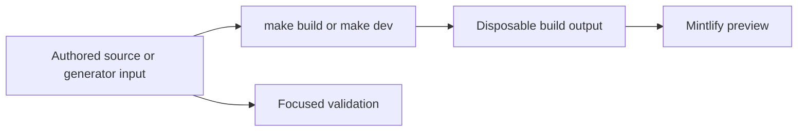

# Quickstart

This repository builds the Mintlify site at [docs.langchain.com](https://docs.langchain.com) from authored inputs in `src/`. The pipeline recreates `build/`, which Mintlify serves and deploys: **never edit `build/`**. The separate [reference.langchain.com](https://reference.langchain.com/python/) API-reference site is not built here; report its issues through the [reference documentation issue template](https://github.com/langchain-ai/docs/issues/new?template=04-reference-docs.yml).



This flow separates editable inputs from derived preview and publication artifacts.

## Set up a local preview

Use Python 3.13 or later, Node.js, and `uv`:

```bash
git clone https://github.com/langchain-ai/docs.git
cd docs
make install
make dev
```

`make install` synchronizes all Python dependency groups, installs project npm dependencies and the global Mintlify CLI, then links canonical `.agents/skills/` procedures into `.claude/skills/` for Claude Code. Open <http://localhost:3000>. `make dev` performs an initial build unless `--skip-build` is supplied, watches `src/`, and runs `mint dev --port 3000` from `build/`. An initial build failure stops the command instead of serving stale output. Use `uv run pipeline dev --skip-build` only when the existing generated tree is known to be suitable; use `make build` to reset it completely.

Read `CLAUDE.md` before changing documentation. It establishes the repository-wide rules: author under `src/`, update `src/docs.json` when adding a page, use Tabler icons, and test code examples. Task-specific procedures live in `.agents/skills/`; run `make skills` after adding or renaming a skill if using Claude Code.

## Route the change to its owner

`src/docs.json` is the Mintlify site-configuration source of truth: it owns navigation, redirects, and OpenAPI section registration. Builder routing and navigation are separate contracts: an emitted route is not automatically placed in a menu, and a navigation label is not a source directory. Add new pages to `docs.json`; when moving or removing a route, maintain a redirect rather than leaving duplicate content.

| Change | Editable input | Generated or operational boundary | First focused action |
| --- | --- | --- | --- |
| Ordinary OSS documentation | `src/oss/`, including shared LangChain, LangGraph, and Deep Agents content | Most shared OSS pages emit Python and JavaScript variants. | Inspect both emitted routes; see [Source Map](/openwiki/architecture/source-map.md). |
| OpenWiki or Deep Agents Code | `src/oss/openwiki/` or `src/oss/deepagents/code/` | Each is deliberately unversioned and uses the Python conditional-fence branch. | Inspect `/oss/openwiki/...` or `/oss/deepagents/code/...`, not both language variants. |
| LangSmith documentation | `src/langsmith/` | Ordinary pages emit under `/langsmith/...`; navigation may place them in Test, Deploy, Monitor, or Products and setup. The **No-code agents** label maps to the `fleet/` directory. | Change the page and its `docs.json` placement together. |
| Managed Deep Agents | `src/langsmith/managed-deep-agents*.mdx` | These sources do not emit ordinary unversioned LangSmith pages. They emit `/langsmith/python/...` and `/langsmith/javascript/...`; legacy unversioned URLs redirect to Python. | Inspect both variants and their language-specific links. |
| LangSmith REST reference | `scripts/process_langsmith_openapi.py` or its upstream API contract | `src/langsmith/langsmith-platform-openapi.json` is generated input for Mintlify's `langsmith/smith-api` OpenAPI section; endpoint pages are deployment-generated rather than local authored MDX. | Change processor policy or review the refresh, not generated endpoint pages. |
| Agent Server or Control Plane API reference | The committed Agent Server spec or configured Control Plane source in `src/docs.json` | Mintlify registers Agent Server from `langsmith/agent-server-openapi.json` and the Control Plane from its remote OpenAPI URL. | Run `make check-openapi` for an Agent Server spec change. |
| Runnable documentation sample | `src/code-samples/` | `src/code-samples-generated/` is an ignored extraction intermediate; `src/snippets/code-samples/` is generated MDX. | Test the source, regenerate snippets, and review the derivative diff; see [Code Sample Lifecycle](/openwiki/workflows/code-sample-lifecycle.md). |

For the complete source-to-route and navigation map, see [Source Map](/openwiki/architecture/source-map.md). For page moves, frontmatter, redirects, and navigation procedure, see [Adding and Maintaining Documentation Pages](/openwiki/operations/adding-pages.md).

## Generated inputs and runnable samples

### LangSmith REST OpenAPI

The checked-in `src/langsmith/langsmith-platform-openapi.json` is an OpenAPI 3.1 specification registered in the Monitor → Reference **LangSmith REST API** navigation group. A daily and manually dispatchable workflow runs:

```bash
uv run python scripts/process_langsmith_openapi.py --write
```

The processor fetches only the allowed LangSmith API host, hides Fleet and internal operations, and adds human-readable tag groups before writing the specification. The workflow opens or appends to one `chore/refresh-langsmith-openapi` pull request only when the processed file differs. Treat the processor and upstream service as the ownership boundary; do not hand-edit the JSON.

### MCP code-sample sources

Runnable samples are executable source, not just documentation fragments. Marked `:snippet-start:` / `:snippet-end:` regions become generated snippet MDX, while `:remove-start:` / `:remove-end:` can hide the local test harness without preventing it from running.

- `src/code-samples/langchain/mcp-multimodal-tool-content.py` has one visible snippet. It adapts a local MCP screenshot tool, invokes an agent, and illustrates reading text and standardized image blocks from `ToolMessage.content_blocks`; its hidden harness asserts that image content is present.
- `src/code-samples/langchain/mcp-tool-results.py` has two visible snippets in one runnable file. The error snippet shows a server tool error arriving as a `ToolMessage` with `status == "error"`, while transport failures still raise. The metadata snippet reads nested MCP annotations defensively and treats absent annotations as non-destructive. Its shared hidden calculator harness exercises the error path and checks the adapter metadata.

Test these source files before producing their snippets:

```bash
make test-code-samples FILES="src/code-samples/langchain/mcp-multimodal-tool-content.py src/code-samples/langchain/mcp-tool-results.py"
make code-snippets
```

`FILES` is a space-separated explicit list. Without it, the runner recursively executes supported Python, TypeScript, Java, Kotlin, Go, and shell samples. Samples inherit the environment and can require live-provider credentials or `POSTGRES_URI`; a full run is not an offline unit test. The multiple markers in `mcp-tool-results.py` also make it ineligible for public trace-link collection, which only publishes traces for successful single-snippet source files.

## Run the smallest relevant validation

Build and inspect the affected route after changing pages, navigation, shared assets, preprocessors, or generator inputs. Then select the narrowest check for the boundary changed.

| Boundary | Command | What it establishes |
| --- | --- | --- |
| Pipeline, parser, builder, watcher, or generator logic | `make test TEST_FILE=tests/unit_tests/path_or_test.py` | Pytest with network sockets disabled except Unix sockets. Omit `TEST_FILE` to run `tests/unit_tests`. |
| Finished prose | `make lint_prose FILES="src/path/to/page.mdx"` | Installs and runs the Vale binary pinned in `.mise.toml`; code samples are excluded. |
| Python tooling and source spelling | `make lint` | Ruff format/check, `ty`, and Codespell. |
| Built routes, redirects, links, and anchors | `make broken-links-with-anchors` | Rebuilds, then runs Mint from `build/` with anchor and redirect checks, filtering known non-actionable reports. |
| Authored `@[ref]` references | `make check-cross-refs` | Checks source reference mappings independently of Mint's rendered-link check. |
| Runnable sample and snippet derivative | `make test-code-samples FILES="..."` then `make code-snippets` | Executes selected sources, then regenerates MDX snippets. |
| Agent Server OpenAPI input | `make check-openapi` | Builds and runs Mint's OpenAPI validation for `langsmith/agent-server-openapi.json`. |
| LangSmith platform OpenAPI policy | `uv run python scripts/process_langsmith_openapi.py --input /path/to/openapi.json` | Previews processor-shaped output without overwriting the committed specification. |

`make broken-links-with-anchors`, `make check-cross-refs`, and sample execution cover different contracts; a pass in one does not replace the others. Raw Mint commands must run from `build/`, not the repository root. See [Testing Overview](/openwiki/testing/test-overview.md) for CI boundaries and failure semantics, and [Local Development Workflow](/openwiki/workflows/local-development.md) for preview recovery and incremental-build limits.

## Before opening a pull request

- Confirm edits target authored content, configuration, metadata, or a generator—not `build/` or a generated snippet as primary input.
- Update `src/docs.json` for added routes, navigation changes, and redirects.
- Inspect every emitted variant required by the source family.
- For an MCP sample, keep visible markers and its executable hidden harness aligned; run the focused sample command before regeneration.
- Run the checks that directly cover the changed boundary, and disclose unavailable credentials or external-service dependencies.

## Related pages

- [Build System Architecture](/openwiki/architecture/build-system.md)
- [Source Map](/openwiki/architecture/source-map.md)
- [Testing Overview](/openwiki/testing/test-overview.md)
- [Code Sample Lifecycle](/openwiki/workflows/code-sample-lifecycle.md)
- [Local Development Workflow](/openwiki/workflows/local-development.md)
