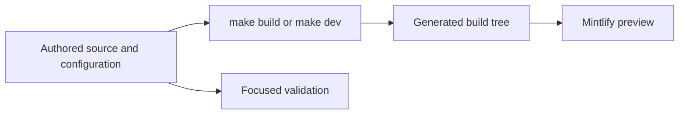

# Quickstart

This repository builds the Mintlify site at [docs.langchain.com](https://docs.langchain.com). Authored documentation, configuration, assets, and generator inputs live in `src/`, `pipeline/`, and related input locations; the pipeline recreates the Mintlify-facing `build/` tree. A full `DocumentationBuilder` run clears that tree, emits Python and JavaScript OSS variants, unversioned OpenWiki and Deep Agents Code content, LangSmith and Managed Deep Agents content, and shared files. **Edit an authored input, configuration file, or generator—never `build/` or another generated artifact.** `reference.langchain.com` is generated outside this repository; use the reference-docs issue template for problems there.



This boundary keeps the editable sources distinct from the disposable preview and deployment output.

## Set up and preview

The checkout requires Python 3.13 or later, Node.js, and `uv`. `make install` synchronizes all Python dependency groups, installs project npm dependencies and the global Mintlify CLI, and links skills for Claude Code.

```bash
git clone https://github.com/langchain-ai/docs.git
cd docs
make install
make dev
```

Open <http://localhost:3000>. `make dev` installs project npm dependencies, then runs the development command. Unless `--skip-build` is supplied, it builds before starting a `src/` watcher and `mint dev --port 3000` from `build/`. A failed initial build exits rather than serving a stale tree. Use `uv run pipeline dev --skip-build` only when an existing build is known to be suitable.

Use `make build` after a navigation, routing, shared asset, snippet component, preprocessing, or deletion change—or whenever the incremental preview looks stale. A full build clears and reconstructs `build/`; repairing generated output directly will not survive the next build. See [Local Development Workflow](/openwiki/workflows/local-development.md) for watcher behavior, recovery, and raw Mint commands.

## Route the change before editing

Start with `AGENTS.md` for repository-wide rules. Then open the procedure matching the task in `.agents/skills/`. That directory is the canonical skill tree: most supported agents read it directly; Claude Code reads linked entries under `.claude/skills/`, which `make skills` creates and reconciles. `AGENTS.md` and byte-identical `CLAUDE.md` hold universal constraints; skills hold conditional, task-specific workflows.

| Change | Start with | Authoritative input and required follow-up |
| --- | --- | --- |
| Add, move, rename, remove, or redirect a page | `add-docs-page` and [Adding and Modifying Documentation Pages](/openwiki/operations/adding-pages.md) | Change the source page, the exact `src/docs.json` navigation entry, and redirects for retired public routes. |
| Edit a page that already has a pull request | `docs-edit` | Work on the pull request's head branch and inspect its real diff. |
| Draft or substantially revise prose; review final prose | `docs-team-voice`, then `docs-review` | Preserve factual identifiers and run focused prose checks. |
| Find a page's source or understand language routes | [Source Directory Map](/openwiki/architecture/source-map.md) | Choose the source owner by route behavior, not a visible menu label. |
| Add or revise a runnable example | `docs-code-samples` and [Testing Overview](/openwiki/testing/test-overview.md) | Edit `src/code-samples/`, execute it, then regenerate its snippet artifacts. |
| Change a skill or its catalogues | [Agent Authoring Skills](/openwiki/operations/agent-skills.md) | Edit `.agents/skills/<name>/SKILL.md`; update catalogues and run its structural test. |
| Change the renderer configuration, navigation, redirects, or publication boundary | [Mintlify Integration](/openwiki/integrations/mintlify.md) | Edit `src/docs.json` and its authored inputs, then build and inspect emitted routes. |
| Change a generated integration listing, build logic, or CI | [Source Directory Map](/openwiki/architecture/source-map.md) and [Testing Overview](/openwiki/testing/test-overview.md) | Change the metadata or generator in `pipeline/`, `scripts/`, or `packages.yml`, not generated results. |

`src/docs.json` is the Mintlify configuration, navigation, and redirect source of truth. It determines visible products, menus, dropdowns, tabs, and groups; these labels need not mirror source directories. For example, `src/langsmith/fleet/` is shown as **No-code agents**. A new page needs an extensionless emitted route in the relevant navigation structure; a moved public route needs the applicable redirect.

Most shared OSS documentation emits both Python and JavaScript routes. `src/oss/openwiki/` and `src/oss/deepagents/code/` are intentional unversioned exceptions. Inspect both outputs for shared or Managed Deep Agents content, but inspect only the unversioned route for those exceptions. The source map explains the route model and navigation hierarchy.

## Respect generated-artifact ownership

Generated output can be committed under `src/` but is still not hand-authored.

- **Provider overview:** `src/oss/python/integrations/providers/overview.mdx` is regenerated from `packages.yml` and `pipeline/tools/partner_pkg_table.py`. Change an input and regenerate it; CI rejects a resulting diff.
- **Code snippets:** runnable files under `src/code-samples/` are source. `make code-snippets` extracts them through `src/code-samples-generated/` and creates importable MDX under `src/snippets/code-samples/`. Do not edit either derivative directly.
- **Integration tables and other generated surfaces:** locate and change their metadata or generator, then run its documented regeneration command. Use [Adding and Modifying Documentation Pages](/openwiki/operations/adding-pages.md) for the input and validation sequence.

Run a changed sample before regeneration:

```bash
make test-code-samples FILES="src/code-samples/langchain/return-a-string.py"
make code-snippets
```

With `FILES` omitted, the runner selects eligible Python, TypeScript, Java, Kotlin, Go, and shell files below `src/code-samples/`. This is deliberately separate from socket-isolated unit testing: sample execution inherits its environment and can need provider credentials or PostgreSQL. CI skips fork pull requests because secrets are unavailable, tests changed supported files on internal pull requests, and uses scheduled or manual full runs for all samples, trace collection, snippet regeneration, and the trace-refresh pull request after successful steps.

## Validate the boundary you changed

Build and inspect the affected route after an authored page, route, navigation, asset, shared input, or preprocessing change. Then choose the narrowest additional check that reaches the changed contract.

| Changed boundary | Command | What it establishes |
| --- | --- | --- |
| Pipeline, parser, watcher, skill contract, or repository-wide behavior | `make test` | Pytest unit contracts with network sockets disabled except Unix sockets. Narrow with `TEST_FILE=...`. |
| Finished authored prose | `make lint_prose FILES="src/path/to/page.mdx"` | Vale using the repository-pinned binary. |
| Python tooling and spelling | `make lint` | Ruff format/check, `ty`, and Codespell. |
| Built links and anchors | `make broken-links-with-anchors` | A fresh build followed by Mint's filtered link and anchor check. |
| Source `@[ref]` references | `make check-cross-refs` | References resolve against source language-aware maps. |
| Runnable sample or its presentation | `make test-code-samples FILES="..."`; `make code-snippets` | The source executes in its toolchain; generated snippet MDX is refreshed. |
| Provider overview or external integration metadata | `uv run python pipeline/tools/partner_pkg_table.py`; `uv run python scripts/refresh_integration_downloads.py --check-docs-urls` | The generated overview matches inputs; external documentation URL schemes are safe. |

Core CI runs on pull requests, pushes to `main`, and manual dispatch. It runs unit tests, lint, and built-link checks, with separate cross-reference, external integration URL, generated-file, and merge-conflict checks. Reproduce the relevant failed gate locally; do not substitute an unrelated passing check for the boundary that changed.

## Before opening a pull request

- Confirm that every edit is to an authored source, configuration, or generator—not `build/` or a derivative artifact.
- For a page lifecycle change, synchronize the source, exact `src/docs.json` placement, and redirects for retired routes.
- Run `make build` and inspect the affected output; inspect both language variants where the route model requires them.
- Execute code samples before regenerating snippets; do not commit credentials.
- Record focused checks run and anything not verified. Use the linked workflow pages for details involving secrets, tracing, schedules, or GitHub writes.

## Related pages

- [Source Directory Map](/openwiki/architecture/source-map.md)
- [Mintlify Integration](/openwiki/integrations/mintlify.md)
- [Adding and Modifying Documentation Pages](/openwiki/operations/adding-pages.md)
- [Agent Authoring Skills](/openwiki/operations/agent-skills.md)
- [Testing Overview](/openwiki/testing/test-overview.md)
- [Local Development Workflow](/openwiki/workflows/local-development.md)
