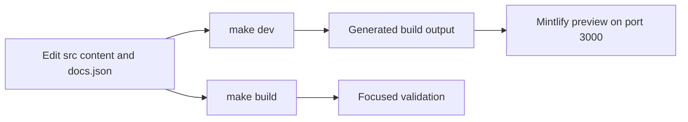

# Quickstart

This repository builds the Mintlify site at `docs.langchain.com` from authored `src/` content into generated `build/` output. The builder clears and recreates that output, including Python and JavaScript OSS variants, unversioned OpenWiki and Deep Agents Code content, LangSmith content, Managed Deep Agents variants, and shared files. **Edit `src/`, never `build/`.** Generated output is for previewing and validating a change, not repairing it.

## Set up and preview locally

The project requires Python 3.13 or later, Node.js, and `uv`. From a clone, install all dependency groups, project npm dependencies, and the global Mintlify CLI, then start development mode:

```bash
git clone https://github.com/langchain-ai/docs.git
cd docs
make install
make dev
```

`make dev` runs an initial full build unless `--skip-build` is supplied, watches `src/`, and starts `mint dev --port 3000` from `build/`. Open <http://localhost:3000>. A failed initial build exits before a watcher or preview server is started, avoiding a stale preview. Use `--skip-build` only when a suitable existing `build/` tree is intentional. For watcher limits, shutdown behavior, and troubleshooting, see [Local Development Workflow](/openwiki/workflows/local-development.md).



This loop keeps the authoring and generated-output boundaries separate: inspect the generated site, then fix its source or configuration.

## Safe edit–preview–validate loop

1. **Choose the source and route owner.** Write Markdown or MDX under the appropriate `src/` domain. `src/docs.json` is the Mintlify site-configuration and navigation source of truth; add a new page at its exact product, menu, dropdown, tab, and group location.
2. **Account for language routing.** Most shared OSS material produces Python and JavaScript routes. OpenWiki and Deep Agents Code are unversioned exceptions. Use the source and route model to decide whether shared conditional content or a language-specific directory is appropriate; do not create or patch a generated variant.
3. **Preview the rendered route.** With `make dev` running, check the page rendering, navigation placement, frontmatter, and links. Inspect both language variants for versioned material.
4. **Reset before broad verification.** Run `make build` after a structural, navigation, deletion, shared-input, or routing change. It is the clean rebuild that removes stale generated artifacts; a watcher refresh alone is not equivalent.
5. **Run the narrowest checks that cover the changed boundary.** Resolve failures in authored source, metadata, or pipeline configuration rather than in `build/`.

For page creation, moves, redirects, frontmatter, and route verification, use [Adding and Modifying Documentation Pages](/openwiki/operations/adding-pages.md). For detailed domain-to-route selection, use [Source Directory Map](/openwiki/architecture/source-map.md).

## Choose validation by change

| Change | Run | What it covers |
| --- | --- | --- |
| Any authored page, asset, navigation, or route change | `make build` | A clean preprocessing pass and regenerated Mintlify input in `build/`. |
| Links, routes, or anchors | `make broken-links-with-anchors` | Builds first, then checks generated links and anchors. Use `make broken-links` when fragments are unaffected. |
| `@[ref]` API references | `make check-cross-refs` | Source references against the language-aware link maps, independently of Mintlify's built-site check. |
| Pipeline, preprocessing, routing, or watcher behavior | `make test` | The socket-isolated pytest suite; narrow with `make test TEST_FILE=tests/unit_tests/test_builder.py`. |
| Runnable source under `src/code-samples/` | `make test-code-samples FILES="src/code-samples/langchain/return-a-string.py"` | Selected samples; these can require language toolchains, credentials, or services. |
| Python tooling or spelling | `make lint` | Ruff formatting and checks, `ty`, and Codespell. |
| Prose | `make lint_prose` | The repository-pinned Vale binary on source prose. |
| External integration-listing `docs_url` metadata | `uv run python scripts/refresh_integration_downloads.py --check-docs-urls` | Safe URL schemes in external-listing metadata, with no network access or writes. |

Core CI runs for pull requests, pushes to `main`, and manual dispatch. It runs the test, lint, and generated-site link workflows, and separately checks cross-references, external integration URLs, generated files, and merge-conflict markers. Reproduce a checkout-based failure with the corresponding local target; see [Testing Overview](/openwiki/testing/test-overview.md) for check boundaries and failure semantics.

## Task router

Use the guide matching the decision or workflow at hand:

| If you need to... | Start here |
| --- | --- |
| Find the correct authored domain, generated route family, navigation owner, snippet surface, or OpenAPI boundary | [Source Directory Map](/openwiki/architecture/source-map.md) |
| Understand full/incremental builds, preprocessing, and why output must not be edited | [Build System Architecture](/openwiki/architecture/build-system.md) |
| Add, move, retire, or redirect an ordinary documentation page | [Adding and Modifying Documentation Pages](/openwiki/operations/adding-pages.md) |
| Write shared Python/JavaScript OSS content safely | [Writing Versioned Content](/openwiki/workflows/versioned-content.md) |
| Select focused unit, link, cross-reference, integration-metadata, or code-sample checks | [Testing Overview](/openwiki/testing/test-overview.md) |
| Diagnose CI, publication, scheduled refreshes, or credentials/trust boundaries | [GitHub Actions and CI/CD](/openwiki/integrations/github-actions.md) |
| Submit or maintain an **integration listing** | [Integration Listing Automation](/openwiki/workflows/integration-listing-automation.md) |

Integration listing work is not an ordinary page edit. A listing issue does not start privileged automation by itself: a maintainer must apply `integration-run` (or manually dispatch the workflow), and the workflow verifies write-or-higher repository permission before processing untrusted issue metadata. The resulting agent work is turned into a review PR only when it has actual changes. Follow the dedicated automation guide for hosted-versus-external eligibility, generated table ownership, retries, and review—not the normal page-creation procedure.

## Before opening a pull request

- Confirm every documentation and configuration change is at its authored source surface under `src/` (or its documented metadata/configuration owner), not in `build/` or another generated table.
- Confirm a new, moved, or removed page has the correct `src/docs.json` entry and redirects for retired public routes.
- Run `make build`, inspect the relevant generated route and navigation, then run the focused checks from the table.
- Add or update focused tests when changing pipeline behavior; local rendered output alone does not establish a routing or watcher contract.
- Test code examples before publishing them, and keep secrets out of pages, commands, issues, and commits.
