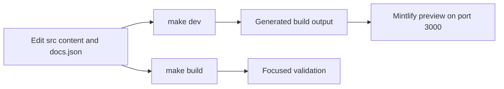

# Quickstart

This repository builds the Mintlify site at `docs.langchain.com` from authored `src/` content into generated `build/` output. The builder clears and recreates output for Python and JavaScript OSS variants, unversioned OpenWiki and Deep Agents Code, LangSmith, Managed Deep Agents variants, and shared files. **Edit `src/`, never `build/`.** Treat generated output as a preview and validation artifact: when it is wrong, fix the source, configuration, or generator that produced it.

## Set up and preview locally

The project requires Python 3.13 or later, Node.js, and `uv`. From a clone, install all dependency groups, project npm dependencies, and the global Mintlify CLI, then start development mode:

```bash
git clone https://github.com/langchain-ai/docs.git
cd docs
make install
make dev
```

Open <http://localhost:3000>. `make dev` runs an initial full build unless `--skip-build` is supplied, watches `src/`, and runs `mint dev --port 3000` from `build/`. If the initial build fails, it exits rather than serving a stale preview. Use `--skip-build` only when an existing `build/` tree is deliberately suitable. If `mint` is missing, rerun `make install` or install it with `npm install -g mint@latest`.



This loop keeps source ownership separate from disposable generated output.

## Author, inspect, then validate

1. **Choose the owner before editing.** Pages, assets, snippets, executable examples, generated catalogs, and specifications have different source owners. `src/docs.json` is the Mintlify site-configuration and navigation authority; update its exact product, menu, dropdown, tab, and group entry when adding or moving an ordinary page.
2. **Choose the route model.** Most shared OSS material emits Python and JavaScript variants; OpenWiki and Deep Agents Code are unversioned exceptions. Shared material should not be copied into generated language directories. See [Writing Versioned Content](/openwiki/workflows/versioned-content.md) for conditional content, links, and snippets.
3. **Preview the resulting route.** Check rendering, frontmatter, links, and navigation in local development. Inspect both variants for versioned content.
4. **Use a clean rebuild for structural changes.** Run `make build` after navigation, route, deletion, shared-input, generator, or preprocessing changes. It removes `build/` before recreating it, unlike relying on a pre-existing watcher output.
5. **Run the narrowest check that reaches the changed contract.** Resolve failures at the authored source surface, in metadata, or in pipeline code—not in `build/`.

For route selection, redirects, and page lifecycle, use [Adding and Modifying Documentation Pages](/openwiki/operations/adding-pages.md). For the current domain-to-route and navigation model, use [Source Directory Map](/openwiki/architecture/source-map.md).

## Select validation by change

| Change boundary | Run | What it establishes |
| --- | --- | --- |
| Any page, asset, navigation, or route change | `make build` | A clean preprocessing pass and regenerated Mintlify input in `build/`. |
| Links, routes, or anchors | `make broken-links-with-anchors` | Builds first, then checks generated links and anchors. Use `make broken-links` when fragments are unaffected. |
| `@[ref]` API references | `make check-cross-refs` | Source references resolve against the language-aware link maps. |
| Pipeline, preprocessing, routing, watcher behavior, or an authored documentation contract | `make test` | The socket-isolated pytest suite under `tests/unit_tests`; narrow with `make test TEST_FILE=tests/unit_tests/test_builder.py`. |
| OpenTelemetry guidance or an OTLP snippet | `make test` | Repository-wide MDX rules and mocked HTTP exporter behavior protect generic versus trace-specific endpoint semantics without opening a socket. |
| Runnable content under `src/code-samples/` | `make test-code-samples FILES="src/code-samples/langchain/return-a-string.py"` | Selected samples; omit `FILES` to run all eligible samples. These can require language toolchains, credentials, or services. |
| Python tooling or spelling | `make lint` | Ruff formatting and checks, `ty`, and Codespell. |
| Prose | `make lint_prose` | The repository-pinned Vale binary on source prose. |
| External integration-listing `docs_url` metadata | `uv run python scripts/refresh_integration_downloads.py --check-docs-urls` | Safe URL schemes, with no network access or writes. |

`make test` runs pytest with network sockets disabled except Unix sockets. The executable-sample runner is intentionally different: its examples may need providers, credentials, or services. The OpenTelemetry contract test scans every authored `.mdx` file: a generic `OTEL_EXPORTER_OTLP_ENDPOINT` must be a base URL rather than a `/v1/traces`, `/v1/metrics`, or `/v1/logs` URL; collector trace URLs use `traces_endpoint`. Its runtime cases mock the exporter session and ensure a generic base gets `/v1/traces` once, while `OTEL_EXPORTER_OTLP_TRACES_ENDPOINT` accepts the complete trace URL.

Core CI runs on pull requests, pushes to `main`, and manual dispatch. It invokes the test, lint, and link workflows and separately checks source cross-references, external integration URLs, generated files, and merge-conflict markers. Reproduce a failure with the corresponding local target; [Testing Overview](/openwiki/testing/test-overview.md) explains the boundaries and failure semantics.

## Task router

| If you need to... | Start here |
| --- | --- |
| Find the owning authored domain, generated route family, navigation location, snippet surface, or OpenAPI boundary | [Source Directory Map](/openwiki/architecture/source-map.md) |
| Add, move, retire, or redirect an ordinary documentation page | [Adding and Modifying Documentation Pages](/openwiki/operations/adding-pages.md) |
| Write shared Python/JavaScript OSS content safely | [Writing Versioned Content](/openwiki/workflows/versioned-content.md) |
| Change semantic SDK references or OpenAPI-backed documentation | [Reference Documentation Integration](/openwiki/integrations/reference-docs.md) |
| Change a generator-owned integration table, external integration metadata, or package-derived overview | [Source Directory Map](/openwiki/architecture/source-map.md) and [Testing Overview](/openwiki/testing/test-overview.md) |
| Change authored tracing or OTLP guidance, pipeline behavior, links, cross-references, or samples | [Testing Overview](/openwiki/testing/test-overview.md) |
| Submit or maintain an integration listing | [Integration Listing Automation](/openwiki/workflows/integration-listing-automation.md) |

Generated-data work is not an ordinary page edit. Integration tables and catalogs have upstream metadata or CLI owners; regenerate and review their authored outputs rather than hand-editing them. External integration `docs_url` values must pass the offline scheme check above. Integration-listing automation is maintainer-gated: it begins only from manual dispatch or an `integration-run` label event, verifies admin, maintain, or write permission for the triggering actor, and opens a review pull request only when the agent made changes.

## Before opening a pull request

- Confirm every documentation and configuration change is at its authored source surface under `src/` (or its documented metadata/configuration owner), never in `build/`.
- Confirm a new, moved, or removed page has the correct `src/docs.json` entry and redirects for retired public routes.
- Run `make build`, inspect the relevant generated route and navigation, then run the focused checks from the matrix.
- Add or update focused tests when changing pipeline behavior or repository-wide documentation contracts; a rendered preview alone does not establish those contracts.
- Test code examples before publishing them, and keep secrets out of pages, commands, issues, and commits.
