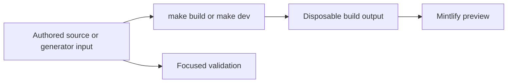

# Quickstart

This repository builds the Mintlify site at [docs.langchain.com](https://docs.langchain.com) from authored files in `src/`. The pipeline recreates `build/`, which Mintlify serves and deploys: **never edit `build/`**. API reference at [reference.langchain.com](https://reference.langchain.com/python/) is generated outside this repository; report problems through the [reference documentation issue template](https://github.com/langchain-ai/docs/issues/new?template=04-reference-docs.yml).



This flow separates editable inputs from derived preview and publication artifacts.

## Set up a preview

Use Python 3.13 or later, Node.js, and `uv`:

```bash
git clone https://github.com/langchain-ai/docs.git
cd docs
make install
make dev
```

`make install` synchronizes Python dependency groups, installs project npm dependencies and the global Mintlify CLI, and links Claude Code skills. Open <http://localhost:3000>. `make dev` builds first, watches `src/`, and launches `mint dev --port 3000` from `build/`; it stops if that initial build fails rather than serving stale output. Use `uv run pipeline dev --skip-build` only when an existing build is suitable. Run `make build` for a clean reconstruction and inspect the affected route or routes.

## Route the change

Read `AGENTS.md` first. It and `CLAUDE.md` are byte-identical repository rules; task procedures live in `.agents/skills/*/SKILL.md`. Most agents read that tree directly. Claude Code uses `.claude/skills/`, so run `make skills` to create or refresh its links.

| Change you are making | Editable owner | Generated or external boundary | First focused action |
| --- | --- | --- | --- |
| A LangSmith page, including Test, Deploy, Monitor, setup, Fleet, LLM Gateway, Engine, or Sandboxes | `src/langsmith/` | Ordinary LangSmith MDX emits unversioned `/langsmith/...` routes. **No-code agents** is the Fleet navigation label, not its directory. | Edit the source and place or move its route in `src/docs.json`; see [Source Map](/openwiki/architecture/source-map.md) and [Adding and Maintaining Documentation Pages](/openwiki/operations/adding-pages.md). |
| A Managed Deep Agents page | `src/langsmith/managed-deep-agents*.mdx` | The builder emits Python and JavaScript variants; legacy unversioned URLs redirect to Python. | Inspect both language outputs and their fence and link resolution. |
| A shared Deep Agents page | `src/oss/deepagents/` | Most shared OSS content emits Python and JavaScript variants. | Inspect both variants. |
| Deep Agents Code | `src/oss/deepagents/code/` | It is deliberately unversioned and resolves conditional fences as Python. | Inspect `/oss/deepagents/code/...`, not language variants. |
| OpenWiki | `src/oss/openwiki/` | It is deliberately unversioned and resolves conditional fences as Python. | Inspect `/oss/openwiki/...`. |
| A hosted integration guide or discovery listing | Hosted MDX `integration:` frontmatter, `scripts/data/integration_external_docs.yaml`, applicable provider cards, or `packages.yml` | Listing snippets and the Python provider overview are generator-owned. External metadata is untrusted and its `docs_url` is safety-validated. | Choose hosted versus external ownership, validate URLs, then regenerate; see [Integration Listing Automation](/openwiki/workflows/integration-listing-automation.md). |
| A runnable example or its visible snippet | `src/code-samples/` | `src/code-samples-generated/` is an extraction intermediate; `src/snippets/code-samples/` is generated MDX. Do not hand-edit either. | Test the changed source, then regenerate snippets; see [Code Sample Lifecycle](/openwiki/workflows/code-sample-lifecycle.md). |
| LangSmith REST endpoint documentation | `scripts/process_langsmith_openapi.py` and its upstream service contract | `src/langsmith/langsmith-platform-openapi.json` is processor-generated; Mintlify generates endpoint pages at deployment, not in local `build/`. | Review the refresh output or change the processor/upstream source, not generated endpoint pages; see [Reference Documentation Integration](/openwiki/integrations/reference-docs.md). |
| Agent Server or Control Plane OpenAPI documentation | Committed Agent Server spec or configured Control Plane source in `src/docs.json` | Mintlify creates endpoint pages at deployment. Control Plane uses its configured remote spec. | For an Agent Server spec change run `make check-openapi`; do not hand-author endpoint pages. |

`src/docs.json` is the Mintlify site configuration, navigation, generated-OpenAPI registration, and redirect source of truth. Navigation labels do not select source directories. Add every new authored page there; for a move or removal, maintain redirects rather than retaining a duplicate page.

## Change generator-owned content at its input

- **Python provider overview:** `src/oss/python/integrations/providers/overview.mdx` comes from `packages.yml` and `pipeline/tools/partner_pkg_table.py`. Change an input, run `uv run python pipeline/tools/partner_pkg_table.py`, and commit the regenerated result. CI rejects a resulting diff.
- **Integration tables:** hosted guide frontmatter and `scripts/data/integration_external_docs.yaml` feed generated `src/snippets/oss/*-downloads.mdx` and `*-featured.mdx`. A `docs_url` may be `https://`, `http://`, or a single-slash site path; protocol-relative and unsafe schemes are rejected. Validate and regenerate with:

  ```bash
  uv run python scripts/refresh_integration_downloads.py --check-docs-urls
  uv run python scripts/refresh_integration_downloads.py --write
  ```

- **Code snippets:** test a changed source before regeneration:

  ```bash
  make test-code-samples FILES="src/code-samples/langchain/return-a-string.py"
  make code-snippets
  ```

  The runner supports Python, TypeScript, Java, Kotlin, Go, and shell files. Samples can use live providers or PostgreSQL, so do not commit credentials. Fork PRs skip the credential-bearing workflow; internal PRs run changed supported samples. Manual and scheduled full runs test all samples, enable tracing, regenerate snippets, and update a trace-refresh PR only after success.

- **LangSmith REST spec:** the daily, manually dispatchable workflow runs `uv run python scripts/process_langsmith_openapi.py --write`, filters and groups the upstream public surface, and creates or updates one `chore/refresh-langsmith-openapi` PR when the committed spec differs. Review a refresh by changing processor rules or upstream ownership; do not hand-edit `src/langsmith/langsmith-platform-openapi.json`.
- **External version mirrors:** `scripts/data/external_versions.yaml` identifies a page pattern and upstream GitHub source. The weekly refresh changes captured version digits only; review surrounding requirement prose. It reuses or creates `chore/refresh-external-versions` when a rewrite changes `src/`.

## Run the smallest relevant validation

Build and inspect affected routes after changing authored pages, navigation, shared assets, preprocessors, or generator inputs. Then run the narrowest command that exercises the changed boundary.

| Boundary | Command | What it establishes |
| --- | --- | --- |
| Pipeline, parser, watcher, or generator behavior | `make test TEST_FILE=tests/unit_tests/path_or_test.py` | Pytest with network sockets disabled except Unix sockets. Omit `TEST_FILE` for the default unit-test tree. |
| Finished prose | `make lint_prose FILES="src/path/to/page.mdx"` | Vale using the pinned binary. |
| Python tooling or spelling | `make lint` | Ruff format/check, `ty`, and Codespell. |
| Built routes, links, and anchors | `make broken-links-with-anchors` | A fresh build followed by Mintlify link and anchor checking. |
| Authored `@[ref]` references | `make check-cross-refs` | Source reference mappings, independently of rendered-link checking. |
| Runnable sample and its derivative | `make test-code-samples FILES="..."`; `make code-snippets` | The executable source, then refreshed snippet MDX. |
| Integration external metadata | `uv run python scripts/refresh_integration_downloads.py --check-docs-urls` | Safe permitted `docs_url` schemes without network writes. |
| Provider overview | `uv run python pipeline/tools/partner_pkg_table.py` | Regenerated overview agrees with its inputs. |
| Agent Server OpenAPI spec | `make check-openapi` | The current target builds and validates the Agent Server spec. |
| Package version claims in a changed page | `uv run python scripts/check_version_claims.py --files src/path/to/page.mdx` | Each named `>=` or `==` version exists on its resolved registry. |
| Upstream-owned version mirror | `uv run python scripts/check_external_versions.py --only <id>` | The registered requirement agrees with its upstream owner. |

The version-claim pull-request gate examines changed source MDX and blocks a version that was never published. An older published floor is informational, not an automatic upgrade request. Core CI runs on pushes to `main`, pull requests, and manual dispatch; its separate jobs include unit tests, lint, anchor-aware links, cross-references, external integration URL validation, provider-overview regeneration, and merge-conflict checks. A passing unrelated check is not a substitute for the gate that covers the change.

## Before opening a pull request

- Confirm every edit targets authored content, configuration, metadata, or a generator—not `build/` or another derivative.
- Update `src/docs.json` for new routes and redirects for moved or removed routes.
- Inspect every emitted variant required by the source family.
- Run focused checks and disclose unavailable credentials or external-service dependencies.
- Review automated version, snippet-trace, integration, and OpenAPI refreshes as generated changes with their inputs and policy boundaries in mind.

## Related pages

- [Source Map](/openwiki/architecture/source-map.md)
- [GitHub Actions and CI/CD](/openwiki/integrations/github-actions.md)
- [Reference Documentation Integration](/openwiki/integrations/reference-docs.md)
- [Adding and Maintaining Documentation Pages](/openwiki/operations/adding-pages.md)
- [Testing Overview](/openwiki/testing/test-overview.md)
- [Code Sample Lifecycle](/openwiki/workflows/code-sample-lifecycle.md)
- [Integration Listing Automation](/openwiki/workflows/integration-listing-automation.md)
