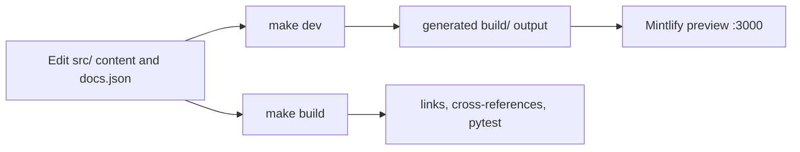

# Quickstart

This repository produces the Mintlify site at `docs.langchain.com`. Author documentation in `src/`; the pipeline preprocesses it into `build/`, which Mintlify deploys. Treat `build/` as disposable generated output—never patch it to fix a page.

## Start locally

The project requires Python 3.13 or later, Node.js, and `uv`. From a clone of the repository, install the Python dependency groups, Node dependencies, and Mintlify CLI, then run the development loop:

```bash
git clone https://github.com/langchain-ai/docs.git
cd docs
make install
make dev
```

`make dev` performs an initial build (unless explicitly skipped), watches `src/`, and starts `mint dev --port 3000` from `build/`. Browse <http://localhost:3000>. If the initial build fails, development mode exits rather than serving stale output. For prerequisites, `--skip-build`, watcher behavior, and troubleshooting, see [Local Development Workflow](/openwiki/workflows/local-development.md).

## Safe edit–preview–validate loop

1. **Find the source and route owner.** Edit a Markdown or MDX source under `src/`, not a generated file. `src/docs.json` owns Mintlify navigation and site configuration; a new page must be added at the appropriate product/menu/dropdown/tab/group location.
2. **Make the smallest source change.** Shared OSS content usually generates Python and JavaScript routes; `src/oss/openwiki/` and `src/oss/deepagents/code/` are unversioned exceptions. Use the source and generated-route model—not a guessed URL—to decide whether language fences or a language-specific source directory are appropriate.
3. **Preview the generated page.** Keep `make dev` running and check the rendered route, navigation placement, frontmatter, and links. For a versioned page, inspect both language variants.
4. **Regenerate and run proportionate checks.** A clean `make build` recreates `build/`; any hand edit there is discarded. Run focused validation before broad checks, then resolve failures in source or configuration.



The diagram is deliberately one-way: generated output is evidence to inspect and validate, not an authoring surface.

## Choose checks by change

| Change | Run | What it covers |
| --- | --- | --- |
| Any source page or navigation change | `make build` | Full preprocessing and regenerated Mintlify input in `build/`. |
| Links, routes, or anchors | `make broken-links-with-anchors` | Builds first, then checks generated links and anchors with documented generated/snippet exclusions. Use `make broken-links` if anchors are unaffected. |
| `@[ref]` API references | `make check-cross-refs` | Checks source references against the language-aware link maps. |
| Pipeline, preprocessing, routing, or watcher change | `make test` | Runs the isolated unit suite; focus it with `make test TEST_FILE=tests/unit_tests/test_builder.py`. |
| Runnable file under `src/code-samples/` | `make test-code-samples FILES="src/code-samples/langchain/return-a-string.py"` | Executes selected samples; these may require language toolchains, credentials, or services. |
| Python tooling or spelling changes | `make lint` | Runs Ruff formatting and checks, `ty`, and Codespell. |
| Prose change | `make lint_prose` | Uses the repository-pinned Vale installation on `src/` (excluding code samples). |

Core CI runs on pushes to `main`, pull requests, and manual dispatch. It includes the isolated test job, linting, built-site link checking, and cross-reference validation; use the failing job and its corresponding local command to reproduce a checkout-based failure. See [Testing Overview](/openwiki/testing/test-overview.md) for validation boundaries and sample-test requirements, and [GitHub Actions and CI/CD](/openwiki/integrations/github-actions.md) for CI and scheduled automation.

## Task router

Choose a guide based on the decision you need to make rather than reading the repository as a file inventory:

- **Where should content live, and what route will it have?** [Source Directory Map](/openwiki/architecture/source-map.md) explains authored domains, generated routes, navigation, language variants, snippets, and OpenAPI-backed areas.
- **How does a source file become output?** [Build System Architecture](/openwiki/architecture/build-system.md) covers builder stages, preprocessing, and the generated-output boundary.
- **How do I add, move, or retire a page?** [Adding and Modifying Documentation Pages](/openwiki/operations/adding-pages.md) covers frontmatter, `src/docs.json`, redirects, link updates, and final verification.
- **What must pass for this change?** [Testing Overview](/openwiki/testing/test-overview.md) distinguishes unit, rendered-site, cross-reference, and executable-sample checks.
- **Why did CI or a scheduled update behave this way?** [GitHub Actions and CI/CD](/openwiki/integrations/github-actions.md) describes deterministic PR checks, credentialed sample runs, and refresh workflows.

## Before opening a pull request

- Confirm every authored change is under `src/` and no `build/` output was edited.
- Confirm a new, moved, or removed page has the correct `src/docs.json` entry and redirects for retired public routes.
- Run `make build`, then the focused checks from the table—especially link/anchor and cross-reference checks when applicable.
- Add or update focused unit tests when changing pipeline behavior; do not rely on a local output inspection alone.
- Test code examples before publishing them, and keep secrets out of pages, commands, and commits.
