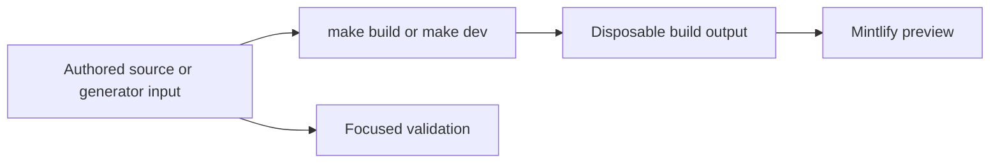

# Quickstart

This repository builds the Mintlify site at [docs.langchain.com](https://docs.langchain.com) from authored inputs in `src/`. The pipeline recreates `build/`; it is a disposable preview and deployment artifact, **not an editing surface**. API reference at [reference.langchain.com](https://reference.langchain.com/python/) is generated outside this repository; report problems through the [reference documentation issue template](https://github.com/langchain-ai/docs/issues/new?template=04-reference-docs.yml).



This flow separates editable inputs from derived preview and publication artifacts.

## Set up and preview

Use Python 3.13 or later, Node.js, and `uv`:

```bash
git clone https://github.com/langchain-ai/docs.git
cd docs
make install
make dev
```

`make install` synchronizes all Python dependency groups, installs project npm dependencies and the global Mintlify CLI, and links Claude Code skills. Open <http://localhost:3000>. `make dev` builds first, watches `src/`, and starts `mint dev --port 3000` from `build/`. It stops rather than serving stale output when the initial build fails. Use `uv run pipeline dev --skip-build` only when a suitable existing build already exists; use `make build` for a clean reconstruction.

Read `AGENTS.md` before editing. It is the repository-wide authoring guide. Task-specific procedures live in `.agents/skills/`; Claude Code consumes their linked `.claude/skills/` tree, so run `make skills` after adding or renaming a skill. See [Agent Authoring Skills](/openwiki/operations/agent-skills.md) for the catalog and distribution model.

## Choose the owning input

`src/` is the authored tree, but source location, output route, and navigation placement are separate concerns. `src/docs.json` is the Mintlify site-configuration and navigation source of truth. Add every new authored page there. When a public route moves or is retired, preserve it with a redirect rather than an authored duplicate.

| Change | Edit this owner | Verify |
| --- | --- | --- |
| Shared LangChain, LangGraph, or most Deep Agents content | `src/oss/` | Python and JavaScript outputs under `/oss/python/...` and `/oss/javascript/...`. |
| Language-specific content or integrations | `src/oss/python/` or `src/oss/javascript/` | Only the matching language route. |
| OpenWiki | `src/oss/openwiki/` | One unversioned `/oss/openwiki/...` route. |
| Deep Agents Code | `src/oss/deepagents/code/` | One unversioned `/oss/deepagents/code/...` route. |
| Ordinary LangSmith documentation | `src/langsmith/` | One unversioned `/langsmith/...` route. `fleet/` is labeled **No-code agents** in navigation. |
| Managed Deep Agents | Direct `src/langsmith/managed-deep-agents*.mdx` files | Python and JavaScript `/langsmith/...` variants; unversioned URLs redirect to Python. |
| Reusable content or assets | `src/snippets/`, `src/images/`, `src/fonts/`, or shared root inputs | Consumers and emitted assets after a build. |
| Mintlify API endpoint reference | Configured OpenAPI spec or remote source | Endpoint pages are created at deployment, not authored MDX or local build pages. |

The navigation has two products: **AGENT DEVELOPMENT LIFECYCLE** contains Home, Build, Test, Deploy, and Monitor; **PRODUCTS AND SETUP** contains LangSmith setup, LLM Gateway, No-code agents, Engine, and Deep Agents Code. Navigation labels do not establish source ownership. Find a neighboring entry in the appropriate `docs.json` group and update it deliberately.

For route rules, duplicated OpenWiki placement, redirects, and the full map, see [Source Directory Map](/openwiki/architecture/source-map.md). For the page add, move, or retirement procedure, see [Adding and Maintaining Documentation Pages](/openwiki/operations/adding-pages.md).

## Change generated content at its input

Do not use derived output as an alternate source.

- **`build/`:** regenerated by the documentation builder. Never edit it.
- **Python provider overview:** `src/oss/python/integrations/providers/overview.mdx` is generated from `packages.yml` and `pipeline/tools/partner_pkg_table.py`. Change an input, then run:

  ```bash
  uv run python pipeline/tools/partner_pkg_table.py
  ```

  CI regenerates this file and rejects a diff.

- **Runnable samples and snippets:** author executable samples in `src/code-samples/`. `make test-code-samples` runs them, while `make code-snippets` extracts and generates importable MDX snippets. Do not edit generated snippet output.

  ```bash
  make test-code-samples FILES="src/code-samples/langchain/return-a-string.py"
  make code-snippets
  ```

- **OpenAPI:** change the committed specification or configured remote source, not deployment-generated endpoint pages.

## Run the smallest relevant check

Build and inspect an affected route after changing authored pages, navigation, assets, preprocessors, or generator inputs. Then select the narrowest validation boundary.

| Boundary | Command | What it checks |
| --- | --- | --- |
| Pipeline, parser, watcher, generator, or skill | `make test TEST_FILE=tests/unit_tests/path_or_test.py` | Pytest with network sockets disabled except Unix sockets. Omit `TEST_FILE` for the unit-test tree. |
| Finished prose | `make lint_prose FILES="src/path/to/page.mdx"` | Vale using the pinned binary. |
| Python tooling and spelling | `make lint` | Ruff format/check, `ty`, and Codespell. |
| Built routes, links, anchors, and redirects | `make broken-links-with-anchors` | Fresh build, then Mintlify link, anchor, and redirect checking. |
| Authored `@[ref]` references | `make check-cross-refs` | Source reference mappings independently of rendered-link checking. |
| Runnable sample and generated snippet | `make test-code-samples FILES="..."`; `make code-snippets` | Executable source, then regenerated snippet MDX. |
| Provider overview | `uv run python pipeline/tools/partner_pkg_table.py` | Generated overview agrees with its inputs. |

Core CI runs on pushes to `main`, pull requests, and manual dispatch. It invokes the unit-test target and separate lint, link, cross-reference, generated-file, external integration URL, and merge-conflict checks. See [Testing Overview](/openwiki/testing/test-overview.md) for boundaries and failure semantics, and [GitHub Actions and CI/CD](/openwiki/integrations/github-actions.md) for automation and trusted-workflow constraints.

## Before opening a pull request

- Confirm the change is in authored content, configuration, metadata, or a generator input—not `build/` or a generated endpoint page.
- Add navigation for each new authored page in `src/docs.json`; add redirects for moved or retired public routes.
- Inspect every output variant required by the source family.
- Regenerate and review derived files after changing their inputs.
- Run focused checks and disclose unavailable credentials or live-service dependencies.

## Task-routing map

- [Source Directory Map](/openwiki/architecture/source-map.md) — source ownership, routes, navigation, redirects, and generated API surfaces.
- [Adding and Maintaining Documentation Pages](/openwiki/operations/adding-pages.md) — page lifecycle, frontmatter, navigation, redirects, and generated-content procedures.
- [Agent Authoring Skills](/openwiki/operations/agent-skills.md) — choose, distribute, or change task-specific agent procedures.
- [Local Development Workflow](/openwiki/workflows/local-development.md) — preview lifecycle, rebuild recovery, and route inspection.
- [Testing Overview](/openwiki/testing/test-overview.md) — focused test commands, toolchain, and CI triage.
- [GitHub Actions and CI/CD](/openwiki/integrations/github-actions.md) — CI gates, scheduled writers, secrets, and automation changes.
- [Code Sample Lifecycle](/openwiki/workflows/code-sample-lifecycle.md) — runnable samples, snippet extraction, tracing, and generated sample output.
