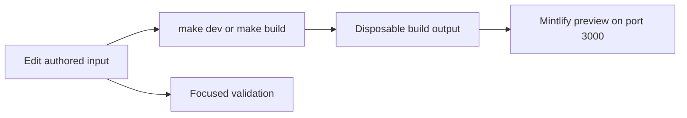

# Quickstart

This checkout builds the Mintlify site at `docs.langchain.com`: authored inputs in `src/` flow through the repository pipeline into disposable `build/` output. **Edit an authored source, configuration file, or generator—never `build/` or another generated artifact.** The separate `reference.langchain.com` API-reference site is not built here; report problems through this repository's reference-docs issue template.

## Start the local loop

The project requires Python 3.13 or later, Node.js, and `uv`. Install dependencies and the Mintlify CLI, then start the preview:

```bash
git clone https://github.com/langchain-ai/docs.git
cd docs
make install
make dev
```

Open <http://localhost:3000>. `make dev` performs an initial build, watches `src/`, and starts `mint dev --port 3000` from `build`. It stops if that initial build fails, preventing a stale preview. `--skip-build` deliberately uses an existing build tree; use it only when that is what you intend.



This loop keeps the editable input separate from generated preview output.

## Route the task before editing

Read `AGENTS.md` for rules that apply to every change. Then load the procedure that matches the task: `.agents/skills/` is the canonical task-specific skill tree. Most supported agents discover it directly; Claude Code users run `make skills` once to link it into `.claude/skills/`. Skills provide conditional procedures, while `AGENTS.md` and the byte-identical `CLAUDE.md` retain universal rules.

| Change boundary | Start here | Edit or verify |
| --- | --- | --- |
| Add, move, rename, retire, or redirect a page | [Adding and Modifying Documentation Pages](/openwiki/operations/adding-pages.md) and `add-docs-page` | The source MDX, exact `src/docs.json` navigation entry, and any redirect |
| Review finished authored prose | `docs-review` | The changed prose, then Vale/focused review |
| Find the source behind a route or visible product label | [Source Directory Map](/openwiki/architecture/source-map.md) | The authored owner, not a similarly named navigation directory |
| Change a shared OSS page | `src/oss/` | Both Python and JavaScript output, except the unversioned product cases below |
| Change OpenWiki or Deep Agents Code | `src/oss/openwiki/` or `src/oss/deepagents/code/` | Their single unversioned route family |
| Change LangSmith, LLM Gateway, Engine, or No-code agents | `src/langsmith/`; No-code agents remains `src/langsmith/fleet/` | The product/menu location selected in `src/docs.json` |
| Add or change an executable documentation example | `docs-code-samples` and [Runnable Code Sample Lifecycle](/openwiki/workflows/code-sample-lifecycle.md) | The runnable file in `src/code-samples/`, then regenerated snippets |
| Change a reusable fragment, asset, generated integration table, build logic, or CI | [Source Directory Map](/openwiki/architecture/source-map.md), [Testing Overview](/openwiki/testing/test-overview.md), or [GitHub Actions and CI/CD](/openwiki/integrations/github-actions.md) | Its actual input owner: `src/snippets/`, `src/images/`, metadata/generator, `pipeline/`, `scripts/`, or workflow |
| Add or revise an agent procedure | [Agent Authoring Skills](/openwiki/operations/agent-skills.md) | `.agents/skills/<name>/SKILL.md`, its catalogues, and structural test |

`src/docs.json` owns site configuration, navigation, and redirects. Its visible products, menus, dropdowns, tabs, and groups do not necessarily match source directory names. In particular, Fleet is labelled **No-code agents**. Use the navigation configuration to find the page's visible placement; do not infer placement from a path.

Most OSS inputs emit Python and JavaScript variants. OpenWiki and Deep Agents Code are intentional exceptions that build once without a language segment. Generated integration and sample artifacts also have their own lifecycle: for the Python provider overview, change `packages.yml` or `pipeline/tools/partner_pkg_table.py` and regenerate; for code snippets, change the runnable source and regenerate rather than hand-editing generated MDX.

## Handle runnable code samples as a lifecycle

Runnable files below `src/code-samples/` are executable source inputs. Test a changed supported file first, then generate its MDX snippet output:

```bash
make test-code-samples FILES="src/code-samples/langchain/return-a-string.py"
make code-snippets
```

The sample runner supports Python, TypeScript, Java, Kotlin, Go, and shell files; it can run all samples when `FILES` is omitted. This is a live integration boundary, not the socket-isolated unit suite: samples inherit the environment and can require provider credentials and PostgreSQL. Do not treat generated `src/snippets/code-samples/` content or the extraction intermediate as authored input.

For an internal pull request that changes a sample, CI selects changed supported files. It skips fork pull requests because samples may need repository secrets. Scheduled and manually dispatched full runs test all samples, enable optional LangSmith trace collection, regenerate trace-linked snippets after success, and may update the dedicated trace-refresh pull request. Read the lifecycle page before changing markers, generated snippets, tracing, or that write-capable automation.

## Validate the contract you changed

Run `make build` and inspect the relevant route/navigation after a page, route, asset, shared-input, or preprocessing change. Add the narrowest check that reaches the changed boundary:

| Change boundary | Run | What it checks |
| --- | --- | --- |
| Pipeline, parser, watcher, agent-skill contract, or repository-wide authored rule | `make test` | Socket-isolated pytest unit contracts; narrow with `TEST_FILE=...` |
| Built routes, links, and anchors | `make broken-links-with-anchors` | A fresh build followed by Mint's filtered link and anchor check |
| Source `@[ref]` references | `make check-cross-refs` | Source references against language-aware maps |
| Runnable source sample | `make test-code-samples FILES="..."` | The selected program in its real toolchain and environment |
| Changed sample presentation | `make code-snippets` | Extraction and generated MDX from the runnable source |
| Python tooling and spelling | `make lint` | Ruff format/check, `ty`, and Codespell |
| Authored prose | `make lint_prose` | The repository-pinned Vale executable |
| External integration `docs_url` metadata | `uv run python scripts/refresh_integration_downloads.py --check-docs-urls` | Safe URL schemes without requests or writes |
| Python provider overview generation | `uv run python pipeline/tools/partner_pkg_table.py` | Generated overview agrees with its inputs |

Core CI runs on pull requests, pushes to `main`, and manual dispatch. It invokes test, lint, and built-link workflows, plus independent cross-reference, external URL, generated-file, and merge-conflict checks. Reproduce the applicable failed gate locally rather than expanding every documentation edit into every expensive check.

## Before opening a pull request

- Confirm each change is at an authored source or its configuration/generator owner, never generated `build/` output.
- Update the precise `src/docs.json` location for a page addition or move and keep redirects for retired public URLs.
- Build and inspect the affected route; run the focused checks above.
- For a code sample, execute the source first and review regenerated snippet changes; keep credentials out of content and commits.
- Use the dedicated workflow pages for changes that affect secrets, GitHub writes, tracing, schedules, or fork behavior.

## Related pages

- [Source Directory Map](/openwiki/architecture/source-map.md)
- [Adding and Modifying Documentation Pages](/openwiki/operations/adding-pages.md)
- [Agent Authoring Skills](/openwiki/operations/agent-skills.md)
- [Runnable Code Sample Lifecycle](/openwiki/workflows/code-sample-lifecycle.md)
- [Testing Overview](/openwiki/testing/test-overview.md)
- [GitHub Actions and CI/CD](/openwiki/integrations/github-actions.md)
