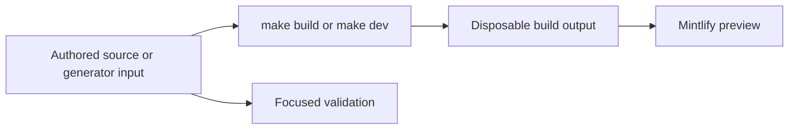

# Quickstart

This repository builds [docs.langchain.com](https://docs.langchain.com) from authored inputs in `src/`. The documentation builder recreates `build/`; Mintlify consumes that disposable output for local preview and deployment. Edit durable source, configuration, metadata, or generator inputs—not `build/` or a hosted artifact. [reference.langchain.com](https://reference.langchain.com/python/) is built outside this repository; report problems through the [reference documentation issue template](https://github.com/langchain-ai/docs/issues/new?template=04-reference-docs.yml).


```mermaid
flowchart LR
  Input["Authored source or generator input"] --> Build["make build or make dev"]
  Build --> Output["Disposable build output"]
  Output --> Preview["Mintlify preview"]
  Input --> Check["Focused validation"]
```

This flow separates durable repository inputs from derived preview, deployment, and hosted artifacts.

## Set up a preview

The project requires Python 3.13 or later, Node.js, and `uv`.

```bash
git clone https://github.com/langchain-ai/docs.git
cd docs
make install
make dev
```

`make install` synchronizes all Python dependency groups, installs project npm dependencies and the global Mintlify CLI, and links Claude Code skills. Open <http://localhost:3000> after startup.

`make dev` runs an initial build unless `--skip-build` is supplied, watches `src/`, then launches `mint dev --port 3000` from `build/`. It exits rather than serving stale output when the initial build fails. Use `uv run pipeline dev --skip-build` only when a suitable generated tree already exists; use `make build` to reconstruct it.

Read `AGENTS.md` before editing. It is the repository-wide authoring guide; task-specific procedures live in `.agents/skills/`. `make skills` links that tree into `.claude/skills/` for Claude Code.

## Route a change to its durable owner

`src/` is the authored tree, but source ownership, emitted route, and navigation are separate contracts. `src/docs.json` is the Mintlify navigation and site-configuration source of truth: add a new authored page to the appropriate navigation group, and use redirects to preserve a moved public route.

| Change | Durable input | Inspect after building |
| --- | --- | --- |
| Shared LangChain, LangGraph, or most Deep Agents documentation | `src/oss/` | Python and JavaScript routes. |
| Language-owned documentation or integration | `src/oss/python/` or `src/oss/javascript/` | The matching language route and its language-specific navigation group. |
| OpenWiki or Deep Agents Code | `src/oss/openwiki/` or `src/oss/deepagents/code/` | One unversioned product route. |
| Ordinary LangSmith documentation | `src/langsmith/` | One unversioned `/langsmith/...` route and its chosen navigation placement. |
| Managed Deep Agents | Direct `src/langsmith/managed-deep-agents*.mdx` file | Python and JavaScript variants; preserve any unversioned compatibility redirect to Python. |
| Reusable content or assets | `src/snippets/`, `src/images/`, `src/fonts/`, or shared root inputs | Importing pages and copied assets. |
| Mintlify endpoint reference | OpenAPI specification or configuration in `src/docs.json` | A deployment preview or production site; generated endpoint pages are not editable MDX sources. |

The builder clears `build/`, emits Python and JavaScript OSS variants, emits OpenWiki and Deep Agents Code once, emits ordinary LangSmith content once, emits Managed Deep Agents language variants, then copies shared files. Thus navigation can project content from different directories and does not create a route. For source-to-route rules and current navigation placement, use [Source Directory Map](/openwiki/architecture/source-map.md). For language variants, links, snippets, and redirects, use [Versioned Documentation and Routes](/openwiki/concepts/versioning.md) and [Changing Versioned Content](/openwiki/workflows/versioned-content.md).

## Change generated content at its input

Never patch a derived file as an alternate source.

- **`build/`:** Recreated by the documentation builder. Do not edit it.
- **Provider overview:** `src/oss/python/integrations/providers/overview.mdx` is generated from `packages.yml` by `pipeline/tools/partner_pkg_table.py`. Change an input, regenerate, and commit the result:

  ```bash
  uv run python pipeline/tools/partner_pkg_table.py
  ```

  CI regenerates this file and rejects a resulting diff.
- **Runnable samples and snippets:** Author executable sources under `src/code-samples/`. `make test-code-samples` executes them; `make code-snippets` extracts an intermediate and generates importable MDX snippets. Do not hand-edit generated snippet output.
- **Integration discovery listings:** Update a hosted guide's `integration:` frontmatter or `scripts/data/integration_external_docs.yaml`, then validate URL metadata before regeneration:

  ```bash
  uv run python scripts/refresh_integration_downloads.py --check-docs-urls
  uv run python scripts/refresh_integration_downloads.py --write
  ```

  External `docs_url` values may be HTTP(S) or a single-slash site-relative path. Protocol-relative and unsafe-scheme values are rejected before rendering. For listing eligibility, generated snippet ownership, provider cards, and scheduled refresh behavior, follow [Integration Listing Automation](/openwiki/workflows/integration-listing-automation.md).
- **OpenAPI:** Mintlify creates configured endpoint pages during deployment. Change the specification or `docs.json` configuration, not an imagined page below `build/`; use `make check-openapi` for the Agent Server specification.

## Run the smallest relevant check

Build and inspect the affected route after changing pages, navigation, assets, preprocessors, or generator inputs. Then choose the narrowest boundary that establishes the change.

| Change boundary | Command | What it establishes |
| --- | --- | --- |
| Pipeline, builder, watcher, or generator behavior | `make test TEST_FILE=tests/unit_tests/path_or_test.py` | Pytest contract with network sockets disabled except Unix sockets. Omit `TEST_FILE` for the unit-test tree. |
| Prose | `make lint_prose FILES="src/path/to/page.mdx"` | Vale with the repository-pinned binary. |
| Python tooling and spelling | `make lint` | Ruff format/check, `ty`, and Codespell. |
| Built routes, links, anchors, and redirects | `make broken-links-with-anchors` | Fresh build plus Mint link, anchor, and redirect checks. |
| Authored `@[ref]` references | `make check-cross-refs` | Source reference mappings, independently of rendered-link checking. |
| Runnable example or snippet | `make test-code-samples FILES="..."`; `make code-snippets` | Live sample source, then regenerated snippet MDX. |
| Integration listing URLs | `uv run python scripts/refresh_integration_downloads.py --check-docs-urls` | Read-only validation of external documentation metadata. |
| Provider overview | `uv run python pipeline/tools/partner_pkg_table.py` | Agreement between generated overview and its inputs. |
| Deployed `llms.txt` coverage | `python3 scripts/check_llms_urls.py` | Every sitemap URL is reachable from the served index hierarchy. |

The last check has a different boundary: Mintlify generates `llms.txt` and may split it into `/_llms/` indexes, neither built nor committed here. The checker crawls the hosted root and same-site nested Markdown indexes, normalizes page URLs, and compares them with the hosted sitemap. It defaults to `https://docs.langchain.com`; use `--base-url` for another deployment. A missing URL exits nonzero: first ensure no custom `llms.txt` was added to the generated tree, then report a Mintlify-generated index gap rather than editing a hosted artifact. The read-only coverage workflow runs weekly on Monday at 07:13 UTC and also supports manual dispatch.

Core CI runs on pushes to `main`, pull requests, and manual dispatch. It invokes the unit-test target alongside separate lint, built-link, cross-reference, integration-URL, generated-file, and merge-conflict checks.

## Before opening a pull request

1. Confirm the edit is in authored content, configuration, metadata, or a generator input—not `build/` or a deployment-generated OpenAPI page.
2. For a new or moved page, establish its route family, update `src/docs.json`, and preserve needed public URLs with redirects.
3. Inspect every emitted variant required by that source family.
4. Regenerate and review derived files after changing their inputs.
5. Run focused checks and disclose unavailable credentials or live-service dependencies.

## Task-routing map

- [Source Directory Map](/openwiki/architecture/source-map.md) — choose source ownership, route family, navigation placement, and redirects.
- [Versioned Documentation and Routes](/openwiki/concepts/versioning.md) — understand builder routing, unversioned exceptions, and compatibility URLs.
- [Changing Versioned Content](/openwiki/workflows/versioned-content.md) — edit shared or language-owned content, conditional blocks, links, snippets, and variants.
- [Integration Listing Automation](/openwiki/workflows/integration-listing-automation.md) — update integration metadata, regenerate discovery listings, and validate untrusted URLs.
- [Mintlify Integration](/openwiki/integrations/mintlify.md) — work at the renderer, OpenAPI, preview, and deployed-artifact boundary.
- [Testing Overview](/openwiki/testing/test-overview.md) — select checks and interpret local, generated, live-service, and hosted-site failures.
