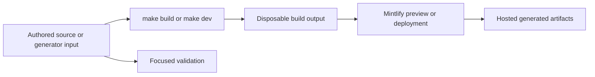

# Quickstart

This repository publishes [docs.langchain.com](https://docs.langchain.com), not [reference.langchain.com](https://reference.langchain.com/python/). Author durable inputs under `src/`, configuration, metadata, or generator code; the builder recreates `build/`, Mintlify consumes it for preview and deployment, and Mintlify may generate further hosted artifacts. Do not edit `build/`, deployment-generated endpoint pages, or the external API-reference site. Report reference-site problems with the [reference documentation issue template](https://github.com/langchain-ai/docs/issues/new?template=04-reference-docs.yml).


```mermaid
flowchart LR
  Input["Authored source or generator input"] --> Build["make build or make dev"]
  Build --> Output["Disposable build output"]
  Output --> Preview["Mintlify preview or deployment"]
  Preview --> Hosted["Hosted generated artifacts"]
  Input --> Check["Focused validation"]
```

This flow separates repository-owned inputs from derived local output and hosted rendering.

## Set up and preview

The project requires Python 3.13 or later, Node.js, and `uv`.

```bash
git clone https://github.com/langchain-ai/docs.git
cd docs
make install
make dev
```

`make install` synchronizes all Python dependency groups, installs project npm dependencies and the global Mintlify CLI, and links authoring skills. Open <http://localhost:3000> after startup.

`make dev` runs an initial build unless `--skip-build` is supplied, watches `src/`, then launches `mint dev --port 3000` from `build/`. It stops rather than serving stale output if the initial build fails. Use `uv run pipeline dev --skip-build` only when a suitable generated tree already exists; use `make build` to recreate it.

Read `AGENTS.md` before editing. It supplies repository-wide authoring rules; `.agents/skills/` holds task procedures. `make skills` links those skills into `.claude/skills/` for Claude Code. In particular, use the page, editing, review, and tooling skills when their task matches; a script, workflow, target, check, or skill change also requires the `docs-tooling-notion` procedure.

## Route the change to its durable owner

Source ownership, emitted route, navigation, and redirects are separate contracts. `src/docs.json` owns Mintlify configuration, navigation, and redirects; add a new authored page to an appropriate group, but do not mistake a menu entry for a generated route.

| Change | Durable input | Verify or maintain |
| --- | --- | --- |
| Shared OSS documentation, including shared MCP guides | `src/oss/` | Python and JavaScript routes; put API-specific MCP prose and references in `:::python` or `:::js` branches. |
| Python- or TypeScript-owned docs, integrations, or MCP migration material | `src/oss/python/` or `src/oss/javascript/` | Only the matching language route and matching navigation entry. |
| OpenWiki or Deep Agents Code | `src/oss/openwiki/` or `src/oss/deepagents/code/` | One unversioned product route. |
| Ordinary LangSmith product content | `src/langsmith/` | One unversioned `/langsmith/...` route and its product-oriented navigation placement. |
| Managed Deep Agents | A direct `src/langsmith/managed-deep-agents*.mdx` file | Python and JavaScript variants, plus an unversioned-to-Python compatibility redirect when needed. |
| Reusable prose or assets | `src/snippets/`, `src/images/`, `src/fonts/`, or shared root inputs | Importing pages and copied assets. |
| Site menu, redirect, or OpenAPI declaration | `src/docs.json` | An emitted route or a deployed generated-reference surface, as applicable. |

A full builder run clears `build/`, emits OSS Python and JavaScript variants, unversioned OpenWiki and Deep Agents Code, ordinary LangSmith content, Managed Deep Agents variants, and shared files. It follows source-family rules; navigation merely projects those routes. Start with [Source Directory Map](/openwiki/architecture/source-map.md) for the route family, then use [Versioned Documentation and Routes](/openwiki/concepts/versioning.md) for variants, redirects, language branches, links, and snippets.

For shared MCP prose, an unfenced `@[ref]` must resolve in both language scopes. Put language-specific API names in the applicable conditional branch, update the scoped link map if necessary, and run `make check-cross-refs`. The [Documentation Preprocessing](/openwiki/concepts/preprocessing.md) page explains the fence and output-rewrite invariants.

## Change generated content at its input

Do not patch a derivative as an alternate source.

- **`build/`:** disposable output of the documentation builder. Rebuild it; never edit it.
- **Provider overview:** `src/oss/python/integrations/providers/overview.mdx` is generated from `packages.yml` by `pipeline/tools/partner_pkg_table.py`. Change its input, regenerate, and commit the result:

  ```bash
  uv run python pipeline/tools/partner_pkg_table.py
  ```

  CI regenerates the overview and rejects a diff.
- **Runnable samples and snippets:** `src/code-samples/` is executable source; `src/code-samples-generated/` is an ignored extraction intermediate; `src/snippets/code-samples/` is committed generated MDX. Run the changed source, then regenerate with `make code-snippets`; do not hand-edit generated snippets. TypeScript samples share `src/code-samples/package.json` and `package-lock.json`, so update both for an MCP adapter or other runtime dependency. Use [Code Sample Lifecycle](/openwiki/workflows/code-sample-lifecycle.md) for markers, remove-region harnesses, MCP fixtures, trace publication, and refresh behavior.
- **Integration discovery:** change a hosted guide's `integration:` frontmatter or `scripts/data/integration_external_docs.yaml`, validate it, then regenerate. `docs_url` accepts HTTP(S) and single-slash site-relative values, but not protocol-relative or unsafe schemes.

  ```bash
  uv run python scripts/refresh_integration_downloads.py --check-docs-urls
  uv run python scripts/refresh_integration_downloads.py --write
  ```

- **Agent Server OpenAPI:** change its specification or `src/docs.json` declaration, then run `make check-openapi`. Mintlify generates configured endpoint pages at deployment rather than from authored endpoint MDX.
- **LangSmith REST OpenAPI:** `src/langsmith/langsmith-platform-openapi.json` is a committed generated deployment input. Do not hand-edit it. `scripts/process_langsmith_openapi.py` fetches only the allowlisted LangSmith endpoint (or accepts a controlled `--input`), hides configured non-public operations, normalizes titles and tag groups, and writes the artifact with `--write`. The trusted daily workflow maintains at most one `chore/refresh-langsmith-openapi` review PR when the generated file differs. Review it as a proposed public-reference change, then inspect a Mintlify preview or production because endpoint pages are deployment-generated. See [LangSmith Platform OpenAPI Refresh](/openwiki/workflows/langsmith-openapi-refresh.md).

## Run the smallest relevant check

Build and inspect an affected route after changing content, configuration, assets, preprocessors, or generator inputs. Then choose the narrowest check that establishes the changed boundary.

| Change boundary | Command | What it establishes |
| --- | --- | --- |
| Pipeline, builder, preprocessor, or generator logic | `make test TEST_FILE=tests/unit_tests/path_or_test.py` | A socket-isolated pytest contract. Omit `TEST_FILE` for the unit-test tree. |
| Shared or language-specific MCP cross-references | `make test TEST_FILE=tests/unit_tests/test_handle_auto_links.py` and `make check-cross-refs` | Scope-aware resolver behavior and strict source-reference validation. |
| Prose | `make lint_prose FILES="src/path/to/page.mdx"` | Vale with the repository-pinned binary. |
| Python tooling and spelling | `make lint` | Ruff format/check, `ty`, and Codespell. |
| Routes, links, anchors, or redirects | `make broken-links-with-anchors` | A fresh build plus Mint link, anchor, and redirect checks. |
| Agent Server OpenAPI | `make check-openapi` | Mintlify validation of the Agent Server specification in `build/`. |
| LangSmith platform OpenAPI policy | `uv run python scripts/process_langsmith_openapi.py --input /path/to/openapi.json --write` | Deterministic curation of a supplied spec; not deployment rendering. |
| Runnable sample or generated snippet | `make test-code-samples FILES="src/code-samples/..."`; `make code-snippets` | Selected program execution, then regenerated snippet MDX. |
| Code-sample generator or TypeScript dependencies | `make test TEST_FILE=tests/unit_tests/test_generate_code_snippet_mdx.py` | Snippet-generation and dependency invariants. |
| Provider overview or integration URL metadata | `uv run python pipeline/tools/partner_pkg_table.py`; `uv run python scripts/refresh_integration_downloads.py --check-docs-urls` | Generated-overview agreement or safe listing URL syntax. |
| Hosted `llms.txt` coverage | `python3 scripts/check_llms_urls.py` | Sitemap URLs are reachable from served indexes, not that a local source or build fixed deployment. |

`make test` disables network sockets except Unix sockets. In contrast, code-sample execution can require credentials, local services, or providers; a LangSmith 429 can be recorded as skipped after retries, so it is not proof that the sample ran. Deployment-generated OpenAPI endpoints and hosted `llms.txt` indexes require a deployment-facing check rather than an edit below `build/`. [Testing Overview](/openwiki/testing/test-overview.md) explains those boundaries and CI behavior.

Core CI runs on pushes to `main`, pull requests, and manual dispatch. It runs unit tests, lint, built-link checks, cross-reference validation, integration-URL validation, generated-overview verification, and merge-conflict checks. Secret-backed code-sample and repository-writing refresh paths have separate trust boundaries; see [GitHub Actions and CI/CD](/openwiki/integrations/github-actions.md).

## Before opening a pull request

1. Confirm the edit is an authored input, configuration change, metadata update, or generator policy change—not disposable or hosted output.
2. Identify the route family before changing navigation; update `src/docs.json` and redirects independently.
3. Inspect every emitted variant that the source family owns. For shared MCP content, check both language outputs and scope each API reference correctly.
4. Regenerate and review derived files after changing their durable inputs. Treat trace sharing and OpenAPI refresh PRs as deliberate public-publication paths.
5. Run focused tests first, add build or deployed-surface validation when the change crosses that boundary, and disclose unavailable credentials or services.

## Task-routing map

- [Source Directory Map](/openwiki/architecture/source-map.md) — choose durable ownership, emitted route family, navigation placement, and API-reference input.
- [Documentation Preprocessing](/openwiki/concepts/preprocessing.md) — maintain conditional content, scoped MCP references, snippets, and output rewrites.
- [Versioned Documentation and Routes](/openwiki/concepts/versioning.md) — safely change language variants, unversioned exceptions, and compatibility URLs.
- [Code Sample Lifecycle](/openwiki/workflows/code-sample-lifecycle.md) — author, execute, extract, and trace runnable samples, including MCP adapter 2 examples.
- [LangSmith Platform OpenAPI Refresh](/openwiki/workflows/langsmith-openapi-refresh.md) — operate the curated platform-spec ingestion and its single review-PR lifecycle.
- [Testing Overview](/openwiki/testing/test-overview.md) — map a change to deterministic, live-service, generated-output, remote, or hosted checks.
- [GitHub Actions and CI/CD](/openwiki/integrations/github-actions.md) — understand CI gates, secrets, trusted writers, and automated review PRs.
