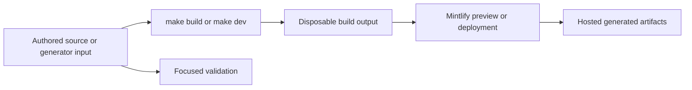

# Quickstart

This repository publishes [docs.langchain.com](https://docs.langchain.com) through Mintlify. It does **not** build [reference.langchain.com](https://reference.langchain.com/python/), whose generated SDK reference is owned elsewhere; use the [reference documentation issue template](https://github.com/langchain-ai/docs/issues/new?template=04-reference-docs.yml) for that site. Make changes to durable inputs under `src/`, metadata, configuration, or generator code—not to `build/`, deployment-generated endpoint pages, or external reference output.


```mermaid
flowchart LR
  Input["Authored source or generator input"] --> Build["make build or make dev"]
  Build --> Output["Disposable build output"]
  Output --> Preview["Mintlify preview or deployment"]
  Preview --> Hosted["Hosted generated artifacts"]
  Input --> Check["Focused validation"]
```

This flow separates repository-owned inputs from rebuilt local output and hosted rendering.

## Set up and preview

The project requires Python 3.13 or later, Node.js, and `uv`.

```bash
git clone https://github.com/langchain-ai/docs.git
cd docs
make install
make dev
```

`make install` synchronizes all Python dependency groups, installs repository npm dependencies and the global Mintlify CLI, and links authoring skills. Open <http://localhost:3000> after startup. The Python `docs` CLI is also installed by `uv sync`; `make dev` and `make build` wrap it, while `mint` is the separate global CLI used for preview and Mintlify checks.

`make dev` builds first unless `--skip-build` is supplied, watches `src/`, and starts `mint dev --port 3000` from `build/`. A failed initial build exits rather than serving stale output. Use `uv run pipeline dev --skip-build` only when an appropriate generated tree already exists.

Read `AGENTS.md` before editing. It is the repository-wide guide; procedures that apply to a particular task live in `.agents/skills/`. `make skills` links those procedures into `.claude/skills/` for Claude Code. In particular, invoke `add-docs-page` for page lifecycle work and `docs-tooling-notion` whenever changing a script, workflow, Make target, check, or skill.

## Find the durable owner before editing

`src/docs.json` is the Mintlify site-configuration, navigation, and redirect source of truth. The site is arranged around two product menus—**Agent development lifecycle** and **Products and setup**—rather than source directories. A lifecycle menu can therefore contain both OSS and LangSmith files; select an owner by path and then place it in the appropriate menu, tab, and group.

| Change | Durable input and expected surface |
| --- | --- |
| Home | `src/index.mdx`; it is custom-mode content and is the only page in the Home menu item. |
| Shared OSS documentation | `src/oss/`; normally emits Python and JavaScript route variants. |
| Language-owned docs and integrations | `src/oss/python/` or `src/oss/javascript/`; emits only the matching language family. |
| OpenWiki or Deep Agents Code | `src/oss/openwiki/` or `src/oss/deepagents/code/`; emits one unversioned OSS route family. |
| Managed Deep Agents | matching `src/langsmith/managed-deep-agents*.mdx`; emits Python and JavaScript variants, with unversioned URLs redirected to Python where configured. |
| Ordinary LangSmith content | `src/langsmith/`; emits an unversioned `/langsmith/...` route and belongs in Test, Deploy, Monitor, or Products and setup according to subject. |
| Reusable prose or assets | `src/snippets/`, `src/images/`, `src/fonts/`, or shared root inputs; validate consumers after the builder copies or preprocesses them. |
| Navigation, redirects, or an OpenAPI declaration | `src/docs.json`; verify the emitted navigation or the deployed reference surface. |

A full build deletes and recreates `build/`, emits the two OSS language variants, unversioned OpenWiki and Deep Agents Code, unversioned LangSmith content, Managed Deep Agents variants, and shared files. Navigation projects these routes; it does not determine source ownership. When adding a page, update `src/docs.json` and any required redirect mapping, but never use generated output as an alternative source. See [Source Directory Map](/openwiki/architecture/source-map.md) and [Adding and Maintaining Documentation Pages](/openwiki/operations/adding-pages.md) for the detailed page workflow.

For shared OSS material, an unfenced `@[ref]` must resolve in both Python and JavaScript scopes. Put language-specific API names in `:::python` or `:::js` branches, update scoped link data when needed, and run `make check-cross-refs`.

## Change generated material at its input

- **Provider overview:** `src/oss/python/integrations/providers/overview.mdx` is generated from `packages.yml` by `pipeline/tools/partner_pkg_table.py`. Change an input and regenerate with `uv run python pipeline/tools/partner_pkg_table.py`; CI rejects a resulting mismatch.
- **Runnable samples:** author executable inputs in `src/code-samples/`, run the affected sample, then use `make code-snippets` to extract and generate committed MDX snippets. `src/code-samples-generated/` is an intermediate and `src/snippets/code-samples/` is generated output; do not hand-edit either. TypeScript samples share `src/code-samples/package.json` and its lockfile, so dependency changes update both. See [Code Sample Lifecycle](/openwiki/workflows/code-sample-lifecycle.md).
- **Integration discovery:** hosted integration frontmatter and `scripts/data/integration_external_docs.yaml` feed discovery tables. Validate URL values before regeneration:

  ```bash
  uv run python scripts/refresh_integration_downloads.py --check-docs-urls
  uv run python scripts/refresh_integration_downloads.py --write
  ```

  External `docs_url` values may be HTTP(S) or a single-slash site-relative URL; protocol-relative and unsafe schemes are rejected.
- **OpenAPI:** Agent Server and LangSmith REST endpoint pages are generated by Mintlify at deployment, not authored endpoint MDX. Change the relevant specification or `src/docs.json` declaration and inspect a deployment/preview rather than editing endpoint output. `make check-openapi` checks the built Agent Server specification.
- **LangSmith REST specification:** `src/langsmith/langsmith-platform-openapi.json` is a committed generated deployment input. Its processor fetches only the allowlisted LangSmith host (or a supplied local input), filters non-public operations, normalizes presentation metadata, and writes only with `--write`. The daily trusted workflow creates or appends to one `chore/refresh-langsmith-openapi` review PR when it finds a diff. See [LangSmith Platform OpenAPI Refresh](/openwiki/workflows/langsmith-openapi-refresh.md).

## Run the smallest relevant check

Build and inspect the affected route after changing content, configuration, assets, preprocessors, or a generator input. Then select the narrowest boundary check.

| Change boundary | Command | What it checks |
| --- | --- | --- |
| Pipeline, builder, preprocessor, or generator logic | `make test TEST_FILE=tests/unit_tests/path_or_test.py` | A focused socket-isolated pytest contract. Omit `TEST_FILE` for all unit tests. |
| Scoped cross-references | `make check-cross-refs` | Source `@[ref]` resolution; pair with a relevant unit test when changing resolver logic. |
| Prose | `make lint_prose FILES="src/path/to/page.mdx"` | The pinned Vale binary against the changed prose. |
| Python tooling or spelling | `make lint` | Ruff format/check, `ty`, and Codespell. |
| Routes, anchors, redirects | `make broken-links-with-anchors` | A fresh build and Mint link, anchor, and redirect checks. |
| Runnable sample or snippet | `make test-code-samples FILES="src/code-samples/..."`; `make code-snippets` | Selected execution followed by regenerated snippet MDX. |
| Provider overview or integration URLs | `uv run python pipeline/tools/partner_pkg_table.py`; `uv run python scripts/refresh_integration_downloads.py --check-docs-urls` | Generated-overview agreement or safe external documentation URLs. |
| Hosted `llms.txt` coverage | `python3 scripts/check_llms_urls.py` | The deployed sitemap is reachable from served indexes, not a local build. |

`make test` disables network sockets except Unix sockets. Code samples can require providers, credentials, or local services, so disclose an unavailable dependency rather than treating an unrun sample as validated. Deployment-generated endpoint pages and Mintlify-generated `llms.txt` indexes require deployment-facing validation; `make broken-links` deliberately excludes those absent local endpoint pages.

Core CI runs on pushes to `main`, pull requests, and manual dispatch. It runs unit tests, lint, link and anchor checks, cross-reference and integration-URL validation, generated-overview verification, and merge-conflict detection. Separate scheduled or trusted workflows refresh the LangSmith spec and check hosted `llms.txt` coverage. See [Testing Overview](/openwiki/testing/test-overview.md) and [GitHub Actions and CI/CD](/openwiki/integrations/github-actions.md).

## Before opening a pull request

1. Confirm the edit is a durable input, not a local build artifact or hosted generated page.
2. Determine source family before changing navigation; update navigation and redirects independently.
3. Inspect every route variant the source family owns. For shared content, check both language outputs and scope API references.
4. Regenerate and review committed derivatives after changing their inputs.
5. Run focused validation first, then add build or deployed-surface checks when the change crosses that boundary.

## Task-routing map

- [Source Directory Map](/openwiki/architecture/source-map.md) — source ownership, emitted route family, navigation, and generated inputs.
- [Adding and Maintaining Documentation Pages](/openwiki/operations/adding-pages.md) — add, move, rename, retire, navigate, and redirect pages.
- [Code Sample Lifecycle](/openwiki/workflows/code-sample-lifecycle.md) — executable sample inputs, shared dependencies, and snippet generation.
- [Testing Overview](/openwiki/testing/test-overview.md) — deterministic, live-service, generated-output, remote, and hosted validation choices.
- [GitHub Actions and CI/CD](/openwiki/integrations/github-actions.md) — CI gates, trust boundaries, scheduled checks, and review-PR automation.
