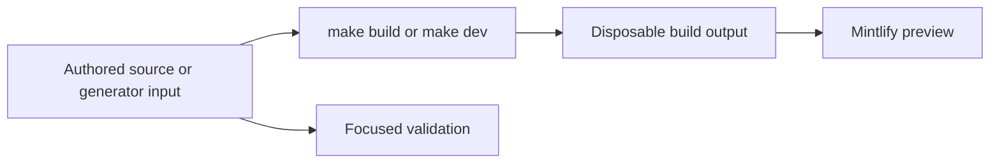

# Quickstart

This repository builds [docs.langchain.com](https://docs.langchain.com) from authored inputs in `src/`. The pipeline recreates `build/`, which Mintlify consumes for local preview and deployment; it is disposable output, never an editing surface. [reference.langchain.com](https://reference.langchain.com/python/) is built outside this repository—use the [reference documentation issue template](https://github.com/langchain-ai/docs/issues/new?template=04-reference-docs.yml) for problems there.


```mermaid
flowchart LR
  Input["Authored source or generator input"] --> Build["make build or make dev"]
  Build --> Output["Disposable build output"]
  Output --> Preview["Mintlify preview"]
  Input --> Check["Focused validation"]
```

This flow separates durable inputs from derived preview, deployment, and hosted artifacts.

## Set up and start a preview

The project requires Python 3.13 or later, Node.js, and `uv`.

```bash
git clone https://github.com/langchain-ai/docs.git
cd docs
make install
make dev
```

`make install` synchronizes all Python dependency groups, installs project npm dependencies and the global Mintlify CLI, and links Claude Code skills. Open <http://localhost:3000> after startup.

`make dev` performs a clean initial build, watches `src/`, then runs `mint dev --port 3000` from `build/`. It does not serve stale output after an initial-build failure. Use `uv run pipeline dev --skip-build` only when a suitable generated tree already exists; use `make build` to reconstruct one from scratch.

Read `AGENTS.md` before editing. It is the repository-wide authoring guide; task-specific procedures live in `.agents/skills/`. Run `make skills` after adding or renaming a skill so Claude Code receives the `.claude/skills/` links.

## Choose the durable input

`src/` is the authored tree, but source location, emitted route, and navigation are distinct concerns. `src/docs.json` is the Mintlify navigation and site-configuration source of truth: add every authored page there, and add a redirect rather than leaving a moved public route behind.

| Change | Start with | Inspect after building |
| --- | --- | --- |
| Shared LangChain, LangGraph, or most Deep Agents documentation | `src/oss/` | Python and JavaScript route variants. |
| Language-specific docs or integrations | `src/oss/python/` or `src/oss/javascript/` | The corresponding language route. |
| OpenWiki | `src/oss/openwiki/` | One unversioned `/oss/openwiki/...` route. |
| Deep Agents Code | `src/oss/deepagents/code/` | One unversioned `/oss/deepagents/code/...` route. |
| LangSmith product documentation | `src/langsmith/` | An unversioned `/langsmith/...` route, except Managed Deep Agents. |
| Managed Deep Agents | `src/langsmith/managed-deep-agents*.mdx` | Python and JavaScript `/langsmith/...` variants; unversioned compatibility URLs redirect to Python. |
| Reusable content or assets | `src/snippets/`, `src/images/`, `src/fonts/`, or shared root inputs | Consumers and copied assets. |
| Mintlify endpoint reference | Configured OpenAPI input or remote spec | Deployment-created pages, not authored MDX or local-build pages. |

Navigation labels are not directory ownership. For example, `src/langsmith/fleet/` is labeled **No-code agents** in navigation. Find a neighboring route in the intended `docs.json` group and mirror its structure deliberately.

For source-to-route rules, see [Source Directory Map](/openwiki/architecture/source-map.md) and [Versioned Documentation and Routes](/openwiki/concepts/versioning.md). For a page addition, move, or retirement, follow [Adding and Maintaining Documentation Pages](/openwiki/operations/adding-pages.md).

## Change generated content at its input

Never use derived output as an alternate source.

- **`build/`:** regenerated by the documentation builder. Do not edit it.
- **Provider overview:** `src/oss/python/integrations/providers/overview.mdx` is generated from `packages.yml` and `pipeline/tools/partner_pkg_table.py`. Change an input and run:

  ```bash
  uv run python pipeline/tools/partner_pkg_table.py
  ```

  CI regenerates this page and rejects an uncommitted difference.
- **Runnable examples and snippets:** author executable source in `src/code-samples/`. `make test-code-samples` executes it; `make code-snippets` extracts it and produces snippet MDX. Do not hand-edit generated snippet output.
- **Integration discovery:** update hosted-guide `integration:` frontmatter or `scripts/data/integration_external_docs.yaml`, then validate and regenerate listings:

  ```bash
  uv run python scripts/refresh_integration_downloads.py --check-docs-urls
  uv run python scripts/refresh_integration_downloads.py --write
  ```

  The validator allows `http://`, `https://`, and a single-slash site-relative URL; it rejects protocol-relative and unsafe-scheme values.
- **OpenAPI:** Mintlify creates configured Agent Server API, Control Plane API, and LangSmith REST API endpoint pages at deployment. Their absence from local output is expected. The committed LangSmith REST specification is refreshed through automation; do not hand-edit it. Use `make check-openapi` for the Agent Server specification.

## Run the smallest relevant check

Build and inspect the affected route after changing pages, navigation, assets, preprocessors, or generator inputs. Then select the boundary that can establish the change.

| Boundary | Command | What it establishes |
| --- | --- | --- |
| Pipeline, builder, watcher, or generator behavior | `make test TEST_FILE=tests/unit_tests/path_or_test.py` | Pytest contracts with network sockets disabled except Unix sockets. Omit `TEST_FILE` for the unit-test tree. |
| Prose | `make lint_prose FILES="src/path/to/page.mdx"` | Vale, using the repository-pinned binary. |
| Python tooling and spelling | `make lint` | Ruff format/check, `ty`, and Codespell. |
| Built routes, links, anchors, and redirects | `make broken-links-with-anchors` | A fresh build plus Mint link, anchor, and redirect checks. |
| Authored `@[ref]` references | `make check-cross-refs` | Source reference mappings, independently of rendered-link checking. |
| Runnable example and snippet | `make test-code-samples FILES="..."`; `make code-snippets` | Live executable source, then regenerated snippet MDX. |
| Integration listing URLs | `uv run python scripts/refresh_integration_downloads.py --check-docs-urls` | Read-only safety validation of external documentation metadata. |
| Provider overview | `uv run python pipeline/tools/partner_pkg_table.py` | Generated overview agreement with its inputs. |
| Deployed `llms.txt` coverage | `python3 scripts/check_llms_urls.py` | Every sitemap URL is reachable from the served `llms.txt` index hierarchy. |

The last check has a different trust boundary: Mintlify generates `llms.txt` and can split a large index into `/_llms/` indexes, neither of which is built or committed here. The checker crawls the hosted root index and same-site nested Markdown indexes, normalizes page URLs, then compares them with the hosted sitemap. It defaults to `https://docs.langchain.com`; use `--base-url` to check another deployment.

A missing URL makes the command fail. First ensure no custom `llms.txt` was added to the generated tree; otherwise report the Mintlify-generated index gap rather than editing a hosted artifact. The read-only `Check llms.txt coverage` workflow runs this check weekly on Monday at 07:13 UTC and can also be dispatched manually. This hosted check supplements, rather than replaces, local builds and link checks.

Core CI runs on pushes to `main`, pull requests, and manual dispatch. It runs the unit-test target and separate lint, built-link, cross-reference, generated-file, integration-URL, and merge-conflict checks.

## Before opening a pull request

1. Confirm the change is in authored content, configuration, metadata, or a generator input—not `build/` or a deployment-generated endpoint page.
2. Add navigation for a new authored page in `src/docs.json`; preserve moved or retired public routes with redirects.
3. Inspect every output variant required by the source family.
4. Regenerate and review derived files after changing their inputs.
5. Run the focused checks above and disclose unavailable credentials or live-service dependencies.

## Task-routing map

- [Local Development](/openwiki/workflows/local-development.md) — setup, watch behavior, preview recovery, and local commands.
- [Build System Architecture](/openwiki/architecture/build-system.md) — source-to-build orchestration and transformation boundaries.
- [Source Directory Map](/openwiki/architecture/source-map.md) — source ownership, routes, navigation, redirects, and deployment-created surfaces.
- [Adding and Maintaining Documentation Pages](/openwiki/operations/adding-pages.md) — safe page additions, moves, and retirements.
- [Changing Versioned Content](/openwiki/workflows/versioned-content.md) — shared and language-specific content, links, snippets, and variants.
- [Mintlify Integration](/openwiki/integrations/mintlify.md) — renderer handoff, OpenAPI, previews, and hosted `llms.txt` behavior.
- [Testing Overview](/openwiki/testing/test-overview.md) — test selection and CI failure interpretation.
- [Code Sample Lifecycle](/openwiki/workflows/code-sample-lifecycle.md) — executable samples and snippet generation.
