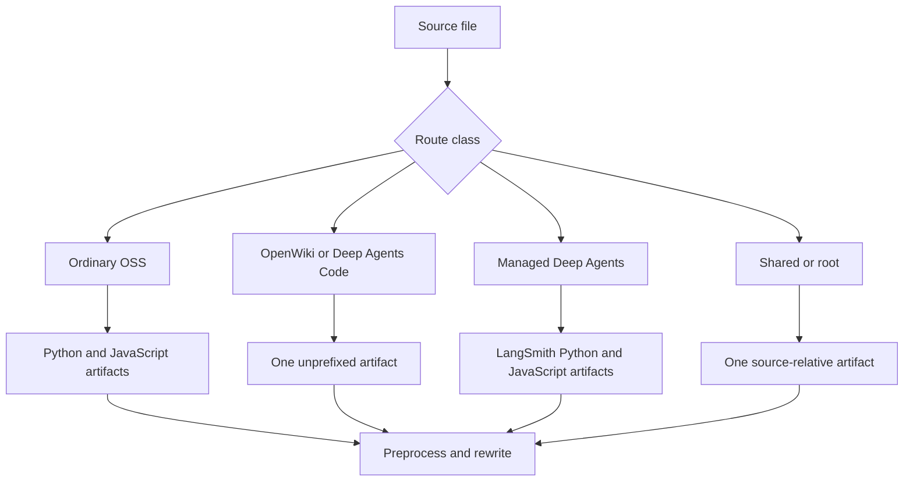

## Scope and test boundary

`DocumentationBuilder` is the filesystem boundary between authored `src/` content and disposable `build/` artifacts. Test observable contracts: emitted paths, paths that must be absent, final file content, and raised errors. Prefer these to private call-count assertions. For surrounding behavior, see [Build System](/openwiki/architecture/build-system.md), [Versioning](/openwiki/concepts/versioning.md), and [Test Overview](/openwiki/testing/test-overview.md).

Run the focused builder tests without network sockets:

```bash
make test TEST_FILE=tests/unit_tests/test_builder.py
```

`make test` runs pytest with sockets disabled. The test dependency group supplies `pytest`, `pytest-asyncio`, and `pytest-socket`; pytest discovers `test_*.py` under `tests/` and uses automatic asyncio mode. Builder and watcher unit tests should use temporary files, mocks, and controlled event-loop seams rather than Mintlify, npm registry, or other network services.

## Fixture harness and assertion style

Use `file_system()` and `File` from `tests/unit_tests/utils.py`. The context manager creates disposable `src/` and `build/` directories, writes UTF-8 `content` or binary `bytes`, exposes `list_build_files()` and `build_file_exists()`, and removes the temporary tree when the context exits.

```python
with file_system([
    File(path="oss/guide.mdx", content="---\ntitle: Guide\n---\n\nBody."),
]) as fs:
    builder = DocumentationBuilder(fs.src_dir, fs.build_dir)
    builder.build_file(fs.src_dir / "oss/guide.mdx")

    assert fs.build_file_exists("oss/python/guide.mdx")
    assert fs.build_file_exists("oss/javascript/guide.mdx")
    assert not fs.build_file_exists("oss/guide.mdx")
```

Keep fixtures small, but include a consuming page when testing snippet imports: a snippet by itself cannot prove that a versioned page selects its matching copy. For transforms, read the final artifact and assert both inclusion and exclusion. For copied assets, assert bytes. For every route exception, assert the intended artifact and absent sibling routes.

## Route-class coverage



This diagram shows the route families that a route-changing test must cover.

- **Ordinary OSS:** a source under `oss/` builds to both `oss/python/...` and `oss/javascript/...`. During a full build, source files already below `oss/python/` or `oss/javascript/` participate only in their matching pass and that source-language component is removed from the output path. Include conditional blocks and bare `/oss/` links when selection or rewriting can change.
- **Intentional unversioned OSS:** `oss/deepagents/code/` and `oss/openwiki/` build once at their source-relative routes, using the Python target for conditional blocks. Their product links remain unprefixed, while links to ordinary OSS content acquire the Python route.
- **Managed Deep Agents:** only a direct Markdown/MDX child of `langsmith/` whose name starts `managed-deep-agents` is special. `build_file()` emits Python and JavaScript routes. Full-build discovery intentionally globs only `managed-deep-agents*.mdx`; a `.md` fixture therefore tests the single-file path, not full-build discovery. Assert that `.mdx` produces no unversioned `langsmith/managed-deep-agents-*.mdx` artifact.
- **Shared and simple content:** `docs.json`; named root pages; paths containing `snippets`, `images`, `.well-known`, or `fonts`; and `.js`/`.css` files are emitted once. In particular, local `.jsx` and `.tsx` snippet components stay under `build/snippets/` rather than being language-expanded.

The intake allowlist contains 22 extensions, including Markdown, JSON, SVG, images, video, YAML, CSS/JavaScript, JSX/TSX, text, fonts, and HTML. Unsupported suffixes and `TEMPLATE.mdx` are skipped. `docs.yml` is the special conversion case: it is parsed with `yaml.safe_load` and emitted as `docs.json`; other supported YAML files are copied.

## Ordered Markdown and snippet assertions

For Markdown and MDX, assert the output in its actual order. `preprocess_markdown()` first resolves autolinks, adds LangSmith CTA UTM parameters, and filters language blocks. The builder then rewrites language-targeted snippet imports, OSS links, and Managed Deep Agents links, before attempting to append the source-links footer. A `.md` input emits `.mdx`. Processing failures are logged and re-raised; the footer helper is best-effort and returns the original content on its own failures.

Use [Conditional Rendering Tests](/openwiki/testing/conditional-rendering.md) for parser-level fences. Builder route fixtures should protect these boundaries:

- Bare Markdown links and HTML `href` values under `/oss/` receive `python` or `javascript`; already-prefixed paths, any path containing `images`, and Deep Agents Code/OpenWiki routes remain unchanged.
- Bare `/langsmith/managed-deep-agents...` Markdown or HTML links receive the active language. Already-qualified paths are preserved.
- Only default-import syntax for snippet `.md`/`.mdx` paths is rewritten from `/snippets/...` to `/snippets/python/...` or `/snippets/javascript/...`. Already-prefixed imports and named component imports are unaffected.
- A Markdown snippet produces a Python-default base file and Python and JavaScript copies. Each uses absolute language-prefixed OSS links, which protects nested consumers. Snippets receive no source footer.
- A normal Markdown page receives the generated source-links footer except root `index.mdx` and paths containing `snippets`.

When changing a rewriter, retain helper tests for syntax edges and an end-to-end `build_all()` or `build_file()` fixture for the consuming route. See [npm Snippets](/openwiki/integrations/npm-snippets.md) when changing the component integration.

## Source safety and generated artifacts

Source discovery is a publication boundary. `_safe_source_files()` rejects every symlink, including one that targets a regular file, and rejects a resolved regular path outside its requested root. Create an outside secret and a symlink within an eligible source subtree, then assert that it is neither collected nor copied and its content does not reach build output.

`_resolve_within()` protects paths derived from editable MDX or `docs.json`: OpenAPI specs must stay inside `build/`, snippet imports used for `llms-full.txt` must stay beneath `build/snippets`, and section-index destinations must remain under `build/`. Test an escaping snippet import with both a real in-tree snippet directory and an outside secret; otherwise a missing directory can make a containment test pass for the wrong reason. Assert an in-tree child resolves and an escape returns `None`.

A full build clears `build/`, emits route families and shared files, overlays npm components, and then generates `llms.txt` and `llms-full.txt`. The npm overlay uses `node_modules/@langchain/docs-sandbox/dist`; absent package content only logs a warning. When changing its mappings or precedence, build a fixture with that sibling package directory and assert that its `PatternEmbed.jsx` and `ExampleEmbed.jsx` overwrite `build/snippets/pattern-embed.jsx` and `build/snippets/example-embed.jsx`, while `ChatLangChainEmbed.js` overwrites the build-root file.

## OpenAPI and LLM-index invariants

`llms.txt` is a custom index that avoids Mintlify's 100,000-character auto-index truncation. It indexes eligible `.mdx` output using frontmatter title and description, excludes snippets and `noindex: true` pages, and adds generated OpenAPI operations. Small sections remain in the root; large ones are linked as section indexes. Section files are always named `llms.txt`, because alternative names are not served. The root must link directly to every section index: a coverage walker only follows one `.txt` hop.

Test generation with a small build tree and test malformed indexes directly through `_validate_llms_indexes()`:

- Root and every linked section must be at most 50,000 characters; root links cannot point to missing files.
- A section must not link to another `.txt` file, and every page URL must appear exactly once across root and sections.
- The distinct URL count must equal the expected page count. Keep a valid root-plus-section control fixture alongside failure cases.
- The root groups and labels linked sections so an agent can choose one without fetching every index. When a parent section splits by directory, its children get their own readable labels.

OpenAPI pages have no MDX source, so `_openapi_entries()` walks `docs.json` navigation recursively, finds `openapi` blocks, reads only a contained spec, and derives operation URLs as `<directory>/<tag>/<summary>`. Fixtures should cover hidden (`x-hidden`) operations, duplicate summaries with numeric suffixes, and tag slugs that retain underscores; `annotation-queues` and `annotation_queues` are intentionally distinct.

`llms-full.txt` is a corpus rather than an index. It omits snippet files and noindex pages as pages, strips frontmatter, and recursively inlines recognized default snippet imports up to the configured depth. Python and TypeScript OSS pages are written to `oss/python/llms-full.txt` and `oss/javascript/llms-full.txt`; the root starts with site metadata and points to those corpora. Assert that the import statement is absent, unique snippet body appears in each appropriate corpus, and language page records are absent from root.

## Entrypoints and watcher guidance

`build_all()` is the consistency operation: it clears stale output and refreshes package overlays and LLM artifacts. `build_file()` routes one existing file and raises `AssertionError` for a missing one. `build_files()` delegates a singleton to `build_file()`; for multiple paths it shows a progress bar disabled in CI. `build_command()` returns `1` for a missing source directory; otherwise it creates the requested build directory, invokes `build_all()`, and returns `0`.

`DocsFileHandler` ignores names ending in `~`, `.bak`, or `.orig`, plus hidden names ending `.tmp`, `.temp`, or `.swp`. Non-directory changes with supported extensions enter the asynchronous queue through `loop.call_soon_threadsafe`; creation delegates to modification. Existing watcher tests concentrate on filtering, so use a fresh event loop and queue when extending that seam.

`FileWatcher` deduplicates pending paths, cancels and reschedules the debounce task on each event, waits 0.2 seconds after the last event, then builds one file in one worker or a batch with at most four workers. It subsequently touches routed output artifacts for hot reload. Test debounce and batching with mocked builder calls and controlled scheduling, not a live observer or wall-clock timing.

Deletion is a distinct limitation: `DocsFileHandler` removes only the source-relative build path and does not apply builder routing, so versioned or special-derived artifacts can survive until `build_all()` clears them. The hot-reload touch logic covers dual-version and unversioned OSS paths but treats `langsmith` as source-relative. Add focused route-aware regressions before relying on deletion or touching for Managed Deep Agents variants.

## Change checklist

1. Start from the closest fixture and add only the source data needed to express the new invariant.
2. Assert each affected route, each forbidden sibling, and final transformed content for every target language.
3. Use binary fixtures for copied assets and hostile external paths for discovery or derived-input containment.
4. For index work, pair a small generation fixture with validator failures and preserve a valid control case.
5. Keep watcher tests asynchronous but offline; separately cover filtering, queue/debounce, rebuild routing, touching, and deletion.
6. Run the focused module first, then broader build/link checks only when the changed contract crosses into generated-site integration.
