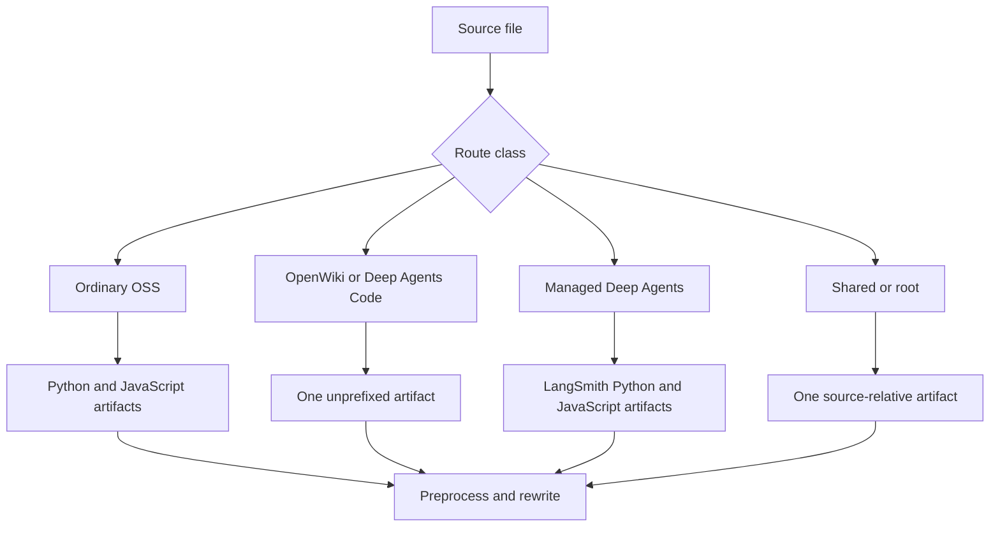

## Scope and execution

`DocumentationBuilder` is the filesystem boundary from authored `src/` to disposable Mintlify input in `build/`. Its useful unit-test contract is observable: emitted routes, intentionally absent routes, final transformed text or bytes, generated artifacts, and failure behavior. Prefer those assertions to private call counts. See [Build System](/openwiki/architecture/build-system.md), [Versioning](/openwiki/concepts/versioning.md), and [Conditional Rendering Tests](/openwiki/testing/conditional-rendering.md) for surrounding contracts.

Run the focused modules without network sockets:

```bash
make test TEST_FILE=tests/unit_tests/test_builder.py
make test TEST_FILE=tests/unit_tests/test_watcher.py
```

The test configuration discovers `test_*.py` and `test_*` and enables pytest-asyncio auto mode. Keep these unit tests offline: use a temporary tree, mocks, and controlled event-loop seams rather than Mintlify, npm installation, an observer, or a live service. [Testing Overview](/openwiki/testing/test-overview.md) describes the broader validation boundaries.

## Fixture harness and assertion discipline

Use `File` and `file_system()` from `tests/unit_tests/utils.py`. The context manager makes a temporary `src/` and `build/` tree, writes UTF-8 `content` or binary `bytes`, provides `list_build_files()` and `build_file_exists()`, then cleans up. A minimal route assertion is:

```python
with file_system([
    File(path="oss/guide.mdx", content="---\ntitle: Guide\n---\n\nBody."),
]) as fs:
    builder = DocumentationBuilder(fs.src_dir, fs.build_dir)
    builder.build_file(fs.src_dir / "oss/guide.mdx")

    assert fs.build_file_exists("oss/python/guide.mdx")
    assert fs.build_file_exists("oss/javascript/guide.mdx")
    assert not fs.build_file_exists("oss/guide.mdx")
```

Keep fixtures small, but make them establish the whole boundary: a consumer page is needed to prove a language-specific snippet import; a binary asset needs byte assertions; and a special route needs positive and negative output-path assertions. For language transforms, assert retained text and excluded text in each variant.

## Route classes to protect



This diagram identifies the artifact families a routing regression should cover.

- Ordinary `oss/` content emits `oss/python/...` and `oss/javascript/...`. A source beneath `oss/python/` or `oss/javascript/` participates only in its matching full-build pass and that source-language segment is removed from its output path. Include conditional blocks and bare `/oss/` links when changing this routing.
- `oss/deepagents/code/` and `oss/openwiki/` are intentional unversioned products. They emit once at the source-relative route, choose the Python conditional branch, and preserve links to their own product while rewriting ordinary OSS links to Python.
- A direct `langsmith/managed-deep-agents*.md` or `.mdx` file builds to Python and JavaScript routes when individually built. Full-build discovery is specifically `managed-deep-agents*.mdx`; test `.mdx` when validating discovery and assert that no unversioned managed-page artifact exists.
- `docs.json`; selected root pages; paths containing `snippets`, `images`, `.well-known`, or `fonts`; and `.js`/`.css` files are shared. JSX/TSX snippet components consequently remain under `build/snippets/` rather than being language-expanded.

The intake allowlist has 22 extensions, including Markdown, JSON, SVG, image and video formats, YAML, CSS/JavaScript, JSX/TSX, text, fonts, and HTML. Unsupported extensions and `TEMPLATE.mdx` are skipped. `docs.yml` is converted with `yaml.safe_load` to `docs.json`; other supported YAML is copied. Assert an allowlist change both as the exact classifier set and as an artifact outcome.

## Markdown, links, and snippet variants

For Markdown, assert transform order rather than only helper output: standard `preprocess_markdown()` runs, then targeted snippet-import rewriting, OSS-link rewriting, Managed Deep Agents-link rewriting, and the source footer. `.md` becomes `.mdx`. Processing errors are logged and raised; footer construction is best-effort and returns the content unchanged on its own error.

Focused builder tests should cover these edges:

- Bare Markdown and HTML `href` links under `/oss/` receive the target language. Already-prefixed routes, paths containing `images`, and unversioned Deep Agents Code/OpenWiki routes must remain unchanged.
- Bare `/langsmith/managed-deep-agents...` links receive the active language; already-qualified URLs are preserved.
- Default imports from `/snippets/...` ending in `.md` or `.mdx` point at `/snippets/python/...` or `/snippets/javascript/...`; already-prefixed imports and component imports do not change.
- A Markdown snippet produces a default Python-resolved file plus Python and JavaScript copies. Its absolute links must work for a nested consumer, and snippets must not receive a source footer.
- Normal Markdown gets the generated GitHub source-links callout except root `index.mdx` and paths containing `snippets`.

Test a rewriter directly for pattern boundaries, but retain an end-to-end `build_all()` or `build_file()` fixture for the routed consumer. Do not infer unsupported regex syntax from an incidental output.

## Generated LLM artifacts

`build_all()` clears output, emits routes and shared content, overlays npm components, then generates `llms.txt` and `llms-full.txt`. Use small full-build trees for generation behavior and direct helper tests for malformed generated files.

### `llms.txt`: a one-hop complete index

The custom index avoids Mintlify's 100,000-character autogenerated-index truncation. It enumerates eligible MDX pages with frontmatter title/description metadata and adds OpenAPI-generated pages; snippets and `noindex: true` pages are excluded. Small groups remain in the root. Large groups are partitioned by directory into files named exactly `<directory>/llms.txt`, with labeled, product-grouped root links.

The one-hop contract is essential: Mintlify serves `llms.txt` at a directory but not invented numbered names, and index coverage walkers do not descend from a section index to another `.txt` link. `_validate_llms_indexes()` therefore fails the build on an over-50,000-character root or section, missing linked section, nested index link, duplicate URL, or a unique-page count that differs from expected. Keep a well-formed root-plus-section control alongside each failure test. When a section splits, assert every emitted index is literally named `llms.txt`, is directly linked from root, has a useful own label, and contributes each page exactly once.

### OpenAPI pages

OpenAPI pages are not MDX files. `_openapi_entries()` recursively walks `docs.json` navigation for `openapi` blocks, reads each contained build-tree specification, and derives Mintlify-style `<directory>/<tag>/<summary>` slugs. It skips `x-hidden` operations, adds numeric suffixes for duplicate operation summaries, and preserves underscores in tag slugs. Test a nested navigation fixture with a controlled JSON specification, including hidden, duplicate, and underscore-versus-hyphen tags.

### `llms-full.txt`: separated corpora with expanded content

The full corpus excludes snippets and `noindex` pages as top-level entries, removes frontmatter, and records each page title, source URL, and body. It recursively inlines recognized single-quoted default snippet imports and their component use, stopping after depth six. The root corpus contains unversioned pages and pointers; Python and JavaScript OSS content belongs in `oss/python/llms-full.txt` and `oss/javascript/llms-full.txt`. Generated OpenAPI pages have no MDX body, so their identity is appended to the root corpus.

Test the whole relationship: import text disappears, a unique nested snippet body appears in the applicable corpus, language variants stay in their split corpora, the root starts with the site title and links to both splits, and a traversal import does not leak a secret.

## Filesystem containment and package overlay

Source discovery is a publication boundary. `_safe_source_files()` rejects every symlink, even one targeting a regular file, and rejects regular paths resolving outside its requested root. Create an external secret and a symlink from an eligible source directory; assert it is not collected, copied, or present in output.

`_resolve_within()` protects paths derived from editable MDX or `docs.json`: OpenAPI specifications stay under `build/`, llms-full snippet imports under `build/snippets`, and section-index writes under `build/`. For a meaningful traversal regression, create a real in-tree snippet directory and an outside secret, then assert a child resolves while an escaping candidate returns `None` and the secret is absent from corpus output.

The npm overlay deliberately overwrites same-named source copies with prebuilt components from `@langchain/docs-sandbox`: `PatternEmbed.jsx` and `ExampleEmbed.jsx` land in `build/snippets/`; `ChatLangChainEmbed.js` lands at the build root. A missing package directory or expected mapped file warns rather than failing. Test mappings and precedence with a fixture-side `node_modules` tree, not a package registry.

## Entrypoints and watcher regressions

`build_all()` is the consistency operation. `build_file()` builds an existing file with route-aware behavior and raises `AssertionError` for a missing file; `build_files()` uses `build_file()` for one item and a CI-hidden tqdm path for several. `build_command()` returns `1` for a missing source directory and otherwise creates the requested build directory, calls `build_all()`, and returns `0`.

`DocsFileHandler` ignores backup names ending in `~`, `.bak`, or `.orig` and hidden temporary names ending `.tmp`, `.temp`, or `.swp`. It queues supported, non-directory creation and modification events through `loop.call_soon_threadsafe`; creation delegates to modification. Extend event tests with a fresh loop and queue when changing this seam, and explicitly retain accepted ordinary and non-temporary hidden-name cases.

`FileWatcher` de-duplicates pending paths, cancels and reschedules the debounce task on each event, waits 0.2 seconds after the last event, builds one file in one worker or a bounded batch of at most four workers, then touches expected outputs for Mint hot reload. Test debounce and concurrency with mocked builder calls and controlled time, not an observer or wall-clock race.

Deletion is deliberately different: the handler removes only the source-relative output path and does not apply builder routing. A deleted dual-version or specially routed source can leave artifacts until a full build clears them. Touch routing explicitly handles ordinary dual-version OSS and unversioned OSS products, but treats `langsmith` as one source-relative output; add a focused regression before assuming it refreshes Managed Deep Agents variants. A route-aware watcher change needs assertions for every emitted output plus a full-build recovery test.

## Change checklist

1. Start from the closest fixture and encode one changed invariant with the smallest source tree.
2. Assert every affected output route, absent sibling route, and final transformed text for each language.
3. Use binary fixture data for copied assets and hostile external paths for source or derived-input safety.
4. For index changes, combine a small generation fixture, a valid one-hop control, and direct validator failures.
5. For corpus changes, test recursive inlining, language split placement, depth behavior, and containment together.
6. Keep watcher tests asynchronous but offline; test filtering, queueing, debounce, rebuild routing, touching, and deletion independently.
7. Run the focused module first; use broader build/link validation only when the changed contract crosses into generated-site integration.
