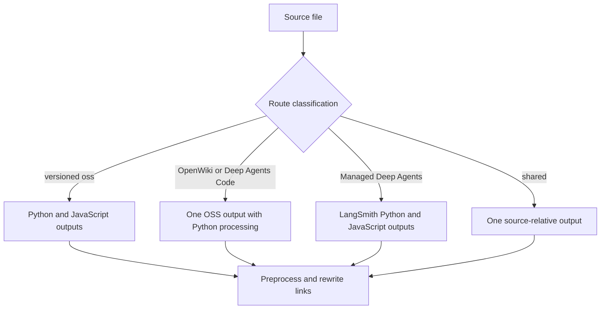

## Scope and test boundary

`DocumentationBuilder` is the file-system boundary between `src/` and the rendered build tree. Its tests should assert **observable artifacts**—output paths, absent paths, output content, and raised failures—rather than private call counts. Use this page alongside [Build System](/openwiki/architecture/build-system.md), [Preprocessing](/openwiki/concepts/preprocessing.md), and [Versioning](/openwiki/concepts/versioning.md); [Testing Overview](/openwiki/testing/test-overview.md) explains how to run the suite.

The focused command is:

```bash
make test TEST_FILE=tests/unit_tests/test_builder.py
```

Use `tests/unit_tests/test_watcher.py` when changing event filtering. The unit suite is deliberately isolated: create files in the fixture rather than relying on the checkout, network, or a running Mintlify process.

## The fixture is the contract harness

Use `file_system()` from `tests/unit_tests/utils.py`. It creates a disposable `src/` and `build/` pair, writes each `File` fixture as UTF-8 `content` or binary `bytes`, and removes the temporary tree on exit. Inspect artifacts through `list_build_files()`, `build_file_exists()`, or direct reads from `fs.build_dir`.

```python
with file_system([
    File(path="oss/guide.mdx", content="---\ntitle: Guide\n---\n\nBody."),
]) as fs:
    builder = DocumentationBuilder(fs.src_dir, fs.build_dir)
    builder.build_file(fs.src_dir / "oss/guide.mdx")

    assert fs.build_file_exists("oss/python/guide.mdx")
    assert fs.build_file_exists("oss/javascript/guide.mdx")
```

Keep fixtures minimal but use a consumer when testing imports: a snippet alone cannot prove that a versioned page imports the matching language copy. Likewise, routing tests should assert both the intended route and the routes that must not exist; absence is essential for avoiding duplicate or orphaned pages.

## Routing invariants worth protecting



This flow shows the artifact-routing decisions a builder regression test should observe.

- Ordinary `oss/` content is emitted for Python and JavaScript. Include language fences and bare `/oss/` links in the fixture when a route change could affect preprocessing or URL rewriting.
- `oss/deepagents/code/` and `oss/openwiki/` are deliberate exceptions: they build once at their source-relative route, process conditional blocks as Python, and keep links to their own unversioned product route. They still rewrite a link to ordinary versioned OSS content to Python.
- Managed Deep Agents Markdown directly under `langsmith/` emits only `langsmith/python/` and `langsmith/javascript/` routes. Test the absent unversioned path as well as rewritten Managed Deep Agents links, OSS links, imports, and conditional content in both outputs.
- Shared files—including `docs.json`, selected root pages, snippets, image/font/.well-known content, and JavaScript/CSS—are copied once. Local `.jsx` and `.tsx` snippet components stay at `build/snippets/`; they are not language-expanded.

The supported extension allowlist is a hard intake boundary. Test an extension-set change in `test_builder_initialization` and pair it with an artifact assertion: unsupported files must not appear, whereas Markdown takes the transformation path and non-Markdown supported files use metadata-preserving copying. `TEMPLATE.mdx` is also skipped, irrespective of its supported extension.

## Content transformation regressions

For Markdown output, assert final text—not merely that the file exists. The builder calls `preprocess_markdown()` first, then rewrites snippet imports, OSS URLs, and Managed Deep Agents URLs, and finally appends the source-edit footer except for root `index.mdx` and snippets. A `.md` input writes a `.mdx` output. Processing failures are logged and re-raised, so a test for invalid input should expect failure rather than a partial successful build.

Use the existing targeted regressions as the boundaries for link work:

- `_rewrite_oss_links()` must add the selected language to bare absolute `/oss/` links, but must not double-prefix links already under `/oss/python/` or `/oss/javascript/`. It also leaves image URLs and the two unversioned product routes unchanged.
- `_rewrite_managed_deep_agents_links()` inserts the selected language only for unprefixed Managed Deep Agents paths; include fragments or HTML `href` values if changing its pattern.
- Versioned pages rewrite Markdown snippet imports to `/snippets/python/` or `/snippets/javascript/`. Snippet components are intentionally not rewritten by that Markdown-import rule.
- Snippet Markdown is emitted three times: default (Python-flavored) plus Python and JavaScript copies. The nested-consumer regression protects absolute language-prefixed OSS links; do not replace that fixture with a shallow page, which would miss the original relative-link failure.

`docs.yml` is special: it is parsed with `yaml.safe_load` and written as `docs.json`; parser and I/O failures are logged and propagated. A change here needs a success fixture that reads JSON and a failure assertion if error semantics change.

## Source and generated-index safety

Source discovery rejects every symlink, including a link to an otherwise regular file, and also rejects a resolved path outside the root. Preserve the symlink regression: create an external secret in the fixture’s temporary parent, point a source symlink at it, and assert it is neither collected nor copied. This is a publication-boundary security test, not just a path-normalization unit test.

The full build clears `build/`, performs the route and shared-file stages, then copies published npm sandbox components and generates `llms.txt` and `llms-full.txt`. Test generated artifacts with small, purpose-built source trees:

- `llms.txt` lists non-snippet, non-`noindex` MDX pages using frontmatter title and description and includes derived OpenAPI operations. It delegates large sections to one-hop section indexes and validates size, uniqueness, existence, and coverage; malformed index fixtures should raise `ValueError` at those validation boundaries.
- OpenAPI tests must retain the distinction between duplicate operation summaries (numeric suffixes), hidden operations (omitted), and tag slugs that preserve underscores.
- `llms-full.txt` inlines snippet component bodies for consumer pages, omits raw import statements, excludes snippets and `noindex` pages themselves, and separates the versioned Python and JavaScript corpora from the root corpus.
- The npm copy is an integration edge: missing `node_modules/@langchain/docs-sandbox/dist` only warns, while available mapped component files overwrite source-tree copies. Test it with a controlled package tree only when altering mappings or precedence.

## Incremental watcher guidance

`build_command()` creates a builder and calls the full build; the watcher instead owns a builder, queues supported source-file create/modify events from the watchdog thread using `call_soon_threadsafe`, debounces for 0.2 seconds, and builds the deduplicated pending set in worker threads. It then touches the corresponding built artifacts so hot reload sees their timestamps. A burst should therefore result in one batch after the final event, not one rebuild per event.

The current watcher regression boundary is intentionally narrow: `DocsFileHandler._should_ignore_file()` must reject editor backups ending in `~`, `.bak`, or `.orig`, and hidden `.tmp`, `.temp`, and `.swp` files while accepting ordinary documentation and asset names. Preserve edge cases such as a tilde in the middle of a name and ordinary hidden files.

When extending watcher behavior, add async tests at the public event/queue seam before testing observer lifecycle: create a fresh loop and `asyncio.Queue`, send a lightweight watchdog event, and assert queueing or no queueing. For batching or touch-path changes, test the output routes that mirror builder routing: ordinary OSS has two timestamps, shared and unversioned OSS have one, and `.md` output uses `.mdx`. Deletion is a separate contract: the handler removes only the source-relative output path, so a routing-aware deletion change needs explicit coverage for derived variants.

## Change checklist

1. Start with the closest existing regression fixture; expand it only to express the changed invariant.
2. Assert paths, missing paths, and transformed content for every affected language or route class.
3. Add binary fixture data for copied assets and a hostile symlink for changes to source discovery.
4. For a full-build stage change, verify generated indexes or copied npm outputs only if that stage is affected.
5. For incremental work, separately cover event filtering, debouncing/batching, routing-aware rebuild output, and hot-reload touching.
