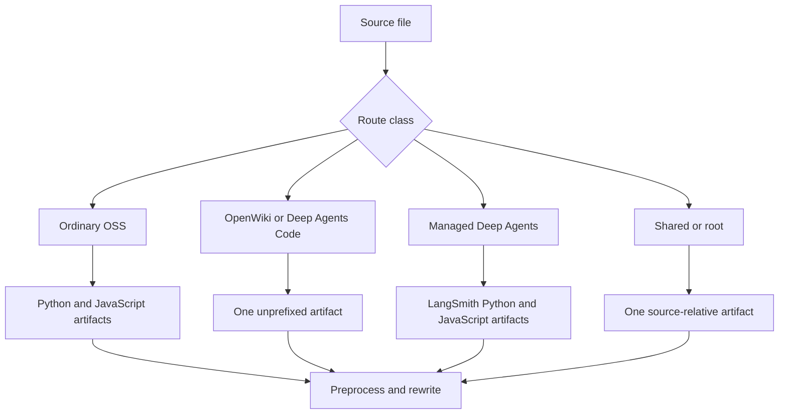

## Scope and test boundary

`DocumentationBuilder` is the filesystem boundary between authored `src/` content and disposable `build/` artifacts. Test its observable contract: emitted paths, paths that must be absent, final file content, and raised errors. Do not substitute private call-count assertions for output assertions. See [Build System](/openwiki/architecture/build-system.md), [Preprocessing](/openwiki/concepts/preprocessing.md), and [Versioning](/openwiki/concepts/versioning.md) for the surrounding behavior.

Run the focused, socket-isolated test module with:

```bash
make test TEST_FILE=tests/unit_tests/test_builder.py
```

Use `tests/unit_tests/test_watcher.py` for the current event-filter contract. `pyproject.toml` configures pytest discovery and asyncio auto mode; the test dependency group includes `pytest`, `pytest-asyncio`, and `pytest-socket`. Keep builder and watcher tests offline: use temporary files, mocks, and controlled event-loop seams. A Mintlify process, npm registry, or network service is not required for these unit contracts.

## Fixture harness and assertion style

Use `file_system()` and `File` from `tests/unit_tests/utils.py`. The context manager creates a disposable `src/` and `build/` pair, writes UTF-8 `content` or binary `bytes`, exposes `list_build_files()` and `build_file_exists()`, and removes the tree on exit.

```python
with file_system([
    File(path="oss/guide.mdx", content="---\ntitle: Guide\n---\n\nBody."),
]) as fs:
    builder = DocumentationBuilder(fs.src_dir, fs.build_dir)
    builder.build_file(fs.src_dir / "oss/guide.mdx")

    assert fs.build_file_exists("oss/python/guide.mdx")
    assert fs.build_file_exists("oss/javascript/guide.mdx")
    assert not fs.build_file_exists("oss/guide.mdx")
```

Keep each fixture small, but include a consumer when testing imports: a snippet alone cannot establish that a versioned page selects the matching snippet copy. Read final output when testing transforms, and assert both positive and negative cases—for example, selected conditional text is present and the other language's text is absent. For copied assets, assert bytes. For a route exception, assert the intended artifact *and* that unwanted sibling routes do not exist.

## Route-class coverage



This flow identifies the artifact families that a route-changing test should cover.

- **Ordinary OSS:** a source below `oss/` builds to both `oss/python/...` and `oss/javascript/...`. A source below `oss/python/` or `oss/javascript/` is included only in its matching pass and loses that source-language directory in the output. Include language blocks and bare `/oss/` links when the change can affect selection or rewriting.
- **Intentional unversioned OSS:** `oss/deepagents/code/` and `oss/openwiki/` build once at their source-relative route, using the Python target for conditional processing. Their own product links remain unprefixed, while a link to ordinary OSS content is rewritten to its Python route.
- **Managed Deep Agents:** only a direct Markdown or MDX child of `langsmith/` whose filename starts `managed-deep-agents` is special. `build_file()` emits its Python and JavaScript routes. In a full build, the dedicated discovery glob is `managed-deep-agents*.mdx`, so a `.md` fixture can exercise the single-file path but does not establish full-build discovery. Assert that full-build `.mdx` fixtures produce no unversioned `langsmith/managed-deep-agents-*.mdx` artifact.
- **Shared and simple content:** `docs.json`; named root pages; any `snippets`, `images`, `.well-known`, or `fonts` path component; and `.js`/`.css` files are emitted once. Local `.jsx` and `.tsx` snippet components therefore stay under `build/snippets/`, rather than being language-expanded.

The intake allowlist contains 22 extensions: `.mdx`, `.md`, `.json`, `.svg`, image formats, video formats, YAML, CSS/JavaScript, JSX/TSX, `.txt`, fonts, and `.html`. Unsupported suffixes are skipped; `TEMPLATE.mdx` is skipped regardless of suffix support. Test an allowlist change by asserting the exact classifier set and the resulting artifact boundary. `docs.yml` or `docs.yaml` is the special conversion path only when the filename is exactly `docs.yml`: it is parsed with `yaml.safe_load` and written as `docs.json`; other supported YAML is copied.

## Ordered Markdown and snippet assertions

For Markdown and MDX, assert output text in its actual order: `preprocess_markdown()` runs first, then language-targeted snippet-import rewriting, OSS link rewriting, Managed Deep Agents link rewriting, and finally the source footer. `.md` output changes to `.mdx`. Content-processing and file-processing errors are logged and re-raised; a footer failure is best-effort and leaves the content unchanged.

Use [Conditional Rendering Tests](/openwiki/testing/conditional-rendering.md) for parser-level fence cases. Builder-level route fixtures should protect these additional boundaries:

- Bare Markdown links and HTML `href` values under `/oss/` receive `python` or `javascript`; already-prefixed paths, any path containing `images`, and Deep Agents Code/OpenWiki routes are unchanged.
- Bare `/langsmith/managed-deep-agents...` Markdown or HTML links receive the active language; already-qualified paths remain unchanged.
- Only default-import syntax for snippet `.md`/`.mdx` paths is rewritten from `/snippets/...` to `/snippets/python/...` or `/snippets/javascript/...`. Already-prefixed imports and component imports are unaffected.
- A Markdown snippet produces a Python-default base file plus Python and JavaScript copies. Its links are absolute and language-prefixed, which is necessary for a nested consumer; snippets receive no source footer.
- A normal Markdown page receives the generated source-links footer except root `index.mdx` and any path containing `snippets`.

When changing a rewriter, test the helper for pattern edges and retain an end-to-end `build_all()` or `build_file()` fixture for the route and artifact that consumes it. Do not claim a regex supports syntax the fixture has not exercised.

## Source safety and generated artifacts

Source discovery is a publication boundary. `_safe_source_files()` rejects every symlink, including one to a regular file, and rejects a resolved regular path outside its requested root. In a fixture, create a secret outside `src/`, link to it from an eligible directory, then assert it is neither collected nor copied and its content is absent from generated output.

The builder also uses `_resolve_within()` for paths derived from editable MDX or `docs.json`: OpenAPI specs must remain inside `build/`, snippet imports used by `llms-full.txt` must remain under `build/snippets`, and section-index writes must remain inside `build/`. Test traversal with a real in-tree snippet directory plus an outside secret, so the containment guard—not a missing intermediate directory—causes rejection. Assert an in-tree child resolves and an escaping candidate returns `None`.

A full build clears `build/`, emits routed and shared content, overlays npm components, then generates `llms.txt` and `llms-full.txt`. Use direct helper tests for deliberately malformed index files and small full-build trees for generation behavior:

- `llms.txt` indexes eligible `.mdx` artifacts and derived OpenAPI operations, using title/description metadata; snippets and `noindex: true` pages are excluded. Small sections remain in root, while large sections are split by directory into root-linked section `llms.txt` files.
- `_validate_llms_indexes()` raises `ValueError` for an over-50,000-character root or section, a root link to a missing section, a second `.txt` link level, duplicate page URLs, or a unique-page count different from the expected count. Include one well-formed root-plus-section fixture as the control case.
- OpenAPI fixtures should put an `openapi` block in `docs.json` navigation and a controlled JSON spec in the build. Assert recursive navigation discovery, omission of `x-hidden` operations, numeric suffixes for duplicate summaries, and underscore-preserving tag slugs.
- `llms-full.txt` excludes snippets and `noindex` pages as pages, strips frontmatter, and inlines recognized snippet imports recursively up to the configured depth. Assert the import statement disappears, unique snippet body appears, and `oss/python/llms-full.txt` and `oss/javascript/llms-full.txt` contain their respective variants while the root corpus points to them.
- The npm overlay is a controlled filesystem edge, not a live package test. A missing `node_modules/@langchain/docs-sandbox/dist` only warns. If changing mappings or precedence, create that directory beside the fixture source tree and assert mapped files overwrite source copies at `build/snippets/` or the build root.

## Entrypoints and watcher guidance

`build_all()` is the consistency operation: it removes stale output and refreshes package overlays and LLM artifacts. `build_file()` routes one existing file and raises `AssertionError` for a nonexistent one. `build_files()` calls the single-file path for one item; for multiple items it uses a tqdm progress bar that is disabled in CI. Test these methods by their artifact effects, not progress output. `build_command()` returns `1` when `src_dir` is absent; otherwise it creates the requested build directory, calls `build_all()`, and returns `0`.

`DocsFileHandler` ignores names ending `~`, `.bak`, or `.orig`, plus hidden names ending `.tmp`, `.temp`, or `.swp`. Create/modify events for non-directory, supported files are queued using `loop.call_soon_threadsafe`; creation delegates to modification. Extend the current narrow filtering tests with a fresh event loop and queue when changing this event seam, and explicitly cover accepted ordinary and non-temporary hidden names.

`FileWatcher` deduplicates pending paths, cancels and reschedules its delay on each event, waits 0.2 seconds after the last event, and builds one path in one worker or a batch with at most four workers before touching expected outputs for hot reload. Test debounce or batching with mocked builder calls and controlled time rather than an observer or live filesystem timing.

Treat deletion separately: for a deleted source path, the handler removes only the source-relative output path. It does not apply the builder route map, so deletion of a dual-version or special-routed source can leave derived artifacts until a full build. Likewise, the touch logic has explicit dual-version and unversioned OSS handling but treats `langsmith` as one source-relative path; add a focused regression before relying on it for Managed Deep Agents variants. A route-aware deletion or touch change needs output assertions for every emitted artifact and a full-build recovery test where derived artifacts matter.

## Change checklist

1. Start from the closest existing fixture and change only enough source data to express the new invariant.
2. Assert every affected route, missing sibling route, and final transformed content for each target language.
3. Use binary fixture data for copied assets and hostile external paths for discovery or derived-input safety.
4. For LLM-index work, combine a small generation fixture with direct validator failures; preserve the valid control case.
5. Keep watcher tests asynchronous but offline, and separately cover filtering, queue/debounce behavior, rebuild routing, touching, and deletion.
6. Run the focused module first; run broader build/link checks only when the changed contract crosses into generated-site integration.
