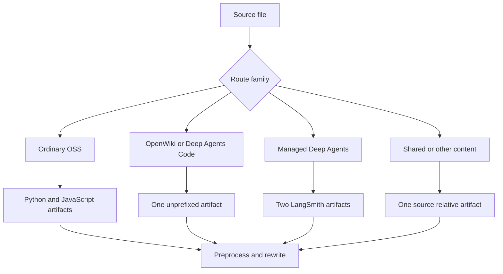
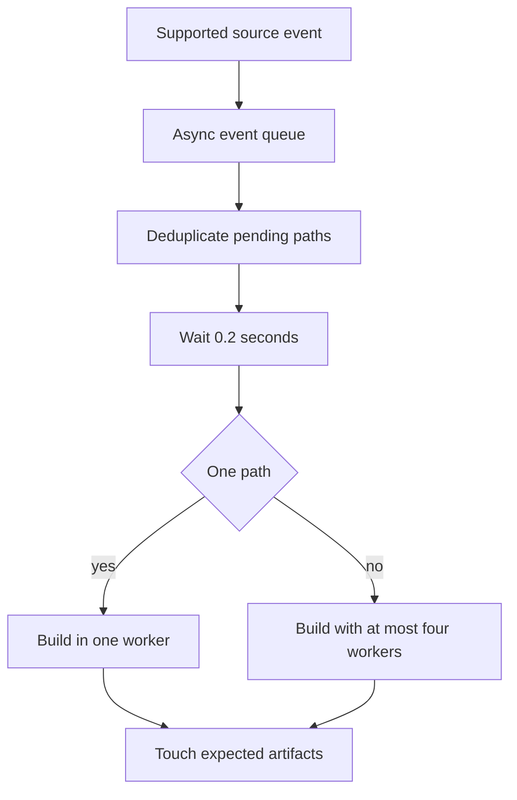

## Scope and test boundary

`DocumentationBuilder` is the filesystem boundary between authored `src/` content and disposable `build/` artifacts. Its unit tests should assert observable contracts: emitted paths, paths that must be absent, transformed output content, copied bytes, and propagated failures. Avoid private call-count assertions that merely restate implementation structure. For the system design, see [Build System](/openwiki/architecture/build-system.md), [Source Directory Map](/openwiki/architecture/source-map.md), [Preprocessing](/openwiki/concepts/preprocessing.md), and [Versioned Documentation and Routes](/openwiki/concepts/versioning.md).

Run the focused module without Internet sockets:

```bash
make test TEST_FILE=tests/unit_tests/test_builder.py
```

`make test` runs pytest with sockets disabled, except for Unix sockets. Use temporary files and controlled inputs for builder and watcher tests; do not require Mintlify, the npm registry, or a live observer to prove a local routing or transformation rule.

## Fixture harness and assertion style

Use `file_system()` and `File` from `tests/unit_tests/utils.py`. The context manager creates isolated `src/` and `build/` directories, writes UTF-8 `content` or binary `bytes`, exposes `list_build_files()` and `build_file_exists()`, and removes the temporary tree at exit.

```python
with file_system([
    File(path="oss/guide.mdx", content="---\ntitle: Guide\n---\n\nBody."),
]) as fs:
    builder = DocumentationBuilder(fs.src_dir, fs.build_dir)
    builder.build_file(fs.src_dir / "oss/guide.mdx")

    assert fs.build_file_exists("oss/python/guide.mdx")
    assert fs.build_file_exists("oss/javascript/guide.mdx")
    assert not fs.build_file_exists("oss/guide.mdx")
```

Keep a fixture small, but include every dependency required to prove an end-to-end contract. For example, a snippet alone proves its copies exist; a consuming page proves that its import is redirected to the matching copy. Read final artifacts and assert both retained and removed conditional content. Use byte fixtures for assets. For every routing exception, assert the desired artifact and the forbidden sibling routes.

## Route families to protect


```mermaid
flowchart TD
    Source["Source file"] --> Classify{"Route family"}
    Classify --> Ordinary["Ordinary OSS"]
    Classify --> Product["OpenWiki or Deep Agents Code"]
    Classify --> Managed["Managed Deep Agents"]
    Classify --> Shared["Shared or other content"]
    Ordinary --> Variants["Python and JavaScript artifacts"]
    Product --> OneProduct["One unprefixed artifact"]
    Managed --> ManagedVariants["Two LangSmith artifacts"]
    Shared --> OneShared["One source relative artifact"]
    Variants --> Transform["Preprocess and rewrite"]
    OneProduct --> Transform
    ManagedVariants --> Transform
    OneShared --> Transform
```

This diagram identifies the output families a routing regression can affect.

- **Ordinary OSS:** `oss/` content produces `oss/python/...` and `oss/javascript/...`. A source subtree already named `python` or `javascript` participates only in its matching full-build pass, and that segment is removed in the output. Include conditional blocks and bare `/oss/` links when selection or rewriting is relevant.
- **Intentional unversioned OSS:** `oss/deepagents/code/` and `oss/openwiki/` emit once at source-relative routes and use the Python target for conditional blocks. Links within those product roots remain unprefixed; links to ordinary OSS content receive the Python route.
- **Managed Deep Agents:** a direct Markdown or MDX child of `langsmith/` with a `managed-deep-agents` name emits Python and JavaScript routes, not an unversioned artifact. The bulk discovery pass only globs `.mdx`; use `.mdx` in full-build fixtures. A `.md` fixture can still exercise `build_file()` classification.
- **Shared inputs:** `docs.json`; specified root pages; paths containing `snippets`, `images`, `.well-known`, or `fonts`; and `.js` or `.css` files emit once. Local `.jsx` and `.tsx` snippet components remain below `build/snippets/` rather than expanding by language.

The supported input set contains 22 suffixes. Unsupported files and `TEMPLATE.mdx` are skipped. `docs.yml` is the conversion exception: it is parsed with `yaml.safe_load` and written as `docs.json`; other supported YAML files are copied.

## Markdown, links, and snippets

For regular Markdown and MDX, the observable ordering is: standard preprocessing, language-specific snippet-import rewrite when targeted, OSS-link rewrite, Managed Deep Agents-link rewrite, then the eligible source footer. A `.md` input emits `.mdx`. Processing errors are logged and re-raised; footer construction is best-effort and leaves content unchanged if it fails.

Protect these boundaries with focused helper and artifact assertions:

- `preprocess_markdown()` resolves autolinks, adds LangSmith CTA UTM parameters, and selects `:::python` or `:::js` blocks. Without an explicit target it uses `TARGET_LANGUAGE`, defaulting to `python`.
- Markdown links and HTML `href` values under `/oss/` receive `python` or `javascript` for a language build. Already-qualified routes, paths containing `images`, and the unversioned Deep Agents Code and OpenWiki roots must not be changed.
- Bare `/langsmith/managed-deep-agents...` links receive the selected public language name. Already-prefixed links remain unchanged.
- Only default imports from `/snippets/...` ending in `.md` or `.mdx` are scoped to `/snippets/python/...` or `/snippets/javascript/...`. Named component imports and already-prefixed imports are intentionally untouched.
- A Markdown snippet emits a Python-default base copy plus Python and JavaScript copies. Snippet copies contain absolute language-qualified links and receive no source footer.
- Normal Markdown receives the source-links footer except root `index.mdx` and any path containing `snippets`.

When changing a rewriter, keep a narrow syntax-edge test and an end-to-end `build_file()` or `build_all()` fixture. The latter verifies that route selection and consumption agree, rather than only that a regular expression substitutes text. See [Conditional Rendering Tests](/openwiki/testing/conditional-rendering.md) for parser-level conditional-fence cases.

## Full-build invariants and extension boundaries

`build_all()` is the reconstruction operation: it deletes and recreates `build/`, builds ordinary OSS language trees, emits the two unversioned OSS products and LangSmith content, then produces Managed Deep Agents variants, shared inputs, and the npm component overlay. It does **not** generate `llms.txt` or `llms-full.txt`; do not add builder-test assertions for those artifacts.

The installed `@langchain/docs-sandbox` overlay runs after shared-file copying, so its mapped files win over source-tree files at the same destination. To modify mapping or precedence, construct the package `dist` sibling of the fixture `src/` tree and assert final contents of `build/snippets/pattern-embed.jsx`, `build/snippets/example-embed.jsx`, and `build/ChatLangChainEmbed.js`. Missing package directories or mapped files are warnings, not build failures.

`build_file()` is useful for a quick route regression and raises `AssertionError` for a missing path. `build_files()` delegates a singleton to it; for multiple paths it uses a progress bar that is disabled in CI. Test the full build when the behavior depends on collection ordering, source-language filtering, shared-file discovery, cleanup of stale outputs, or overlay precedence.

## Source safety and watcher limits

Whole-tree collectors call `_safe_source_files()`. It rejects every symbolic link, including one that targets a regular file, and skips a regular path whose resolved target escapes the root. A containment regression fixture should create an outside secret and a symlink inside an eligible source subtree, then assert that the symlink is neither collected nor emitted and that the secret never appears in output.

`DocsFileHandler` ignores editor artifacts whose names end in `~`, `.bak`, or `.orig`, and hidden temporary names ending in `.tmp`, `.temp`, or `.swp`. Supported create and modification events are queued through `loop.call_soon_threadsafe`; creation delegates to modification.


```mermaid
flowchart TD
    Event["Supported source event"] --> Queue["Async event queue"]
    Queue --> Pending["Deduplicate pending paths"]
    Pending --> Delay["Wait 0.2 seconds"]
    Delay --> Count{"One path"}
    Count -->|"yes"| OneWorker["Build in one worker"]
    Count -->|"no"| Batch["Build with at most four workers"]
    OneWorker --> Touch["Touch expected artifacts"]
    Batch --> Touch
```

This is the watcher rebuild path after a supported modification or creation event.

The watcher cancels and reschedules its debounce task after each queued event. It touches expected output artifacts after building so Mintlify hot reload sees a modification. Tests for this seam should use a fresh event loop, a controlled queue, and mocked build or touch work instead of wall-clock timing or a live filesystem observer.

Deletion has a deliberate gap: the handler removes only the source-relative output path and does not apply builder routing. Derived versioned and Managed Deep Agents artifacts can therefore survive until `build_all()` clears them. The touch routing also treats `langsmith` as unversioned, so it does not touch Managed Deep Agents variants. Add a route-aware regression before relying on incremental deletion or hot reload for these cases.

## When to add a rendered-site check

A helper or fixture test proves builder behavior, not that navigation, redirects, or Mintlify accept the complete output graph. After the focused module, add a built-route check when changing `docs.json`, redirects, cross-family links, route classification, package overlays, or renderer-facing output.

```bash
make broken-links-with-anchors
```

This target first builds, runs Mint from `build/`, checks anchors and redirects, filters known standalone-snippet reports, and fails when actionable broken links remain. The snippet filtering is intentional: language-qualified absolute links are valid when Mintlify inlines a snippet into a consumer but can appear unresolved when Mint checks the snippet as a standalone page. Preserve the focused consumer fixture as the diagnostic test; use the rendered-site check for output-tree composition and navigation integration.

## Change checklist

1. Start with the closest `file_system()` fixture and add only inputs needed to demonstrate the contract.
2. Assert every expected route, every forbidden sibling route, and final transformed content for each target language.
3. Use binary assets for copy behavior and an external secret plus symlink for source-containment behavior.
4. Test rewriter syntax narrowly, then test a real consuming route when imports or links cross a routing boundary.
5. Keep watcher tests offline and separate filtering, queuing/debounce, rebuild routing, touching, and deletion limitations.
6. Run `make test TEST_FILE=tests/unit_tests/test_builder.py` first; run `make broken-links-with-anchors` when the change crosses into built-site behavior.
