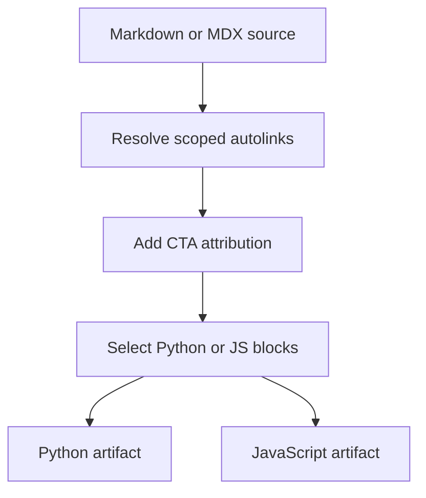

# Conditional Rendering Tests

Conditional rendering lets one Markdown or MDX source contain content for the Python and JavaScript documentation variants. It is a build-time transformation, not a Markdown parser feature: `_apply_conditional_rendering()` selects supported `:::python` and `:::js` blocks after the earlier autolink and CTA passes.

## What a rendering test must prove

For a source containing both supported blocks, assert both positive and negative output properties:

```markdown
Shared introduction.

:::python
Python only.
:::

:::js
TypeScript only.
:::
```

- The `python` target emits `Python only.` without its enclosing fences and removes `TypeScript only.`
- The `js` target emits `TypeScript only.` without its enclosing fences and removes `Python only.`
- Shared text remains in both artifacts.

`python` and `js` are the only accepted target keys. Calling `_apply_conditional_rendering()` with another value raises `ValueError`; `preprocess_markdown()` obtains a missing target from `TARGET_LANGUAGE`, defaulting to `python`.



This shows the preprocessing order: links resolve while conditional fences still exist, and rendering happens last.

## The two fence mechanisms are deliberately different

Do not conflate conditional rendering with the autolink scanner's fence handling.

| Concern | `replace_autolinks()` | `_apply_conditional_rendering()` |
| --- | --- | --- |
| Processing model | Line scanner with a current language scope | One whole-document regular-expression substitution |
| Regular backtick/tilde code fences | Detects fences of at least three backticks or tildes and leaves their contents untouched | Has no code-fence state, so it can match conditional-looking text inside a code fence |
| Conditional fences | An opening `:::language` changes scope; a closing `:::` resets it to the default scope | Keeps/removes only supported-language blocks and drops their fences |
| Nesting | Holds only one current scope, not a stack | Does not parse nesting; the first eligible closing marker terminates the match |

The code-fence protection is specifically an autolink (and CTA) property. A literal `:::js ... :::` example inside a triple-backtick fence is safe from autolink scope changes, but it is **not** protected from later conditional rendering. Escape literal conditional markers when they must survive the complete preprocessing pipeline.

## Scoped links: test before rendering

`preprocess_markdown()` calls `replace_autolinks()` before conditional rendering and passes `default_scope`, which otherwise defaults to the selected target. The line scanner starts in that scope. At an unescaped conditional opening, it changes the scope to the fence language; at a closing fence, it returns to the default. Consequently, an `@[Name]` inside `:::js` resolves against the JavaScript map even while producing a Python artifact, before the JavaScript block is removed.

A focused autolink test should cover all of these boundaries:

```python
md = ":::python\n@[StateGraph]\n```\n:::js\n@[StateGraph]\n```\n@[Command]\n:::\n"
result = replace_autolinks(md, "test.mdx")
```

The outer `:::python` gives the first and final references Python scope. The conditional-looking line inside the backtick fence does not switch scope and its `@[StateGraph]` stays literal. The existing unit test asserts precisely those outcomes. An unclosed ordinary code fence similarly suppresses autolink replacement for the document remainder. These guarantees do not extend to the conditional-rendering regex.

## Fence syntax and edge cases

### Supported, unsupported, and incomplete blocks

The renderer recognizes an opening marker with a word-character language identifier. It only transforms blocks labelled `python` or `js`; a complete block with another identifier is returned unchanged. An opening with no matching closing marker does not satisfy the pattern and remains unchanged. This is not a validation error emitted by this function.

The matched content includes its internal newlines. A selected block is replaced by that captured content; a nonmatching supported block is replaced by an empty string. Thus do not rely on the transformation to normalize surrounding blank lines.

### Escaped markers

Prefix a literal marker with a backslash in authored text:

```markdown
\:::python
This documents the syntax rather than selecting content.
\:::
```

The conditional matcher excludes a marker immediately preceded by `\`. After substitution it removes the backslash from every `\:::` sequence, producing literal `:::` text. This is the safe way to demonstrate conditional syntax, including inside examples that reach the full preprocessor.

### Indentation is not a safe structural invariant

The pattern captures opening whitespace and uses a backreference before the closing marker, which appears to require matching indentation. However, it is not anchored to the beginning of a line. The regex engine can retry at the opening `:::` itself with an empty captured indent, and the closing expression then permits arbitrary leading spaces or tabs. A mismatched indentation may therefore still be matched, potentially leaving opening-line whitespace in the output rather than reliably leaving the block untouched.

Use identical indentation for readable source, especially in list items or other nested Markdown, but add a direct regression test before treating indentation mismatch as rejection behavior. Do not use indentation to nest conditional blocks.

### No nesting and no code-fence awareness

The content portion is non-greedy, so the first non-escaped eligible `:::` that follows an opening ends the match. An inner conditional opening has no special meaning to this regex; nested forms can leave a stray close or select/remove unexpected content. Keep conditional blocks sequential.

Likewise, wrapping a conditional-looking block in backticks does not stop rendering. Put real code fences *inside* the selected conditional block instead:

````markdown
:::python
```python
print("Python only")
```
:::

:::js
```typescript
console.log("TypeScript only");
```
:::
````

## Exercise the production boundary

`DocumentationBuilder._process_markdown_content()` invokes `preprocess_markdown()` and then rewrites snippet imports and language-aware routes. `build_all()` recreates `build/` and runs versioned OSS builds with `python` to `build/oss/python/` and `js` to `build/oss/javascript/`. Snippet Markdown is also independently preprocessed into `build/snippets/python/` and `build/snippets/javascript/`, with a Python-targeted default copy for unversioned consumers.

The integration test `test_build_all_creates_managed_deep_agents_language_routes()` is the model for an artifact-level regression: it supplies a snippet containing both conditional branches, calls `build_all()`, reads both emitted snippet files, and asserts each contains its own branch and not the other. It also verifies that route and snippet-import rewriting select the matching `python` or `javascript` path, so it tests the meaningful build boundary rather than only string substitution.

For a focused local run:

```bash
make test TEST_FILE=tests/unit_tests/test_builder.py
make test TEST_FILE=tests/unit_tests/test_handle_auto_links.py
```

Use `make build` when validating actual build artifacts or a route-related change. It installs Node dependencies and invokes `pipeline build`; inspect both language outputs afterward. For source autolinks, run `make check-cross-refs` separately: it validates references under applicable language scopes, whereas a successful render can remove a nonmatching branch and conceal a bad reference from the final artifact.

## Regression checklist

1. Test `python` and `js` outputs for retained matching content, absent nonmatching content, and shared text.
2. If links occur in a conditional block, assert the target scope used during the pre-render autolink pass; include a conditional-looking marker inside a regular code fence when changing scanner behavior.
3. Test literal syntax with escaped opening **and** closing markers, and assert that the output has no escape backslashes.
4. Add direct cases for unsupported labels, missing closes, indentation mismatch, nesting, and conditional-looking text in a code fence whenever changing the renderer regex. Their behavior is regex behavior, not parser validation.
5. Prefer a `DocumentationBuilder.build_all()` test when the change can affect emitted language paths, snippets, imports, or links; assert both artifact content and location.

## Related documentation

- [Markdown preprocessing pipeline](/openwiki/concepts/preprocessing.md)
- [Language versioning strategy](/openwiki/concepts/versioning.md)
- [Testing overview](/openwiki/testing/test-overview.md)
- [Writing versioned content](/openwiki/workflows/versioned-content.md)
