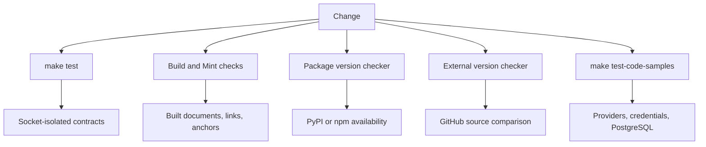
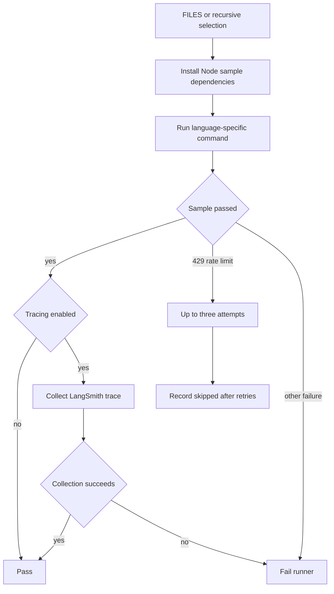

## Choose the validation boundary

Validation is deliberately split by what it is allowed to depend on. A successful socket-isolated unit test does not prove an external registry lookup, rendered Mint link, or credentialed example works. Run the narrowest applicable command first, then use the relevant CI gate for the handoff.

| Change | Focused command | What it validates | Boundary |
| --- | --- | --- | --- |
| Python pipeline, parser, skill, or checker logic | `make test TEST_FILE=tests/unit_tests/test_skills.py` | Deterministic structural and behavioral contracts | Sockets disabled except Unix sockets |
| Python dependencies or toolchain | `uv sync --group test` | The locked Python environment supports the test group | Resolved local environment |
| Prose in changed docs | `make lint_prose FILES="src/path/page.mdx"` | Vale terminology and style rules | Downloads/reuses Vale if needed |
| Generated build, redirects, anchors, or OpenAPI | `make broken-links-with-anchors` and `make check-openapi` | Fresh build consumed by Mint | Built-document validation |
| Source `@[ref]` mapping | `make check-cross-refs` | Source references resolve in every applicable rendering scope | Source structural check |
| Package versions in documentation | `uv run python scripts/check_version_claims.py --files src/path/page.mdx` | A named release is published in its selected registry | Registry network check |
| Upstream-mirrored requirement | `uv run python scripts/check_external_versions.py --only <id>` | A registered page value equals its GitHub source | Upstream network check |
| Runnable example | `make test-code-samples FILES="src/code-samples/..."` | A real program exits successfully with its language environment | Credentialed live execution |



This flow separates offline assertions from registry, upstream, rendered-document, and live-service validation.

## Toolchain and locked environment

The project requires Python `>=3.13.0,<4.0.0`; local mise configuration selects Python 3.13 and uv 0.9.26, while `pyproject.toml` accepts uv 0.9.26 or later. `uv.lock` is the resolved lockfile for that Python range, including separate resolution markers for Python 3.14 and later versus earlier interpreters. Do not edit the lockfile as an independent source of requirements: change `pyproject.toml`, resolve with uv, and commit the resulting lock update.

For normal development, run `mise trust && mise install`, then install the test environment with:

```bash
uv sync --group test
```

The test dependency group supplies pytest, asyncio support, socket isolation, timeouts, mocking, lint/type tooling, and YAML support. `make install` is broader: it synchronizes all dependency groups, installs Node dependencies and Mint, and links agent skills for Claude. CI installs the test group and sets `UV_FROZEN=true` for reusable test, lint, and link workflows, so a dependency declaration/lock mismatch is a CI failure rather than an implicit lock refresh.

### Vale uses one canonical pin

`.mise.toml` is the canonical Vale version pin. Both `make lint_prose` and the changed-document prose workflow call `scripts/install-vale.sh`, so update the mise entry rather than separately changing CI or Make targets. The installer accepts only a bare semantic version after removing an optional leading `v`; it exits before forming a URL for an invalid value. It first preserves an already matching destination or a matching `vale` on `PATH`, then selects a Linux or macOS x86_64/ARM64 release asset. A failed release download falls back to `go install`; without Go, unsupported platform/architecture, or a missing downloaded binary, installation fails.

`lint-prose.yml` computes changed `src/**/*.md` and `src/**/*.mdx` files from the PR merge base and lints only that set. The Make target excludes `node_modules` and `src/code-samples` from Vale scanning. This is prose validation, not a substitute for building documentation or executing samples.

## Socket-isolated unit tests

Run the core suite with:

```bash
make test
make test TEST_FILE=tests/unit_tests/test_skills.py
```

The target invokes `uv run pytest --disable-socket --allow-unix-socket $(TEST_FILE) -vv`. Pytest uses automatic asyncio mode and function-scoped asyncio loops; its configured output reports extra outcomes and the five slowest tests. Unit tests must mock registry, GitHub, and provider interactions or use temporary files and permitted Unix sockets—opening an Internet socket is a boundary violation.

Important focused contracts include:

- **Builder:** `tests/unit_tests/test_builder.py` verifies the builder’s supported copy-extension set, empty-tree behavior, and copying a local TSX snippet into `build/snippets`. Run it when changing the build copy policy; use the built-document checks below for end-to-end output. See [Builder Tests](/openwiki/testing/builder-tests.md).
- **Agent skills:** each directory under `.agents/skills` must contain `SKILL.md`; its kebab-case directory name must equal frontmatter `name`, its description must be present and at most 1,024 characters, and frontmatter may use only supported keys. Backticked, in-scope repository paths and referenced Make targets must exist, while `README.md` and the Skills section in `AGENTS.md` must exactly catalogue the skill tree. See [Agent Authoring Skills](/openwiki/operations/agent-skills.md).
- **Cross references:** the source checker scans Markdown below `src`, excluding code-sample snippets and `node_modules`; fenced and escaped references are ignored. An unfenced shared OSS reference must resolve in every scope where its page builds.
- **OpenTelemetry prose:** the endpoint test scans MDX and rejects generic `OTEL_EXPORTER_OTLP_ENDPOINT` values that include a signal path. In Collector-exporter documents, a traces URL belongs in `traces_endpoint`, not the generic endpoint.

## Version and upstream checks are network boundaries

`scripts/check_version_claims.py` checks explicit `>=` floors and `==` pins in MDX as **published availability**, not feature compatibility. It selects PyPI or npm from scoped syntax, Python extras, nearby labels, language fences, page context, and finally a PyPI default. Registry lookups run concurrently. Exact releases pass if published; truncated series require a correctly delimited matching release series, so `1.1` does not match `1.14`.

A timeout, malformed registry response, private/unsafe package input, or other unavailable lookup is reported as **unresolved**, distinct from a confirmed unpublished version. `scripts/version_claims_ignore.txt` is an exact-specifier exception list for reviewed sentinel or placeholder claims; correct documentation rather than broadly masking a claim. The PR workflow derives changed MDX files under `src` from the merge base, skips an empty set, is read-only, and has a 10-minute limit. Its Monday full sweep is advisory-only so unresolved lookups do not fail the schedule.

External mirrors are a separate equality contract. `scripts/data/external_versions.yaml` allowlists a page below `src`, an exactly-once page pattern with a named `version` capture, and a GitHub file or latest-release source. The checker rejects unsafe pages, repositories, source paths, types, and capture configurations before fetching. Check mode fails for drift or unreadable sources; write mode changes only captured version digits and continues past unreadable upstreams so a review can include resolvable changes. The trusted Monday 08:00 UTC/manual refresh writes only a version-only `src` diff and maintains at most one `chore/refresh-external-versions` PR.

## Build, link, and generated-file validation

`make build` creates `build/`; the Mint checks operate there, not on source paths. `make broken-links-with-anchors` runs Mint with anchors and redirects enabled, filters known generated OpenAPI and standalone-snippet noise, and fails only for remaining reported links. `make broken-links` omits anchor checking. The reusable link workflow uses Python 3.13 and Node 22, installs Mint with a cache, then runs the anchor/redirect check and `make check-openapi` in a 20-minute job.

`make export-htmltest` is deliberately different: it builds and exports Mint documentation, unpacks the export, then uses htmltest to check external resources. Mint exports omit a complete page set, so `htmltest-mint-export.yml` disables internal path and internal-hash checks; external HTTP is limited to four concurrent requests with a 30-second timeout.

The main CI workflow runs reusable test, lint, and link jobs on Python 3.13, cancels outdated runs for the same workflow/ref, and separately checks conflict markers, cross references, integration `docs_url` schemes, and generated files. Its generated-file gate regenerates `src/oss/python/integrations/providers/overview.mdx` and fails on a diff; change `pipeline/tools/partner_pkg_table.py` or `packages.yml`, regenerate, and commit the result. Only the specified automated package-download update PR or a `bypass-auto-check` label skips that check.

## Credentialed live code samples

Run all eligible samples or a focused subset with:

```bash
make test-code-samples
make test-code-samples FILES="src/code-samples/langchain/return-a-string.py"
```

The Make target first runs `npm install --silent` inside `src/code-samples` when its `package.json` exists, then invokes the runner with `PYTHONPATH` set to the repository root. That package manifest is the TypeScript sample environment: it is an ESM package and owns `tsx` plus the LangChain and other Node dependencies that `npx tsx` resolves.

The runner accepts Python, TypeScript, Java, Kotlin, Go, and shell files below `src/code-samples`; `FILES` selects a space-separated subset, while an unset list recursively selects every eligible file except `__pycache__` and `node_modules`. Each sample has a 1,200-second default timeout configurable with `CODE_SAMPLE_TIMEOUT_SECONDS`. Python uses `uv run python`; TypeScript uses `npx tsx`; Go uses `go run`; shell uses `bash`; and Java/Kotlin use JBang with Java 21. Python and JBang run from the repository root; TypeScript, Go, and shell run from `src/code-samples` so their shared environments resolve.



This flow shows live-sample result handling; a rate-limit skip is not a successful execution.

### CI environment and failure semantics

The sample workflow skips fork PRs because it needs provider secrets. PR runs find the merge-base diff and execute only changed eligible sample files; scheduled monthly and manual runs execute all samples. The job allows 60 minutes for PRs and 90 for full runs, provisions `pgvector/pgvector:pg17`, and installs Python/uv, Node 20, Java 21/JBang, and Go from `src/code-samples/go.mod`. It passes `POSTGRES_URI` and provider credentials to the runner.

For local PostgreSQL-backed samples, `src/code-samples/conftest.py` honors `POSTGRES_URI` first, then attempts a pgvector testcontainer, Docker, and finally the default local URI. Its preparation helper drops shared store and migration tables before setup so stale partial schemas do not leak between samples.

A LangSmith-style 429 rate-limit response is retried up to three total attempts with 15-second delays. Persistent rate limiting is recorded as skipped and does not make the runner nonzero; other failures do. Treat a green run containing skips as unexecuted examples.

Scheduled/manual full runs set `CODE_SAMPLE_TRACING=1`. Successful samples then attempt LangSmith trace collection; a collection failure fails the runner even if the program passed. For a single-snippet file with a qualifying recent agent root run, collection shares the run and updates the trace manifest; multi-snippet files are recorded as skipped. `make code-snippets` adds a `View example trace` card only when the manifest has a URL. After a successful full run and regeneration, CI opens or updates `chore/refresh-code-sample-traces` with the manifest and generated snippet MDX. A separate workflow creates a Linear issue only when a scheduled sample workflow fails or is cancelled.

## CI handoff and triage

Before requesting review, run the focused local checks for the changed boundary and inspect the generated diff after build-affecting changes. In CI, interpret failures by boundary:

- A socket error means an isolated unit test attempted an impermissible network operation.
- A `UV_FROZEN` or sync failure means dependency declarations and `uv.lock` need reconciliation.
- A generated overview diff means update the generator or `packages.yml`, not the generated page directly.
- An unresolved package/upstream lookup is not evidence of availability or synchronization; retry or investigate the remote source.
- A live sample failure may be credentials, PostgreSQL readiness, toolchain/dependency installation, or real provider behavior. A rate-limit skip needs a later execution.

## Related documentation

- [GitHub Actions and CI/CD](/openwiki/integrations/github-actions.md)
- [Mintlify](/openwiki/integrations/mintlify.md)
- [Agent Authoring Skills](/openwiki/operations/agent-skills.md)
- [Quickstart](/openwiki/quickstart.md)
- [Builder Tests](/openwiki/testing/builder-tests.md)
- [Code Sample Lifecycle](/openwiki/workflows/code-sample-lifecycle.md)
