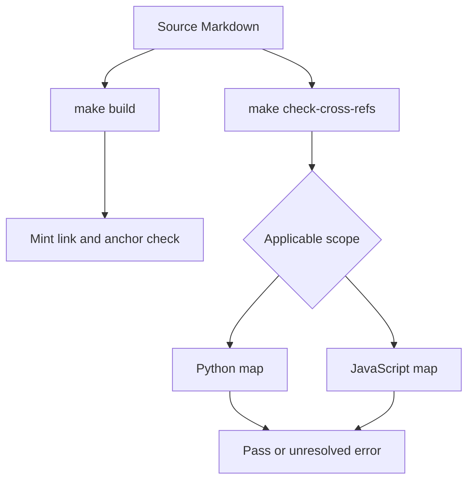

## Validation matrix

This repository uses three deliberately different validation boundaries. Choose the narrowest one that exercises a change:

| Change area | Primary command | What it proves | External dependencies |
| --- | --- | --- | --- |
| Pipeline behavior and regressions | `make test` | Isolated pytest behavior for `tests/unit_tests` | No network sockets; Unix sockets are allowed |
| Rendered documentation and links | `make broken-links-with-anchors` | The pipeline can build the site and Mintlify accepts internal links and anchors after filtering known non-actionable output | Python dependencies, Node.js, and the Mintlify CLI |
| Source `@[ref]` references | `make check-cross-refs` | Every eligible Markdown reference resolves in every applicable language scope | Local link map only |
| Runnable examples | `make test-code-samples` | Selected or all Python, TypeScript, Java, Kotlin, Go, and shell samples exit successfully | Language toolchains; some samples use live providers and PostgreSQL |

Do not treat the sample runner as a replacement for the isolated test suite. `make test` invokes pytest only for `tests/unit_tests`, with socket isolation. The sample runner intentionally inherits its environment and executes programs that may need provider credentials, a local service, or network access.

## Core pytest suite

Run the normal unit suite with:

```bash
make test
```

`TEST_FILE` defaults to `tests/unit_tests`, so a focused invocation can use, for example, `make test TEST_FILE=tests/unit_tests/test_builder.py`. The target runs `uv run pytest --disable-socket --allow-unix-socket $(TEST_FILE) -vv`. Pytest configuration also discovers `test_*.py` and `test_*`, enables asyncio auto mode with function-scoped fixture loops, reports extra outcomes, and shows slow tests. Install the test group with `uv sync --group test`.

Socket isolation is an invariant for this suite: tests should use fixtures, temporary files, mocks, or Unix-domain services rather than make network calls. The `file_system` helper creates disposable `src/` and `build/` directories, populates source fixtures, and removes the complete temporary tree on exit.

### Focused regression coverage

The unit suite protects behavior at the documentation pipeline boundary rather than merely parsing happy paths:

- Builder tests exercise supported-file copying, empty and targeted builds, directory preservation, preprocessing, and Python/JavaScript output variants. They also cover URL rewriting and safe source collection, including rejecting symlinks.
- Parser tests turn Markdown into an AST and Mintlify output, preserving code blocks and source locations while converting front matter, admonitions, and tab/conditional constructs.
- Autolink and cross-reference tests ensure `@[ref]` handling is language-aware without rewriting or validating escaped references or fenced code. Unclosed fences continue to protect the remaining input.
- Watcher tests keep editor backup and temporary files out of rebuild handling.

## Built-site and cross-reference checks

`make broken-links-with-anchors` first builds `build/`, then runs `mint broken-links --check-anchors` from that directory. The Make target captures output and applies `scripts/filter_mint_broken_links.py`; it fails only when filtered output still contains a reported link line. This deliberately excludes deployment-generated OpenAPI areas and standalone snippets whose absolute language-prefixed links only become valid once inlined. Use `make broken-links` when anchor validation is unnecessary.

`make check-cross-refs` scans `src/**/*.md` and `src/**/*.mdx` against `pipeline/preprocessors/link_map.py`. It ignores `snippets/code-samples/`, `node_modules`, invalid UTF-8 files, fenced code, and escaped references. A page under `oss/python/` checks Python entries, one under `oss/javascript/` checks JavaScript entries, and shared `oss/` content must resolve in **both** scopes unless a `:::python` or `:::js` fence selects one. Unresolved entries cause exit code 1 and identify the source line and scopes; fix the reference or update the link map.



This flow shows that built-site link checking and source cross-reference resolution are separate gates.

## Executable code samples

Run all samples locally with:

```bash
make test-code-samples
```

To run an explicit, space-separated subset, pass repository-relative paths:

```bash
make test-code-samples FILES="src/code-samples/langchain/return-a-string.py"
```

The runner accepts only existing files beneath `src/code-samples/` with `.py`, `.ts`, `.java`, `.kt`, `.go`, or `.sh` extensions; without `FILES`, it recursively runs all such files while excluding `__pycache__` and `node_modules`. It runs Python through `uv`, TypeScript through `npx tsx`, Go from the code-samples module, shell through `bash`, and Java/Kotlin with JBang pinned to Java 21. Each individual sample has a 600-second timeout. A nonzero exit is a failure, and stdout/stderr are printed immediately for diagnosis.

Samples inherit the caller environment. In CI, this includes provider keys and `POSTGRES_URI`; local contributors should provide the credentials and service only when the selected samples require them. The code-sample workflow supplies PostgreSQL 17 with pgvector, waits for a TCP connection to port 5432 before execution, and installs Python/uv, Node 20, Java 21/JBang, and Go. It passes `ANTHROPIC_API_KEY`, optional Anthropic endpoint and headers, LangSmith and gateway keys, OpenAI, Tavily, Google, and Daytona settings along with the PostgreSQL URI.

MCP examples demonstrate two useful testing patterns. The published `main` snippets show an adapter connecting to an MCP endpoint and supplying discovered tools to an agent. Their executable sections avoid a provider model invocation: `deepagents-mcp-tools.py` starts a FastMCP HTTP server in process and asserts that tool discovery exposes `ping`; `mcp-quickstart.py` adapts an in-memory FastMCP weather server and invokes `get_forecast`. Keep this distinction when changing snippets so the repository test validates MCP transport and tool loading without accidentally making an example depend on a live model.

### CI selection, security, and failure semantics

The code-sample workflow runs on pull requests that touch `src/code-samples/**` or the workflow itself, on manual dispatch, and weekly on Sunday. Scheduled and manual runs test all samples. For pull requests, it computes the merge-base against the base branch and tests only changed eligible sample files; a PR with no eligible changes exits successfully without running samples. The workflow is skipped for fork pull requests because GitHub does not expose repository secrets to them. Do not weaken this guard to make an external contribution appear green.

The job timeout is 60 minutes for a pull-request run and 90 minutes for scheduled or manual full runs. Its concurrency group cancels an older run for the same workflow and ref. These job limits coexist with—not replace—the 600-second timeout imposed on each program.

Live LangSmith calls can return a 429 during CI load even when an example is correct. The runner recognizes a 429 with a rate-limit message, retries up to three total attempts with 15-second delays, then records the sample as skipped rather than failing the build if it remains rate-limited. Any other unsuccessful sample is reported and makes the runner return 1. Thus a green sample job may include rate-limited skips; inspect its summary when confidence in a live integration matters.

## CI responsibilities

The main CI workflow runs on pushes to `main`, pull requests, and manual dispatch. It cancels obsolete branch/PR runs. Its reusable pytest and lint jobs use Python 3.13 and have 20-minute limits; the standard test job runs `make test`. Separate jobs run built documentation/link-and-anchor checks, cross-reference validation, generated-file validation, external documentation URL scheme checks, and merge-conflict-marker detection. Code linting is `ruff format`, `ruff check`, `ty check`, and `codespell`; prose linting is available locally through Vale with the configured LangChain, proselint, vale, and write-good styles, while excluding code samples.

## Related documentation

- [Builder Tests](/openwiki/testing/builder-tests.md)
- [Conditional Rendering](/openwiki/testing/conditional-rendering.md)
- [Preprocessing](/openwiki/concepts/preprocessing.md)
- [GitHub Actions](/openwiki/integrations/github-actions.md)
- [Local Development](/openwiki/workflows/local-development.md)
