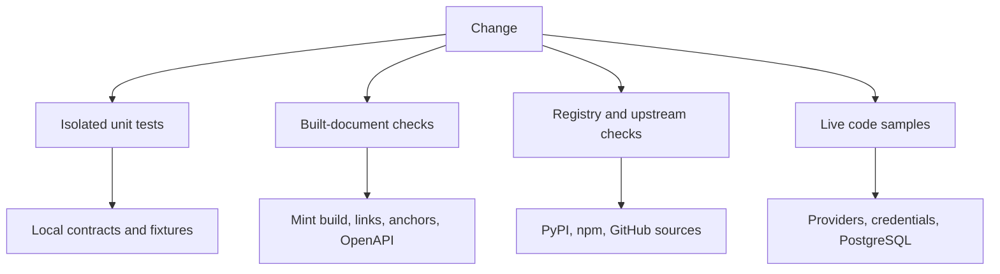
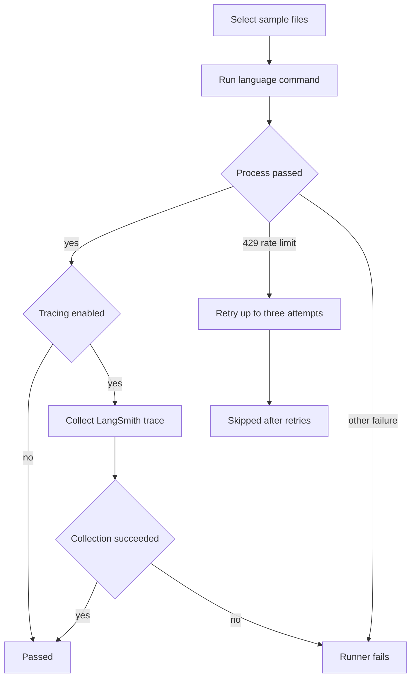

## Choose the validation boundary

Validation is intentionally split by dependency boundary. Start with the narrowest check that can prove the change, then run broader checks when the change crosses into generated output, external data, or executable examples. A passing socket-isolated unit test proves neither a registry or upstream response nor rendered Mintlify output nor a live provider call.

| Change | Focused command | What it validates | Boundary |
| --- | --- | --- | --- |
| Python pipeline, parser, skill, or checker behavior | `make test TEST_FILE=tests/unit_tests/test_builder.py` | Deterministic contracts in temporary/local fixtures | Isolated unit test |
| Python environment or dependency change | `uv sync --group test` | The locked test environment can be installed | Local dependency resolution |
| Prose in a document | `make lint_prose FILES="src/path/page.mdx"` | Vale terminology and style rules | Prose lint |
| Build, redirect, anchor, or OpenAPI change | `make broken-links-with-anchors` and `make check-openapi` | The generated `build/` consumed by Mint | Rendered-document check |
| Source `@[ref]` mapping | `make check-cross-refs` | References resolve in every applicable build scope | Source structural check |
| Integration external-document metadata | `uv run python scripts/refresh_integration_downloads.py --check-docs-urls` | `docs_url` values are safe link targets | Deterministic metadata check |
| Package version claim | `uv run python scripts/check_version_claims.py --files src/path/page.mdx` | A documented release is available from its selected registry | Registry network check |
| Upstream-mirrored requirement | `uv run python scripts/check_external_versions.py --only <id>` | A registered page value matches its GitHub source | Upstream network check |
| Runnable example | `make test-code-samples FILES="src/code-samples/..."` | A real program runs with its language environment, credentials, and services | Live sample |



This flow distinguishes isolated tests from rendered documents, remote sources, and live services; success at one boundary is not evidence for another.

## Toolchain and deterministic tests

The project requires Python `>=3.13.0,<4.0.0`. Local mise selects Python 3.13 and uv 0.9.26; `pyproject.toml` requires uv 0.9.26 or newer. Change dependency declarations first, resolve with uv, and commit the resulting `uv.lock` update rather than treating the lockfile as an independent requirements source.

For normal development, use `mise trust && mise install`, then:

```bash
uv sync --group test
make test
make test TEST_FILE=tests/unit_tests/test_builder.py
```

`make test` runs `uv run pytest --disable-socket --allow-unix-socket $(TEST_FILE) -vv`. Pytest is configured for automatic asyncio mode and function-scoped asyncio fixture loops, with verbose reporting and five slowest-test durations. Unit tests must mock Internet-facing dependencies; Unix sockets remain permitted. A socket violation is a test-boundary failure, not proof that an external service is down.

The reusable test, lint, and documentation-link workflows install the test group with `UV_FROZEN=true`, so CI will not silently refresh a stale lockfile. The reusable test and link workflows also set `UV_NO_SYNC=true`; their explicit `uv sync --group test` step is the controlled installation point.

### Focused local contracts

- **Builder.** `tests/unit_tests/test_builder.py` checks the supported copy-extension set, an empty source tree, and copying a local TSX snippet component to `build/snippets`. Use it when changing copy policy. The builder itself clears and recreates `build/`, emits Python and JavaScript OSS variants as well as unversioned content, then copies shared assets and snippets; follow with a built-document check for actual rendered output. See [Builder tests](/openwiki/testing/builder-tests.md).
- **Agent skills.** Skill tests require a matching kebab-case directory/frontmatter identity, supported frontmatter, valid referenced paths and Make targets, and exact catalogues in `README.md` and `AGENTS.md`.
- **Cross references and endpoint prose.** The cross-reference checker ignores code samples, `node_modules`, fenced code, and escaped references, but shared OSS references must resolve in every build scope. The OpenTelemetry test rejects signal paths in generic `OTEL_EXPORTER_OTLP_ENDPOINT`; Collector-exporter trace URLs belong in `traces_endpoint`.
- **Integration `docs_url` metadata.** `--check-docs-urls` reads the external integration YAML and exits without network calls or writes. It accepts `https://`, `http://`, and a single-leading-slash site-relative path, while rejecting missing values, protocol-relative URLs, and unsafe schemes such as `javascript:` or `data:`. The main CI workflow runs this check separately.

Vale has a single canonical pin in `.mise.toml`. `make lint_prose` installs that version through `scripts/install-vale.sh` and excludes `node_modules` and `src/code-samples`; update the mise pin rather than copying a version into a workflow. The installer validates the version, reuses a matching binary where possible, chooses supported Linux/macOS assets, and falls back to `go install` after a release-download failure.

## Rendered-document and generated-file checks

`make build` produces `build/`; Mint link and OpenAPI validation operate on that generated tree, not directly on `src`. `make broken-links-with-anchors` builds, checks anchors and redirects, filters known generated OpenAPI and standalone-snippet noise, and fails if relevant reported links remain. `make broken-links` omits anchor checking. The reusable documentation workflow uses Node 22, caches Mint, runs the anchor/redirect check, and then runs `make check-openapi`.

`make export-htmltest` is a separate external-link boundary: it exports Mint documentation, unpacks the export, then runs htmltest. Because the export does not contain a complete page set, its configuration disables internal path and internal-hash checks while checking external resources. It caps external HTTP concurrency at four and timeout at 30 seconds. A successful source or unit check is therefore not a substitute for this rendered/export validation.

The main CI workflow cancels superseded runs for the same workflow/ref and dispatches reusable test, lint, and link jobs on Python 3.13. It also checks conflict markers, source cross-references, safe external integration documentation URLs, and generated output. Its generated-file gate regenerates `src/oss/python/integrations/providers/overview.mdx` and fails on a diff: change `pipeline/tools/partner_pkg_table.py` or `packages.yml`, regenerate, and commit the result. Only the designated automated package-download update PR and the `bypass-auto-check` label bypass that gate.

## Registry and upstream network checks

`scripts/check_version_claims.py` treats explicit `>=` floors and `==` pins in MDX as published-availability assertions, not compatibility claims. It chooses PyPI or npm from scoped syntax, extras, nearby labels, language fences, page context, and a PyPI default. Lookups are concurrent; exact releases must exist, while truncated series must be correctly delimited so `1.1` does not match `1.14`.

A timeout, malformed response, private or unsafe input, or unavailable registry lookup is **unresolved**, not confirmation that a version is published or unpublished. `scripts/version_claims_ignore.txt` is an exact-specifier exception mechanism for reviewed sentinel floors and placeholders; prefer correcting documentation to masking a claim. The pull-request workflow uses the merge base to run only for changed `src/**/*.mdx` files and has a 10-minute limit. The Monday full sweep is advisory-only, so an unavailable lookup or yanked release reports findings without failing the schedule.

External-version synchronization is a distinct equality contract. `scripts/data/external_versions.yaml` allowlists a `src` page, an exactly-once page pattern with a named version capture, and a GitHub file or latest-release source. Validation rejects unsafe configuration before fetching. Check mode fails for drift or unreadable inputs. Write mode replaces only captured version digits and continues past unreadable upstream sources, allowing a review to contain resolvable updates without claiming that unavailable sources synchronized. The Monday 08:00 UTC/manual workflow can write and maintains at most one `chore/refresh-external-versions` pull request when `src` has a version-only diff.

## Credentialed live code samples

```bash
make test-code-samples
make test-code-samples FILES="src/code-samples/langchain/return-a-string.py"
```

The Make target installs the Node environment in `src/code-samples` when its `package.json` exists, then runs the sample runner with the repository on `PYTHONPATH`. The runner accepts Python, TypeScript, Java, Kotlin, Go, and shell files under `src/code-samples`. `FILES` is a space-separated explicit subset; without it, the runner discovers all eligible files except paths in `__pycache__` and `node_modules`.

Every sample has a default 1,200-second timeout, configurable through `CODE_SAMPLE_TIMEOUT_SECONDS`. Python runs with `uv run python`; TypeScript with `npx tsx`; Go with `go run`; shell with `bash`; Java and Kotlin with JBang on Java 21. Python and JBang run from the repository root, while TypeScript, Go, and shell run from `src/code-samples` so their shared environments resolve.



This flow is live execution, not a deterministic test. A rate-limit skip is not a successful example execution.

### Live-sample CI and failure semantics

The code-sample workflow skips fork pull requests because provider secrets are unavailable. Pull requests run changed eligible sample files from the merge-base diff; scheduled monthly and manually dispatched runs execute all samples. It uses 60 minutes for PR runs and 90 minutes for full runs, provisions a `pgvector/pgvector:pg17` service, installs Python/uv, Node 20, Java 21/JBang, and Go, and supplies provider credentials plus `POSTGRES_URI`.

For PostgreSQL-backed samples, the local helper honors `POSTGRES_URI` before attempting a pgvector testcontainer, Docker, and a default local connection. Preparation drops shared store and migration tables before setup to prevent stale partial schemas leaking between examples.

A LangSmith-style 429 is retried up to three total attempts with 15-second waits. A sample still rate-limited after those attempts is recorded as skipped and does not cause a nonzero exit; other sample failures do. A green run containing skips therefore says the runner did not observe a failure, not that every skipped sample worked.

Scheduled/manual full runs enable `CODE_SAMPLE_TRACING`. After a successful process, trace collection is attempted; a collection failure makes the runner fail even though the sample process passed. Only a single-snippet source file with a qualifying recent agent root run gets a public manifest entry; multi-snippet files are recorded as skipped. Snippet generation adds a `View example trace` card only for a manifest URL. A successful full run and regeneration can open or update `chore/refresh-code-sample-traces`; a separate workflow opens a Linear issue only when a scheduled sample run fails or is cancelled.

## CI triage

Interpret a failure at the boundary that produced it:

- A socket error means an isolated test attempted an impermissible network operation.
- A `UV_FROZEN` or sync failure means dependency declarations and `uv.lock` require reconciliation.
- A Mint link, anchor, redirect, or OpenAPI failure concerns generated documentation and should be reproduced with the corresponding built-document command.
- An invalid `docs_url` is unsafe or missing metadata; use an allowed absolute HTTP(S) URL or a site-relative `/path`.
- A generated provider-overview diff means update its generator or `packages.yml`, not the generated page by hand.
- An unresolved registry/upstream lookup is not proof of availability or synchronization; retry or investigate the remote source.
- A live-sample failure can reflect credentials, provider behavior, PostgreSQL readiness, toolchain setup, or the sample itself. A rate-limit skip requires later execution.

## Related documentation

- [GitHub Actions and CI/CD](/openwiki/integrations/github-actions.md)
- [Mintlify](/openwiki/integrations/mintlify.md)
- [Quickstart](/openwiki/quickstart.md)
- [Builder tests](/openwiki/testing/builder-tests.md)
- [Integration listing automation](/openwiki/workflows/integration-listing-automation.md)
