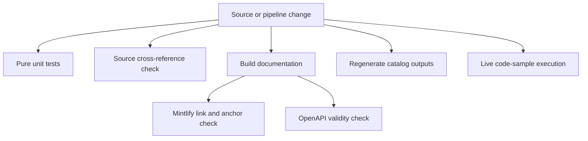

## Validation model

Validation is layered rather than a single test suite. Start with the layer that owns the behavior changed, then run downstream layers when a change affects emitted documentation or executable examples.

This diagram shows the validation layers and the build-dependent checks.

| Change or question | Focused command | What success establishes | Network and credentials |
| --- | --- | --- | --- |
| Python pipeline behavior | `make test` or `make test TEST_FILE=tests/unit_tests/test_builder.py` | Unit assertions pass with socket isolation | No network sockets; Unix sockets explicitly allowed |
| `@[...]` references or link-map entries | `make check-cross-refs` | Source references resolve in every applicable language scope | Local file scan; no credentials required |
| Rendered routes, links, snippets, or navigation | `make broken-links-with-anchors` | A fresh build passes Mintlify link and fragment checks after documented filtering | Mint CLI required; no provider secrets |
| LangSmith agent-server OpenAPI input | `make check-openapi` | The built `langsmith/agent-server-openapi.json` passes Mintlify OpenAPI validation | Mint CLI required; no provider secrets |
| Provider overview or integration-table inputs | `uv run python pipeline/tools/partner_pkg_table.py` and, when editing integration metadata, `uv run python scripts/refresh_integration_downloads.py --write` | Generated outputs are reproduced before review | The integration refresh can query external package services; do not treat it as an offline unit test |
| A code sample under `src/code-samples/` | `make test-code-samples FILES="src/code-samples/path/example.py"` | The actual language runtime exits successfully | Potentially live services and provider keys; use CI or a deliberately configured environment |

Run `uv sync --group test` before Python test and validation commands when dependencies are not already installed. `make build` creates `build/` and is a prerequisite of the Make targets that validate links or OpenAPI.

## Deterministic pipeline tests

`make test` runs `uv run pytest --disable-socket --allow-unix-socket $(TEST_FILE) -vv`; `TEST_FILE` defaults to `tests/unit_tests`. Socket isolation is intentional: a test that needs an HTTP request is not a pure pipeline unit test and must instead be designed around a fixture, mock, or a separately operated integration workflow. The pytest configuration discovers `test_*.py` and `test_*`, uses automatic asyncio mode with function-scoped default event loops, and reports extra outcomes and timing data.

Builder tests exercise `DocumentationBuilder` with disposable source and build directories. They protect output-shaping behavior such as supported-file selection, routing OSS content into Python and JavaScript variants, preservation of unversioned OpenWiki and Deep Agents Code routes, Markdown preprocessing, link rewriting, and the rejection of source symlinks. The shared `file_system` fixture creates and cleans up `src/` and `build/` trees, allowing tests to assert generated files without touching the repository build directory.

Autolink and UTM tests are focused preprocessor contracts. Autolinks replace resolvable `@[Reference]` values outside code fences, choose the relevant language map, and preserve fenced or escaped text. CTA tagging adds documentation UTM parameters only for supported `smith.langchain.com` destinations, preserves existing query strings and titles, and does not modify code blocks, non-CTA paths, or other domains. See [Preprocessing](/openwiki/concepts/preprocessing.md) and [Builder Tests](/openwiki/testing/builder-tests.md) for the ownership boundaries.

## Source cross-reference validation

`make check-cross-refs` invokes `scripts/check_cross_refs.py` over source `.md` and `.mdx` files. It skips generated code-sample snippets and `node_modules`, ignores fenced code and escaped references, and tracks `:::python` and `:::js` conditional fences. Default scope follows the source route: `oss/python/` is Python, `oss/javascript/` is JavaScript, non-OSS is Python, and shared `oss/` content is checked in both scopes.

A shared, unfenced reference must exist in **all** scopes in which the page is built—not merely one. An unresolved reference prints its source-relative path, line, reference name, and scopes, then exits nonzero. Fix the prose or add the intended map entry; do not suppress the checker merely because the reference works in one rendered variant. See [Conditional Rendering](/openwiki/testing/conditional-rendering.md).

## Build, link, and OpenAPI checks

`make broken-links` and `make broken-links-with-anchors` build first, run Mintlify from `build/`, then pass its output through `scripts/filter_mint_broken_links.py`. The filter removes known non-local or standalone-snippet false positives; the target fails only if filtered output still contains the indented link lines that represent actionable broken links. Prefer the anchor variant for route, heading, or navigation changes.

The reusable CI link workflow runs the anchor check and `make check-openapi`. The latter also builds first, then runs `mint openapi-check langsmith/agent-server-openapi.json` in `build/`. Thus these checks validate the emitted artifacts, not just source syntax. They require the Mint CLI; the workflow installs it under Node.js 22 and includes a KaTeX version-placeholder workaround before validation.

## Generated catalog drift and input safety

The normal pull-request CI job regenerates `src/oss/python/integrations/providers/overview.mdx` with `pipeline/tools/partner_pkg_table.py` and fails if that tracked output differs afterward. Change its generator or the package metadata, regenerate locally, and commit the resulting output instead of hand-editing the generated page.

Integration download tables have a related regeneration path. `scripts/refresh_integration_downloads.py --write` reads integration frontmatter and external integration rows, then writes language/component snippets under `src/snippets/oss/`. Its `--check-docs-urls` mode validates external `docs_url` values without fetching counts: only `http`, `https`, or a single-slash site-relative URL is accepted, while executable and protocol-relative schemes are rejected. CI invokes that safety check separately.

The scheduled package-download workflow is the operational refresh path: it updates package counts, regenerates the provider overview and integration snippets, uploads the results, and opens an automated PR when outputs changed. This differs from ordinary CI because download collection reaches package services and may be rate-limited.

## Live code samples: an explicit exception

`make test-code-samples` starts `scripts/test_code_samples.py`. With no `FILES` it collects runnable `.py`, `.ts`, `.java`, `.kt`, `.go`, and `.sh` files below `src/code-samples/`, excluding `__pycache__` and `node_modules`; supplying `FILES` selects only valid paths below that directory. The runner executes each sample with its language-specific toolchain—`uv run python`, `npx tsx`, `go run`, `bash`, or Java/Kotlin through JBang—preserves the environment for child processes, and gives each sample a 600-second timeout. Any ordinary failed sample fails the command.

These are intentionally not socket-isolated unit tests. Some samples call live LangSmith or provider APIs, and the CI workflow supplies provider credentials plus a local PostgreSQL service. It skips fork pull requests because GitHub does not expose repository secrets to them. Pull-request runs select changed source files; scheduled and manually dispatched runs test every sample. Persistent LangSmith 429 responses are retried up to three times with a 15-second delay and then reported as skipped rather than failing the run, because that condition reflects service rate limiting rather than necessarily a broken example. See [Code Samples](/openwiki/workflows/code-samples.md).

## CI responsibilities

The primary CI workflow runs on pushes to `main`, pull requests, and manual dispatch. It uses Python 3.13 and cancels older runs for the same workflow/ref. Its reusable test job has a 20-minute timeout, installs the test group with frozen uv resolution, and runs `make test`. Separate jobs own linting, build/link/OpenAPI validation, cross-reference checking, external documentation URL safety, generated provider-overview drift, and merge-conflict marker detection.

Do not infer that every workflow has the same threat model: core tests reject sockets; source and generated-file checks operate on repository content; the build/link job installs Node and Mint; and the sample workflow deliberately receives secrets and network access only for non-fork runs. This separation makes deterministic feedback fast while preserving executable-example coverage.

## Related pages

- [GitHub Actions](/openwiki/integrations/github-actions.md)
- [Builder Tests](/openwiki/testing/builder-tests.md)
- [Conditional Rendering](/openwiki/testing/conditional-rendering.md)
- [Code Samples](/openwiki/workflows/code-samples.md)
- [Integration Catalog](/openwiki/workflows/integration-catalog.md)
