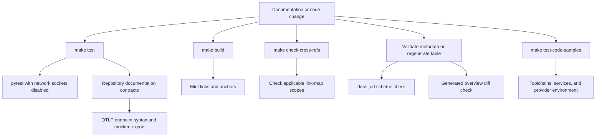

## Choose validation by change boundary

The repository has intentionally separate validation paths. Select the narrowest path that covers the change: a passing unit test does not validate generated docs, external metadata, or a live code sample.

| Change | Run locally | What a pass establishes | Failure meaning |
| --- | --- | --- | --- |
| Pipeline, parser, preprocessor, watcher, helper, or authored OTel contract | `make test` | Isolated behavior in `tests/unit_tests`, including repository-wide assertions where applicable | Regression, assertion failure, or prohibited network socket use |
| Built docs, internal links, or anchors | `make broken-links-with-anchors` | A fresh `build/` passes Mintlify's filtered link and anchor check | Build, actionable link, or anchor failure |
| Source `@[ref]` link-map use | `make check-cross-refs` | Each eligible reference resolves in every scope where it renders | Fix the reference or `pipeline/preprocessors/link_map.py` |
| Generated provider overview | `uv run python pipeline/tools/partner_pkg_table.py` | The committed overview matches its generator and package metadata | Generated output is stale; do not hand-edit it |
| External integration `docs_url` metadata | `uv run python scripts/refresh_integration_downloads.py --check-docs-urls` | External-listing URLs have an allowed href scheme, without requests or writes | Missing or unsafe metadata must be corrected |
| Mint export external URLs | `make export-htmltest` | Exported HTML's configured external resources and anchors pass htmltest | External URL/resource failure; it does not validate internal navigation |
| Runnable example | `make test-code-samples [FILES="..."]` | The selected program exits successfully in its real toolchain/environment | Program, dependency, credential, service, or live-provider failure |



This diagram separates deterministic socket-isolated tests and documentation contracts from generated metadata validation and intentionally live executable samples.

## Isolated pytest suite

Run the core suite with:

```bash
make test
```

`TEST_FILE` defaults to `tests/unit_tests`; narrow a regression with `make test TEST_FILE=tests/unit_tests/test_builder.py`. The target invokes `uv run pytest --disable-socket --allow-unix-socket $(TEST_FILE) -vv`. Pytest discovers `test_*.py` and `test_*`, uses asyncio auto mode with function-scoped fixture loops, reports additional outcomes, and displays the five slowest tests. Install its dependencies with `uv sync --group test`.

Socket isolation is a suite invariant: unit tests must not make network calls. Use mocks, temporary files, or permitted Unix sockets instead. The `file_system` context manager supplies disposable `src/` and `build/` directories for file-system tests.

### Focused coverage to retain when changing behavior

- **Builder:** test supported-file copying, ignored extensions, directory layout, preprocessing, and Python/JavaScript variants. Include adversarial source collection cases such as symlinks when changing source traversal.
- **Parser and conditional rendering:** test both AST/source-location behavior and emitted Mintlify form for front matter, headings, code blocks, admonitions, tabs, and conditionals. Keep code fences opaque to transformations.
- **Autolinks and cross-references:** verify language-scoped `@[Reference]` resolution and that escaped or fenced text is left alone; test unclosed-fence behavior when changing fence logic.
- **Watcher:** retain filters for editor backup and temporary suffixes so non-document files do not trigger rebuild work.
- **Integration issue-form parser:** add cases for `###` section boundaries, HTML-comment removal, `_No response_` optional values, checked confirmations, missing required fields, and language-specific PyPI/npm requirements. The parser maps text to data and does not execute form values.
- **External `docs_url` safety:** test accepted `https://`, `http://`, and single-slash site-relative paths plus rejected empty, `javascript:`, `data:`, `vbscript:`, and protocol-relative `//` inputs. Test both validation errors and the fallback that prevents an unsafe URL from being emitted in a table link.

### OpenTelemetry documentation contract

`tests/unit_tests/test_otel_endpoints.py` treats authored `.mdx` files below `src/` as a repository-wide contract, not merely an example-local test. It rejects a generic `OTEL_EXPORTER_OTLP_ENDPOINT` assignment that already includes `/v1/traces`, `/v1/metrics`, or `/v1/logs`; the generic HTTP exporter endpoint is a base URL, so combining it with a signal suffix risks a duplicated path. Collector configurations are checked separately: in a document that declares `exporters:`, a trace URL ending in `/v1/traces` must use `traces_endpoint`, rather than generic `endpoint`.

The runtime portion fixes the expected endpoint semantics against the installed OpenTelemetry HTTP trace exporter without opening a socket. With `OTEL_EXPORTER_OTLP_TRACES_ENDPOINT` set to the full traces URL, the exporter must post precisely to that URL. With the generic base `OTEL_EXPORTER_OTLP_ENDPOINT`, it must append `/v1/traces` exactly once. Each test builds a `TracerProvider`, attaches a `SimpleSpanProcessor`, ends a span, force-flushes it, and replaces the exporter's session `post` method with a `MagicMock`; assertions inspect the requested URL and reject `/v1/traces/v1/traces`.

When editing [Trace with OpenTelemetry](../../src/langsmith/trace-with-opentelemetry.mdx) or adding OTLP snippets elsewhere, preserve that distinction: use the base URL with `OTEL_EXPORTER_OTLP_ENDPOINT`, use a complete trace URL only with `OTEL_EXPORTER_OTLP_TRACES_ENDPOINT` or an exporter constructor's trace-specific endpoint, and use `traces_endpoint` in Collector YAML. Extend both the textual scan and mocked-export cases if support for another signal or exporter configuration changes. Do not turn this into a live endpoint smoke test: mocked transport is what keeps `make test` within its socket-isolated boundary.

## Documentation gates: built links versus source references

`make broken-links-with-anchors` builds first, then runs `mint broken-links --check-anchors` from `build/`. Its wrapper filters known non-actionable reports for deployment-generated OpenAPI pages and snippets checked as standalone files; it fails only if filtered output still contains link-report lines. `make broken-links` omits anchor checking. The reusable link workflow also runs `make check-openapi`; it uses Node 22, installs/caches the Mint CLI, and applies its KaTeX installation workaround when needed.

`make check-cross-refs` is a distinct source check. It scans Markdown below `src`, excluding code-sample snippets and `node_modules`, skips invalid UTF-8 input, and ignores fenced code and escaped references. Python and JavaScript OSS paths use their respective scope; shared OSS content outside a language conditional must resolve in both maps. It reports each unresolved file, line, name, and scope and exits 1.

Export checking is a third, external-facing option. `make export-htmltest` creates a Mint export, unpacks it, and runs htmltest with `htmltest-mint-export.yml`. That configuration enables external checks but disables internal paths and internal hashes because exports omit a complete page set; it limits external concurrency and timeout and ignores documented checker noise. The `htmltest.yml` workflow runs this check every Monday at 08:00 UTC and on manual dispatch, with a 90-minute limit; it installs the Mint CLI and htmltest after setting up Python 3.13 and Node 22. Use Mint's built-tree check for internal navigation.

## Generated integration metadata and tables

Two checks protect different generated-data contracts:

1. CI regenerates `src/oss/python/integrations/providers/overview.mdx` with `pipeline/tools/partner_pkg_table.py` and rejects any diff. Change the generator or `packages.yml`, regenerate, and commit the resulting output rather than manually editing the overview. The check is bypassed only for the designated automated download-update PR or a `bypass-auto-check` label.
2. `scripts/refresh_integration_downloads.py --check-docs-urls` reads external integration metadata and performs **no network requests and no writes**. It requires every external entry to have a safe `docs_url`; CI fails on missing or unsafe values. During full table generation, package download counts are a separate, networked registry concern: npm/PyPI lookups can retry on HTTP 429 and failures yield an unavailable download value. Do not confuse these registry requests with the offline safety check or the socket-isolated pytest suite.

The generator merges hosted integration front matter with third-party external rows, renders name links from a validated `docs_url` where supplied, and otherwise uses the hosted integration route. Unsafe external values are rejected before external rows are collected; the rendering path also rechecks before emitting an href.

## Executable code samples

Run all eligible samples with:

```bash
make test-code-samples
```

Or pass a space-separated explicit subset:

```bash
make test-code-samples FILES="src/code-samples/langchain/return-a-string.py"
```

The runner selects existing `.py`, `.ts`, `.java`, `.kt`, `.go`, and `.sh` files below `src/code-samples`; without `FILES`, it recursively runs all eligible files excluding `__pycache__` and `node_modules`. It preserves the caller environment, runs each sample for at most 600 seconds, and uses `uv`, `npx tsx`, `go run`, `bash`, or JBang with Java 21 as appropriate. A nonzero exit normally fails the runner. Unlike `make test`, this is expected to contact providers or local services when the example requires them.

CI provisions PostgreSQL 17 with pgvector and passes `POSTGRES_URI` plus provider credentials to the runner. It skips fork pull requests because those jobs cannot receive repository secrets. Pull requests test only changed eligible samples since the merge base; scheduled Sunday and manual runs test all samples. The job allows 60 minutes for PR runs and 90 minutes for full runs, while per-sample timeouts remain in effect.

The runner recognizes a LangSmith 429/rate-limit response, retries up to three attempts with 15-second delays, then records a persistently rate-limited sample as skipped and returns success if no other sample failed. Other unsuccessful samples produce output and a nonzero exit. Treat a green job with skips as evidence of runner health, not a successful live execution of every sample.

## CI selection and triage

`ci.yml` runs on pull requests, pushes to `main`, and manual dispatch, cancelling older runs for the same workflow/ref. It calls reusable test, lint, and documentation-link workflows on Python 3.13; the test and link jobs have 20-minute limits. It separately checks merge-conflict markers, cross-references, external integration URLs, and generated files.

For a fast local reproduction, run the corresponding row in the matrix—not the code-sample workflow for a deterministic documentation change. Start with the command CI runs, inspect whether the failure is a transformation/metadata invariant or an integration dependency, and preserve the boundary: isolated unit tests must remain offline, while registry refreshes and executable samples have explicitly different network and credential semantics.

## Related documentation

- [GitHub Actions](/openwiki/integrations/github-actions.md)
- [Reference Documentation](/openwiki/integrations/reference-docs.md)
- [Quickstart](/openwiki/quickstart.md)
- [Builder Tests](/openwiki/testing/builder-tests.md)
- [Conditional Rendering](/openwiki/testing/conditional-rendering.md)
