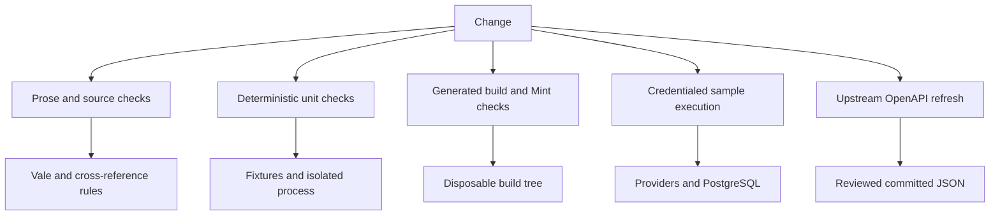
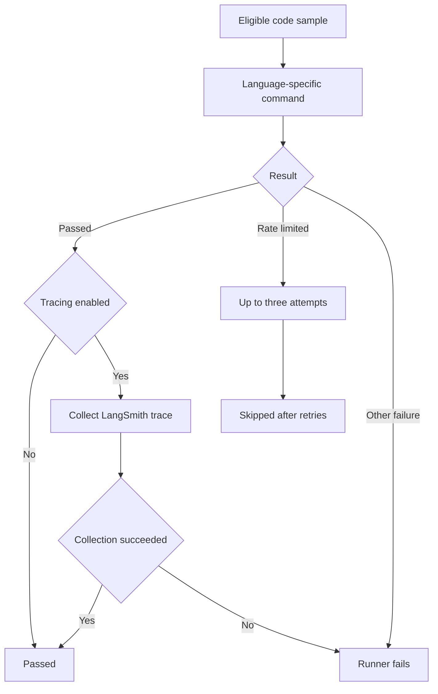
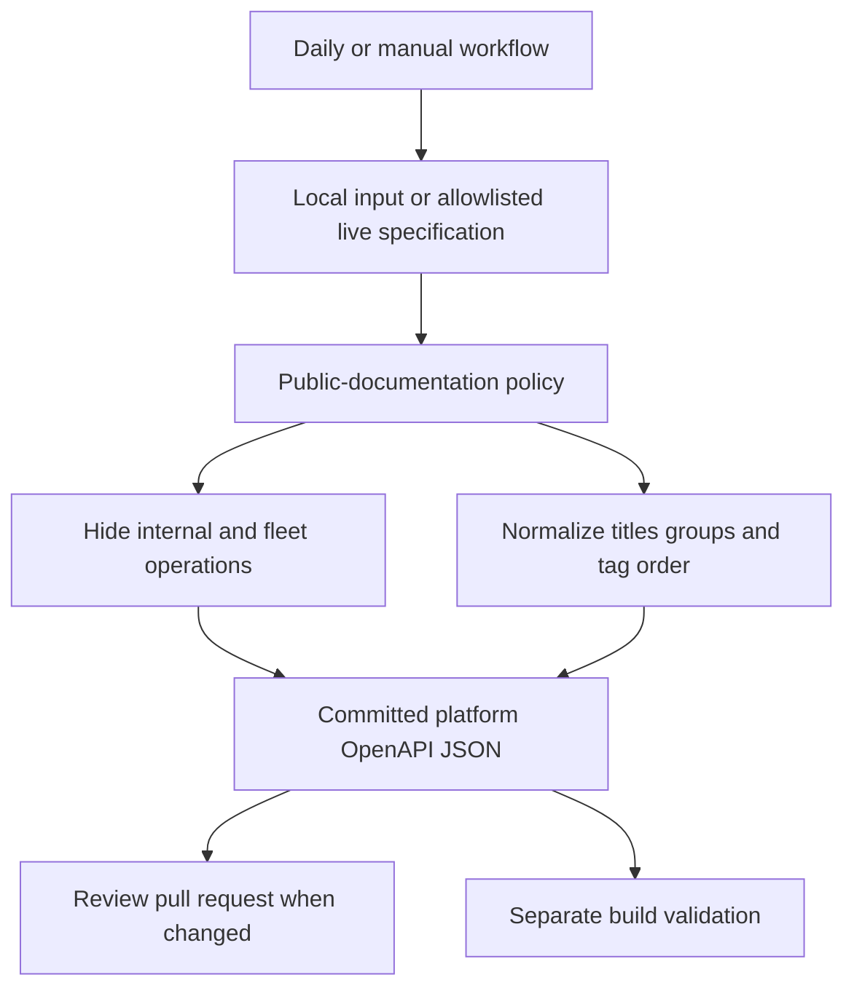

## Choose the validation boundary

Start with the narrowest check that proves the changed contract, then add checks for every boundary crossed by the change. Unit tests, generated-output checks, Mint validation, credentialed samples, and upstream refreshes are complementary evidence—not substitutes. In particular, a socket-isolated test cannot prove a provider request, and a green live sample cannot prove that routes, anchors, or generated documentation are correct.

| Change | Start with | Passing result proves | It does not prove |
| --- | --- | --- | --- |
| Prose under `src/` | `make lint_prose FILES="src/path/page.mdx"` | Vale accepted the changed authored prose under the repository style configuration | A route, link destination, or generated page works |
| Builder, preprocessing, generator, or metadata behavior | `make test TEST_FILE=tests/unit_tests/test_builder.py` | A fixture-controlled implementation contract | A remote API, provider, or deployed page works |
| Shared `@[ref]` map | `make check-cross-refs` | Authored unfenced references resolve for the scopes in which their source is built | The final rendered route is reachable |
| Routes, redirects, anchors, or Agent Server OpenAPI | `make broken-links-with-anchors` and `make check-openapi` | The disposable `build/` output passes the configured Mint checks | A remote upstream specification is fresh |
| Integration external-doc metadata | `uv run python scripts/refresh_integration_downloads.py --check-docs-urls` | Partner `docs_url` values use an allowed, safe URL form | The external destination responds successfully |
| Generated provider overview | `uv run python pipeline/tools/partner_pkg_table.py` followed by `git diff -- src/oss/python/integrations/providers/overview.mdx` | The committed overview agrees with its generator and package metadata | Other generated documentation or live integrations work |
| Runnable example | `make test-code-samples FILES="src/code-samples/..."` | The selected program executed in its language environment with available services and credentials | A skipped rate-limited example executed, or the documentation build is valid |
| LangSmith Platform OpenAPI refresh | `uv run python scripts/process_langsmith_openapi.py --input /path/to/openapi.json --write` | The supplied specification received the repository's deterministic public-documentation policy | Mint rendered every endpoint page or the live API remains unchanged |


```mermaid
flowchart TD
  Change["Change"] --> Prose["Prose and source checks"]
  Change --> Unit["Deterministic unit checks"]
  Change --> Build["Generated build and Mint checks"]
  Change --> Live["Credentialed sample execution"]
  Change --> Upstream["Upstream OpenAPI refresh"]
  Prose --> Style["Vale and cross-reference rules"]
  Unit --> Fixture["Fixtures and isolated process"]
  Build --> Tree["Disposable build tree"]
  Live --> Services["Providers and PostgreSQL"]
  Upstream --> Artifact["Reviewed committed JSON"]
```

This flow shows the independent validation boundaries that a documentation change can cross.

## Prose, metadata, and deterministic tests

`lint-prose.yml` runs for pull requests that modify `src/**/*.md` or `src/**/*.mdx`. It computes the changed Markdown files from the merge base and invokes `make lint_prose` only when that set is nonempty. The Make target installs the Vale version pinned by `.mise.toml`, excludes `node_modules` and `src/code-samples`, and accepts `FILES` for a focused invocation. Vale treats MDX as Markdown, skips frontmatter, ignores fenced code blocks, and fails only at its configured `error` alert level. Its active style set is LangChain, proselint, vale, and write-good.

```bash
uv sync --group test
make test
make test TEST_FILE=tests/unit_tests/test_builder.py
make lint_prose FILES="src/path/page.mdx"
make check-cross-refs
```

`make test` runs pytest with `--disable-socket` while allowing Unix sockets. Pytest is configured for verbose outcome reporting, automatic asyncio mode, and function-scoped asyncio fixture loops. Network-facing behavior belongs behind mocks at this boundary: a socket error identifies an isolation violation, not a provider outage. Reusable test, lint, and documentation-link workflows synchronize the test dependency group with `UV_FROZEN=true`; CI therefore cannot silently refresh the lockfile.

### Focused contracts worth running

- **Builder and route input:** `test_builder.py` checks the supported copy-extension policy, empty source handling, and copying a local TSX component into `build/snippets`. The builder clears and recreates `build/`, then emits language-specific and unversioned documentation trees. Follow a builder or navigation change with the Mint build checks.
- **Autolinks:** `test_handle_auto_links.py` covers scope-sensitive marker expansion, fenced-code preservation, and escaped markers. `make check-cross-refs` scans Markdown below `src`, excluding generated code-sample snippets and `node_modules`; a shared, unfenced OSS reference must resolve in every scope where that page is built. Use a conditional language fence for a language-specific key.
- **Integration listing metadata:** `test_refresh_integration_downloads.py` checks that external `docs_url` values accept HTTP(S) or a single-leading-slash site path and reject empty, protocol-relative, or executable schemes. The CI `check-external-docs-urls` job runs the same validation without treating it as an availability probe. See [Integration Listing Automation](/openwiki/workflows/integration-listing-automation.md).
- **Snippet generation and TypeScript dependency state:** `test_generate_code_snippet_mdx.py` protects embeddings and provider-specific chat-model identifiers while expanding eligible agent model strings. It also guards language-specific Google provider keys and requires declared and locked `@langchain/google` versions of at least `0.2.6`, preventing a stale resolution from losing the mixed-tool configuration fix.

The provider overview is generated rather than hand-maintained. CI regenerates it and rejects a diff unless the pull request is the designated automated package-download update or has the `bypass-auto-check` label; update `packages.yml` or `pipeline/tools/partner_pkg_table.py` instead.

## Build, route, and navigation validation

`make build` uses the pipeline to recreate `build/`. `make broken-links-with-anchors` then runs Mint's broken-link checker with both anchor and redirect validation. Its filter deliberately removes known generated OpenAPI and standalone-snippet noise, but a remaining reported indented link is a failure. `make check-openapi` separately runs `mint openapi-check` against `build/langsmith/agent-server-openapi.json`. The reusable documentation-link workflow installs dependencies with frozen resolution, uses Node 22, and runs both commands.

These are generated-surface checks: they establish properties of a fresh local build and the Mint CLI, not provider behavior or hosted deployment behavior. Conversely, passing unit preprocessing or metadata validation does not establish that redirects, anchors, route rewrites, or the Agent Server OpenAPI document pass Mint.

For an exported Mint site, run `make export-htmltest`. The export omits a complete page set, so htmltest deliberately disables internal URL and internal-hash checks while retaining external URL checks. It limits external HTTP concurrency to four and uses a 30-second external timeout. This is a network check over an incomplete export, not an interchangeable replacement for deterministic build or unit tests.

## Live code samples and generated trace links

```bash
make test-code-samples
make test-code-samples FILES="src/code-samples/langchain/return-a-string.py"
```

The Make target installs the ESM package environment in `src/code-samples` before running the sample runner; this package owns `tsx` and shared TypeScript dependencies. The runner executes eligible Python, TypeScript, Java, Kotlin, Go, and shell files below that directory. `FILES` is an explicit space-separated subset; without it, the runner discovers all eligible files except files below `__pycache__` and `node_modules`.

Each execution gets a default 1,200-second timeout, overridden by `CODE_SAMPLE_TIMEOUT_SECONDS`. Python uses `uv`, TypeScript uses `npx tsx`, Go uses `go run`, shell uses `bash`, and Java/Kotlin use JBang with Java 21. Python and JBang run from the repository root; TypeScript, Go, and shell run from `src/code-samples` so their shared environment resolves.


```mermaid
flowchart TD
  Select["Eligible code sample"] --> Execute["Language-specific command"]
  Execute --> Result{"Result"}
  Result -->|"Passed"| Trace{"Tracing enabled"}
  Trace -->|"No"| Passed["Passed"]
  Trace -->|"Yes"| Collect["Collect LangSmith trace"]
  Collect --> Collected{"Collection succeeded"}
  Collected -->|"Yes"| Passed
  Collected -->|"No"| Failed["Runner fails"]
  Result -->|"Rate limited"| Retry["Up to three attempts"]
  Retry --> Skipped["Skipped after retries"]
  Result -->|"Other failure"| Failed
```

This flow is live integration evidence. A persistent LangSmith rate limit after three attempts separated by 15-second delays is recorded as skipped and does not make the runner nonzero; other unsuccessful samples do. A skip is not a pass and needs later execution. When `CODE_SAMPLE_TRACING` is enabled, each successful sample is followed by trace collection; a collection failure makes the runner fail even though the process itself passed.

The workflow skips fork pull requests because provider secrets are unavailable there. Internal pull requests run changed eligible sample files, while scheduled monthly and manual dispatches run the entire set with tracing; their job timeout is 90 minutes rather than 60 minutes. CI provisions a pgvector PostgreSQL service, language toolchains, provider credentials, and `POSTGRES_URI`. The local PostgreSQL helper prioritizes that URI, then tries a pgvector testcontainer, Docker, and finally its local default; its store preparation removes shared store and migration tables before setup.

Trace publication has a narrower contract than execution. Only a single-snippet source file with a qualifying recent agent root run produces a public manifest URL; multi-snippet sources are recorded as skipped. Generated snippet MDX adds its View example trace card only when such a URL exists. After a successful full scheduled or manual run and snippet regeneration, the workflow opens or updates the standing `chore/refresh-code-sample-traces` pull request with the manifest and generated snippet changes. See [Code Sample Lifecycle](/openwiki/workflows/code-sample-lifecycle.md).

## LangSmith Platform OpenAPI publication boundary

The committed public artifact is `src/langsmith/langsmith-platform-openapi.json`. The processor reads a local `--input` when supplied; otherwise it fetches only the allowlisted LangSmith API host. It applies the public-documentation policy—hiding fleet/internal operations, normalizing titles, assigning groups, and ordering tags—and writes JSON only with `--write`; without that flag it prints the processed result.


```mermaid
flowchart TD
  Source["Local input or allowlisted live specification"] --> Process["Public-documentation policy"]
  Process --> Hide["Hide internal and fleet operations"]
  Process --> Group["Normalize titles groups and tag order"]
  Hide --> JSON["Committed platform OpenAPI JSON"]
  Group --> JSON
  Refresh["Daily or manual workflow"] --> Source
  JSON --> Review["Review pull request when changed"]
  JSON --> BuildCheck["Separate build validation"]
```

This flow separates upstream freshness, deterministic curation, review, and Mint build validation.

The trusted refresh workflow runs daily and on manual dispatch. It processes the live specification and opens or updates one `chore/refresh-langsmith-openapi` review pull request only when the committed artifact changes. Review a refresh as a change to the public publication policy output; a successful fetch does not prove the local build or hosted API documentation rendered correctly. Run the relevant Mint build checks separately. See [Reference Documentation](/openwiki/integrations/reference-docs.md) and [GitHub Actions and CI/CD](/openwiki/integrations/github-actions.md).

## CI triage

- **Vale failure:** correct authored prose or an applicable style rule. The workflow only gates changed Markdown under `src/`, and code fences and frontmatter have their configured exclusions.
- **Socket or focused-test failure:** repair the deterministic contract or mock. Do not diagnose it as a live-service outage.
- **Cross-reference failure:** add the scoped map entry, move a language-specific key inside its conditional fence, or escape it intentionally. Then validate routes separately.
- **Generated overview failure:** regenerate from its source of truth rather than editing the output directly.
- **Mint link, redirect, anchor, or OpenAPI failure:** reproduce against `build/`; it is separate from source-level and remote-upstream checks.
- **Live sample failure:** inspect credentials, provider behavior, service readiness, toolchains, and the example. Treat a rate-limit skip as missing execution evidence.
- **Platform OpenAPI refresh diff:** review exposed, hidden, renamed, and regrouped operations, then run build validation; a remote fetch is not hosted-surface evidence.

## Related documentation

- [Quickstart](/openwiki/quickstart.md)
- [GitHub Actions and CI/CD](/openwiki/integrations/github-actions.md)
- [Reference Documentation](/openwiki/integrations/reference-docs.md)
- [Code Sample Lifecycle](/openwiki/workflows/code-sample-lifecycle.md)
- [Integration Listing Automation](/openwiki/workflows/integration-listing-automation.md)
