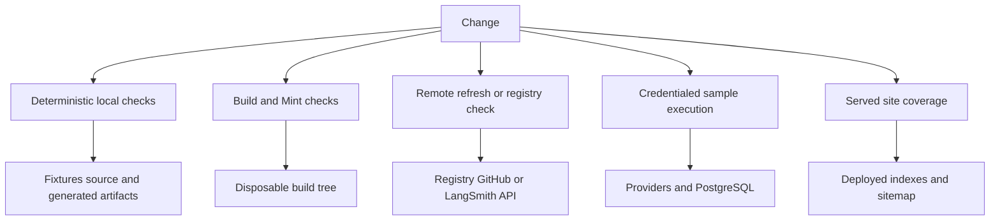
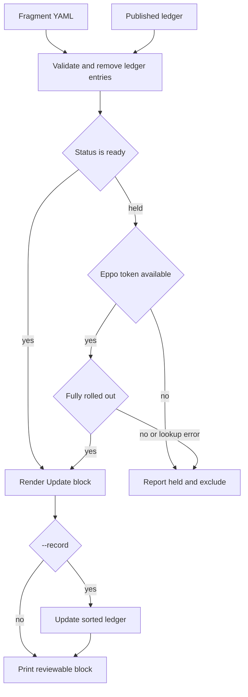
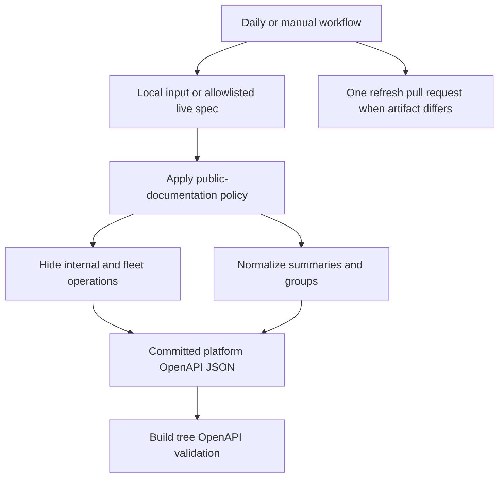
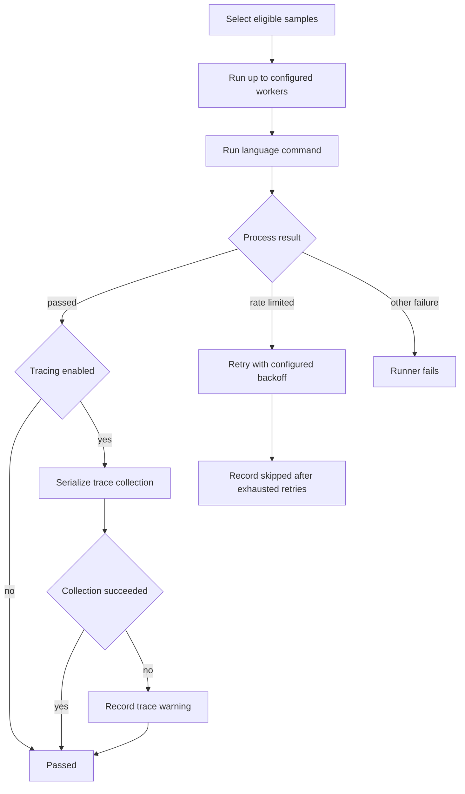

## Choose the validation boundary

Start with the narrowest check that can prove the change, then add a boundary when it changes generated output, a link map, an external registry or specification, a credentialed example, or deployed content. These checks complement one another: a socket-isolated unit test cannot prove a provider call, and a successful live sample cannot prove that all generated documentation links resolve.

| Change | Focused command | Passing result proves | It does not prove |
| --- | --- | --- | --- |
| Pipeline, parser, builder, link-map, or generator behavior | `make test TEST_FILE=tests/unit_tests/test_builder.py` | A local, fixture-controlled contract | A registry, provider, deployed page, or remote API works |
| Code-sample TypeScript dependency or generated CodeGroup rule | `make test TEST_FILE=tests/unit_tests/test_generate_code_snippet_mdx.py` | Dependency floors and source-tree generation invariants | That a real provider request succeeds |
| MCP or other `@[ref]` reference/map change | `make test TEST_FILE=tests/unit_tests/test_handle_auto_links.py` and `make check-cross-refs` | Resolver behavior and source references in applicable scopes | The rendered destination is reachable |
| Changelog fragment ledger or recording behavior | `make test TEST_FILE=tests/unit_tests/test_assemble_changelog.py` | Ledger parsing, deduplication, and the tested render/record path under temporary files | A sibling `langchainplus` fragment set, Eppo rollout state, or a pasted changelog block is correct |
| Self-hosted changelog chapter navigation | `node --test tests/changelog-navigation.test.js` | The isolated DOM harness accepts only visible stable minor-release headings and preserves its navigation lifecycle | Mintlify's production DOM, CSS, or deployment behavior |
| Build, redirect, anchor, or committed OpenAPI artifact | `make broken-links-with-anchors` and `make check-openapi` | The generated `build/` tree passes Mint checks | The live upstream OpenAPI endpoint is current |
| LangSmith platform OpenAPI refresh | `uv run python scripts/process_langsmith_openapi.py --input /path/to/openapi.json --write` | A supplied or allowlisted remote spec is processed deterministically into the committed artifact | That Mint renders every generated endpoint page as intended |
| Runnable code sample | `make test-code-samples FILES="src/code-samples/..."` | The selected program ran in its real language environment with supplied services and credentials | That skipped rate-limited samples ran, or all documentation output is valid |
| Package version assertion | `uv run python scripts/check_version_claims.py --files src/path/page.mdx` | The selected registry reports the stated release | Compatibility beyond published availability |
| Upstream-mirrored version | `uv run python scripts/check_external_versions.py --only <id>` | A configured source matches its GitHub upstream | An unreadable upstream synchronized |
| Hosted `llms.txt` coverage | `python3 scripts/check_llms_urls.py` | Sitemap pages are reachable through served indexes | A local build or source edit fixed the deployment |


```mermaid
flowchart TD
  Change["Change"] --> Unit["Deterministic local checks"]
  Unit --> Local["Fixtures source and generated artifacts"]
  Change --> Rendered["Build and Mint checks"]
  Rendered --> Build["Disposable build tree"]
  Change --> Remote["Remote refresh or registry check"]
  Remote --> Network["Registry GitHub or LangSmith API"]
  Change --> Live["Credentialed sample execution"]
  Live --> Services["Providers and PostgreSQL"]
  Change --> Hosted["Served site coverage"]
  Hosted --> Site["Deployed indexes and sitemap"]
```

This map separates deterministic local evidence from remote, live-service, and hosted-site evidence.

## Deterministic unit and build checks

The project requires Python `>=3.13.0,<4.0.0`; local mise selects Python 3.13 and uv 0.9.26. Install the test group, then use the focused test before the full suite:

```bash
uv sync --group test
make test
make test TEST_FILE=tests/unit_tests/test_builder.py
```

`make test` invokes pytest with `--disable-socket` and permits Unix sockets. Pytest uses automatic asyncio mode and function-scoped asyncio fixture loops. Internet-facing behavior must be mocked in this boundary; a socket failure means a test crossed its isolation boundary, not that a remote service is unavailable. Reusable test, lint, and documentation-link workflows synchronize the test group with `UV_FROZEN=true`, so CI does not silently update `uv.lock`.

### Focused contracts for documentation changes

- **Builder changes:** `tests/unit_tests/test_builder.py` covers the supported copy extensions, an empty source tree, and copying a local TSX snippet component into `build/snippets`. The builder clears and recreates `build/`, so follow a passing focused test with a build-oriented check when routing or output policy changes.
- **Autolinks and MCP maps:** `tests/unit_tests/test_handle_auto_links.py` verifies scoped autolinks outside fenced code, preserves markers inside backtick or tilde fences (including extended and unclosed fences), and unescapes rather than resolves `\@[...]`. The source gate scans authored Markdown below `src`, skips generated code-sample snippets and `node_modules`, and requires an unfenced shared OSS reference to resolve in every build scope. Put Python-only and TypeScript-only MCP symbols in their respective conditional branch, then run both the focused resolver test and `make check-cross-refs`. See [Documentation Preprocessing](/openwiki/concepts/preprocessing.md) and [Cross-References](/openwiki/operations/cross-references.md).
- **Generated snippets and TypeScript dependencies:** The snippet-generator tests protect the distinction between an agent's routable model string and provider-specific chat or embedding model IDs. They also enforce `google:` and camel-case `googleSearch` in TypeScript, `google_genai:` in Python, and a declared and locked `@langchain/google` version of at least 0.2.6. When changing an MCP-related TypeScript package, `tsx`, or a sample dependency, update `src/code-samples/package.json` and its lockfile together, run this focused test, then execute the affected live sample if its path actually uses the changed package.
- **Other deterministic metadata:** The integration `docs_url` validator makes no network calls or writes; it accepts HTTP(S) and single-leading-slash paths while rejecting unsafe or missing values. The provider overview is generated: CI regenerates it and rejects a diff, so change `packages.yml` or its generator rather than editing the overview directly.

`make test-code-samples` installs the ESM package environment below `src/code-samples` before starting the runner. It declares `tsx` and the shared TypeScript dependencies, so it is the dependency owner for TypeScript examples rather than each sample file.

### Changelog assembly and browser enhancement

The changelog assembler has two distinct inputs: fragment YAML lives by default in the sibling checkout at `../langchainplus/.changelog`, while the publication ledger is the repository-owned `scripts/.changelog_published.txt`. It refuses a ledger path that resolves outside this repository, skips fragment names already in the ledger, and changes the ledger only when `--record` is supplied after it has rendered ready fragments. Therefore, use a temporary `--fragments-dir` and `--ledger` with the focused Python test for ledger and local rendering semantics; run the production invocation only when the sibling checkout is available and treat its output as a reviewable paste candidate rather than a published change.

A fragment must provide title, body, components, and a `ready` or `held` status; `held` also requires a flag. Ready entries render directly. A held entry remains excluded without `EPPO_API_KEY`; with a token, the script reads the fixed HTTPS Eppo API and includes it only when the active production environment's first catch-all allocation has full exposure and one appropriate variation. Lookup errors leave held entries out rather than promoting them. `--promote` is deliberately stateful: it rewrites qualifying held fragments to `status: ready`; `--check-flag` is a credentialed diagnostic and does not assemble the weekly block.


```mermaid
flowchart TD
  Fragments["Fragment YAML"] --> Validate["Validate and remove ledger entries"]
  Ledger["Published ledger"] --> Validate
  Validate --> Ready{"Status is ready"}
  Ready -->|"yes"| Render["Render Update block"]
  Ready -->|"held"| Token{"Eppo token available"}
  Token -->|"no"| Hold["Report held and exclude"]
  Token -->|"yes"| Rollout{"Fully rolled out"}
  Rollout -->|"yes"| Render
  Rollout -->|"no or lookup error"| Hold
  Render --> Record{"--record"}
  Record -->|"yes"| Write["Update sorted ledger"]
  Record -->|"no"| Output["Print reviewable block"]
  Write --> Output
```

This is the assembly decision path: a dry run produces review material, whereas `--record` also advances the repository's duplicate-prevention state.

The self-hosted page enhancement is a separate Node test surface. `src/changelog-navigation.js` activates only at `/langsmith/self-hosted-changelog`; it collects visible `h2` IDs matching exactly `langsmith-<major>-<minor>-0`, adds index links, and uses a request-animation-frame-coalesced `MutationObserver` to rebuild on route or DOM changes. It removes generated indexes and heading classes when leaving the page. `tests/changelog-navigation.test.js` runs this browserless script in a minimal DOM and exercises stable-versus-patch/prerelease filtering, sidebar and inline fallback mounting, coalescing, cleanup, and filter-driven re-rendering. Run it explicitly with `node --test tests/changelog-navigation.test.js`: the reusable Python test job runs only `make test`, and the documentation workflow uses Node for Mint checks but does not invoke this Node test file.

### Rendered documentation is a separate boundary

`make build` creates the disposable `build/` tree. `make broken-links-with-anchors` builds it, checks anchors and redirects through Mint, and filters documented generated-OpenAPI and standalone-snippet noise; `make check-openapi` validates `build/langsmith/agent-server-openapi.json`. The reusable documentation workflow runs those commands with Node 22 after installation. A passing source-map or unit test does not show that route rewrites, anchors, redirect targets, or Mint's OpenAPI validation work.

`make export-htmltest` is a further external-link boundary. The Mint export is incomplete, so htmltest deliberately disables internal-path and hash checks while checking external URLs, with four concurrent HTTP requests and a 30-second timeout.

## LangSmith platform OpenAPI: refresh, process, validate

The committed public artifact is `src/langsmith/langsmith-platform-openapi.json`. `scripts/process_langsmith_openapi.py` either reads `--input` locally or fetches only `https://api.smith.langchain.com/openapi.json`; it writes only with `--write`, otherwise it previews JSON on stdout. The network fetch has a 30-second timeout and rejects hosts outside its allowlist.

Processing is intentionally idempotent: it hides operations tagged for fleet/internal use or matching configured health/internal path rules, standardizes operation summaries (including visible non-sandbox v2 labels), adds or updates top-level tags, applies human-readable `x-group` values, and orders tags by the configured group order. This is a curation step for Mint's public endpoint navigation, not schema validation.


```mermaid
flowchart TD
  Input["Local input or allowlisted live spec"] --> Process["Apply public-documentation policy"]
  Process --> Hide["Hide internal and fleet operations"]
  Process --> Labels["Normalize summaries and groups"]
  Hide --> Artifact["Committed platform OpenAPI JSON"]
  Labels --> Artifact
  Artifact --> Mint["Build tree OpenAPI validation"]
  Refresh["Daily or manual workflow"] --> Input
  Refresh --> Review["One refresh pull request when artifact differs"]
```

This flow distinguishes remote-spec freshness, deterministic policy transformation, and Mint validation of the resulting build artifact.

The trusted refresh workflow runs daily at 10:00 UTC and can be dispatched manually. It processes the live spec, preserves the resulting file while checking out or creating `chore/refresh-langsmith-openapi`, and opens or appends to one review PR only when that artifact differs. Review the generated diff for newly exposed, hidden, renamed, or regrouped operations; do not treat a successful fetch as proof that public endpoint pages rendered correctly. Run `make check-openapi` and the documentation link check for that separate build boundary. See [LangSmith OpenAPI Refresh](/openwiki/workflows/langsmith-openapi-refresh.md).

## Credentialed live code samples

```bash
make test-code-samples
make test-code-samples FILES="src/code-samples/langchain/return-a-string.py"
```

The runner discovers Python, TypeScript, Java, Kotlin, Go, and shell samples under `src/code-samples`; `FILES` selects a space-separated subset and an unset value runs all eligible files except `__pycache__` and `node_modules`. The default timeout is 1,200 seconds and `CODE_SAMPLE_TIMEOUT_SECONDS` overrides it. `CODE_SAMPLE_JOBS` controls concurrent execution (default 4; invalid values fall back and values below one clamp to one). Samples in the `evaluate-rag` and `experiment-runs-query` serial groups take a group lock, so they do not overlap with another sample in their own group while unrelated samples can still use the other workers. Python runs through `uv`, TypeScript through `npx tsx`, Go through `go run`, shell through `bash`, and Java/Kotlin through JBang pinned to Java 21. Python and JBang use the repository root; TypeScript, Go, and shell use `src/code-samples` to resolve their shared environments.


```mermaid
flowchart TD
  Select["Select eligible samples"] --> Workers["Run up to configured workers"]
  Workers --> Run["Run language command"]
  Run --> Result{"Process result"}
  Result -->|"passed"| Trace{"Tracing enabled"}
  Trace -->|"no"| Pass["Passed"]
  Trace -->|"yes"| Collect["Serialize trace collection"]
  Collect --> TraceResult{"Collection succeeded"}
  TraceResult -->|"yes"| Pass
  TraceResult -->|"no"| Warn["Record trace warning"]
  Warn --> Pass
  Result -->|"rate limited"| Retry["Retry with configured backoff"]
  Retry --> Skip["Record skipped after exhausted retries"]
  Result -->|"other failure"| Fail["Runner fails"]
```

This is live integration evidence, not a deterministic unit test. A rate-limit skip is not a successful execution, and a trace-collection warning is not a sample failure: the sample process already passed.

The workflow does not run on fork pull requests because examples can require provider secrets. Internal PRs run only changed eligible samples; monthly scheduled and manual runs test all samples, enable tracing, and allow 150 minutes rather than the PR job's 60. CI installs Node 20, Java 21/JBang, and Go from `src/code-samples/go.mod`, and supplies provider credentials plus a pgvector PostgreSQL service through `POSTGRES_URI`. The PostgreSQL helper prefers that URI before attempting a testcontainer, Docker, or a default local connection, and clears shared store and migration tables before setup.

A detected LangSmith 429 gets up to five total attempts by default, including the initial attempt. `CODE_SAMPLE_RATE_LIMIT_ATTEMPTS` sets that budget, and `CODE_SAMPLE_RATE_LIMIT_DELAY_SECONDS` sets the base delay; each retry waits base delay times its one-based attempt number, capped at 120 seconds. The same policy retries 429s raised while collecting traces. A sample that remains rate-limited is recorded as skipped without a nonzero exit, whereas a normal nonzero exit, timeout, or missing executable fails the runner. This keeps CI available under provider load, but a skip is **not successful sample validation**: rerun the skipped path later.

With tracing enabled, only a sample process that passed is followed by trace collection. A trace-collection exception—including one that remains rate-limited after its retry budget—is recorded as a warning and does not fail the runner. Although samples can run in parallel, collection is serialized: the lock protects the shared manifest and claimed-run set so one trace is not attributed to multiple samples. Only a one-snippet source with a qualifying recent agent root run receives a public manifest URL; generated snippet MDX adds a trace card only when that URL exists. On scheduled or manual full runs, CI regenerates snippets when the sample step was not cancelled, fewer than 20 samples failed, and at least one trace entry was updated; it can therefore prepare a trace-refresh PR despite some sample failures, but the final workflow step still fails the job when the runner reported sample failures. See [Code Sample Lifecycle](/openwiki/workflows/code-sample-lifecycle.md).

## Generated snippets: extraction is not execution

`make code-snippets` is the generated-document boundary for sample changes. It first runs `scripts/extract_code_snippets.py`, then `scripts/generate_code_snippet_mdx.py`; it does **not** run samples. The extractor reads line-based `:snippet-start:`/`:snippet-end:` markers in Python, TypeScript, Java, Kotlin, Go, and shell sources, removes marked `:remove-start:` regions, normalizes output, and writes Bluehawk-compatible files under `src/code-samples-generated/`. With no `CODE_SNIPPET_SOURCES`, it clears generated files of those languages before scanning the tree; a space-separated `CODE_SNIPPET_SOURCES` list restricts replacement to validated source files under `src/code-samples`.

The MDX generator reads those extracted files and emits language-suffixed snippet MDX under `src/snippets/code-samples/`. Prefix markers can set a CodeGroup tab title or fence modifiers without appearing in emitted code. For eligible Python and TypeScript agent model strings it creates the seven-provider CodeGroup, but deliberately leaves embeddings and provider-specific chat model IDs unchanged; `KEEP MODEL` prevents expansion of the following model line. It reads `trace-links.json` and replaces or removes a trailing trace card, so a trace URL is presentation metadata layered on generated code rather than proof that the snippet itself executed.

Run `make test TEST_FILE=tests/unit_tests/test_generate_code_snippet_mdx.py` after changing these rules or shared TypeScript dependencies. The test guards the language-specific Google provider keys and tool spelling as well as the declared and lockfile-resolved `@langchain/google` floor. Then run `make code-snippets` and review the generated MDX diff. For a change to runnable behavior, add the credentialed sample command; generation and execution prove different properties.

## Remote and hosted checks

Package-version and external-version checks are network checks, not unit tests. The package checker resolves `>=` floors and `==` pins against PyPI or npm using syntax and context. It distinguishes confirmed unavailable releases from unresolved inputs such as timeouts, malformed responses, unsafe names, or private packages. The changed-document workflow runs only for changed MDX under `src`; its scheduled full sweep is advisory. The external-version checker validates an allowlisted configuration before comparing page values to GitHub content. Check mode fails for drift or unreadable entries; write mode can report unreadable upstream sources yet finish so resolvable changes can be reviewed.

Hosted `llms.txt` coverage is also deliberately outside the local build. The checker crawls the served root index and same-site nested `/_llms/` Markdown indexes, normalizes Markdown and `/index` URLs, and fails when sitemap URLs are unreachable through that hierarchy. Its weekly, credential-free workflow checks the deployed default site. A failure is a deployment/Mintlify coverage gap, not evidence that an authored source file or the local builder failed.

## CI triage

- **Socket, fixture, or focused-test failure:** repair the deterministic contract or its mock; do not diagnose it as a provider outage.
- **`UV_FROZEN` or sync failure:** reconcile declarations and `uv.lock`.
- **Cross-reference failure:** add/correct the scoped map key or fence the language-specific reference. A passing source gate does not validate final rendered URLs.
- **Generated snippet/dependency failure:** update the shared TypeScript declaration and lockfile or preserve the generator's language/model invariant; follow with the affected live sample when appropriate.
- **Changelog assembler test failure:** distinguish a local ledger/rendering regression from a live Eppo or sibling-checkout issue. The focused pytest uses temporary files and no token, so it cannot establish rollout eligibility or validate the production fragment directory.
- **Changelog navigation test failure:** run `node --test tests/changelog-navigation.test.js` directly and repair the script's isolated DOM contract. A green Python CI job does not cover it; a green Node harness does not prove Mintlify's deployed DOM or styling.
- **Mint link, anchor, redirect, or OpenAPI failure:** reproduce against the build tree. It is separate from source preprocessing and remote-spec refresh.
- **OpenAPI refresh diff:** review policy effects and run build validation; a fetched spec is remote input, not a guarantee of rendered public documentation.
- **Live sample failure:** inspect credentials, current provider behavior, service readiness, toolchains, and the sample. A green run with skips requires later execution of the skipped samples.
- **Hosted `llms.txt` failure:** investigate served indexes and sitemap/deployment state rather than editing a generated hosted artifact.

## Related documentation

- [Documentation Preprocessing](/openwiki/concepts/preprocessing.md)
- [GitHub Actions and CI/CD](/openwiki/integrations/github-actions.md)
- [Cross-References](/openwiki/operations/cross-references.md)
- [Quickstart](/openwiki/quickstart.md)
- [Builder Tests](/openwiki/testing/builder-tests.md)
- [Changelog Publication](/openwiki/workflows/changelog-publication.md)
- [Code Sample Lifecycle](/openwiki/workflows/code-sample-lifecycle.md)
- [LangSmith OpenAPI Refresh](/openwiki/workflows/langsmith-openapi-refresh.md)
