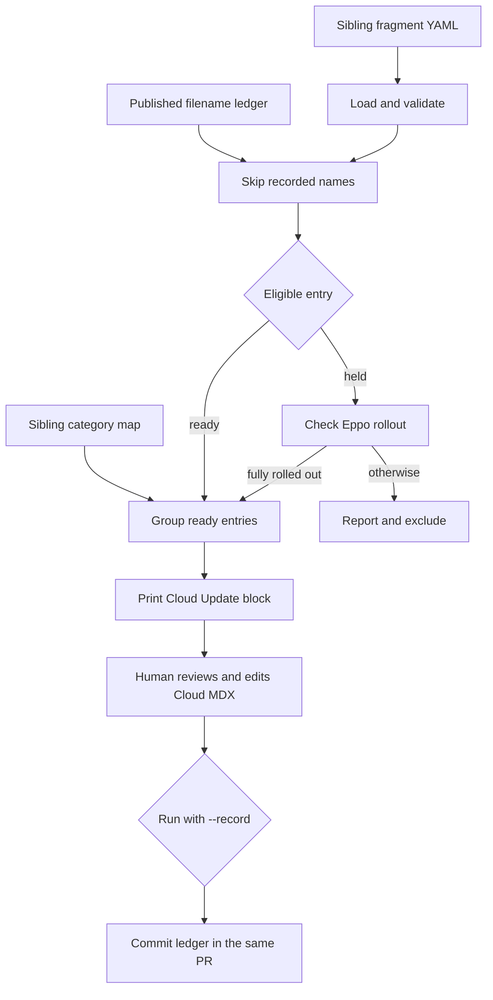

# LangSmith Changelog Publication

LangSmith uses three independently maintained public entrypoints:

<!-- openwiki: broken internal link [/langsmith/fleet/changelog] file "/langsmith/fleet/changelog" does not exist. Fix the href or restore the target, then delete this comment. -->
<!-- openwiki: broken internal link [/langsmith/self-hosted-changelog] file "/langsmith/self-hosted-changelog" does not exist. Fix the href or restore the target, then delete this comment. -->
- The weekly **Cloud** stream is `src/langsmith/changelog.mdx`. It links readers to the [Fleet changelog](/langsmith/fleet/changelog) and the [self-hosted changelog](/langsmith/self-hosted-changelog).
- The weekly **Fleet** route is `src/langsmith/fleet/changelog.mdx`, which imports the authored update stream from `src/snippets/langsmith/fleet-changelog.mdx`.
- **Self-hosted** release notes are authored in `src/langsmith/self-hosted-changelog.mdx`; they follow chart releases rather than the Cloud fragment workflow.

`scripts/assemble_changelog.py` is a **curation and review aid, not an autonomous publisher**. It prepares a candidate Cloud `<Update>` block on standard output. A weekly agent running on Fleet reviews that candidate and opens a documentation PR for human approval. Pasting it into MDX, reviewing the PR, and merging remain human actions.

## Cloud assembly: inputs, state, and control flow

The assembler reads top-level YAML fragments and the category map from the sibling checkout at `../langchainplus/.changelog`. Fragment schema and category ownership are upstream inputs; do not recreate or modify them in this repository. It skips `_`- and `TEMPLATE`-prefixed names, resolves candidates inside the fragment root, and rejects files that escape through traversal or a symlink.

The repository-owned publication state is `scripts/.changelog_published.txt`. It records fragment **filenames**, ignoring comments and blank lines. This ledger—not a fragment's position in an upstream `published/` directory—is the duplicate-prevention record. Its header requires that it be committed with the corresponding changelog entry and not manually edited.



This is the review-oriented Cloud publication path. `--record` advances only the local duplicate-prevention state for entries rendered in that invocation; it does not edit MDX, open a PR, merge a PR, or publish anything.

### Fragment validity and rendering

A valid fragment has a nonempty `title`, `body`, and `components`, plus `status: ready` or `status: held`. A held item also needs `flag`. Invalid fragments are reported and excluded.

After ledger filtering, the first component found in the category map selects an entry's section and optional group. Unmapped entries appear under `Other`. Section order follows the category map; ungrouped bullets come before named groups. When `docs_link` is set, the renderer adds a `Learn more` Markdown link only if the body does not already contain a Markdown link.

The output is one Mintlify `<Update>` block. Its default label spans the current Monday-through-Friday week. `--week-label` and `--rss-date` independently override the visible label and RSS date; the RSS title is `<date> - LangSmith Cloud update`. Reports (`READY`, `HELD`, `ERROR`, `INVALID`, and already-published entries) go to stderr so stdout remains paste-ready MDX.

## Held entries and the Eppo boundary

`ready` fragments render directly. A `held` fragment stays excluded without `EPPO_API_KEY`. With that environment variable, the script makes read-only GET requests only to the fixed HTTPS `https://eppo.cloud/api/v1` endpoint.

A held flag qualifies only when its production environment is active and its first non-targeted, non-archived catch-all allocation has full exposure (`1` or `100`) with exactly one nonzero-weight variation. For Boolean flags, that variation must be the `true` variation. Targeted allocations do not establish a general rollout because users who do not match them continue to the catch-all allocation.

Lookup failures warn and leave the item out. The flag index reads one API page; when an envelope says more flags exist than were returned, the assembler warns rather than silently treating a potentially omitted flag as eligible. A missing named flag is an error, not a publish decision.

> **Credential boundary:** Supply `EPPO_API_KEY` through the process environment only. The CLI has no token argument, and the value is sent as `X-Eppo-Token` only to the fixed Eppo host. The token permits rollout evaluation; it does not grant publication authority.

## Human review and same-PR ledger procedure

Run the normal invocation from the documentation repository root. It is a dry run: it prints a candidate block and does not modify the ledger.

```bash
uv run python scripts/assemble_changelog.py
uv run python scripts/assemble_changelog.py --week-label "June 15-19, 2026"
```

Review both the candidate and stderr reports. Correct or defer invalid upstream fragments, and do not bypass held items simply because they reference a flag. Paste the reviewed output into `src/langsmith/changelog.mdx`; the assembler has no mode that performs that edit.

Only after the exact Cloud update is ready for its documentation PR, run the matching record command and inspect its diff:

```bash
uv run python scripts/assemble_changelog.py --week-label "June 15-19, 2026" --record
```

`--record` unions only rendered ready filenames with the ledger, preserving comment lines and writing names sorted and unique. It does not record held, invalid, errored, or already-recorded items. Commit the resulting ledger change in the **same PR** as the pasted Cloud changelog block; never pre-record entries in a separate PR. An overridden `--ledger` must resolve inside this repository, so traversal and symlink targets outside the checkout are refused.

Two modes intentionally serve different purposes:

```bash
uv run python scripts/assemble_changelog.py --check-flag my-eppo-flag-key
uv run python scripts/assemble_changelog.py --promote
```

`--check-flag` requires `EPPO_API_KEY`, prints the selected flag JSON and rollout verdict, then exits before normal assembly. `--promote` rewrites qualifying held fragments in the sibling fragment checkout to `status: ready`; use it only when that upstream state transition is intended and can be separately reviewed. Neither mode edits the Cloud changelog MDX.

## Coverage audit

`scripts/audit_changelog_coverage.py` is a reconciliation backstop, not an assembly or publication step. It queries merged `langchain-ai/langchainplus` PRs through authenticated read-only `gh` commands. Its default window is 14 days and is split into contiguous seven-day subwindows to reduce the chance of GitHub search-cap truncation.

The audit considers candidate user-facing `feat` and `fix` PRs, excluding explicit internal, BYOC, data-plane, and provisioning signals. A candidate is covered when its own diff includes a `.changelog/*.yaml` fragment or a fragment's `pr:` field matches it; an ignore file holds human dispositions. It deliberately over-reports remaining candidates for review instead of silently omitting borderline user-facing changes.

## Fleet and self-hosted streams

Fleet is not generated by the Cloud assembler. The Fleet route imports its own weekly `<Update>` blocks from `src/snippets/langsmith/fleet-changelog.mdx`, with Fleet-specific RSS titles. Make Fleet release-note edits in that snippet and retain the route-level import.

Self-hosted notes are direct, versioned `<Update>` blocks tagged, for example, `Stable` or `Preview`. They describe the release, include the LangSmith application version, and link to the corresponding Helm chart archive. This release-driven source of truth is separate from both weekly Cloud fragment assembly and the Fleet snippet.

### Self-hosted minor-release navigation

`src/changelog-navigation.js` enhances only `/langsmith/self-hosted-changelog`. It selects visible `h2` elements whose rendered IDs exactly match `langsmith-<major>-<minor>-0`, which limits the index to stable minor-release chapters. Patches, release candidates, non-release categories, and hidden headings are excluded.

For eligible headings, the script adds a **Minor releases** index at the start of `#content` and, when `#content-side-layout` is present, a sidebar index. The inline index is marked as the fallback without a sidebar. A `MutationObserver` watches route and DOM changes; `requestAnimationFrame` coalesces bursts, and a heading-ID signature prevents unnecessary rebuilding. Leaving the route removes generated indexes and heading classes; indexes are also removed if no eligible visible headings remain. CSS styles the hierarchy and links, including focus and dark-mode states, and hides the non-fallback inline duplicate on wide sidebar layouts.

## Focused validation

Use the narrow test boundary for the changed behavior:

```bash
make test TEST_FILE=tests/unit_tests/test_assemble_changelog.py
node --test tests/changelog-navigation.test.js
```

The Python test uses temporary fragments and a ledger. It covers ledger comment and blank-line parsing, missing-ledger behavior, sorted de-duplicated recording, skipping recorded fragments, no write without `--record`, and rejection of an out-of-repository ledger. It does not prove the real sibling fragment set, live Eppo state, or a manually pasted MDX block.

The Node test evaluates the navigation script in a minimal DOM. It covers stable-minor and visible-heading selection, sidebar and inline fallback mounting, animation-frame coalescing, unchanged-index avoidance, route cleanup, and filter-driven removal and recreation. It does not prove Mintlify's production DOM, CSS, or deployment behavior.

For public MDX, heading, navigation-style, anchor, or generated-tree changes, also run `make broken-links-with-anchors` as described in [Testing Overview](/openwiki/testing/test-overview.md). See [CLI Tools](/openwiki/operations/cli-tools.md) for build and preview behavior, [GitHub Actions and CI/CD](/openwiki/integrations/github-actions.md) for CI boundaries, and [Quickstart](/openwiki/quickstart.md) for local setup.

## Safe publication checklist

1. Make the sibling `langchainplus` checkout available and dry-run the Cloud assembler.
2. Review invalid, held, error, and already-published reports; resolve source issues upstream rather than bypassing safeguards.
3. When rollout status needs inspection, use `--check-flag` with an environment-provided token and do not disclose it.
4. Review the rendered Cloud block and paste it into `src/langsmith/changelog.mdx`.
5. Run the matching `--record` command, inspect the ledger diff, and commit the ledger and Cloud MDX update in one PR for human review.
6. Edit Fleet updates in `src/snippets/langsmith/fleet-changelog.mdx` and self-hosted releases in `src/langsmith/self-hosted-changelog.mdx`; neither is a target of the Cloud assembler.
7. Run the focused Python test for assembler or ledger changes, the Node test for self-hosted navigation changes, and the rendered-site check for public MDX, headings, or CSS.
