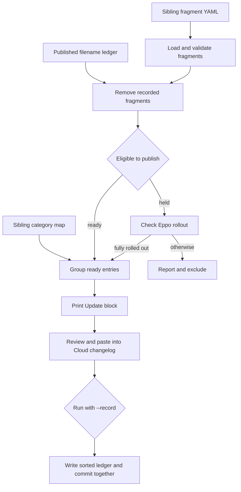

# LangSmith Changelog Publication

LangSmith has two publication paths with different source material and cadence:

- The Cloud/Fleet page, `src/langsmith/changelog.mdx`, contains weekly `<Update>` blocks. `scripts/assemble_changelog.py` turns per-PR YAML fragments from the sibling `langchainplus` checkout into a paste-ready block for this page.
- The self-hosted page, `src/langsmith/self-hosted-changelog.mdx`, is a release-note stream of Helm-chart releases. Its client-side enhancement builds a navigation index for visible stable minor releases; it does not assemble or alter release-note content.

The assembler is a **curation aid**, not an autonomous publisher. It prints MDX to standard output for review, while its categorized reports go to standard error. A weekly changelog agent reviews the block and opens a documentation PR for human approval.

## Cloud and Fleet weekly assembly

### Inputs, ownership, and durable state

By default, the assembler reads top-level `*.yaml` fragments from the sibling checkout at `../langchainplus/.changelog` and a component category map in that same directory. It ignores fragment names beginning with `_` or `TEMPLATE`; it also resolves each candidate and rejects a path that escapes the fragment directory. This makes the fragment directory and its schema/category map upstream inputs, not files to recreate in this repository.

The repository-owned publication ledger is `scripts/.changelog_published.txt`. It is the duplicate-prevention record: a fragment's presence in a `published/` directory is not evidence that it shipped. The ledger stores fragment **filenames**, ignoring comments and blank lines; its header explicitly requires that it be committed in the same PR as the published changelog entry and not hand-edited.



This is the Cloud/Fleet publication lifecycle. The ledger changes only for ready fragments rendered by a `--record` run.

A valid fragment requires a nonempty `title`, `body`, and `components`, plus `status: ready` or `status: held`. Held fragments must name a feature flag. Invalid fragments are reported and excluded. After ledger filtering, the first component found in the category map selects the rendered section and optional subgroup; unmapped entries are rendered under `Other`. Sections follow the category map's order, while ungrouped entries precede named groups.

### Eligibility and Eppo gate

`ready` fragments are renderable. A `held` fragment stays out unless its named Eppo flag is fully rolled out. Without `EPPO_API_KEY` in the environment, held entries are deliberately reported but excluded.

With the environment variable available, the assembler makes read-only GET requests to the hard-coded HTTPS Eppo API host. Its rollout predicate requires all of the following:

1. An active production environment exists.
2. The first non-targeted, non-archived allocation for that environment has full exposure (`1` or `100`).
3. That allocation serves exactly one nonzero-weight variation.
4. For a Boolean flag, that variation is the `true` variation.

Targeted allocations do not prove general availability: users who do not match them fall through to the first catch-all allocation. A missing flag becomes an error rather than a publish; a lookup failure warns and leaves held entries held. The API index is currently one page: if Eppo reports a larger total than the returned items, the script warns that a later-page flag may be reported as missing rather than silently treating it as rolled out.

> **Security boundary:** Set `EPPO_API_KEY` only in the process environment. Do not pass it as a command-line argument, put it in a committed file, or expose it in a changelog fragment. The CLI has no token argument; requests send the environment value only as `X-Eppo-Token` to the fixed `https://eppo.cloud/api/v1` base.

### Rendered output and operational procedure

The output is one Mintlify `<Update>` block with the requested (or calculated Monday-through-Friday) label and an RSS title of `<date> - LangSmith Cloud update`. Each eligible fragment becomes a bullet. If a fragment supplies `docs_link` and its body does not already contain a Markdown link, the renderer appends a `Learn more` link.

Run from the repository root. The normal invocation is a dry run: it emits only the paste candidate on standard output and does not write the ledger.

```bash
uv run python scripts/assemble_changelog.py
uv run python scripts/assemble_changelog.py --week-label "June 15-19, 2026"
```

Use `--rss-date` to override the ISO date independently. Review the rendered grouping, wording, links, and the `HELD`, `ERROR`, `INVALID`, and already-published reports before pasting the block into the Cloud tab in `src/langsmith/changelog.mdx`.

Once the exact update is ready for the documentation PR, record the rendered filenames and commit the resulting ledger edit in that **same** PR as the pasted `<Update>` block:

```bash
uv run python scripts/assemble_changelog.py --week-label "June 15-19, 2026" --record
```

`--record` unions rendered filenames with the existing ledger, retains comment lines, and rewrites names sorted and unique. It does not record held, invalid, errored, or already-recorded fragments. The script constrains an overridden `--ledger` path to the repository root, so a symlink or traversal path outside this checkout is refused.

Two stateful or diagnostic modes deserve extra care:

```bash
uv run python scripts/assemble_changelog.py --check-flag my-eppo-flag-key
uv run python scripts/assemble_changelog.py --promote
```

`--check-flag` requires the environment token, prints the selected flag JSON and rollout verdict, and exits without assembly. `--promote` rewrites every held fragment that qualifies during that run to `status: ready` in the sibling fragment checkout; use it only when that upstream state change is intended and review it separately. Neither mode makes a Cloud page change by itself.

## Self-hosted changelog navigation

Self-hosted notes are authored directly in `src/langsmith/self-hosted-changelog.mdx` as `<Update>` blocks with release headings such as `## langsmith-0.17.0`, release tags, version details, and Helm-chart download links. The browser enhancement in `src/changelog-navigation.js` limits itself to `/langsmith/self-hosted-changelog`.

On that route it finds visible `h2` elements whose IDs match exactly `langsmith-<major>-<minor>-0`. It adds a **Minor releases** index linking to those headings, marks them for the larger chapter styling, and intentionally excludes patches, release candidates, categories, and hidden headings. The index appears at the start of content and, when `#content-side-layout` exists, also in the sidebar. Without that layout it marks the inline index as a fallback.

A `MutationObserver` watches route and DOM changes, and `requestAnimationFrame` coalesces bursts into one enhancement pass. The navigation stores its heading-ID signature and does not rebuild unchanged link content. When a filter leaves no eligible headings it removes generated indexes; when navigation leaves the self-hosted route it also removes generated heading classes. CSS gives matching chapters a prominent top border, styles the index and focus state in light and dark themes, and hides the ordinary inline duplicate on wide layouts when a sidebar is present.

## Validation and change guidance

Use the focused test that corresponds to the changed boundary:

```bash
make test TEST_FILE=tests/unit_tests/test_assemble_changelog.py
node --test tests/changelog-navigation.test.js
```

The Python test uses temporary fragment and ledger files. It verifies comment/blank-line handling, absent-ledger behavior, sorted de-duplicated recording, skipping recorded fragments, no recording without `--record`, and rejection of an out-of-repository ledger path. It does **not** establish that the sibling fragment set, Eppo response, or a manually pasted block is correct.

The Node test runs the navigation script in a minimal DOM. It covers exact stable-minor selection, visible-heading filtering, sidebar and inline fallback mounting, animation-frame coalescing, no-op updates for unchanged headings, cleanup on route changes, and filter-driven removal/recreation. It does not prove Mintlify's production DOM or CSS rendering.

For a change that affects the final MDX, navigation styling, anchors, or the generated documentation tree, add the rendered-site boundary described in [Testing Overview](/openwiki/testing/test-overview.md), such as `make broken-links-with-anchors`. See [CLI Tools](/openwiki/operations/cli-tools.md) for build and preview behavior, [GitHub Actions and CI/CD](/openwiki/integrations/github-actions.md) for general CI boundaries, and [Quickstart](/openwiki/quickstart.md) for local setup.

## Safe publication checklist

1. Ensure the sibling `langchainplus` checkout is available; run the assembler without `--record`.
2. Fix or defer invalid fragments upstream; do not bypass a held entry merely because it has a flag name.
3. If eligibility is uncertain, use `--check-flag` with an environment-provided token. Never disclose the token.
4. Review the candidate `<Update>` and reports, then paste the reviewed block into the Cloud tab of `src/langsmith/changelog.mdx`.
5. Run the matching `--record` command, inspect the sorted ledger diff, and commit it with the MDX change in one PR.
6. Run the focused Python test for assembler/ledger changes; run the Node test for self-hosted navigation changes; use a rendered-site check when changing public MDX, headings, or CSS.
