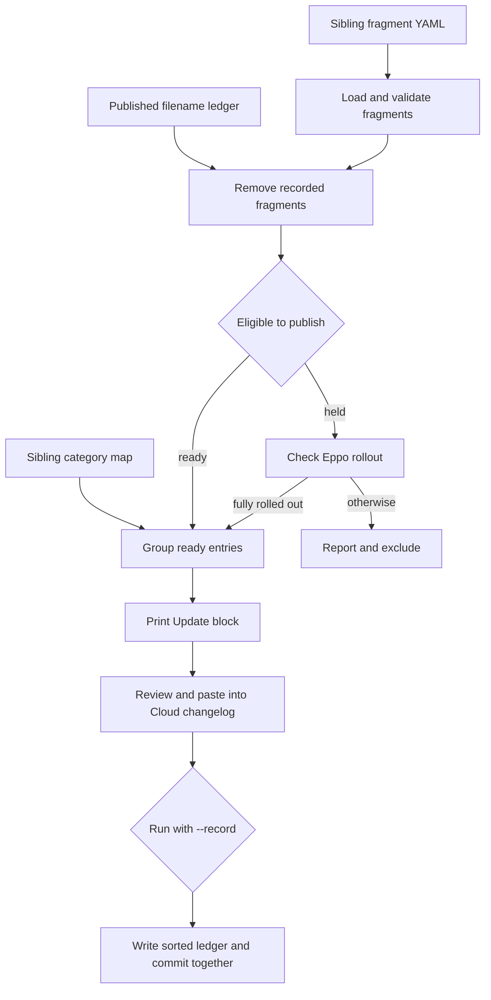

# LangSmith Changelog Publication

LangSmith has two intentionally separate changelog paths:

- `src/langsmith/changelog.mdx` is the weekly Cloud and Fleet stream. `scripts/assemble_changelog.py` turns per-PR YAML fragments from the sibling `langchainplus` checkout into a paste-ready `<Update>` block.
- `src/langsmith/self-hosted-changelog.mdx` is an independently authored release-note stream for self-hosted Helm charts. Its browser enhancement builds navigation only; it neither assembles nor changes release-note content.

The assembler is a **curation aid, not an autonomous publisher**. It prints MDX on standard output and reports on standard error. The weekly changelog agent runs it on Fleet, reviews the candidate, and opens a documentation PR for human approval. The agent, the sibling checkout, and the Eppo credential are outside this repository's publication authority.

## Cloud and Fleet weekly assembly

### Inputs, ownership, and durable state

By default, the assembler reads top-level `*.yaml` fragments from the sibling checkout at `../langchainplus/.changelog` and the component category map in that directory. It ignores names beginning with `_` or `TEMPLATE`, and resolves each candidate before accepting it so a symlink or traversal cannot escape the fragment root. The fragment schema and category map are upstream inputs; do not recreate or alter them from this repository.

The repository-owned duplicate-prevention state is `scripts/.changelog_published.txt`. The ledger contains fragment **filenames**, ignoring comments and blank lines. A fragment's presence in a sibling `published/` directory does not establish that it shipped. Its header requires the ledger to be committed in the same PR as the corresponding changelog entry and not edited manually.



This is the Cloud/Fleet publication lifecycle. Printing a block, pasting it, opening a PR, and merging remain human-controlled steps; `--record` only advances the local duplicate-prevention record for fragments rendered in that invocation.

A valid fragment has a nonempty `title`, `body`, and `components`, plus `status: ready` or `status: held`; held entries also require `flag`. Invalid fragments are reported and excluded. After ledger filtering, the first fragment component that appears in the category map selects its section and optional group. Unmapped entries go in `Other`; sections preserve map order and ungrouped bullets precede named groups.

### Eligibility and the Eppo boundary

`ready` fragments render immediately. A `held` fragment remains excluded unless its named Eppo flag is fully rolled out. With no `EPPO_API_KEY`, it is reported as held rather than promoted.

When the environment variable is present, the script makes read-only GET requests to the fixed HTTPS `https://eppo.cloud/api/v1` host. A flag qualifies only when all of these conditions hold:

1. A production environment is active.
2. Its first non-targeted, non-archived catch-all allocation has full exposure (`1` or `100`).
3. That allocation has exactly one variation with nonzero weight.
4. For a Boolean flag, that variation is the `true` variation.

Targeted allocations do not establish general availability because unmatched users fall through to the catch-all allocation. A missing flag is an error, not a publish. Lookup failures warn and keep held fragments out. The flag index reads one API page; if an envelope reports more flags than it returns, the script warns that a later-page flag can be reported as missing rather than silently qualifying it.

> **Credential boundary:** Provide `EPPO_API_KEY` only through the process environment. Do not put it in a fragment, committed file, or command-line argument. The CLI has no token option and sends the environment value only as `X-Eppo-Token` to the fixed Eppo host. Possession of this credential determines only whether held entries can be evaluated; it does not publish a changelog.

### Render and record procedure

The renderer emits one Mintlify `<Update>` block. Its default label covers the current Monday-through-Friday week, while `--week-label` and `--rss-date` override the label and RSS date independently. The RSS title is `<date> - LangSmith Cloud update`. Each eligible fragment becomes a bullet; if `docs_link` is present and the body has no Markdown link, the renderer appends `Learn more`.

Run from the repository root. A normal invocation is a dry run: it writes a paste candidate to stdout and does not change the ledger.

```bash
uv run python scripts/assemble_changelog.py
uv run python scripts/assemble_changelog.py --week-label "June 15-19, 2026"
```

Review rendered wording, grouping, and links, together with `HELD`, `ERROR`, `INVALID`, and already-published reports on stderr. Paste the reviewed block into the Cloud tab in `src/langsmith/changelog.mdx`; no assembler mode performs that edit.

Only after the exact block is ready for the documentation PR, record the rendered filenames and commit the ledger edit in the **same** PR:

```bash
uv run python scripts/assemble_changelog.py --week-label "June 15-19, 2026" --record
```

`--record` unions rendered filenames with the ledger, keeps comment lines, and rewrites names sorted and unique. It does not record held, invalid, errored, or already-recorded fragments. An overridden `--ledger` is resolved inside the repository root; a symlink or traversal outside the checkout is refused.

Two non-default modes have distinct effects:

```bash
uv run python scripts/assemble_changelog.py --check-flag my-eppo-flag-key
uv run python scripts/assemble_changelog.py --promote
```

`--check-flag` requires the environment token, prints the selected flag JSON and rollout verdict, and exits without assembling a weekly block. `--promote` rewrites each qualifying held fragment to `status: ready` in the **sibling** fragment checkout. Use it only when that upstream state change is intended and review it separately. Neither command edits or publishes the Cloud changelog.

### Coverage audit

`scripts/audit_changelog_coverage.py` is a separate reconciliation backstop, not part of assembly. It queries merged PRs in `langchain-ai/langchainplus` through authenticated, read-only `gh` commands over a contiguous date window (14 days by default), narrowing searches to seven-day subwindows to avoid GitHub's result cap. It reports candidate user-facing `feat` and `fix` PRs that lack either a fragment in the PR diff or a matching `pr:` field; a human dispositions borderline items through an ignore file. It deliberately over-reports rather than silently dropping potential user-facing changes.

## Self-hosted changelog release notes and navigation

Self-hosted notes are authored directly as `<Update>` blocks in `src/langsmith/self-hosted-changelog.mdx`. The current structure includes tagged stable and preview releases, version details, release-specific changes, and Helm-chart download links. For example, the stable `langsmith-0.17.0` release is presented alongside stable patch releases and preview release candidates. This is a different release cadence and source of truth from the weekly Cloud/Fleet fragment workflow.

`src/changelog-navigation.js` enhances only `/langsmith/self-hosted-changelog`. On that route, it selects visible `h2` elements whose rendered IDs match exactly `langsmith-<major>-<minor>-0`: stable minor-release chapters. Patches, release candidates, categories, and hidden headings are intentionally excluded. It marks selected headings and builds a **Minor releases** link index at the start of `#content`; when `#content-side-layout` exists, it also builds a sidebar index. Without that layout, the inline index is explicitly a fallback.

A `MutationObserver` watches path and DOM changes, while `requestAnimationFrame` coalesces bursts into one enhancement pass. A heading-ID signature avoids rebuilding unchanged indexes. When there are no eligible visible headings, generated indexes are removed. Leaving the self-hosted route also removes generated heading classes. The stylesheet supplies the chapter hierarchy, responsive inline/sidebar behavior, keyboard focus styling, and dark-mode colors; on wide layouts, it hides the non-fallback inline duplicate when a sidebar is available.

## Validation and safe change guidance

Run the focused test for the boundary changed:

```bash
make test TEST_FILE=tests/unit_tests/test_assemble_changelog.py
node --test tests/changelog-navigation.test.js
```

The Python test uses temporary fragment and ledger files. It covers comment/blank-line parsing, a missing ledger, sorted de-duplicated recording, skipping recorded fragments, no recording without `--record`, and refusal of an out-of-repository ledger path. It does not prove the sibling fragment set, live Eppo state, or a manually pasted MDX block.

The Node test runs the navigation script in a minimal DOM. It covers exact stable-minor and visible-heading selection, sidebar and inline fallback mounting, animation-frame coalescing, no-op updates for unchanged headings, route cleanup, and filter-driven removal/recreation. It does not prove Mintlify's production DOM or rendered CSS.

For a change to public MDX, headings, navigation styling, anchors, or the generated documentation tree, also run the rendered-site check in [Testing Overview](/openwiki/testing/test-overview.md), such as `make broken-links-with-anchors`. See [CLI Tools](/openwiki/operations/cli-tools.md) for build and preview behavior, [GitHub Actions and CI/CD](/openwiki/integrations/github-actions.md) for general CI boundaries, and [Quickstart](/openwiki/quickstart.md) for local setup.

## Safe publication checklist

1. Ensure the sibling `langchainplus` checkout is available; run the assembler without `--record`.
2. Fix or defer invalid fragments upstream. Do not bypass a held entry merely because it names a flag.
3. If eligibility is uncertain, use `--check-flag` with an environment-provided token; never disclose the token.
4. Review the candidate and stderr reports, then paste the reviewed block into `src/langsmith/changelog.mdx`.
5. Run the matching `--record` command, inspect the sorted ledger diff, and commit it with the MDX update in one PR.
6. Run the focused Python test for assembler or ledger changes, the Node test for self-hosted navigation changes, and a rendered-site check for public MDX, heading, or CSS changes.
