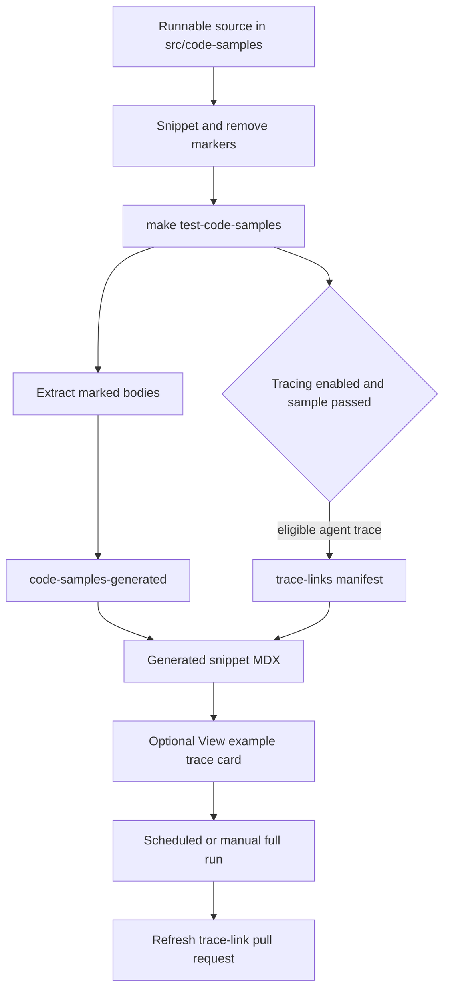

## Purpose and ownership

Runnable examples have one editable source of truth: supported-language files below `src/code-samples/`, organized by product such as `langchain/`, `langgraph/`, `deepagents/`, and `langsmith/`. The same file is both a program the repository executes and a container for one or more documentation regions. This keeps the code a reader sees coupled to a real execution path rather than to a hand-maintained copy.

Do **not** edit `src/code-samples-generated/` or the MDX under `src/snippets/code-samples/` by hand. The former is a gitignored extraction intermediate; the latter is regenerated output used by documentation pages. Change the runnable sample, validate it, then run `make code-snippets` and commit the resulting MDX changes when applicable. An MDX page consumes a generated file by importing it and rendering its component in the appropriate language section.



This flow shows that source execution precedes extraction, while optional trace metadata is incorporated during MDX generation and a trusted full run may publish the refreshed artifacts.

## Author a source sample

Use `.py`, `.ts`, `.java`, `.kt`, `.go`, or `.sh` files. Delineate each visible region with a comment-line `:snippet-start: <id>` and a matching `:snippet-end:`: Python and shell use `#`; TypeScript, Java, Kotlin, and Go use `//`. The extractor is deliberately line based, so it recognizes those markers without parsing TypeScript and is not confused by `/**` inside a string. A missing end marker or an unclosed remove region makes extraction fail.

Snippet IDs must be unique and kebab-case in practice, and **must end in the language suffix** that corresponds to the source: `-py`, `-js`, `-java`, `-kt`, `-go`, or `-sh`. The MDX generator uses that suffix to select the emitted fence language and silently skips extracted files whose IDs do not have the expected suffix. Thus a syntactically extractable but incorrectly suffixed marker produces no generated MDX.

Use `:remove-start:` / `:remove-end:` blocks for execution harness code that should not appear in documentation. They can hold assertions, credentials-only setup, or a blocking operation that would be inappropriate in the displayed fragment. The runnable file must still execute the visible snippet body: do not put `SystemExit`, `process.exit`, or `exit 0` before it. Place a harness after the snippet where possible so it can assert values the shown code created.

A Python file can normally collocate several related regions and share imports or helpers. A TypeScript file is executed as one module, however: all marked regions and remove blocks share module scope. Split independently runnable TypeScript snippets into separate files when they would redeclare imports, `const`/`let`, classes, functions, or top-level setup. Keep imports that readers need inside the visible region; do not import the same binding in both the snippet and a remove block.

The generator also accepts optional first-line `:codegroup-tab:` and `:codegroup-fence-mods:` markers, strips them from code, and uses them to shape the emitted Mintlify fence. For Python and TypeScript only, recognized `model` string forms expand into the configured seven-provider `<CodeGroup>` unless a preceding `# KEEP MODEL` or `// KEEP MODEL` marker preserves that occurrence. These are presentation transformations; they do not replace source execution.

## Validate before generating

Run the narrowest executable check while editing, then the whole suite when the change has broad dependency or ordering effects:

```bash
make test-code-samples FILES="src/code-samples/langchain/return-a-string.py"
make test-code-samples
make lint
```

`FILES` is a space-separated list. The runner rejects paths outside the source tree and ignores unsupported extensions; without it, it selects supported files recursively (excluding `node_modules` and `__pycache__`) in language groups: Python, TypeScript, Java, Kotlin, Go, then shell. It executes Python through `uv run python`, TypeScript through `npx tsx`, Go through `go run`, shell through `bash`, and Java/Kotlin as JBang single-file programs pinned to Java 21. TypeScript, Go, and shell run from `src/code-samples/`, where `package.json` and `go.mod` provide shared dependencies.

Samples inherit the environment and may intentionally contact providers or PostgreSQL, so this is a live integration check rather than part of socket-isolated `make test`. The per-sample timeout is `CODE_SAMPLE_TIMEOUT_SECONDS`, defaulting to 1,200 seconds. CI supplies pgvector PostgreSQL and provider credentials; locally, PostgreSQL helpers first use `POSTGRES_URI`, then attempt a pgvector testcontainer, Docker, and finally the default local URI.

### Failure and retry semantics

A timeout, absent toolchain executable, or ordinary nonzero exit records that sample as failed and makes the runner return nonzero after reporting output. The one exception is a detected LangSmith API rate limit: output containing `429` plus a rate-limit phrase is retried up to three total attempts with 15-second delays. A sample still rate-limited after those attempts is reported as **skipped**, not failed. Treat that as unexecuted validation, not evidence that the example works. A successful sample is the only one considered for trace collection.

## Extract and generate

After a focused program passes, run:

```bash
make code-snippets
```

The target first invokes `scripts/extract_code_snippets.py`, which removes test-only regions, dedents the marked body, normalizes output newlines, and writes files named `<source-stem>.snippet.<snippet-id>.<extension>` below `src/code-samples-generated/`. It then invokes `scripts/generate_code_snippet_mdx.py`, which reads every supported extracted snippet, wraps it in an appropriate fenced block or model `CodeGroup`, applies any trace-link card, and writes `<snippet-id>.mdx` under `src/snippets/code-samples/` while preserving generated subdirectories.

For rapid iteration, restrict only extraction with a space-separated, repository-relative list under `src/code-samples/`:

```bash
CODE_SNIPPET_SOURCES="src/code-samples/langsmith/trace.java" make code-snippets
```

A partial run validates that each specified path exists, is under the source root, and has a supported extension. It removes and replaces generated intermediate files for only those source stems; intermediates for other stems remain. Crucially, MDX generation is still a full scan of all existing intermediates, so inspect all generated MDX changes rather than assuming the second stage was partial. A full extraction clears supported intermediate files first and rebuilds them from all sources.

## Optional public trace links

`make update-code-sample-traces` enables `CODE_SAMPLE_TRACING=1`, defaults `LANGSMITH_PROJECT` to `docs-code-samples`, runs the samples, and then regenerates MDX. With tracing enabled, the runner sets `LANGSMITH_TRACING=true` for child programs. After each successful sample, collection considers the source's marker count:

- No `:snippet-start:` marker has no trace link.
- Exactly one marker is eligible. The collector flushes and polls LangSmith for a recent root run, preferring agent/LangGraph-like names and falling back to a chain root with an LLM child. When one is found, it publicly shares the run and stores the source, URL, run/trace IDs, run name, and update time under that snippet ID in `src/code-samples/trace-links.json`.
- More than one marker is deliberately ineligible. The source and IDs are recorded in `skipped_multi_snippet`, and any corresponding stale single-snippet entries are removed. Split the source into one-snippet files before expecting a trace CTA.

Collection polls at most six times with a two-second delay, allowing for upload delay and clock skew. No qualifying agent root is a no-link outcome, whereas an exception during trace collection is a runner failure even if the sample itself passed. During MDX generation, a manifest URL produces or replaces a `View example trace` Mintlify Card; absent URLs remove a previous trailing trace CTA. Public sharing is therefore an intentional publication action—only run it with the appropriate LangSmith credentials and with examples suitable for public visibility.

## CI operation and maintenance

The **Test Code Samples** workflow runs on relevant pull requests, manual dispatch, and at 00:00 UTC on the first day of each month. It skips fork PRs because samples can require repository secrets. Internal PRs calculate the merge-base diff and test only changed supported sample files; manual and scheduled runs test all samples. The workflow has a 60-minute PR limit and a 90-minute full-run limit, provisions Python/uv, Node 20, Java/JBang, Go, and PostgreSQL, and cancels obsolete runs for the same workflow/ref.

Only manual and scheduled full runs enable tracing. If all tests succeed, they run `make code-snippets`; only if that succeeds does the trusted workflow preserve `trace-links.json` and generated MDX, apply them to `chore/refresh-code-sample-traces`, and act on a diff. It appends to an existing open PR on that branch, or creates the branch and a PR targeting `main`; no diff produces no commit or PR update. Ordinary PR checks neither refresh traces nor write repository state.

A separate workflow observes completed scheduled Test Code Samples runs. It opens a Linear issue only when that scheduled producer failed or was cancelled, attaching the run URL. Manual, pull-request, and successful scheduled outcomes do not create a ticket. Use the run logs to distinguish an ordinary source/toolchain failure, an environmental service problem, a rate-limit skip, and a trace-publication failure before retrying.

## Change checklist

1. Edit the runnable source under `src/code-samples/`; never hand-edit generated snippet MDX.
2. Give every visible region a matched, language-correct marker and an ID with the required language suffix.
3. Keep the displayed code executable, and move only test-only or blocking tails into remove blocks.
4. Avoid TypeScript module-scope collisions by splitting independent examples when necessary.
5. Run the focused `make test-code-samples FILES="..."` command, resolve real failures, then run `make code-snippets` and inspect generated MDX.
6. Use partial extraction only as an iteration optimization; use a full run before relying on complete generated state.
7. Request trace publication only for a successful, single-snippet agent sample and review the public-link implications.

## Related pages

- [GitHub Actions and CI/CD](/openwiki/integrations/github-actions.md)
- [Adding and Maintaining Documentation Pages](/openwiki/operations/adding-pages.md)
- [Agent Authoring Skills](/openwiki/operations/agent-skills.md)
- [CLI Tools](/openwiki/operations/cli-tools.md)
- [Quickstart](/openwiki/quickstart.md)
- [Testing Overview](/openwiki/testing/test-overview.md)
