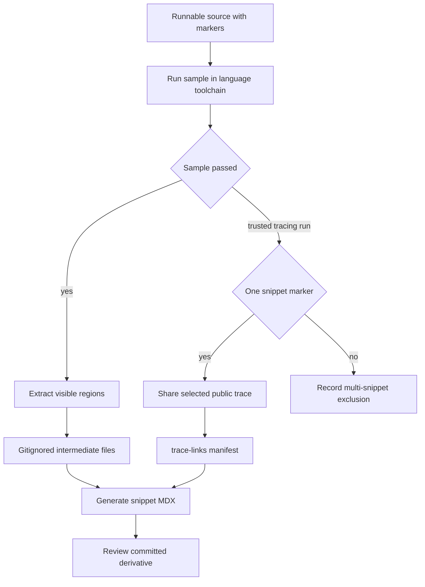

## Ownership and lifecycle

Runnable programs in `src/code-samples/` are the editable source of truth. `src/code-samples-generated/` is a gitignored extraction intermediate, while committed MDX below `src/snippets/code-samples/` is a derivative consumed by documentation. Edit the runnable program, execute it, regenerate the derivative, and review its diff; do not hand-author generated snippet MDX.



This flow distinguishes normal executable-documentation generation from the credentialed publication branch that shares a public trace.

## Author an executable sample

Supported sample extensions are `.py`, `.ts`, `.java`, `.kt`, `.go`, and `.sh`. Put matched `:snippet-start: <id>` and `:snippet-end:` lines around the code readers should see: Python and shell markers use `#`; TypeScript, Java, Kotlin, and Go use `//`. The extractor is line based, accepts indented marker lines, strips matched `:remove-start:` / `:remove-end:` regions from the displayed body, dedents output, and rejects unclosed snippet or remove regions.

A snippet ID must have the suffix for its source language: `-py`, `-js`, `-java`, `-kt`, `-go`, or `-sh`. Generation uses this suffix to choose a fence language and skips an extracted file whose ID does not have the expected suffix. The ID also determines the MDX filename, so make it unique and descriptive.

A remove block is for non-display harness logic, such as an assertion or a blocking execution tail. The program must execute the visible imports, construction, and invocation before it exits; an early `SystemExit`, `process.exit`, or `exit 0` only establishes parsing, not that the documented path works.

### Scope, dependencies, and the skills-reload samples

A file can hold related snippets and shared setup. This works especially well in Python, where the skills source contains setup, other skills examples, and the three new reload snippets: invocation with `skills_metadata` reset, explicit state update, and middleware that requests a later reload. Because it has many markers, `skills.py` cannot receive a single-snippet public trace.

TypeScript is executed as one module, so every visible region and remove block shares top-level imports and bindings. Split independently runnable TypeScript snippets into separate files when imports or `const`, `let`, class, or function names would collide. Keep an import that readers need inside the visible snippet; do not duplicate it in a remove block.

`skills-reload.ts` currently takes the opposite colocation tradeoff: shared agent setup and `agentEditedSkills` are in an initial remove block, followed by three marked JavaScript snippets (`skills-reload-invoke-js`, `skills-reload-update-state-js`, and `skills-reload-middleware-js`). Its `process.exit(0)` occurs before those regions, so the sample runner does **not** execute those visible reload statements. Treat that as a validation gap when changing this example: move the harness after the documented code or otherwise exercise the visible paths before claiming runtime validation. Its multiple markers also make it ineligible for a public trace until split.

Python dependencies are supplied by the repository `pyproject.toml` and locked environment; it includes `deepagents[quickjs]`, LangGraph, LangSmith, provider integrations, and `deepagents-acp`. TypeScript samples instead resolve from the shared `src/code-samples/package.json`, whose lockfile records the install graph; `make test-code-samples` installs that package before running samples. Add runtime dependencies at these shared owners rather than per-sample setup.

All Go examples similarly share `src/code-samples/go.mod` and `go.sum`. The runner invokes `go run` from `src/code-samples/`, and CI selects Go from that module file. Update the shared module and checksums rather than creating a module per example.

### Presentation directives and model variants

The first extracted line may be `:codegroup-tab:` to name a Mintlify tab; `:codegroup-fence-mods:` may be the next line or the first line itself to supply fence modifiers. Generation removes these directives from the emitted code.

For eligible Python and TypeScript model strings, the generator creates a seven-provider Deep Agents `<CodeGroup>`. `# KEEP MODEL` or `// KEEP MODEL` immediately before an occurrence pins it and removes the directive. It deliberately does not vary embeddings-model arguments, model IDs containing `embedding`, or provider-specific constructor models such as `ChatOpenAI`, because inserting a routable `provider:model` value would make those examples invalid. The focused generator tests verify that RAG examples retain their embeddings model while varying the agent model, and that kept or provider-specific models remain single-fence output.

## Run and regenerate

Start with the changed program, then broaden when shared dependencies or execution behavior changed:

```bash
make test-code-samples FILES="src/code-samples/deepagents/skills-reload.ts"
make test-code-samples
make test TEST_FILE=tests/unit_tests/test_generate_code_snippet_mdx.py
make code-snippets
```

`FILES` is an explicit space-separated list. The runner warns and skips missing, unsupported, or out-of-tree paths; without it, it recursively selects eligible samples, excluding `node_modules` and `__pycache__`, in Python, TypeScript, Java, Kotlin, Go, then shell order. It uses `uv run python`, `npx tsx`, JBang with Java 21, `go run`, and `bash` respectively. TypeScript, Go, and shell run from `src/code-samples/`; Python and JBang run from the repository root. Processes inherit environment variables, so samples can require provider credentials or `POSTGRES_URI` and can call live services. The default timeout is 1,200 seconds and `CODE_SAMPLE_TIMEOUT_SECONDS` overrides it.

Ordinary nonzero exits, timeouts, missing executables, and trace-collection failures fail the runner. LangSmith HTTP 429 is the limited exception: it is retried three total times with 15-second delays and then reported as skipped, rather than failed. A skipped sample has not been validated and cannot publish a trace.

`make code-snippets` first runs the extractor, then the MDX generator. Extraction writes files named `<source-stem>.snippet.<snippet-id>.<extension>` under `src/code-samples-generated/`; generation scans those intermediates, writes the corresponding `<snippet-id>.mdx`, and adds a trace CTA only when the manifest has a URL.

For local iteration, limit extraction only:

```bash
CODE_SNIPPET_SOURCES="src/code-samples/deepagents/skills-reload.ts" make code-snippets
```

`CODE_SNIPPET_SOURCES` accepts existing supported files below `src/code-samples/`. A full extraction clears supported intermediates and rebuilds them; a partial extraction replaces only selected source stems. MDX generation still scans all remaining intermediates, so use a full run before relying on repository-wide generated output.

## Public traces are trusted publication

`make update-code-sample-traces` is not routine validation. It requires `LANGSMITH_API_KEY`, enables tracing, chooses `LANGSMITH_PROJECT` or `docs-code-samples`, runs the samples, and regenerates MDX. It calls LangSmith's sharing API to produce a public URL. Use authorized credentials and only inputs, outputs, and run metadata safe for public exposure.

For a successful source with exactly one marker, the collector flushes and polls for a recent agent-like root run in the configured project, shares the selected run, and records its URL and run metadata in `src/code-samples/trace-links.json`. It prefers agent, Deep Agent, LangGraph, or `create_agent`-like roots, with a chain-plus-LLM-child fallback. Files with multiple markers are recorded in `skipped_multi_snippet`; their stale per-snippet links are removed. During regeneration, a manifest URL appends or replaces the `View example trace` card, and no URL removes a stale trailing card.

## CI trust boundary and refresh

The **Test Code Samples** workflow runs for relevant pull requests, manual dispatch, and at 00:00 UTC on the first day of each month. It skips fork pull requests because samples may need secrets. Internal pull requests compute a merge base and run only changed eligible sample files; manual and scheduled events run all samples. CI provisions Python and uv, Node 20, Java 21 and JBang, Go, and pgvector PostgreSQL.

Only manual and scheduled full runs enable tracing and public sharing. After a successful traced full run, CI regenerates the trace manifest and snippet MDX, compares only those artifacts, and updates or creates the deterministic `chore/refresh-code-sample-traces` pull request when there is a diff. Pull-request validation neither shares traces nor writes refresh artifacts. A separate workflow opens a Linear issue only when a scheduled sample run fails or is cancelled.

## Change checklist

1. Change the runnable source, not `src/snippets/code-samples/` directly.
2. Use matched language-correct markers and a unique ID with its required suffix.
3. Make the runner execute the visible path before any terminating or blocking harness behavior.
4. Respect TypeScript module scope; use the shared Python environment, TypeScript package and lockfile, or Go module for new dependencies.
5. Run the focused sample, run the generator unit test when model CodeGroup behavior changes, then run `make code-snippets` and review generated MDX.
6. Use partial extraction only for iteration; run a full extraction for complete generated state.
7. Treat local trace refresh and trusted CI refresh as deliberate, credentialed, public-publication actions.

## Related pages

- [Build System Architecture](/openwiki/architecture/build-system.md)
- [GitHub Actions and CI/CD](/openwiki/integrations/github-actions.md)
- [Adding and Maintaining Documentation Pages](/openwiki/operations/adding-pages.md)
- [Agent Authoring Skills](/openwiki/operations/agent-skills.md)
- [Testing Overview](/openwiki/testing/test-overview.md)
- [Versioned Content](/openwiki/workflows/versioned-content.md)
