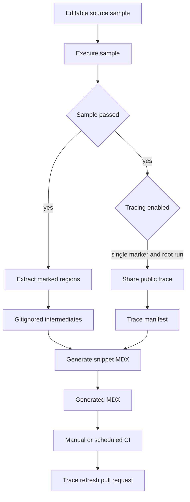

## Purpose and ownership

Runnable documentation examples have one editable source of truth: supported-language files below `src/code-samples/`. A source file is both an executable program and a container for one or more documentation regions. This makes the code displayed to readers subject to a real toolchain and dependency check rather than maintained as an independent copy.

Treat `src/code-samples/` as source. Treat `src/code-samples-generated/` and `src/snippets/code-samples/` as derivative artifacts: the former is a gitignored extraction intermediate and the latter is generated MDX committed for documentation consumption. Edit the runnable sample, run it, regenerate, and review the MDX diff; do not hand-edit a generated snippet. Documentation pages import the generated MDX component in their language-specific content.



This flow separates executable source from derived presentation artifacts, and makes public trace sharing a gated publication path.

## Author an executable sample

Supported source extensions are `.py`, `.ts`, `.java`, `.kt`, `.go`, and `.sh`. Mark visible code with a matched `:snippet-start: <id>` and `:snippet-end:` comment line: Python and shell use `#`; TypeScript, Java, Kotlin, and Go use `//`. The line-based extractor intentionally avoids a TypeScript parser, so comment-like text such as `/**` in a string does not disrupt marker handling. It accepts indented markers, strips `:remove-start:` / `:remove-end:` regions from a snippet body, dedents the result, normalizes line endings, and fails extraction if either kind of region is unclosed.

A snippet ID must end with its emitted language suffix: `-py`, `-js`, `-java`, `-kt`, `-go`, or `-sh`. The generator maps that suffix to its fence language and skips an extracted file with a mismatched suffix. Use unique, descriptive kebab-case IDs because the ID becomes the MDX filename.

Use remove blocks for harness assertions, credentials-only setup, or blocking tails that must execute in the source but should not appear in documentation. The visible code must still run before any `SystemExit`, `process.exit`, or `exit 0`; a successful early exit only proves parsing, not imports, signatures, constructors, or configuration.

### Scope and layout rules

One file may contain related regions and one execution harness. Python can commonly share imports and helpers in such a file. TypeScript samples execute as one module, so every visible region and remove block shares module scope. Split independently runnable TypeScript examples into separate source files when they would duplicate imports or top-level `const`, `let`, class, function, or setup bindings.

The refreshed Deep Agents skills sources illustrate both sides of this boundary. `skills.py` keeps related Python setup, approval, writable-store, and invocation regions in one runnable file, so it is a multi-snippet trace exclusion. The corresponding TypeScript approval, source-composition, and writable-store examples each use one marker and a trailing assertion block in separate files. The LangGraph multiple-schemas TypeScript sample follows the same pattern: a visible graph construction and invocation with a hidden assertion harness. This structure keeps displayed code executable while permitting a single-snippet file to be considered for tracing.

### Presentation controls

An optional first line inside a snippet may be `:codegroup-tab:`; `:codegroup-fence-mods:` may follow it, or be the first line on its own. The generator removes these presentation directives from code and uses them to build the Mintlify fence. For Python and TypeScript, recognized `model` string forms can instead produce a seven-provider Deep Agents `<CodeGroup>`; `# KEEP MODEL` or `// KEEP MODEL` immediately before an occurrence removes the marker but preserves that model occurrence. These are output transformations only and do not weaken the requirement to execute the source sample.

## Execute and diagnose samples

Use the narrowest focused check during authoring, then run the full suite when shared dependencies or ordering may matter:

```bash
make test-code-samples FILES="src/code-samples/langchain/return-a-string.py"
make test-code-samples
make lint
```

`FILES` is a space-separated explicit list. The runner warns and skips missing, unsupported, or out-of-tree paths; without it, it recursively selects eligible files under `src/code-samples/`, excluding `node_modules` and `__pycache__`, in Python, TypeScript, Java, Kotlin, Go, then shell order. It runs Python with `uv run python`, TypeScript with `npx tsx`, Go with `go run`, shell with `bash`, and Java/Kotlin through JBang pinned to Java 21. TypeScript, Go, and shell execute from `src/code-samples/` so their shared package or module dependencies resolve there.

This is a live integration check: child processes inherit credentials and environment, and samples may call providers or PostgreSQL. The default timeout is 1,200 seconds and is configurable with `CODE_SAMPLE_TIMEOUT_SECONDS`. The PostgreSQL helper prefers `POSTGRES_URI`, then attempts a pgvector testcontainer, Docker, and finally the default local URI. CI provides pgvector PostgreSQL, supported toolchains, and provider secrets.

A timeout, missing executable, or ordinary nonzero exit is a failed sample and makes the runner return nonzero. Persistent LangSmith rate limiting is the explicit exception: output that indicates a 429 rate limit is retried three total times with 15-second delays, then recorded as skipped rather than failed. A skip is not validation and cannot collect a trace. If tracing is enabled, an exception in trace collection fails the runner even when the sample executable succeeded.

## Extract and generate

After the source passes, run:

```bash
make code-snippets
```

The target runs `scripts/extract_code_snippets.py` and then `scripts/generate_code_snippet_mdx.py`. Extraction writes `<source-stem>.snippet.<snippet-id>.<extension>` into `src/code-samples-generated/`, retaining a product subdirectory based on the source layout. Generation scans the intermediates for supported extensions, wraps each valid-suffix body in a language fence or generated CodeGroup, applies the trace manifest if present, and writes `<snippet-id>.mdx` under `src/snippets/code-samples/`.

For rapid iteration, restrict extraction only:

```bash
CODE_SNIPPET_SOURCES="src/code-samples/langsmith/trace.java" make code-snippets
```

`CODE_SNIPPET_SOURCES` must name existing supported files below `src/code-samples/`. A full extraction deletes all supported intermediate files before rebuilding. A partial extraction deletes and replaces intermediates only for the selected source stems, leaving other intermediates intact; MDX generation still scans all intermediates. Therefore inspect every generated MDX change, and use a full regeneration before relying on complete derivative state.

## Public trace publication

`make update-code-sample-traces` sets `CODE_SAMPLE_TRACING=1`, defaults `LANGSMITH_PROJECT` to `docs-code-samples`, executes the samples with `LANGSMITH_TRACING=true`, and regenerates MDX. This is not routine validation: calling the collector shares a run publicly. Use it only with credentials authorized to create public LangSmith links and only for example input and output suitable for public visibility.

After a successful source execution, the collector reads its marker count:

- A source with no marker gets no link.
- A source with exactly one marker is eligible. The collector flushes and polls up to six times, with two-second waits and a two-second start-time buffer, for a recent root run in the configured project. It prefers names that look like agent, Deep Agent, LangGraph, or `create_agent` runs; if none match, it accepts a chain root only when its trace has an LLM child. It then calls LangSmith sharing and records the URL, source, run and trace IDs, run name, and update time under that snippet ID.
- A source with more than one marker is deliberately excluded. Its IDs are recorded in `skipped_multi_snippet`, and stale single-snippet entries for those IDs are removed. Split the source into one-snippet files to make a trace CTA possible.

The manifest is `src/code-samples/trace-links.json`; it owns the association of a source snippet ID with public trace metadata. During generation, a manifest URL adds or replaces the `View example trace` Mintlify Card. With no URL, generation removes a prior trailing trace CTA. For example, the single-marker LangGraph multiple-schemas sample has a manifest entry and its generated MDX contains the public trace card, while the updated single-marker Deep Agents skills TypeScript samples have no manifest entries or cards until a qualifying traced execution publishes them.

## CI boundaries and maintenance

The **Test Code Samples** workflow triggers for relevant pull requests, manual dispatch, and monthly schedule at 00:00 UTC on the first day. It skips fork pull requests because secrets are unavailable and samples can require them. For internal pull requests it calculates the merge-base diff and executes changed eligible sample files only; manual and scheduled runs execute all samples. It supplies Python/uv, Node 20, Java/JBang, Go, and PostgreSQL; concurrency cancels obsolete runs for the same workflow and ref.

Only trusted manual and scheduled full runs enable trace collection. Once the test step succeeds, CI regenerates snippets. Only after successful regeneration does it preserve `trace-links.json` and generated snippet MDX, restore a clean checkout, and compare those two publication artifacts on `chore/refresh-code-sample-traces`. A difference creates a commit: it appends to an existing open PR on that branch or creates a PR targeting `main`. No difference means no repository write. Pull-request checks exercise source code but neither share traces nor publish artifact changes.

A separate observer workflow creates a Linear issue only when a scheduled Test Code Samples run failed or was cancelled, with the workflow URL attached. It does not ticket successful scheduled runs, manual runs, or pull-request runs. When investigating, distinguish an executable/toolchain failure from a rate-limit skip, a no-qualifying-trace outcome, and a trace collection or publication failure.

## Change checklist

1. Edit only the runnable source under `src/code-samples/`.
2. Add matched language-correct markers and an ID with the required language suffix.
3. Keep visible code executable; put only non-display harness or blocking code in trailing remove blocks.
4. Split TypeScript when module-scope declarations would collide; use one marker per file when a public trace is desired.
5. Run focused `make test-code-samples FILES="..."`, then `make code-snippets`, and review generated MDX.
6. Treat a partial extraction as an iteration optimization, not a complete regeneration.
7. Treat `make update-code-sample-traces` and trusted CI trace refresh as intentional public publication actions.

## Related pages

- [GitHub Actions and CI/CD](/openwiki/integrations/github-actions.md)
- [Adding and Maintaining Documentation Pages](/openwiki/operations/adding-pages.md)
- [Quickstart](/openwiki/quickstart.md)
- [Testing Overview](/openwiki/testing/test-overview.md)
