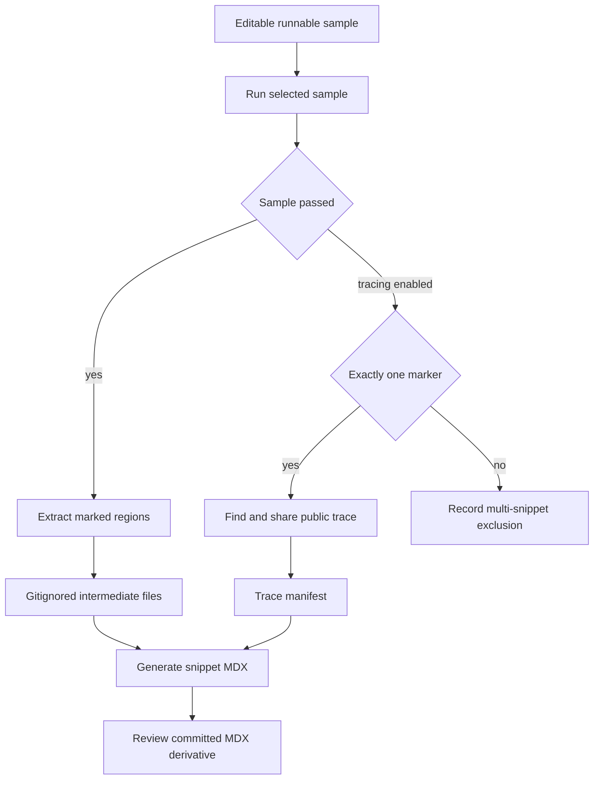

## Ownership and lifecycle

Runnable examples under `src/code-samples/` are the editable source of truth. They are programs containing one or more marked documentation regions, so the code readers see is exercised by its language toolchain. `src/code-samples-generated/` is a gitignored extraction intermediate; `src/snippets/code-samples/` is the committed generated MDX consumed by documentation. Edit and review the runnable source and the regenerated MDX diff—never treat generated snippets as hand-authored content.



This flow separates executable authorship from presentation derivatives; trace sharing is a separately gated public-publication branch.

## Author marked, executable source

Supported source extensions are `.py`, `.ts`, `.java`, `.kt`, `.go`, and `.sh`. Delimit visible code using matched `:snippet-start: <id>` and `:snippet-end:` comment lines: Python and shell use `#`; TypeScript, Java, Kotlin, and Go use `//`. The extractor is deliberately line based rather than a TypeScript parser, avoiding failures from comment-like text such as `/**` in a string. It permits indented markers, removes matched `:remove-start:` / `:remove-end:` regions from the emitted body, dedents and normalizes it, and rejects unclosed snippet or remove regions.

Every ID must use the output-language suffix: `-py`, `-js`, `-java`, `-kt`, `-go`, or `-sh`. The generator uses that suffix to select the fence language and silently skips an intermediate whose ID does not match its source language. Use unique, descriptive kebab-case IDs because the ID determines the MDX filename.

Keep the visible region executable. A remove block is appropriate for assertions, credentials-only setup, or an execution tail that should not be displayed, but it must not let the process exit before the visible imports, construction, and invocation have run. An early successful `SystemExit`, `process.exit`, or `exit 0` proves little beyond parsing.

### File scope and Deep Agents expansion

One source file can own related snippets and one shared harness. This is particularly useful for Python. TypeScript instead runs as a single module: all visible regions and remove blocks share its imports and top-level bindings. Split independently runnable TypeScript snippets into separate files when imports or `const`, `let`, class, function, or setup names would collide.

The Deep Agents skills expansion demonstrates the tradeoff. `skills.py` contains eight related Python regions and is intentionally ineligible for a single snippet trace. The approval, source-composition, and writable-store TypeScript samples each contain one visible marker followed by a remove-block assertion. The single-marker LangGraph multiple-schemas TypeScript sample similarly keeps its assertion harness hidden and has a generated trace card.

Optional presentation directives must be the first lines inside the extracted body: `:codegroup-tab:` provides a Mintlify tab title, and `:codegroup-fence-mods:` supplies fence modifiers either after the tab directive or as the first line by itself. Both are stripped from emitted code.

For Python and TypeScript, the generator can expand a qualifying routable `model` string into a seven-provider Deep Agents `<CodeGroup>`. `# KEEP MODEL` or `// KEEP MODEL` immediately before a model occurrence strips the directive but pins that occurrence. Expansion intentionally excludes a model argument in an embeddings constructor, a model ID containing `embedding`, and provider-specific constructor calls such as `ChatOpenAI`: these require provider-specific values and substituting a `provider:model` string would make output invalid. When a RAG snippet contains both an embeddings model and an eligible agent model, the embedding value remains identical in every generated tab and the agent model is varied; a snippet with only excluded or kept models remains one fence.

### Go module boundary

All Go examples share the module rooted at `src/code-samples/go.mod`; its `go 1.25.0` directive is both the local module's toolchain declaration and the value used by CI setup. Add or update direct Go sample dependencies there and commit the corresponding checksums in `src/code-samples/go.sum`, rather than creating per-example modules. The runner invokes `go run` from `src/code-samples/`, which makes that module resolve imports for nested examples such as the LangSmith SmithDB migration samples.

## Execute samples and handle failure

During authoring, use a narrow check first, then broaden when shared dependencies or execution behavior changed:

```bash
make test-code-samples FILES="src/code-samples/langchain/return-a-string.py"
make test-code-samples
make test TEST_FILE=tests/unit_tests/test_generate_code_snippet_mdx.py
```

`FILES` is a space-separated explicit list. Invalid, missing, unsupported, or out-of-tree entries are warned about and skipped. Without it, the runner recursively selects eligible files under `src/code-samples/`—excluding `node_modules` and `__pycache__`—in Python, TypeScript, Java, Kotlin, Go, then shell order.

Python runs through `uv run python`; TypeScript uses `npx tsx`; Go uses `go run`; shell uses `bash`; Java and Kotlin use JBang pinned to Java 21. TypeScript, Go, and shell run with `src/code-samples/` as their working directory, while Python and JBang run from the repository root. Processes inherit the environment, including provider credentials and `POSTGRES_URI`, and may exercise live APIs or PostgreSQL. The default per-sample timeout is 1,200 seconds and can be changed with `CODE_SAMPLE_TIMEOUT_SECONDS`.

An ordinary nonzero exit, timeout, missing executable, or trace-collection exception makes the runner fail. The narrow operational exception is a LangSmith HTTP 429 recognized in process output: the runner retries up to three total attempts with 15-second waits, then records the sample as skipped rather than failed. A skipped sample is not validated and cannot publish a trace.

## Extract and regenerate MDX

After a source passes, generate its derivatives with:

```bash
make code-snippets
```

The target runs extraction before MDX generation. Extraction writes `<source-stem>.snippet.<snippet-id>.<extension>` below `src/code-samples-generated/`, retaining a product subdirectory based on the source layout. Generation scans all supported intermediates, formats each valid-suffix body as a fence or CodeGroup, applies a trace CTA from the manifest when present, and writes `<snippet-id>.mdx` under `src/snippets/code-samples/`.

For rapid local iteration, limit **extraction** with:

```bash
CODE_SNIPPET_SOURCES="src/code-samples/langsmith/trace.java" make code-snippets
```

`CODE_SNIPPET_SOURCES` accepts only existing supported files beneath `src/code-samples/`. A full extraction deletes every supported intermediate then rebuilds all of them. A partial extraction replaces intermediates only for selected source stems, but generation still scans every intermediate left behind. It is therefore an iteration optimization, not a complete regeneration; use a full run before relying on repository-wide generated state.

## Intentional public trace publication

`make update-code-sample-traces` is not ordinary sample validation. It requires `LANGSMITH_API_KEY`, enables `CODE_SAMPLE_TRACING=1`, selects `LANGSMITH_PROJECT` or the default `docs-code-samples`, runs samples with LangSmith tracing, then regenerates MDX. It calls the sharing API and publishes a public LangSmith link, so use authorized credentials and only inputs, outputs, and run metadata appropriate for public visibility.

For each successful source, the collector counts snippet markers:

- No markers produces no link.
- Exactly one marker is eligible. The collector flushes and polls six times with two-second waits, querying roots from a two-second buffered start time in the configured project. It prefers agent, Deep Agent, LangGraph, or `create_agent`-like roots; otherwise it accepts a chain root only if that trace has an LLM child. It shares the selected run and records URL, source, run ID, trace ID, run name, and update time under the snippet ID.
- More than one marker is explicitly excluded. The file and IDs are recorded in `skipped_multi_snippet`, and prior single-snippet entries for those IDs are removed. Split the file to make a trace CTA possible.

`src/code-samples/trace-links.json` owns this association. During MDX generation a manifest URL adds or replaces the `View example trace` Card; absent URLs remove a stale trailing CTA. The LangGraph multiple-schemas JavaScript entry illustrates the resulting public card.

## CI trust and refresh behavior

The **Test Code Samples** workflow runs for relevant pull requests, manual dispatch, and monthly scheduled runs at 00:00 UTC on the first day. It skips fork PRs because samples can require secrets. Internal PRs compute the merge-base and run changed eligible sample files; manual and scheduled runs test all samples. CI supplies Python and uv, Node 20, Java 21 and JBang, Go from `src/code-samples/go.mod`, and pgvector PostgreSQL.

Only trusted manual and scheduled full runs enable trace collection. Once a full run succeeds, CI regenerates snippets, preserves the refreshed trace manifest and generated MDX while resetting the checkout, and compares just those publication artifacts. A nonempty difference updates an existing or creates a new `chore/refresh-code-sample-traces` PR targeting `main`; no difference produces no repository write. Pull-request checks neither collect public traces nor publish generated artifacts.

A separate observer creates a Linear issue only when a scheduled sample workflow fails or is cancelled. When responding, distinguish a sample/toolchain failure, a rate-limit skip, no qualifying root run, and a trace-collection or publication failure.

## Change checklist

1. Change the runnable source in `src/code-samples/`, not the generated MDX.
2. Use matched, language-correct markers and a unique ID with the required suffix.
3. Run the visible path; reserve trailing remove blocks for non-display harness logic.
4. Keep Go dependency ownership in the shared module and checksum file; split TypeScript where module scope collides.
5. Run the focused sample and, for CodeGroup behavior, `tests/unit_tests/test_generate_code_snippet_mdx.py`; regenerate with `make code-snippets` and review the derivative diff.
6. Treat partial extraction as local iteration only; run full extraction before relying on complete output.
7. Treat `make update-code-sample-traces` and the trusted CI refresh as deliberate credentialed public-publication actions.

## Related pages

- [Build System Architecture](/openwiki/architecture/build-system.md)
- [GitHub Actions and CI/CD](/openwiki/integrations/github-actions.md)
- [Adding and Maintaining Documentation Pages](/openwiki/operations/adding-pages.md)
- [Builder Test Guidance](/openwiki/testing/builder-tests.md)
- [Testing Overview](/openwiki/testing/test-overview.md)
