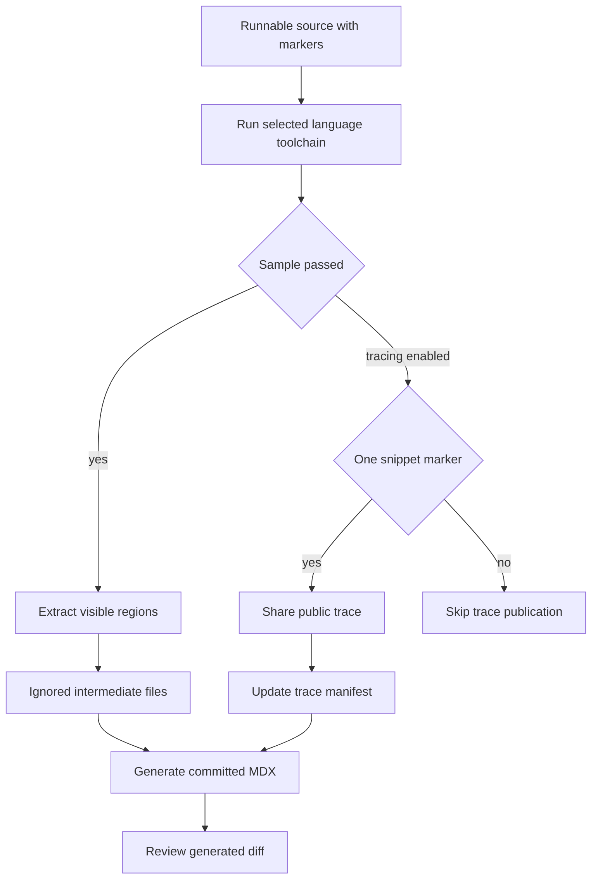

## Ownership and lifecycle

`src/code-samples/` is the source of truth for executable documentation. The ignored `src/code-samples-generated/` directory is an extraction intermediate, and committed `src/snippets/code-samples/` MDX is derived output. Change and run the source program, regenerate the derivative, and review the MDX diff; do **not** hand-edit generated snippets.


```mermaid
flowchart TD
  Source["Runnable source with markers"] --> Test["Run selected language toolchain"]
  Test --> Passed{"Sample passed"}
  Passed -->|"yes"| Extract["Extract visible regions"]
  Extract --> Intermediate["Ignored intermediate files"]
  Intermediate --> Generate["Generate committed MDX"]
  Generate --> Review["Review generated diff"]
  Passed -->|"tracing enabled"| TraceCheck{"One snippet marker"}
  TraceCheck -->|"yes"| Share["Share public trace"]
  Share --> Manifest["Update trace manifest"]
  Manifest --> Generate
  TraceCheck -->|"no"| Skip["Skip trace publication"]
```

This shows the normal source-to-MDX lifecycle and its optional, credentialed trace-publication branch. Validation does not itself modify reader-facing code.

## Author source that both runs and documents correctly

Supported sample extensions are `.py`, `.ts`, `.java`, `.kt`, `.go`, and `.sh`. Put matched `:snippet-start: <id>` and `:snippet-end:` lines around the code readers should see. Python and shell use `#`; TypeScript, Java, Kotlin, and Go use `//`. IDs need the matching `-py`, `-js`, `-java`, `-kt`, `-go`, or `-sh` suffix: the generator uses it to select a fence and skips an extracted snippet whose ID has another suffix.

The extractor deliberately uses line-based marker recognition rather than a language parser. It accepts indented markers, strips matched `:remove-start:` / `:remove-end:` regions from the displayed body, dedents the result, and fails on an unclosed snippet or remove region. A remove region is presentation-only: it remains in the complete program that the runner executes. Use it for fixtures, assertions, cleanup, and a terminating harness—not for code that readers need to learn from.

Keep the visible construction or invocation on an executable path before an early `SystemExit`, `process.exit`, or `exit 0`; a trailing hidden harness can validate values and release resources. TypeScript samples run as one module, so visible and removed regions share imports and top-level bindings. Split independently runnable examples into separate `.ts` files if they would duplicate imports or top-level declarations.

### Deep Agents skills sample

`src/code-samples/deepagents/skills.py` is one runnable Python program containing multiple independently extracted documentation regions. Its reader-facing snippets demonstrate the major skills configuration boundaries:

- A `FilesystemBackend` plus `skills` source path; dynamically selected skill directories by user role; and a `CompositeBackend` whose `/skills/` route uses a per-assistant, per-user `StoreBackend` namespace.
- Main-agent and subagent-specific skill sources, composition of organization, team, and request sources, and filesystem write control. The approval example interrupts writes and uses `MemorySaver`, while the writable example denies writes to approved skills and routes approved and editable directories to different store namespaces.
- `SkillsMiddleware` with an explicit tool list, a name-based resolver, an integration-level resolver that returns all Linear tools, and a context-aware resolver that obtains a user's tools from `runtime.context.user_id`.
- Deferred provider tool search combined with `SkillsMiddleware`, plus explicit reload examples that clear `skills_metadata` directly or from `after_agent` middleware after a skill edit.

The source uses `# KEEP MODEL` ahead of every documented `model=` line so generation preserves the deliberately chosen provider/model instead of turning that sample into a provider CodeGroup. Its hidden harness rebinds the initial filesystem backend to a local virtual example directory, checks representative agent construction and tool resolution, prints a success message, and exits before the later live `agent.invoke` examples. This lets focused sample execution test construction and local resolver wiring without making an external model request.

## Shared dependency owners

Python samples execute through the repository's `uv` environment. `pyproject.toml` owns the Python dependency set, including `deepagents[quickjs]`, LangChain, LangGraph, and provider integrations used by the Deep Agents examples.

TypeScript samples execute from `src/code-samples/`, which owns one ESM `package.json` and committed `package-lock.json`. Add or update a TypeScript sample runtime dependency in that package and refresh its lockfile; do not install dependencies per sample. `make test-code-samples` installs that package before invoking the runner. The manifest and lockfile together make the resolved dependency tree used by every TypeScript sample reproducible. The package currently declares `deepagents`, `tsx`, and the LangChain provider packages alongside the MCP dependencies used by other samples.

## Extract and generate derived MDX

Run the complete transformation with:

```bash
make code-snippets
```

The target runs extraction and then MDX generation. Extraction writes `<source-stem>.snippet.<snippet-id>.<extension>` intermediates below `src/code-samples-generated/`. Generation scans all intermediates, emits language fences, handles optional `:codegroup-tab:` and `:codegroup-fence-mods:` directives, and writes `<snippet-id>.mdx` under `src/snippets/code-samples/`.

A full extraction clears supported intermediate files and rebuilds them. For a local source iteration, `CODE_SNIPPET_SOURCES` restricts replacement to existing supported paths below `src/code-samples/`:

```bash
CODE_SNIPPET_SOURCES="src/code-samples/deepagents/skills.py" make code-snippets
```

Generation still scans every intermediate that remains, so do a full extraction before relying on the generated directory as repository-wide state. For the skills source, this produces snippets such as `skills-tools-integration-py.mdx`; it is evidence of the source marker region, not an alternate authoring surface.

For Python and TypeScript model strings, the generator may replace the first eligible model ID and repeated matching occurrences with a seven-provider CodeGroup. `KEEP MODEL` prevents replacement of the next model. Embedding IDs and models supplied to embeddings or provider-specific chat constructors are not expanded because replacing them with a `provider:model` value would make the resulting code non-runnable. The Google provider key intentionally differs: Python uses `google_genai:`, while TypeScript uses `google:`.

## Focused validation for a skills change

Start with the changed executable source, then regenerate and inspect its derived snippets:

```bash
make test-code-samples FILES="src/code-samples/deepagents/skills.py"
make test TEST_FILE=tests/unit_tests/test_generate_code_snippet_mdx.py
CODE_SNIPPET_SOURCES="src/code-samples/deepagents/skills.py" make code-snippets
```

`FILES` is a space-separated explicit list. Missing, unsupported, or out-of-tree paths are warned about and skipped. Without it, the runner recursively selects all eligible samples, excluding `node_modules` and `__pycache__`; Python runs through `uv run python`, TypeScript through `npx tsx`, Java and Kotlin through JBang with Java 21, Go through `go run`, and shell through `bash`. The default timeout is 1,200 seconds and `CODE_SAMPLE_TIMEOUT_SECONDS` overrides it.

The focused `skills.py` run proves that its complete module can create the documented agents and execute its hidden checks up to its deliberate exit. It does not prove the later displayed `agent.invoke` calls or a live provider response. Treat those as an integration concern requiring appropriate credentials and a deliberately changed harness, rather than assuming a construction-only pass validates them.

The generator unit test protects model expansion exclusions, `KEEP MODEL` behavior, language-specific Google provider keys, the TypeScript Google search tool shape, and the minimum declared and locked `@langchain/google` version required when built-in and function tools are mixed. Run it whenever generator logic, model markers, or shared TypeScript dependencies change.

Ordinary nonzero exits, timeouts, and trace-collection exceptions fail the runner. A recognized LangSmith 429 is retried three total times with 15-second delays and then reported as skipped rather than failed; that skip is not successful validation.

## Trace publication and CI

Public trace sharing is separate from ordinary test execution. `make update-code-sample-traces` requires `LANGSMITH_API_KEY`, enables tracing, uses `LANGSMITH_PROJECT` or `docs-code-samples`, runs samples, and regenerates MDX. Only a successful source containing exactly one snippet marker can receive a public trace link; the skills sample has multiple markers and is consequently unsuitable for per-snippet public trace publication without being split.

The **Test Code Samples** workflow skips fork pull requests, runs changed eligible samples for internal PRs, and runs all samples on manual or monthly executions. Only manual and scheduled full runs enable tracing. After a successful traced full run and regeneration, CI updates or creates `chore/refresh-code-sample-traces` only if the trace manifest or generated snippet MDX changed. A separate observer creates a Linear issue only for failed or cancelled scheduled sample runs.

## Change checklist

1. Edit the executable source in `src/code-samples/`, never generated snippet MDX.
2. Use matched language-correct markers and a unique language-suffixed snippet ID.
3. Keep the visible path executable; place local fixture, assertion, cleanup, and deliberate-exit logic in remove regions.
4. For `skills.py`, preserve `KEEP MODEL` where a fixed model is part of the example, and understand which snippets are reached before its hidden harness exits.
5. Update the appropriate shared dependency owner and lockfile when a Python or TypeScript runtime dependency changes.
6. Run the focused sample, generator unit test when applicable, regenerate with `CODE_SNIPPET_SOURCES`, and review all generated MDX changes.
7. Use trace refresh only as a deliberate credentialed public-publication action.

## Related pages

- [Documentation Preprocessing](/openwiki/concepts/preprocessing.md)
- [GitHub Actions and CI/CD](/openwiki/integrations/github-actions.md)
- [Quickstart](/openwiki/quickstart.md)
- [Testing Overview](/openwiki/testing/test-overview.md)
