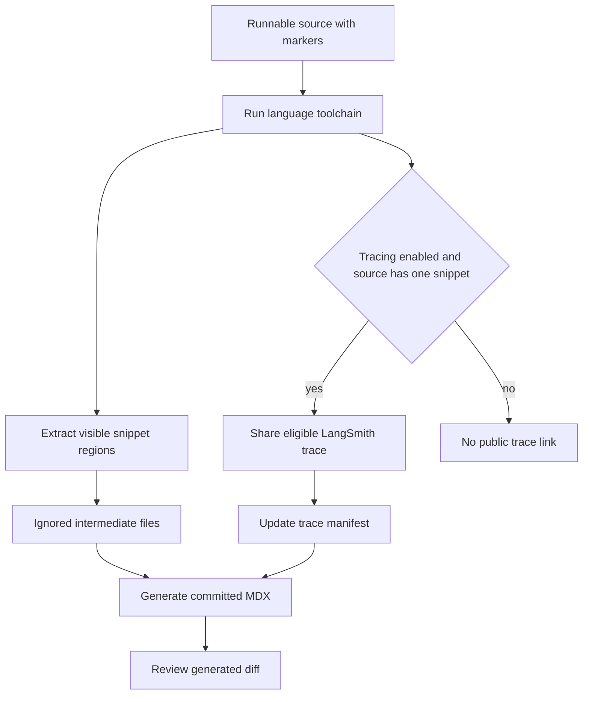

## Ownership and lifecycle

`src/code-samples/` is the executable source of truth. The ignored `src/code-samples-generated/` directory holds extraction intermediates, and committed files in `src/snippets/code-samples/` are generated documentation artifacts. Change the source program, validate it, regenerate the MDX, and review that diff rather than editing generated MDX directly.


```mermaid
flowchart TD
  Source["Runnable source with markers"] --> Validate["Run language toolchain"]
  Validate --> Extract["Extract visible snippet regions"]
  Extract --> Intermediate["Ignored intermediate files"]
  Intermediate --> Render["Generate committed MDX"]
  Render --> Review["Review generated diff"]
  Validate --> TraceGate{"Tracing enabled and source has one snippet"}
  TraceGate -->|"yes"| Publish["Share eligible LangSmith trace"]
  Publish --> Manifest["Update trace manifest"]
  Manifest --> Render
  TraceGate -->|"no"| NoPublish["No public trace link"]
```

This flow separates executable authorship and validation from derived documentation, with trace publication as an explicit optional branch.

## Author a sample that is both readable and executable

Supported source extensions are `.py`, `.ts`, `.java`, `.kt`, `.go`, and `.sh`. Surround the reader-visible region with matching `:snippet-start: <id>` and `:snippet-end:` comments: `#` for Python and shell, and `//` for TypeScript, Java, Kotlin, and Go. The ID must end in the language suffix (`-py`, `-js`, `-java`, `-kt`, `-go`, or `-sh`); generation uses that suffix to choose a fence and silently does not emit an MDX file for a mismatched extracted ID.

The extractor is deliberately line based, rather than parsing the host language. It accepts indented markers, removes content enclosed by matched `:remove-start:` / `:remove-end:` markers from the displayed result, dedents the remaining body, and rejects unclosed snippet or removal regions. Removal is a presentation operation only: the full source—including fixtures, assertions, cleanup, and harnesses—still runs during validation.

Put executable setup and the behavior being demonstrated before a deliberate exit. A hidden tail can assert the constructed values or avoid a blocking/live invocation after the visible code has run. In TypeScript, visible and removed regions execute in one module and share top-level bindings. Split independently runnable examples into separate files when imports, `const`/`let`, classes, or functions would collide.

The MCP TypeScript samples demonstrate this pattern. `mcp-destructive-gate.ts` keeps the adapter, tool metadata predicate, approval configuration, and agent construction visible, while a removed tail starts a local MCP fixture and asserts the gate before closing resources. `mcp-multi-server.ts` similarly exposes the HTTP and stdio adapter usage but creates its temporary servers and validates tool selection in hidden code. The result is documentation a reader can copy, paired with local executable checks rather than mocked SDK behavior.

## Validate the source program

Use a focused run while iterating:

```bash
make test-code-samples FILES="src/code-samples/langchain/mcp-destructive-gate.ts"
```

`FILES` is a space-separated explicit list. Invalid, unsupported, missing, or out-of-tree paths are warned about and omitted. With no list, the runner recursively selects eligible files while excluding `node_modules` and `__pycache__`. It runs Python with `uv run python`, TypeScript with `npx tsx` from `src/code-samples/`, Java and Kotlin through JBang pinned to Java 21, Go with `go run` from that shared directory, and shell with `bash`. Each subprocess receives the parent environment; the default timeout is 1,200 seconds and `CODE_SAMPLE_TIMEOUT_SECONDS` can override it.

The runner defaults to four concurrent jobs, configurable through `CODE_SAMPLE_JOBS`. A normal nonzero exit, missing executable, or timeout fails the run. A recognized LangSmith 429 response is retried up to three total attempts with 15-second waits and then counted as skipped rather than failed; this is not evidence that the sample was successfully exercised. When trace collection is enabled, successful samples are still processed under a trace lock so parallel jobs cannot claim the same run or overwrite the shared manifest; a trace-collection exception fails the run.

Python dependencies are owned by the repository `uv` project. TypeScript dependencies are shared by `src/code-samples/package.json`, with the committed `package-lock.json` recording the resolved graph; the Make targets install that package before invoking TypeScript samples. Add a shared runtime dependency there and refresh the lockfile rather than creating per-sample installs. Go samples likewise run against the shared `src/code-samples/go.mod`.

## Extract and render the derived snippets

```bash
make code-snippets
```

This target first extracts source regions into files named like `<source-stem>.snippet.<snippet-id>.<extension>` below `src/code-samples-generated/`, then scans those intermediates to render `<snippet-id>.mdx` below `src/snippets/code-samples/`. A full extraction deletes supported intermediate files before rebuilding them. For a fast local iteration, `CODE_SNIPPET_SOURCES` accepts existing supported paths below `src/code-samples/` and replaces intermediates for those source stems only:

```bash
CODE_SNIPPET_SOURCES="src/code-samples/langchain/mcp-destructive-gate.ts" make code-snippets
```

MDX generation still scans every intermediate left in the directory. Run a full extraction before treating the output as complete repository-wide state, and inspect all generated changes after a partial run.

The renderer emits language fences and consumes optional first-line presentation directives: `:codegroup-tab:` supplies a Mintlify CodeGroup tab name, and `:codegroup-fence-mods:` supplies fence modifiers. For eligible Python and TypeScript LangChain-style model strings, it can render seven provider variants in a CodeGroup. `# KEEP MODEL` or `// KEEP MODEL` preserves the following model occurrence. Embedding model IDs and models in provider-specific embedding/chat constructors stay untouched, because substituting a routable `provider:model` value would make the example invalid. The Google provider variant is intentionally language-specific: Python uses `google_genai:`, while TypeScript uses `google:`.

The focused generator test protects these runnable-output invariants, including `KEEP MODEL`, exclusion of embedding and provider-specific models, language-specific Google keys, the TypeScript Google search-tool spelling, and the minimum declared and locked `@langchain/google` version needed when built-in and function tools are mixed:

```bash
make test TEST_FILE=tests/unit_tests/test_generate_code_snippet_mdx.py
```

## Publish public traces only deliberately

Ordinary sample validation does not publish traces. `make update-code-sample-traces` sets `CODE_SAMPLE_TRACING=1`, uses `LANGSMITH_PROJECT` or the default `docs-code-samples`, runs the samples, and regenerates MDX. It requires `LANGSMITH_API_KEY` to access LangSmith and create public shares.

After a successful traced sample, collection reads its source markers. A source with no markers receives no link; a source with more than one marker is recorded in `skipped_multi_snippet` and is ineligible. Only an unambiguous single-snippet source can be associated with an agent-like root run found in its execution time window. The collector avoids already claimed run IDs, shares the selected trace publicly, and records source, URL, run/trace IDs, run name, and update time in `src/code-samples/trace-links.json`. Rendering appends the **View example trace** Card only when that manifest contains a URL for the snippet; it removes a stale trailing CTA when no URL is available.

Treat this as a security and content-publication boundary: credentials are necessary, publication is explicit, and splitting a multi-snippet file is required before it can gain a per-snippet public trace link.

## CI maintenance loop

The **Test Code Samples** workflow runs on relevant pull requests, manual dispatch, and the first day of each month. It skips fork PRs because the samples can require repository secrets. Internal PRs run changed eligible sample files; manual and scheduled runs test the complete set, provision Python/Node/Java/JBang/Go and PostgreSQL, and enable tracing. The workflow limits its normal PR job to 60 minutes and its full job to 150 minutes.

On a successful traced full run, CI regenerates snippets and considers only `trace-links.json` and generated snippet MDX for a deterministic `chore/refresh-code-sample-traces` branch. It makes no commit when those paths have no diff; otherwise it updates an open PR on that branch or creates one. A separate `workflow_run` observer opens a Linear issue only when a scheduled **Test Code Samples** run fails or is cancelled.

## Change checklist

1. Edit the runnable file under `src/code-samples/`; do not hand-edit generated snippet MDX.
2. Use matched, language-correct markers and a unique ID with the expected language suffix.
3. Keep the visible code on an executed path. Put local fixtures, assertions, cleanup, and non-reader-facing setup in remove regions.
4. Update the appropriate shared dependency owner and lockfile when a runtime dependency changes.
5. Run `make test-code-samples FILES="…"`, run the focused generator test when generator or TypeScript provider behavior changes, then run `make code-snippets` with `CODE_SNIPPET_SOURCES` if appropriate.
6. Review generated MDX, remembering that partial extraction does not clear unrelated intermediates.
7. Use trace refresh only with intended credentials and only when publishing a public trace for an unambiguous single-snippet source is acceptable.

## Related pages

- [Documentation Preprocessing](/openwiki/concepts/preprocessing.md)
- [GitHub Actions and CI/CD](/openwiki/integrations/github-actions.md)
- [Adding Pages](/openwiki/operations/adding-pages.md)
- [CLI Tools](/openwiki/operations/cli-tools.md)
- [Testing Overview](/openwiki/testing/test-overview.md)
