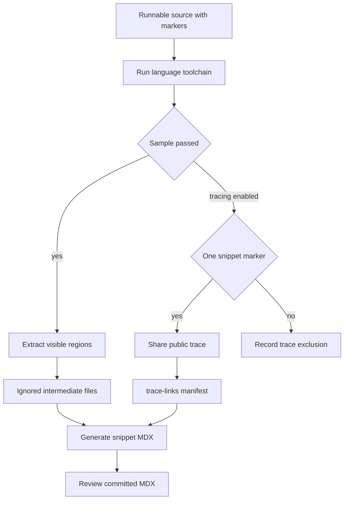

## Ownership and lifecycle

`src/code-samples/` is the source of truth for executable documentation. The ignored `src/code-samples-generated/` directory is an extraction intermediate, and committed `src/snippets/code-samples/` MDX is generated output. Change and run the source program, regenerate the derivative, and review the MDX diff; do not hand-author the generated snippet.


```mermaid
flowchart TD
  Source["Runnable source with markers"] --> Run["Run language toolchain"]
  Run --> Result{"Sample passed"}
  Result -->|"yes"| Extract["Extract visible regions"]
  Extract --> Intermediate["Ignored intermediate files"]
  Intermediate --> Generate["Generate snippet MDX"]
  Generate --> Review["Review committed MDX"]
  Result -->|"tracing enabled"| Eligible{"One snippet marker"}
  Eligible -->|"yes"| Share["Share public trace"]
  Share --> Manifest["trace-links manifest"]
  Manifest --> Generate
  Eligible -->|"no"| Skip["Record trace exclusion"]
```

This diagram shows the executable-documentation path and its separate credentialed trace-publication branch.

## Author visible code and executable harnesses

Supported sample extensions are `.py`, `.ts`, `.java`, `.kt`, `.go`, and `.sh`. Put matched `:snippet-start: <id>` and `:snippet-end:` lines around the code readers should see. Python and shell use `#`; TypeScript, Java, Kotlin, and Go use `//`. IDs need the matching `-py`, `-js`, `-java`, `-kt`, `-go`, or `-sh` suffix: the generator uses it to choose the output fence and ignores an extracted snippet without the expected suffix.

The extractor is intentionally line based rather than a language parser. It accepts indented markers, removes matched `:remove-start:` / `:remove-end:` regions from the displayed body, dedents the result, and rejects unclosed snippet or remove markers. A remove region affects presentation only: its code still executes when the complete source file runs. Use it for assertions, local fixtures, cleanup, and credential-dependent paths that make the documented example safely testable without putting that machinery in docs.

Arrange the harness so the visible construction or invocation actually runs before an early `SystemExit`, `process.exit`, or `exit 0`. A trailing harness can assert the values created by the snippet and clean up servers or adapters; a pre-snippet terminating region only proves parsing. Regions in a TypeScript source file execute in the same module and therefore share imports and top-level bindings. Split independently runnable snippets into different `.ts` files if they would redeclare an import, `const`, `let`, class, or function.

### MCP adapter 2 sample pattern

The TypeScript MCP samples use the shared `@langchain/mcp-adapters` `2.0.0` dependency and one `-js` snippet each. They show distinct adapter lifecycle and error semantics while their remove regions supply a real local MCP test boundary:

- `mcp-quickstart.ts` creates an adapter for the documentation MCP endpoint, discovers tools, constructs an agent, and closes the adapter in `finally`. Its hidden checks require at least one tool and an agent; without `ANTHROPIC_API_KEY`, it intentionally validates discovery and construction but does not invoke the model.
- `mcp-elicitation.ts` uses a checkpointer and an MCP elicitation interrupt. It resumes the exact pending interrupt with `createMCPElicitationResume`, keyed by the server request key, and closes the adapter. Its local server/harness proves the interrupt, resumption, and resulting booking response without requiring a model call.
- `mcp-shared-adapter.ts` keeps one module-scoped adapter, refreshes its tool list, and exposes a graph factory. Its local harness makes concurrent and later calls, checks client reuse and wrapper reuse, then verifies that `adapter.close()` invalidates a previously obtained tool.
- `mcp-tool-errors.ts` demonstrates that server `isError: true` reaches an agent as an error-status `ToolMessage`, while a direct tool invocation rejects. The local calculator fixture verifies both paths and teardown closes the adapter, handler, and HTTP server.

These files deliberately keep reader-facing adapter code inside their snippet markers and Node assertions, fixture servers, address substitution, and cleanup in remove regions. The full runner executes both, so a passing focused sample exercises the adapter API against a local MCP server where applicable; it does not necessarily prove a live model request when its API key is absent.

### Shared language dependencies

Python samples run in the repository's uv environment. TypeScript samples are ESM programs run from `src/code-samples/`, which owns the shared `package.json` and committed `package-lock.json`; add a runtime dependency there and refresh the lockfile rather than creating a per-sample installation. The manifest declares direct requirements while the lockfile records the resolved package tree used by the samples. The MCP examples additionally rely on the pinned adapter and Model Context Protocol packages in that owner. `make test-code-samples` installs the shared package before executing TypeScript samples.

Go samples similarly share `src/code-samples/go.mod` and `go.sum`; the runner invokes `go run` from `src/code-samples/`, and CI selects Go from that module file. For all languages, child processes inherit the environment, so a source can require provider credentials or `POSTGRES_URI` and can call live services.

## Generate snippets

Run:

```bash
make code-snippets
```

The target runs extraction then MDX generation. Extraction writes `<source-stem>.snippet.<snippet-id>.<extension>` files below `src/code-samples-generated/`. Generation scans all intermediate files, emits language fences, applies optional `:codegroup-tab:` and `:codegroup-fence-mods:` presentation directives, writes `<snippet-id>.mdx`, and adds a trace card only when the manifest contains a URL.

A full extraction deletes supported intermediate files and rebuilds them. For a local source iteration, `CODE_SNIPPET_SOURCES` accepts existing supported paths under `src/code-samples/` and replaces intermediates only for those source stems:

```bash
CODE_SNIPPET_SOURCES="src/code-samples/langchain/mcp-elicitation.ts" make code-snippets
```

Generation still sees every remaining intermediate, so use a full extraction before treating the generated directory as repository-wide state.

For Python and TypeScript model strings, generation can replace the first eligible model ID and repeated matching occurrences with a seven-provider CodeGroup. `KEEP MODEL` preserves the next model instead. Embedding IDs and models supplied to embedding or provider-specific chat constructors are deliberately not expanded, because substituting a `provider:model` value would make those samples non-runnable. The Google variant intentionally differs by language: TypeScript uses `google:`, while Python uses `google_genai:`.

## Execute and test

Start with the changed sample and then regenerate its derivative:

```bash
make test-code-samples FILES="src/code-samples/langchain/mcp-elicitation.ts"
make test-code-samples FILES="src/code-samples/langchain/mcp-quickstart.ts src/code-samples/langchain/mcp-shared-adapter.ts src/code-samples/langchain/mcp-tool-errors.ts"
make test TEST_FILE=tests/unit_tests/test_generate_code_snippet_mdx.py
make code-snippets
```

`FILES` is a space-separated explicit list. Invalid, missing, unsupported, or out-of-tree entries are warned about and skipped. Without it, the runner recursively selects eligible source files (excluding `node_modules` and `__pycache__`) in Python, TypeScript, Java, Kotlin, Go, then shell order. It runs Python through `uv run python`, TypeScript through `npx tsx`, Java/Kotlin through JBang with Java 21, Go through `go run`, and shell through `bash`. The default timeout is 1,200 seconds and `CODE_SAMPLE_TIMEOUT_SECONDS` overrides it.

Ordinary nonzero exits, timeouts, missing executables, and trace-collection exceptions fail the runner. A detected LangSmith 429 is retried three total times with 15-second delays and is then reported as skipped rather than failed. A rate-limited sample was not validated and does not produce a trace. The focused generator test protects CodeGroup expansion exclusions, language-specific Google provider keys, the camel-case TypeScript `{ googleSearch: {} }` tool shape, and the minimum declared and lockfile-resolved `@langchain/google` version needed for mixed built-in and function tools. It is a focused regression guard for that shared TypeScript dependency contract, not a replacement for running a changed sample.

## Public traces are a trusted publication action

`make update-code-sample-traces` requires `LANGSMITH_API_KEY`, sets tracing, selects `LANGSMITH_PROJECT` or `docs-code-samples`, runs samples, and regenerates MDX. It can call the LangSmith sharing API to create a public URL. Use it only with authorized credentials and inputs, outputs, and run metadata that are safe to disclose publicly.

After a successful traced sample, only a source containing exactly one snippet marker is eligible. The collector flushes and polls the configured project for a recent agent-like root run, preferring agent, Deep Agent, LangGraph, or `create_agent`-like roots and falling back to a chain root with an LLM child. It shares the selected run and stores the source, URL, run identifiers, name, and update time under `src/code-samples/trace-links.json`. Multi-snippet files are recorded in `skipped_multi_snippet` and stale per-snippet entries are removed. During MDX generation, the manifest URL creates or replaces the `View example trace` card; no URL removes a stale trailing card.

## CI trust boundary and refresh

The **Test Code Samples** workflow runs on relevant pull requests, manual dispatch, and at 00:00 UTC on the first day of each month. It skips fork pull requests because sample execution may require secrets. Internal pull requests compute a merge base and run only changed eligible samples; manual and scheduled runs execute all samples. CI installs Python and uv, Node 20, Java 21 and JBang, Go, and a pgvector PostgreSQL service.

Only manual and scheduled full runs enable tracing and public sharing. Once such a run and MDX regeneration succeed, CI compares `trace-links.json` and generated snippet MDX, then updates or creates the deterministic `chore/refresh-code-sample-traces` pull request only if either artifact changed. Pull-request validation neither publishes traces nor writes refresh artifacts. A separate observer opens a Linear issue only when a scheduled sample workflow fails or is cancelled.

## Change checklist

1. Edit the runnable source in `src/code-samples/`, not generated MDX.
2. Use matched language-correct markers and a unique language-suffixed snippet ID.
3. Put fixture, assertion, and cleanup code in remove regions, but make the complete source execute the visible path.
4. Keep TypeScript module scope collision-free and update the shared package manifest **and lockfile** when dependencies change.
5. For an MCP adapter sample, use a local server fixture when practical, assert the intended adapter behavior, and close adapter and server resources in `finally`.
6. Run the focused source with `FILES`, the generator unit test when generation or the shared TypeScript dependency contract changes, then `make code-snippets` and review MDX.
7. Use trace refresh only as a deliberate credentialed public-publication operation; rely on trusted full-run CI for automated refreshes.

## Related pages

- [Documentation Preprocessing](/openwiki/concepts/preprocessing.md)
- [GitHub Actions and CI/CD](/openwiki/integrations/github-actions.md)
- [Quickstart](/openwiki/quickstart.md)
- [Testing Overview](/openwiki/testing/test-overview.md)
- [Changing Versioned Content](/openwiki/workflows/versioned-content.md)
