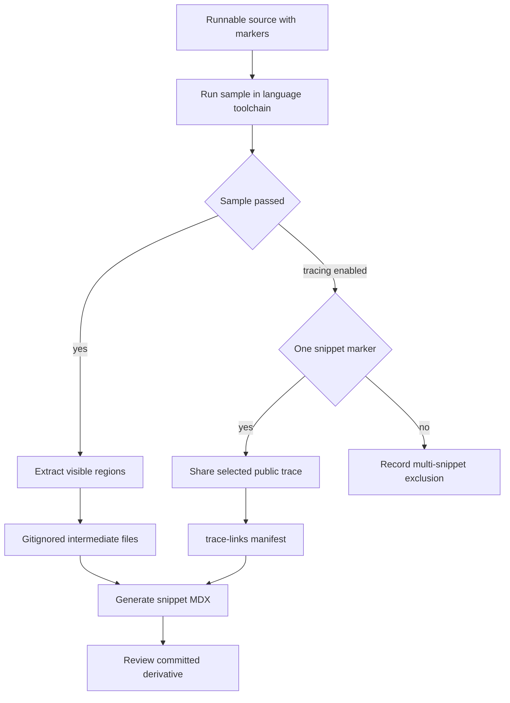

## Ownership and lifecycle

Runnable programs in `src/code-samples/` are the editable source of truth. `src/code-samples-generated/` is a gitignored extraction intermediate, while committed MDX below `src/snippets/code-samples/` is a derivative consumed by documentation. Edit the runnable program, execute it, regenerate the derivative, and review its diff; do not hand-author generated snippet MDX.


```mermaid
flowchart TD
  Source["Runnable source with markers"] --> Run["Run sample in language toolchain"]
  Run --> Passed{"Sample passed"}
  Passed -->|"yes"| Extract["Extract visible regions"]
  Extract --> Intermediate["Gitignored intermediate files"]
  Intermediate --> Generate["Generate snippet MDX"]
  Generate --> Review["Review committed derivative"]
  Passed -->|"tracing enabled"| Eligible{"One snippet marker"}
  Eligible -->|"yes"| Share["Share selected public trace"]
  Share --> Manifest["trace-links manifest"]
  Manifest --> Generate
  Eligible -->|"no"| Skip["Record multi-snippet exclusion"]
```

This diagram shows the normal executable-documentation path and its credentialed, public-trace publication branch.

## Author an executable sample

Supported sample extensions are `.py`, `.ts`, `.java`, `.kt`, `.go`, and `.sh`. Put matched `:snippet-start: <id>` and `:snippet-end:` lines around the code readers should see: Python and shell markers use `#`; TypeScript, Java, Kotlin, and Go use `//`. The extractor is line based, accepts indented marker lines, strips matched `:remove-start:` / `:remove-end:` regions from the displayed body, dedents output, and rejects unclosed snippet or remove regions.

A snippet ID must have the suffix for its source language: `-py`, `-js`, `-java`, `-kt`, `-go`, or `-sh`. Generation uses this suffix to choose a fence language and skips an extracted file whose ID does not have the expected suffix. The ID becomes the MDX filename, so it must be unique and descriptive.

A remove block hides harness logic from documentation; it does **not** prevent that logic from executing when the full source file runs. Put assertions and a blocking tail after the documented construction or invocation where possible. An early `SystemExit`, `process.exit`, or `exit 0` only establishes parsing, not that the visible path works.

### Scope and language dependency owners

A file can hold related snippets and shared setup. Prefer this for a coherent page or tutorial flow, but remember that a trace can be attached only to a single-snippet source file. The multi-snippet `skills.py` source, for example, contains reload invocation, explicit state reset, and reload middleware snippets, so it cannot receive a single-snippet public trace.

TypeScript is executed as one module, so every visible region and remove block shares top-level imports and bindings. Split independently runnable TypeScript snippets into separate files when imports or `const`, `let`, class, or function names would collide. Keep an import readers need inside the visible snippet; do not duplicate it in a remove block.

`skills-reload.ts` demonstrates an unsafe validation layout: its shared agent setup and `process.exit(0)` are in an initial remove block before its three visible reload snippets. The runner therefore exits without executing those visible statements, and the multiple markers also exclude the file from a public trace. When changing it, move the harness after the documented code or otherwise execute the displayed paths.

Python samples run in the repository's uv environment. TypeScript samples are an ESM package and resolve dependencies from the shared `src/code-samples/package.json` and `package-lock.json`; `make test-code-samples` installs that package before execution. Add TypeScript runtime dependencies and refresh the lockfile at this shared owner, rather than adding per-sample setup. Go examples similarly share `src/code-samples/go.mod` and `go.sum`; the runner runs them from `src/code-samples/`, and CI derives its Go version from that module file.

### TypeScript Google-provider invariants

The TypeScript Deep Agents examples use the JavaScript provider key `google:`, not Python's `google_genai:`. The latter is not a TypeScript `initChatModel` provider and fails before a request can be made. Conversely, Python samples must retain `google_genai:` rather than adopting `google:`. The generator encodes the same distinction in its Google CodeGroup tab: TypeScript emits `google:gemini-3.6-flash`, while Python emits `google_genai:gemini-3.6-flash`.

Provider-specific samples must also use the API shape of their installed integration. `quickstart-provider-google.ts` gates its live validation on `GOOGLE_API_KEY`, uses `{ googleSearch: {} }` for the built-in Google search tool, and keeps its real agent construction and invocation in a remove block. The generated snippet intentionally contains only the Google-tab setup. Repository tests reject the legacy `google_search` spelling anywhere in TypeScript samples and ensure the shared `@langchain/google` declaration and resolved lockfile version are at least `0.2.6`, the minimum that configures mixed built-in and function-tool requests correctly.

`context-engineering-memory.ts` is a single visible Deep Agents construction example and can therefore produce a trace if it completes with tracing enabled. `models-runtime-configurable.ts` deliberately places `// KEEP MODEL` immediately before both its default model and the runtime context model: the generated documentation preserves these values rather than presenting provider variants, because the example teaches runtime-selected models.

### Presentation directives and model variants

The first extracted line may be `:codegroup-tab:` to name a Mintlify tab; `:codegroup-fence-mods:` may be the next line or the first line itself to supply fence modifiers. Generation removes these directives from emitted code.

For Python and TypeScript, the generator recognizes `model="…"` / `model = "…"` and `model: "…"` / `model = "…"`, respectively. It selects the first eligible model ID and replaces occurrences of that same ID with a seven-provider Deep Agents `<CodeGroup>` (Google, OpenAI, Anthropic, OpenRouter, Fireworks, Baseten, and Ollama). A preceding `# KEEP MODEL` or `// KEEP MODEL` removes the directive but pins the next occurrence. The generator leaves embeddings IDs and models passed to embeddings or provider-specific chat constructors such as `ChatOpenAI` alone: replacing either with a routable `provider:model` value would make the sample invalid. Focused tests cover these exclusions and the intentionally different Python and TypeScript Google keys.

## Run and regenerate

Start with the changed program, then broaden when shared dependencies or execution behavior changes:

```bash
make test-code-samples FILES="src/code-samples/deepagents/context-engineering-memory.ts"
make test-code-samples
make test TEST_FILE=tests/unit_tests/test_generate_code_snippet_mdx.py
make code-snippets
```

`FILES` is an explicit space-separated list. The runner warns and skips missing, unsupported, or out-of-tree paths; without it, it recursively selects eligible samples, excluding `node_modules` and `__pycache__`, in Python, TypeScript, Java, Kotlin, Go, then shell order. It uses `uv run python`, `npx tsx`, JBang with Java 21, `go run`, and `bash` respectively. TypeScript, Go, and shell run from `src/code-samples/`; Python and JBang run from the repository root. Processes inherit environment variables, so samples can require provider credentials or `POSTGRES_URI` and can call live services. The default timeout is 1,200 seconds and `CODE_SAMPLE_TIMEOUT_SECONDS` overrides it.

Ordinary nonzero exits, timeouts, missing executables, and trace-collection failures fail the runner. LangSmith HTTP 429 is the limited exception: it is retried three total times with 15-second delays and then reported as skipped, rather than failed. A skipped sample has not been validated and cannot publish a trace.

`make code-snippets` first runs the extractor, then the MDX generator. Extraction writes files named `<source-stem>.snippet.<snippet-id>.<extension>` under `src/code-samples-generated/`; generation scans those intermediates, writes the corresponding `<snippet-id>.mdx`, and adds a trace CTA only when the manifest has a URL.

For local iteration, limit extraction only:

```bash
CODE_SNIPPET_SOURCES="src/code-samples/deepagents/context-engineering-memory.ts" make code-snippets
```

`CODE_SNIPPET_SOURCES` accepts existing supported files below `src/code-samples/`. A full extraction clears supported intermediates and rebuilds them; a partial extraction replaces only selected source stems. MDX generation still scans all remaining intermediates, so use a full run before relying on repository-wide generated output.

## Public traces are trusted publication

`make update-code-sample-traces` is not routine validation. It requires `LANGSMITH_API_KEY`, enables tracing, chooses `LANGSMITH_PROJECT` or `docs-code-samples`, runs the samples, and regenerates MDX. It calls LangSmith's sharing API to produce a public URL. Use authorized credentials and only inputs, outputs, and run metadata safe for public exposure.

For a successful source with exactly one marker, the collector flushes and polls for a recent agent-like root run in the configured project, shares the selected run, and records its URL and run metadata in `src/code-samples/trace-links.json`. It prefers agent, Deep Agent, LangGraph, or `create_agent`-like roots, with a chain-plus-LLM-child fallback. Files with multiple markers are recorded in `skipped_multi_snippet`; their stale per-snippet links are removed. During regeneration, a manifest URL appends or replaces the `View example trace` card, and no URL removes a stale trailing card.

## CI trust boundary and refresh

The **Test Code Samples** workflow runs for relevant pull requests, manual dispatch, and at 00:00 UTC on the first day of each month. It skips fork pull requests because samples may need secrets. Internal pull requests compute a merge base and run only changed eligible sample files; manual and scheduled events run all samples. CI provisions Python and uv, Node 20, Java 21 and JBang, Go, and pgvector PostgreSQL.

Only manual and scheduled full runs enable tracing and public sharing. After a successful traced full run, CI regenerates the trace manifest and snippet MDX, compares only those artifacts, and updates or creates the deterministic `chore/refresh-code-sample-traces` pull request when there is a diff. Pull-request validation neither shares traces nor writes refresh artifacts. A separate workflow opens a Linear issue only when a scheduled sample run fails or is cancelled.

## Change checklist

1. Change the runnable source, not `src/snippets/code-samples/` directly.
2. Use matched language-correct markers and a unique ID with its required suffix.
3. Make the runner execute the visible path before any terminating or blocking harness behavior.
4. Respect TypeScript module scope. Add dependencies to the shared Python environment, TypeScript package and lockfile, or Go module.
5. For TypeScript Google samples, retain `google:` and `{ googleSearch: {} }`; retain `google_genai:` in Python.
6. Run the focused sample, then run `make test TEST_FILE=tests/unit_tests/test_generate_code_snippet_mdx.py` when model-variant or TypeScript provider behavior changes.
7. Run `make code-snippets`, review generated MDX, and use a full extraction before relying on complete generated state.
8. Treat local trace refresh and trusted CI refresh as deliberate, credentialed, public-publication actions.

## Related pages

- [Build System Architecture](/openwiki/architecture/build-system.md)
- [GitHub Actions and CI/CD](/openwiki/integrations/github-actions.md)
- [Testing Overview](/openwiki/testing/test-overview.md)
- [Versioned Content](/openwiki/workflows/versioned-content.md)
