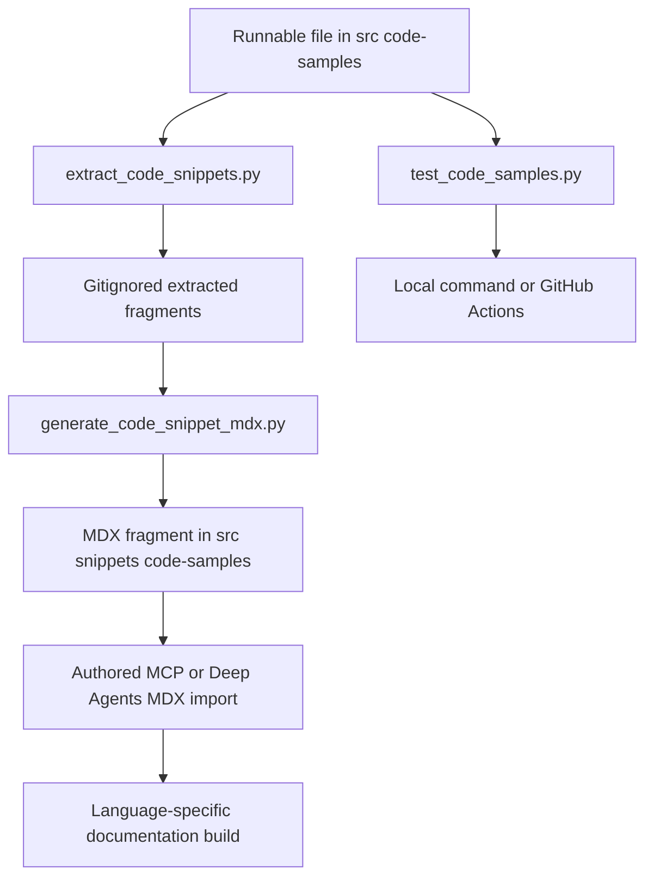

# Executable Code Samples to Embedded Snippets

## Purpose and ownership

This repository maintains documentation examples as executable programs under `src/code-samples/`, then derives displayable MDX fragments under `src/snippets/code-samples/`. The source program is the place to make an example runnable and to mark the portion readers should see; the MDX page is responsible for importing the derived fragment and placing its component in the relevant language branch. The intermediate `src/code-samples-generated/` directory is deliberately gitignored, so it is disposable generator output rather than an artifact to edit or commit.

This is a distinct validation boundary from ordinary unit tests. `make test` runs pytest with network sockets disabled, whereas `make test-code-samples` intentionally runs programs that can need provider credentials, live services, and a local database. Use the smallest focused sample run while authoring, and run extraction only after that executable check succeeds.



This shows the two coupled paths: execution validates the whole source program, while extraction and generation provide the component rendered by an authored documentation page.

## Authoring the executable source

A supported sample is a `.py`, `.ts`, `.java`, `.kt`, `.go`, or `.sh` file below `src/code-samples/`; recursive discovery excludes `__pycache__` and `node_modules`. Keep a sample self-contained enough for its selected runtime: Python runs from the repository root, while TypeScript, Go, and shell run from `src/code-samples/`, where their shared dependency configuration is available. Java and Kotlin are single-file JBang programs. The project dependencies include the Python LangChain, MCP, Deep Agents, FastMCP, PostgreSQL, and provider libraries; the TypeScript samples use the package manifest in `src/code-samples/`.

Use line-comment markers to select one or more visible fragments from a runnable file:

- `# :snippet-start: <id>` and `# :snippet-end:` for Python and shell; `//` equivalents for TypeScript, Java, Kotlin, and Go.
- `:remove-start:` / `:remove-end:` with the matching comment style to exclude setup, assertions, or cleanup from a selected fragment.
- Optional first-body markers `:codegroup-tab:` and `:codegroup-fence-mods:` control a generated Mintlify tab label and fence modifiers without appearing in the code.

The extractor is deliberately line-based rather than a TypeScript parser. It recognizes only full comment-marker lines, allowing strings that contain `/**` without confusing a parser. It rejects an unclosed snippet or removal region, dedents a collected body, normalizes it to Unix newlines with one trailing newline, and writes a file named from the source stem, snippet ID, and source extension. With no filter it clears old supported intermediate outputs before scanning all sources. With `CODE_SNIPPET_SOURCES`, it accepts only existing supported files beneath `src/code-samples/`, deletes outputs for just those source stems, and leaves other intermediate outputs in place.

### Keep runnable and readable views aligned

The sample runner executes the complete source file, not an extracted fragment. A `:remove:` region is therefore useful for local test plumbing that must not appear in documentation—but only if the program still executes the code whose reader-facing behavior it is intended to validate. A representative Python MCP sample keeps the public `MCPAdapter` discovery and `create_deep_agent` code in its snippet, while hidden code runs a real in-process FastMCP server and asserts that its `ping` tool was discovered. Its visible fragment can be concise without turning the runtime check into a mock.

Review the actual execution path when changing a sample. In particular, the current TypeScript MCP example has a `process.exit(0)` in a leading removed block, so its runner validates basic Deep Agents wiring but exits before the later visible MCP example runs. Marker removal affects generated display, not program control flow. Do not treat the presence of markers alone as proof that a reader-visible path has been exercised.

## From fragments to MDX components

Run the generation pipeline from the repository root:

```bash
make test-code-samples FILES="src/code-samples/langchain/mcp-connections.py"
make code-snippets
```

`make code-snippets` first runs the extractor and then the MDX generator. The generator scans the intermediate output for all six supported extensions, strips the optional tab and fence markers, and emits a normal fenced code block unless it recognizes an expandable Deep Agents model declaration. Names are a contract: only snippet IDs ending in `-py`, `-js`, `-java`, `-kt`, `-go`, or `-sh` are emitted, and the extension determines the output language and corresponding suffix. A marker with another suffix can extract successfully yet produce no MDX component.

For Python and TypeScript fragments that contain an eligible quoted `model` assignment or property, the generator replaces the same canonical model ID in each generated copy and wraps the copies in a seven-tab `<CodeGroup>` (Google, OpenAI, Anthropic, OpenRouter, Fireworks, Baseten, and Ollama). `# KEEP MODEL` or `// KEEP MODEL` immediately before a model line removes that marker and exempts that occurrence from expansion. This is a presentation transform: it preserves the assignment/property syntax and does not change the executable source.

Generated components are imported by authored pages, not discovered automatically. For example, `src/oss/langchain/mcp/connections.mdx` imports `mcp-lifecycle-short-py.mdx` and renders `<McpLifecycleShortPy />` inside a `:::python` branch. The public fragment comes from `mcp-connections.py`, whose hidden harness validates it against an in-process HTTP MCP server. The Deep Agents tools page separately imports Python and TypeScript MCP fragments and renders each only in its matching `:::python` or `:::js` block; the Python fragment is also reused by the Deep Agents customization page. Consequently, renaming a snippet ID, moving it, or changing its language suffix requires updating every page import and component use, then validating a documentation build.

Shared OSS pages build into Python and JavaScript variants. The Markdown preprocessor rewrites supported `/snippets/...` imports to the target language snippet path in a language-targeted build, so page authors should use the unprefixed import form shown above and keep language-specific components inside the matching conditional block. See [Writing Versioned Content](/openwiki/workflows/versioned-content.md) and [Markdown Transformation and Cross-Reference Semantics](/openwiki/concepts/preprocessing.md) for the build-side rules.

## Running examples locally

The main entrypoint is:

```bash
make test-code-samples
```

It installs the TypeScript dependencies if `src/code-samples/package.json` exists, then calls `scripts/test_code_samples.py`. To limit work to changed or newly authored programs, provide a space-separated list of repository-relative paths through `FILES`; invalid paths, files outside `src/code-samples/`, and unsupported extensions are warned about and skipped. An empty resulting selection is successful but does not attest to any sample.

Each program receives a copy of the caller environment, so credentials and `POSTGRES_URI` reach child processes. The runner uses `uv run python`, `npx tsx`, `go run`, `bash`, or `jbang --java 21` according to the extension. JBang is pinned to Java 21 and attempts to discover a matching JBang-managed JDK if `JAVA_HOME` is absent. Every invocation has a 600-second timeout; a timeout, missing executable, or nonzero result is reported with captured standard output and error, and ordinary failures make the command nonzero.

Some examples require PostgreSQL. Their helper uses `POSTGRES_URI` first; otherwise it attempts a pgvector testcontainer, then Docker, and finally assumes the default local PostgreSQL URI. It also exposes a cleanup function that drops the shared store tables before a sample recreates its schema. Prefer setting `POSTGRES_URI` explicitly for a reproducible local run rather than relying on this fallback chain.

## CI: selection, isolation, and external failure policy

`.github/workflows/test-code-samples.yml` runs separately from the normal CI fan-out. It is triggered by pull requests that change `src/code-samples/**` or the workflow itself, manually, and on Sunday at 00:00 UTC. It cancels superseded runs for the same workflow/ref. Scheduled and manual events run every eligible sample; a same-repository pull request computes its merge base and passes only changed supported source files to `make test-code-samples`.

The workflow intentionally skips fork pull requests because GitHub does not expose repository secrets to them. For eligible runs it supplies provider and LangSmith credentials (including `ANTHROPIC_API_KEY`, `OPENAI_API_KEY`, `TAVILY_API_KEY`, and `LANGSMITH_API_KEY`) as environment variables, provisions a `pgvector/pgvector:pg17` PostgreSQL service, waits for TCP readiness, and exports its local `POSTGRES_URI`. It also installs Python 3.13 with `uv`, Node 20, Java 21/JBang, and Go based on the samples' `go.mod`. Job limits are 60 minutes for pull requests and 90 minutes for scheduled/manual full runs; these are distinct from the per-program 600-second limit.

Live service overload has a narrow exception. If an unsuccessful sample's output contains `429` plus a recognized rate-limit phrase, the runner retries it up to three times with a 15-second delay. A sample still matching that condition is reported as skipped and does not fail the run; any other unsuccessful result remains a failure. This policy is specifically for transient LangSmith API rate limiting, not a general mechanism to ignore flaky or broken examples.

## Safe change checklist

1. Put the complete runnable program under `src/code-samples/` and give every exported fragment a stable, correctly suffixed snippet ID.
2. Run `make test-code-samples FILES="..."` with the required keys and service configuration. Confirm that the visible path, rather than only a test prelude, executes.
3. Add or adjust marker boundaries and hidden setup; rerun `make code-snippets` and inspect the affected MDX output.
4. Update imports and component placement in the authored MCP or Deep Agents page, preserving `:::python`/`:::js` boundaries where relevant.
5. Run the focused sample again after any change to its runtime wiring, then use build/link validation when imports, page content, or output paths changed. Do not edit `src/code-samples-generated/`.

For the broader test-selection model, see [Testing and Validation Strategy](/openwiki/testing/test-overview.md); for workflow conventions see [GitHub Actions, CI, and Scheduled Maintenance](/openwiki/integrations/github-actions.md).
