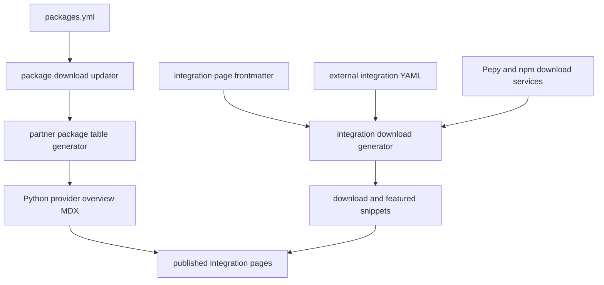

## Two related catalogs, with different sources of truth

The repository has two generation paths that both present integration popularity, but they should not be confused:

| Published content | Primary authored data | Generator | Output |
| --- | --- | --- | --- |
| Python **Popular providers** landing-page table | `packages.yml` | `pipeline/tools/partner_pkg_table.py` | `src/oss/python/integrations/providers/overview.mdx` |
| Component download tables, for Python and JavaScript | `integration:` frontmatter on individual integration MDX pages plus `scripts/data/integration_external_docs.yaml` | `scripts/refresh_integration_downloads.py --write` | `src/snippets/oss/{language}-{component}-downloads.mdx` and applicable `-featured.mdx` files |

`packages.yml` is the package/repository registry. It records the Python package name, repository and optional repository subpath, display and provider-page overrides, TypeScript package mapping, whether an entry is an integration, curation flags, and stored monthly-download data with its update timestamp. The provider-overview generator derives presentation fields from that registry; the generated overview explicitly says not to edit it by hand.

The component snippets are deliberately a separate inventory. A hosted guide opts in by giving its frontmatter an `integration` mapping with a `name` and, where downloads apply, `pypi` or `npm`; it can also declare `featured`, `deprecated`, chat capabilities, and component-specific fields. For example, the OpenAI embeddings guide supplies `name`, `featured`, and its PyPI package. Entries not yet represented by a hosted guide belong in `integration_external_docs.yaml`, where their name links to partner documentation rather than an invented hosted route. An embedding landing page imports both generated all-downloads and featured snippets.



This shows the separate inputs that converge only at the published documentation layer.

## Provider overview derivation

The provider generator loads every package record, derives `name_short` by removing a leading `langchain-` or trailing `-langchain`, derives a display title unless `name_title` was authored, and classifies each record as monorepo, LangChain-organization, third-party, or ignored. The hard-coded ignore set excludes core and non-provider packages. It then retains only packages with at least 100,000 recorded downloads, except that maintainer-controlled `highlight: true` entries bypass the threshold; highlighted entries sort first, followed by descending downloads, and the result is capped at 50 rows.

Each emitted row has a provider link, a package link, monthly-download and PyPI-version badges, and a JS/TS-support cell. `js: "n/a"` renders **N/A**; a real JS package gives an npm link; absence renders no JS support. The badges link to PyPI, even when the package-name link targets generated reference documentation.

### Provider link resolution

The provider URL is resolved rather than assumed from a package name. The generator checks, in order:

1. An absolute `provider_page` URL in `packages.yml`.
2. A locally hosted provider page or provider directory named by a relative `provider_page` override.
3. A local page/directory named by the derived short name.
4. A matching `<Card title=… href=…>` from the authored `all_providers.mdx` catalog. Matching includes title and normalized short-name variants, and may intentionally yield an external partner URL.
5. `https://github.com/{repo}` when the registry contains a repository.
6. The package's PyPI project page as the final fallback.

This ordering makes `provider_page` the extension point for mismatches such as a package whose guide uses another slug, while allowing a package without a hosted guide to continue linking to an authored provider card, its repository, or PyPI. `all_providers.mdx` itself is authored provider-card content; it is an input for fallback resolution, not an output of this generator.

### Package and reference links

The package-name target is independent of the provider target. Monorepo and `langchain-ai` organization packages receive a `reference.langchain.com` URL. Third-party packages receive that URL only when `has_reference_docs: true`; otherwise they link to PyPI. Integration records use `https://reference.langchain.com/python/integrations/{package_name_with_underscores}/`, while non-integration records use `https://reference.langchain.com/python/{package_name}/`. A record may not combine `has_reference_docs: true` with `integration: false`: generation raises `ValueError` rather than silently selecting an ambiguous URL.

## Download snippet generation and presentation

`refresh_integration_downloads.py` scans supported component subtrees for MDX files, skipping index/template/example-data files. It ignores a file without usable `integration` frontmatter or a mapping without `integration.name`, logging a warning. It merges the external rows for the same language/component, fetches a given `(registry, package)` at most once per run, and orders rows with numeric downloads first in descending order and then by name; unavailable counts sort after known ones.

For a Python row, `pypi` selects Pepy; for a JavaScript row, `npm` selects the npm API. Missing, blank, or `-`-prefixed package values produce an **N/A** download cell. Pepy and npm requests have a 20-second timeout and retry HTTP 429 up to six times with exponential backoff (capped at 30 seconds). Other retrieval, parsing, or API failures are reported as warnings and make that row N/A rather than terminating the whole table. Generated badges retain the fetched numeric count in `data-sort-value` as an offline/first-paint value.

The table schema is component-aware: chat tables expose declared streaming, tool-calling, structured-output, and multimodal capability marks; middleware, retriever, and vectorstore tables have their respective extra columns; other components show an integration name and downloads. The generator writes an all-rows snippet and writes a featured snippet whenever a component has featured rows (always for chat). It marks every generated snippet as hand-edit forbidden.

At page load, `src/integration-downloads-table.js` enhances the generated wrapper into a keyboard-accessible sortable table. It initially sorts the Downloads column descending, re-fetches live badge SVGs without credentials, updates sortable values when parsing succeeds, and re-sorts. Failed browser fetches preserve the baked-in value. This means table order can reflect newer live badge values than the committed snippet.

### Safe external documentation links

External rows must include `docs_url`; their name column uses that URL instead of `/oss/integrations/{path}`. The generator accepts only `http://`, `https://`, or a single-slash site-relative path, rejects empty, protocol-relative, and executable/data schemes, and raises for an unsafe external-catalog entry during collection. Its `--check-docs-urls` mode performs this validation without network requests or writes. CI runs that mode, and focused unit tests prove unsafe links are dropped or cannot be emitted in Markdown.

## Generated versus authored responsibilities

**Author and review:** `packages.yml`; provider cards in `all_providers.mdx`; hosted integration guides and their `integration:` frontmatter; `integration_external_docs.yaml`; the two generators; and the JavaScript enhancement. Update the appropriate input, not the emitted table.

**Regenerate rather than hand-edit:** the Python provider `overview.mdx` and the `src/snippets/oss/*-downloads.mdx` and `*-featured.mdx` tables. Ordinary PR CI reruns only the provider-overview generator and fails if the committed overview differs. It is therefore possible for an integration snippet to need an explicit local regeneration even though that particular drift check is not part of `check-generated-files`.

Use these commands after installing the test group when needed:

```bash
uv sync --group test
uv run python pipeline/tools/partner_pkg_table.py
uv run python scripts/refresh_integration_downloads.py --write
uv run python scripts/refresh_integration_downloads.py --check-docs-urls
```

Use `--language` and `--component` with the snippet generator to narrow a local regeneration; without `--write`, it prints generated tables for inspection.

## Weekly maintenance and review lifecycle

`.github/workflows/update-package-downloads.yml` runs at 23:59 UTC every Sunday and also supports manual dispatch. The generation job installs the test dependency group, updates stale `packages.yml` download counts, regenerates the provider overview and all integration snippets, runs the hosted-docs candidate flagger, and uploads the changed registry and generated files as a one-day artifact.

The package updater calls Pepy monthly badge endpoints, parses ordinary, `k`, and `M` counts, and preserves YAML quotes/comments/formatting with `ruamel.yaml`. It enforces unique package names, skips records updated in the previous 24 hours, and stamps refreshed records with a UTC ISO timestamp. A Pepy 404 is recorded as zero—appropriate for a package that has not been indexed—whereas other request failures abort the updater. Thus a manual run shortly after a successful refresh normally produces no package-count changes.

A second job downloads the artifact and compares `packages.yml`, the provider overview, and snippets. If nothing changed, it exits. Otherwise it creates a timestamped branch, commits only those generated artifacts as `github-actions[bot]`, opens a PR against `main`, and enables squash auto-merge. CI intentionally skips the provider-overview drift check for this bot PR title, avoiding a redundant regeneration check on a workflow-produced change.

The candidate step is a separate curation signal, not automatic publication: it examines external integration rows that meet the 50,000 monthly-download threshold and deduplicates against open Linear issues. It is dry-run when either `LINEAR_API_KEY` or `LINEAR_TEAM_KEY` is unavailable; only with both does the workflow request issue creation. This preserves reviewability and prevents an uncredentialed refresh from gaining write access to Linear.

## Safe change checklist

1. Decide which catalog owns the change: package/provider discovery belongs in `packages.yml`; component-table discovery belongs in guide frontmatter or the external catalog.
2. For a package record, set a provider-page override only when default local discovery is wrong; set `has_reference_docs` only when the reference site actually hosts the third-party package.
3. For external rows, supply a safe, preferred partner-docs URL (then GitHub, then package registry) and validate it with `--check-docs-urls`.
4. Regenerate the affected output, review link targets, inclusion/sort effects, and the diff, then rely on CI's overview-drift check and URL-scheme check.
5. Do not interpret a changed badge image or browser-side sort order alone as a source change: live badge refresh is intentionally independent of the committed snapshot.

Related documentation: [source and build ownership](/openwiki/architecture/source-map.md), [reference documentation](/openwiki/integrations/reference-docs.md), [GitHub Actions](/openwiki/integrations/github-actions.md), [adding pages](/openwiki/operations/adding-pages.md), and [testing overview](/openwiki/testing/test-overview.md).
