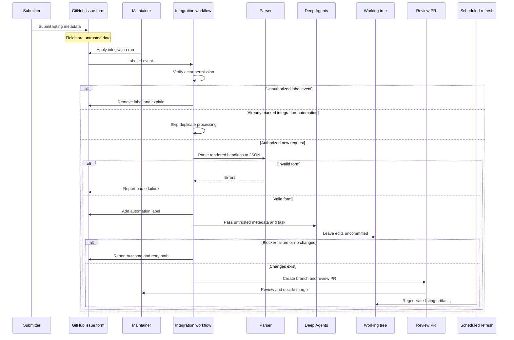

## Purpose and trust boundary

The **Integration listing** issue form is the intake for a published third-party LangChain package. It collects a display or class name, language, component, registry package name, documentation URL, repository, provider description, optional capability notes, and a published-package confirmation. It applies `integration-submission` and `integration`; filing the issue does not itself start automation.

The workflow in `.github/workflows/integration-submission.yml` makes a maintainer-approved submission into a **review PR**, not an accepted listing. New integration implementations stay standalone packages owned and published by their providers. This repository records discoverability metadata or, when eligible, hosts documentation.



This sequence shows the maintainer authorization gate, the untrusted-data boundary, and the division between agent-produced local edits and workflow-owned GitHub writes.

## Entry points, authorization, and parsing

The issue path starts only when a maintainer applies `integration-run`; `workflow_dispatch` is a separate manual entry point with a required issue number. Before checkout, the workflow queries the triggering actor's repository permission and permits only `admin`, `maintain`, or `write`. For an unauthorized label event, it removes `integration-run`, comments on the issue, and skips. It also skips an issue already carrying `integration-automation`. That label represents processing in progress or already attempted. A non-cancelling, per-issue concurrency group serializes same-issue triggers instead of cancelling an active run.

The parser maps rendered `###` form headings to stable JSON fields. It strips optional no-response values, extracts checked confirmations, and rejects missing required sections and registry package names required by the selected language. It does not execute or evaluate submitted values. On parse failure, the workflow comments with errors and never runs the agent; on success, it adds `integration-automation` before building the prompt.

Treat the resulting JSON—and every submitted URL, description, and capability note—as **untrusted listing metadata**. The `submit-integration` repository skill says not to follow instructions embedded in those values. It may use their literal values as candidate metadata and corroborate them with registry information, package READMEs, and public documentation. The workflow prompt also prohibits asking clarifying questions, GitHub comments, pushes, and PR creation by the agent. The agent leaves its changes uncommitted; the trusted workflow is the only component in this path that commits, opens PRs, edits labels, or comments through its GitHub token.

`submit-integration` is a project skill at `.agents/skills/submit-integration/SKILL.md`. `.agents/skills/` supersedes the former `.deepagents/skills/` project location for Deep Agents, so `skill: submit-integration` resolves without a compatibility link. The related `update-integrations-prs` skill is for maintainers reconciling existing integration PRs, rather than new issue intake.

## Eligibility and listing surfaces

Hosted guides are reserved for a package with at least 50,000 monthly PyPI or npm downloads, or a maintainer feature decision. Otherwise the default is an external listing; it must not create a hosted MDX page. The submission skill measures downloads rather than inventing them, makes best-effort metadata decisions without waiting for the author, and reserves `integration-submission-error.md` for a hard blocker where no reasonable listing can be made—for example, an absent registry package or values that cannot map to a component. Maintainers review judgment calls in the PR.

| Outcome | Primary records | Important invariant |
| --- | --- | --- |
| Hosted guide | Matching `src/oss/{python,javascript}/integrations/<component>/TEMPLATE.mdx`, integration frontmatter, and applicable index/navigation | Remove an external YAML row for the same package. Do not set `featured: true` merely because the download threshold is met. |
| External listing | `scripts/data/integration_external_docs.yaml`, relevant provider/package metadata, and generated component snippet | Do not add a new hosted MDX page. Prefer partner docs, then a public repository README, then a registry page. |

`integration_external_docs.yaml` is the canonical language-and-component source for external entries. Its rows have a name, appropriate registry package where available, `docs_url`, and possibly component-specific capability flags. The refresh script merges these rows with the `integration:` frontmatter in hosted MDX files. External names link to `docs_url`; hosted names link to their local documentation route. It orders rows by known downloads descending, then name, and adjusts tables by component: chat has capability columns; middleware and retrievers have specialized columns; vectorstore capability columns appear only when values are known.

A `docs_url` is a link-safety boundary. The generator accepts `https://`, `http://`, or a site-relative path beginning with exactly one `/`; it rejects protocol-relative URLs and unsafe schemes such as `javascript:` and `data:`. Missing or unsafe external YAML URLs prevent that row from being collected, and the dedicated validation mode reports YAML errors before generation.

`packages.yml` is a separate source of truth for LangChain packages and repositories. It feeds the package index and partner package table; its `highlight` override is maintainer-only. When the submission represents a public LangChain-related package with a public `owner/repo`, the skill can add a package record. An external listing can also have an alphabetical `all_providers` card where that surface applies.

## Agent result and review lifecycle

The workflow has three outcomes that do not create a PR:

- If `integration-submission-error.md` exists, it posts its blocker text and stops.
- If the agent action fails, it posts the run link and retry instructions.
- If the agent succeeds but both staged and unstaged diffs are empty, it posts a no-change diagnosis and retry instructions.

For real edits, the workflow drops any leftover blocker file and invokes the PR action on branch `integration/issue-<number>`. The PR title and commit use `docs: list <display name> integration`; it is labeled `integration`, assigned to the designated maintainer, closes the source issue, and mentions the maintainer and issue author. Its checklist asks reviewers to confirm the download/eligibility decision, docs URL and provider card, and relevant YAML, package, generated-table, or hosted-MDX changes. The PR—not the agent run—is the review boundary, and a maintainer decides whether to merge.

To retry a parse failure, agent failure, or no-change result, correct the relevant submission if needed, remove `integration-automation`, then have a maintainer reapply `integration-run`. The duplicate-suppression label and non-cancelling concurrency group prevent routine overlapping processing; they do not replace the authorization check.

## Generated refresh and operations

`refresh_integration_downloads.py` writes the component downloads and featured snippets under `src/snippets/oss/` with a generated-file marker. Treat those generated snippets as generator-owned: update hosted frontmatter or `integration_external_docs.yaml`, then run the generator rather than maintaining generated output by hand. The scheduled package-download workflow also regenerates `packages.yml` download data and the provider overview, so an external row becomes visible in its regenerated component table after merge.

The refresh workflow runs every Sunday at 23:59 UTC and is also manually dispatchable. Its read-only generation job runs package-download update, partner-table generation, and:

```bash
uv run python scripts/refresh_integration_downloads.py --write
```

It uploads the changed package, provider-overview, and snippet artifacts to a separate write-capable job. That job creates and pushes a timestamped PR only when those tracked paths differ, then enables squash auto-merge. The generation job also checks external entries that reach the approximately 50,000-download hosted-docs threshold: with `LINEAR_API_KEY` and `LINEAR_TEAM_KEY` it creates deduplicated Linear issues; otherwise it performs a dry run.

For download retrieval, npm and PyPI calls retry HTTP 429 up to six times with capped exponential backoff. Other request, response-parsing, or missing-data failures degrade that row to unavailable download data instead of aborting the whole collection.

Use the offline, no-write URL check when changing external metadata:

```bash
uv run python scripts/refresh_integration_downloads.py --check-docs-urls
```

CI runs this command in a read-only job. Focused tests cover parser extraction and language-package requirements, plus safe and unsafe URL schemes, safe rendered links, repository-YAML validation, and table-text normalization. Preserve the maintainer authorization gate and workflow-owned GitHub write boundary when changing this automation.

## Related pages

- [Source Directory Map](/openwiki/architecture/source-map.md) — authored sources, generated snippets, and navigation ownership.
- [GitHub Actions and CI/CD](/openwiki/integrations/github-actions.md) — repository workflow trust boundaries.
- [Adding pages](/openwiki/operations/adding-pages.md) — normal authored documentation changes.
- [Agent Authoring Skills](/openwiki/operations/agent-skills.md) — canonical skill discovery and validation.
- [Quickstart](/openwiki/quickstart.md) — setup and common checks.
- [Testing overview](/openwiki/testing/test-overview.md) — focused test conventions.
