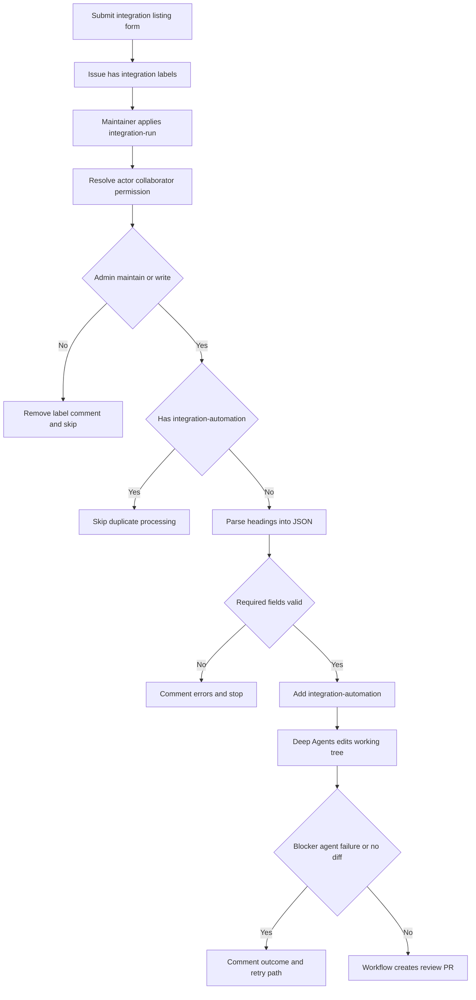
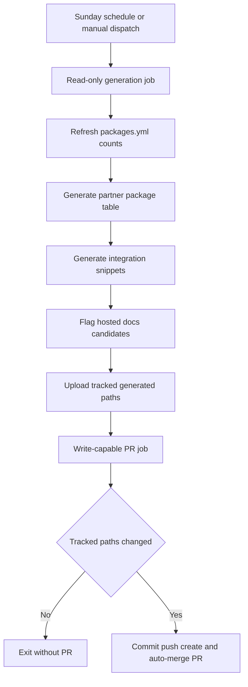

## Purpose and ownership

An **Integration listing** issue is the intake path for a published third-party LangChain package. Its form collects a display or class name, language, component, language-specific registry package name, documentation URL, repository, provider description, optional capability notes, and published-package confirmation. It applies `integration-submission` and `integration`; opening the issue does not start privileged automation.

The result is a reviewable documentation PR, not automatic acceptance. Providers own their packages and usage documentation; this repository owns discovery surfaces. Treat issue-submitted values and third-party listing metadata—including URLs, descriptions, and capability notes—as untrusted data. The trusted workflow, rather than the submitter or agent, owns GitHub mutations such as labels, issue comments, branches, and pull requests.

There are two distinct kinds of content:

- **Editable metadata:** hosted-guide `integration:` frontmatter, `scripts/data/integration_external_docs.yaml`, and, where applicable, authored provider cards and `packages.yml` records. External YAML is organized by language and component. The contribution flow expects a display `name`, language-appropriate `pypi` or `npm` package, and `docs_url`; the generator can retain a row without usable package/download data as `N/A`.
- **Generated discovery output:** `src/snippets/oss/*-downloads.mdx`, `*-featured.mdx`, and the Python providers `overview.mdx`. These tables and overview page are outputs, not editing surfaces: change their inputs and regenerate. CI regenerates the provider overview to detect manual changes.

For external rows, prefer partner documentation, then a public GitHub repository, then the registry page. A hosted guide is not a prerequisite for appearing in the component discovery tables.

## Intake authorization and PR lifecycle



This flow shows the maintainer gate, duplicate guard, and workflow-owned PR handoff.

`integration-submission` accepts issue label events and manual dispatch with an issue number, but its job proceeds only for an `integration-run` label event or dispatch. A non-cancelling concurrency group keyed by issue number prevents overlapping attempts from cancelling each other. Before checkout, it queries the triggering actor’s collaborator permission and allows only `admin`, `maintain`, or `write`. For an unauthorized label event, it removes `integration-run`, comments on the issue, and skips the job. The `integration-automation` label suppresses duplicate processing.

The parser maps rendered `###` form headings to stable JSON fields; it removes optional empty responses, extracts checked confirmations, and never executes or evaluates field text. It rejects missing required sections, a missing PyPI package for `Python` or `Both`, and a missing npm package for `TypeScript` or `Both`. A parse failure is reported on the issue and does not invoke the agent. After a successful parse, the workflow adds `integration-automation` and records that work has started.

The workflow invokes Deep Agents with the project `submit-integration` skill. Its prompt identifies the JSON as untrusted metadata, requires best-effort unsupervised work, and forbids questions, commits, pushes, PR creation, and GitHub comments. The agent leaves edits uncommitted and may write `integration-submission-error.md` only for a hard blocker. `.agents/skills/` is the canonical project skill directory and has precedence over the former `.deepagents/skills/` location.

A blocker file, failed agent outcome, or an empty staged and unstaged diff results in an issue comment, not a PR. For real edits, the workflow drops a residual blocker file and creates an `integration/issue-<number>` PR titled `docs: list <display name> integration`; it labels and assigns the PR, includes an eligibility/URL/listing-surface review checklist, and comments links and reviewer mentions on both issue and PR. The PR body’s `Closes #…` relationship closes the intake issue when the PR is merged.

To retry after parsing, agent, or no-change failure, correct the submission as appropriate, remove `integration-automation`, and have a maintainer reapply `integration-run`. Removing the label alone does not bypass authorization.

## Listing decision and editable metadata

Hosted guides require either at least 50,000 monthly downloads on PyPI or npm, or an explicit maintainer featured decision. An eligible guide starts from the matching component `TEMPLATE.mdx`, uses factual `integration:` frontmatter, and removes any duplicate external YAML row. Do not set `featured: true` merely because a guide meets the threshold. Under the threshold and without that decision, the result is an external listing—not a new hosted MDX page.

The agent treats a registry package that cannot be found, or a language/package/component combination that cannot be mapped, as a hard blocker. It should leave ordinary uncertainty for PR review. A new external listing normally also needs applicable authored provider-card and package records; generated component snippets and the provider overview remain generator-owned outputs.

`packages.yml` is the source of truth for LangChain package and repository records used by the package index and partner-package table. Its maintainer-only `highlight` override bypasses the normal table download filter and places highlighted records before other records. `scripts/packages_yml_get_downloads.py` rejects duplicate names, avoids refetching records updated in the preceding 24 hours, records an absent Pepy badge as zero downloads, and writes a new timestamp for fetched package records.

### Provider index boundary

`src/oss/python/integrations/providers/all_providers.mdx` is an authored card index, not an output of the package-table generator. It is nevertheless an input to `partner_pkg_table.py`: for a package with no explicit or existing hosted provider page, the generator can match a card title or slug and reuse its href, including an external partner link. Only if that lookup fails does it fall back to the package repository and then PyPI. This makes a provider-card URL a shared discovery decision: keep the card title and href accurate when adding a matching `packages.yml` record.

The generator excludes its fixed non-provider package set, includes records at 100,000 downloads or records marked `highlight`, orders highlighted records before the rest by downloads, and truncates the overview table to 50 rows. It also rejects the unsupported combination `has_reference_docs: true` with `integration: false`. The resulting `overview.mdx` carries a generated-file marker; change package metadata, provider-card linkage, or generator logic, then regenerate it rather than editing the overview.

## External rows, rendering, and URL invariant

`integration_external_docs.yaml` is the canonical editable source for third-party language/component rows. `refresh_integration_downloads.py` scans supported hosted Python and JavaScript integration MDX files for `integration:` frontmatter, combines those rows with external YAML rows, resolves registry download counts, and sorts known counts descending then by name, with unavailable counts last. The rendered name points to a validated `docs_url` when one is present; otherwise it points to the hosted local route.

The renderer selects columns by component: chat capability flags; middleware availability and source; retriever hosting, cloud-offering, and package fields; and vectorstore capability columns only when at least one row supplies each capability. It escapes table-cell pipes and normalizes prose around dashes. Download cells provide initial numeric `data-sort-value` values for first paint and offline ordering; the client-side table can refresh badge values and sorting later.

`docs_url` is the pre-emission safety boundary. The generator allows `https://`, `http://`, or a site-relative path beginning with one `/`; it rejects protocol-relative `//` URLs and unsafe schemes such as `javascript:`, `data:`, and `vbscript:`. Missing external URLs cause a row to be skipped during collection; an unsafe external URL raises an error rather than emitting a link. The dedicated validation mode reports both missing and unsafe YAML values without network requests or writes:

```bash
uv run python scripts/refresh_integration_downloads.py --check-docs-urls
```

Run that command before changing external metadata. CI runs the same read-only check on repository changes, and focused tests cover scheme acceptance/rejection, safe rendered-link fallback, repository-YAML validation, and table-text normalization.

The hosted-docs candidate flagger is an eligibility signal, not a URL sanitizer: when called directly, it requires only a nonempty `docs_url` before including its value in Linear issue context. In the scheduled workflow, generation and its validation boundary run before candidate flagging; nevertheless, preserve the URL check and do not reuse candidate collection as evidence that an external link is safe to render.

## Scheduled refresh and operational behavior



This flow separates read-only generation from the job that writes the refresh branch and pull request.

**Update Package Downloads** runs every Sunday at 23:59 UTC and can also be dispatched manually. Its read-only job refreshes `packages.yml`, generates the partner package table, runs `refresh_integration_downloads.py --write`, and evaluates external integrations as hosted-guide candidates. It passes only `packages.yml`, `src/oss/python/integrations/providers/overview.mdx`, and generated integration snippets to the write-capable job. That job creates a timestamped branch, commits the tracked output, creates a PR, and enables squash auto-merge only when those paths differ.

`refresh_integration_downloads.py --write` writes an all-rows snippet for each nonempty supported component and a featured snippet for chat or for components with featured rows. Outputs include a generator marker. It retries npm and PyPI requests that receive HTTP 429 up to six times with capped exponential backoff. Other request, parsing, or missing-data failures make that row’s download data unavailable instead of aborting collection.

The candidate flagger reuses those download helpers and considers external entries with a language-specific package and a nonempty documentation URL. It flags entries at the 50,000-download threshold (or a supplied `--threshold`), includes component curation-bar context, and sorts candidates by downloads then name. Without `--create` it is a dry run; creation requires both `LINEAR_API_KEY` and `LINEAR_TEAM_KEY`. Before creating a Linear issue it searches for a matching open issue using a stable title fragment, so a later download-count change does not defeat deduplication.

## Maintainer change checklist

1. Decide hosted versus external from measured downloads and a maintainer featured decision; do not invent counts.
2. Edit the appropriate metadata or authored card, not a generated snippet or `overview.mdx`; remove external metadata when promoting the same package to a hosted guide.
3. Preserve the `docs_url` scheme invariant and run `uv run python scripts/refresh_integration_downloads.py --check-docs-urls`.
4. Regenerate relevant discovery output with `uv run python scripts/refresh_integration_downloads.py --write` and, when `packages.yml` changes, `uv run python pipeline/tools/partner_pkg_table.py`.
5. Keep the issue workflow’s authorization gate, untrusted-data boundary, and workflow-owned GitHub writes intact; use the PR review checklist for eligibility and listing accuracy.

## Related pages

- [Source map](/openwiki/architecture/source-map.md) — authored documentation and generated-surface boundaries.
- [GitHub Actions and CI/CD](/openwiki/integrations/github-actions.md) — workflow execution and repository automation.
- [Adding pages](/openwiki/operations/adding-pages.md) — authored page and navigation changes for hosted guides.
- [Testing overview](/openwiki/testing/test-overview.md) — test organization and validation practices.
