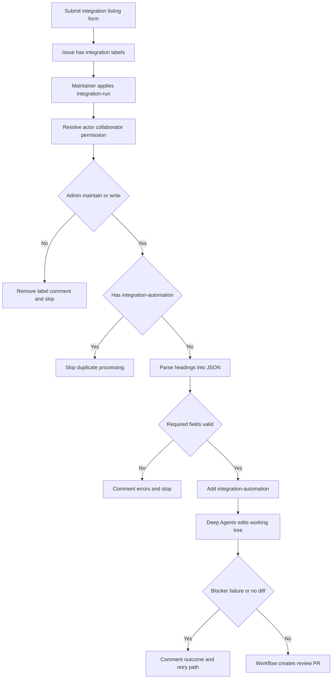
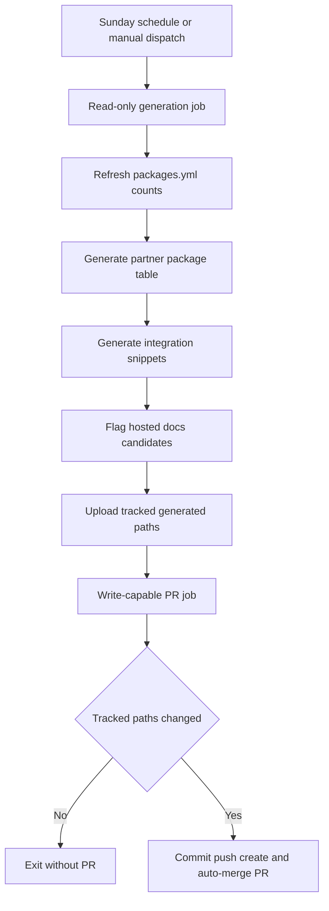

## Purpose and ownership

An **Integration listing** issue is the intake path for a published third-party LangChain package. The form collects a display or class name, language, component, language-specific registry package name, documentation URL, repository, provider description, optional capability notes, and a published-package confirmation. It automatically applies `integration-submission` and `integration`; opening an issue does not run privileged automation.

The result is a reviewable documentation PR, not automatic acceptance. Providers publish and own their packages; this repository owns their discovery surfaces. Treat issue-form values and external listing metadata—including URLs, descriptions, and capability notes—as untrusted data. The trusted workflow, rather than the agent or submitter, owns all GitHub writes such as labels, issue comments, branches, and pull requests.

Integration download snippets in `src/snippets/oss/*-downloads.mdx` and `*-featured.mdx` are generator-owned. Their inputs are hosted-guide `integration:` frontmatter and `scripts/data/integration_external_docs.yaml`; change those maintained sources and regenerate with `scripts/refresh_integration_downloads.py`. Do not manually edit generated snippets or tables.

## Intake authorization and PR lifecycle



This flow shows that a maintainer authorization decision precedes checkout and parsing, while only the workflow performs GitHub mutations.

The `integration-submission` workflow accepts labeled-issue events and manual dispatch with an issue number, but its job runs only for `integration-run` label events or dispatch. A non-cancelling concurrency group keyed by issue number serializes overlapping attempts. Before checkout, it calls the repository collaborator-permission API for the triggering actor and allows only `admin`, `maintain`, or `write`. An unauthorized label event removes `integration-run`, tells the issue author that a maintainer must start the work, and exits. An existing `integration-automation` label also suppresses duplicate processing.

The parser recognizes rendered `###` issue-form headings and maps them to stable JSON keys. It strips optional no-response values, extracts checked confirmations, and never executes or evaluates submitted text. It rejects absent required sections and requires a PyPI package for `Python` or `Both`, and an npm package for `TypeScript` or `Both`. A parse error is reported on the issue and the agent is not run. On success, the workflow adds `integration-automation` before preparing the handoff.

The handoff invokes the project `submit-integration` skill through Deep Agents. The prompt explicitly says that field values are untrusted listing metadata, requires best-effort unsupervised work, and prohibits questions, pushes, PR creation, and GitHub comments. The agent leaves changes uncommitted; it may create `integration-submission-error.md` only for a hard blocker where no reasonable listing is possible. `.agents/skills/` is the canonical skill location and takes precedence over the former `.deepagents/skills/` location, so the workflow needs no shim.

A blocker file, an unsuccessful agent outcome, or an empty staged and unstaged diff produces an issue comment rather than a PR. For a real diff, the workflow removes a residual blocker file and uses branch `integration/issue-<number>` to create a `docs: list <display name> integration` PR. The workflow labels and assigns it, closes the issue, and links the PR from the source issue while mentioning the maintainer and submitter. The review checklist covers eligibility, the documentation URL and provider card, and the applicable metadata, generated-table, package, or hosted-MDX changes.

To retry a parse failure, agent failure, or no-change result, correct the submission as appropriate, remove `integration-automation`, and have a maintainer apply `integration-run` again. Label removal alone is not an authorization bypass.

## Listing decision and source boundaries

Hosted integration guides require either at least 50,000 monthly PyPI or npm downloads or an explicit maintainer featured decision. Otherwise, use an external listing and do not add a hosted MDX guide. The skill treats missing registry packages or an unmappable language/package/component combination as hard blockers; ordinary uncertainty belongs in the PR for maintainer review.

| Listing outcome | Maintained source | Important boundary |
| --- | --- | --- |
| Hosted guide | Matching `src/oss/{python,javascript}/integrations/<component>/TEMPLATE.mdx`, its `integration:` frontmatter, and relevant navigation/index | Remove duplicate external metadata for the package. Meeting the threshold does not itself mean `featured: true`. |
| External listing | `scripts/data/integration_external_docs.yaml`, plus applicable authored provider/package records | No new hosted MDX guide. Prefer partner docs, then a public repository README, then a registry page. |

`integration_external_docs.yaml` is the canonical language-and-component source for external rows. The refresh script combines it with `integration:` frontmatter from hosted MDX pages. Hosted names receive local documentation links; external names link to `docs_url`. Rows with known counts sort by descending downloads and then name, with unavailable counts last. The renderer adds component-specific columns for chat capabilities, middleware availability/source, retriever hosting/offering/package, and vectorstore capabilities when present.

`docs_url` is a rendering safety boundary. The generator permits `https://`, `http://`, and a site-relative path beginning with exactly one `/`; it rejects protocol-relative `//` URLs and schemes such as `javascript:` and `data:`. Collection skips an external entry missing `docs_url`, but raises for an unsafe URL. The dedicated check reports both missing and unsafe YAML values without network requests or writes:

```bash
uv run python scripts/refresh_integration_downloads.py --check-docs-urls
```

`packages.yml` is a separate source of truth for LangChain package and repository records. It feeds the package index and partner package table. Its maintainer-only `highlight` override bypasses normal download filtering and orders highlighted packages first. `scripts/packages_yml_get_downloads.py` rejects duplicate names, leaves records updated in the preceding 24 hours untouched, records a missing Pepy badge as zero, and refreshes download timestamps for fetched records.

## Scheduled refresh and operational behavior



This flow separates read-only generation from the job that can write the refresh branch and pull request.

**Update Package Downloads** runs every Sunday at 23:59 UTC and also supports manual dispatch. Its read-only job updates `packages.yml`, regenerates the partner package table and integration snippets, and evaluates external entries as potential hosted-guide candidates. It passes only `packages.yml`, `src/oss/python/integrations/providers/overview.mdx`, and generated integration snippets to its write-capable PR job. That job creates a timestamped branch and a squash-auto-merge PR only when those tracked paths differ.

`refresh_integration_downloads.py --write` scans the supported Python and JavaScript component directories. It writes all-row snippets for nonempty components and featured snippets for chat or components with featured rows. Each output has a generator marker. Initial numeric `data-sort-value` values provide first-paint and offline ordering; the client-side table can later update badge values and sorting.

For npm and PyPI download retrieval, the refresh script retries HTTP 429 up to six times with capped exponential backoff. Other request, parse, or missing-data failures reduce that row to unavailable download data rather than stopping table collection. The candidate flagger shares these download helpers, considers external rows with valid language-specific packages, and flags the 50,000-download threshold. It creates deduplicated Linear issues only when both `LINEAR_API_KEY` and `LINEAR_TEAM_KEY` are configured; otherwise it runs as a dry run.

CI executes `refresh_integration_downloads.py --check-docs-urls` in a read-only job. Focused unit tests cover parser extraction and the Python package requirement, URL-scheme and rendered-link safety, repository-YAML validation, and table-text normalization. Preserve the authorization gate, untrusted-data boundary, workflow-owned GitHub writes, and generator ownership when changing this path.

## Related pages

- [Source map](/openwiki/architecture/source-map.md) — authored documentation, routes, and generated snippet boundaries.
- [GitHub Actions and CI/CD](/openwiki/integrations/github-actions.md) — workflow execution and repository automation.
- [Agent Authoring Skills](/openwiki/operations/agent-skills.md) — skill discovery and project skill ownership.
- [Quickstart](/openwiki/quickstart.md) — repository setup and contribution workflow.
- [Testing overview](/openwiki/testing/test-overview.md) — test organization and validation practices.
