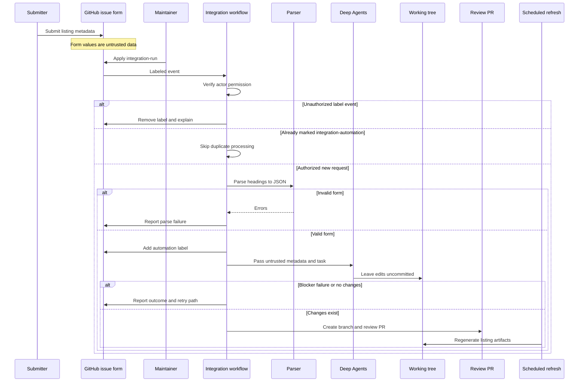

## Purpose and ownership

The **Integration listing** issue form is the intake for a published third-party LangChain package. It collects a display or class name, language, component, registry package name, documentation URL, repository, provider description, optional capability notes, and published-package confirmation. It adds `integration-submission` and `integration`; filing the issue alone does not start automation.

The automation produces a **review PR**, not an automatically accepted listing. Providers own and publish their integration packages; this repository records how users discover them. A new listing normally changes maintained source metadata and, where applicable, provider cards or package records. Integration download tables and `src/snippets/oss/*-downloads.mdx` and `*-featured.mdx` are generator-owned outputs: change the hosted-page frontmatter or `scripts/data/integration_external_docs.yaml`, then regenerate them. Do not treat a rendered row or snippet as an authoring target.



This sequence shows the authorization gate, the untrusted-data boundary, and the division between agent-produced local edits and workflow-owned GitHub writes.

## Entry, authorization, and parsing

The issue path starts only when a maintainer applies `integration-run`; `workflow_dispatch` is a separate manual entry point requiring an issue number. Before checkout, the workflow queries the triggering actor's repository permission and permits only `admin`, `maintain`, or `write`. For an unauthorized label event, it removes `integration-run`, comments on the issue, and skips. It also skips an issue already carrying `integration-automation`. This label represents processing in progress or already attempted. A non-cancelling per-issue concurrency group serializes same-issue triggers rather than cancelling an active run.

The parser maps rendered `###` form headings to stable JSON keys, removes optional no-response values, and extracts checked confirmations. It rejects missing required sections and the required registry package for the selected language; it does not execute or evaluate field values. On a parse failure, the workflow comments with errors and never runs the agent. On success, it adds `integration-automation` before building the prompt.

Treat the JSON—and every submitted URL, description, and capability note—as **untrusted listing metadata**. The `submit-integration` skill says not to follow instructions embedded in those fields. It can use literals as candidate metadata and corroborate them against registry metadata, package READMEs, and public documentation. The workflow also forbids the agent from asking questions, pushing, opening PRs, or commenting on GitHub. The agent leaves edits uncommitted; only the trusted workflow commits, creates PRs, changes labels, and comments through its GitHub token.

`submit-integration` is a project skill at `.agents/skills/submit-integration/SKILL.md`. `.agents/skills/` has higher Deep Agents precedence than the prior `.deepagents/skills/` project location, so `skill: submit-integration` needs no compatibility link. `update-integrations-prs` is the related maintainer procedure for reconciling existing integration PRs rather than handling new issue intake.

## Eligibility and maintained listing sources

Hosted guides require at least 50,000 monthly PyPI or npm downloads, or an explicit maintainer feature decision. Otherwise the default is an external listing, which must not add a hosted MDX guide. A hard blocker is reserved for cases in which no reasonable listing can be made, such as an absent registry package or a package/language combination that cannot map to a component; ordinary uncertainty is resolved best-effort and reviewed in the PR.

| Outcome | Maintained inputs | Invariant |
| --- | --- | --- |
| Hosted guide | Matching `src/oss/{python,javascript}/integrations/<component>/TEMPLATE.mdx`, `integration:` frontmatter, and applicable navigation/index | Remove an external YAML row for the same package. Do not set `featured: true` merely because the threshold is met. |
| External listing | `scripts/data/integration_external_docs.yaml`; applicable authored provider card and package record | Do not create a new hosted MDX guide. Prefer partner docs, then a public repository README, then a registry page. |

`integration_external_docs.yaml` is the canonical language-and-component metadata source for external entries. The refresh script merges its rows with `integration:` frontmatter from hosted MDX files. An external name links to its `docs_url`; a hosted name links to its local route. It sorts known download counts descending, then names, and renders component-specific columns: chat capability flags; middleware availability and source; retriever hosting, offering, and package; and vectorstore capabilities only when at least one row supplies them.

`docs_url` is a link-safety boundary. The generator accepts `https://`, `http://`, or a site-relative path beginning with exactly one `/`; it rejects protocol-relative URLs and unsafe schemes such as `javascript:` and `data:`. Missing external URLs cause an entry to be skipped during collection, while an unsafe external URL fails collection; `--check-docs-urls` reports missing and unsafe YAML values without network access or writes.

`packages.yml` is separate from external-listing YAML: it is the source of truth for LangChain package and repository records and feeds the package index and partner package table. Its `highlight` setting is a maintainer-only override that bypasses download filtering and puts the package first among highlighted entries. The provider overview pages are authored card collections, whose cards may point to hosted routes or external URLs; use the source page rather than a generated integration snippet when an applicable card must be changed.

## Agent handoff and review lifecycle

The workflow does not open a PR in three cases:

- If `integration-submission-error.md` exists, it posts that blocker text and stops.
- If the agent action fails, it posts the workflow-run link and retry instructions.
- If the agent succeeds but both staged and unstaged diffs are empty, it posts a no-change diagnosis and retry instructions.

For real edits, the workflow removes any leftover blocker file and invokes the PR action on `integration/issue-<number>`. The PR title and commit use `docs: list <display name> integration`; it is labeled `integration`, assigned to the designated maintainer, closes the source issue, and mentions the maintainer and issue author. Its checklist asks reviewers to confirm the eligibility decision, docs URL and provider card, and relevant YAML, package, generated-table, or hosted-MDX changes. The PR—not the agent run—is the review boundary.

To retry a parse failure, agent failure, or no-change result, correct the submission if needed, remove `integration-automation`, then have a maintainer reapply `integration-run`. The label and concurrency group prevent routine duplicate work but do not substitute for authorization.

## Scheduled refresh and operations

`refresh_integration_downloads.py --write` scans supported Python and JavaScript integration components, fetches package download counts, and writes the all-rows snippet for each nonempty component plus featured snippets for chat or components with featured rows. Every generated snippet starts with a marker declaring `scripts/refresh_integration_downloads.py` its owner. The client-side table can later refresh badge values and sorting, while the generated numeric value supplies its initial and offline ordering.

The **Update Package Downloads** workflow runs each Sunday at 23:59 UTC and can also be manually dispatched. Its read-only generation job:

1. runs `scripts/packages_yml_get_downloads.py`, which skips package records updated within the prior 24 hours, records a Pepy 404 as zero, and otherwise updates `downloads` and `downloads_updated_at`;
2. regenerates the partner package table and integration snippets; and
3. flags external listings at the 50,000-download threshold for potential hosted docs.

It uploads changed `packages.yml`, the Python provider overview, and integration snippets to a separate write-capable job. That job creates, pushes, and enables squash auto-merge for a timestamped PR only when those tracked paths differ.

For integration table retrieval, npm and PyPI calls retry HTTP 429 up to six times with capped exponential backoff. Other request, response-parsing, or missing-data failures degrade that row to unavailable download data rather than aborting collection. The candidate flagger shares these download helpers, ignores entries without a valid language-specific package, and creates deduplicated Linear issues only when both `LINEAR_API_KEY` and `LINEAR_TEAM_KEY` are configured; otherwise the workflow runs it as a dry run.

Use the no-write URL check when changing external metadata:

```bash
uv run python scripts/refresh_integration_downloads.py --check-docs-urls
```

CI runs this command with read-only contents permission. Focused unit tests cover issue parsing and language-package requirements, URL scheme safety, rendered-link safety, repository-YAML validation, and table-text normalization. Preserve the maintainer authorization gate, untrusted-input boundary, workflow-owned GitHub writes, and generator ownership when changing this automation.

## Related pages

- [Source Directory Map](/openwiki/architecture/source-map.md) — authored sources, generated snippets, and navigation ownership.
- [GitHub Actions and CI/CD](/openwiki/integrations/github-actions.md) — repository workflow trust boundaries.
- [Adding pages](/openwiki/operations/adding-pages.md) — normal authored documentation changes.
- [Agent Authoring Skills](/openwiki/operations/agent-skills.md) — canonical skill discovery and validation.
- [Testing overview](/openwiki/testing/test-overview.md) — focused test conventions.
