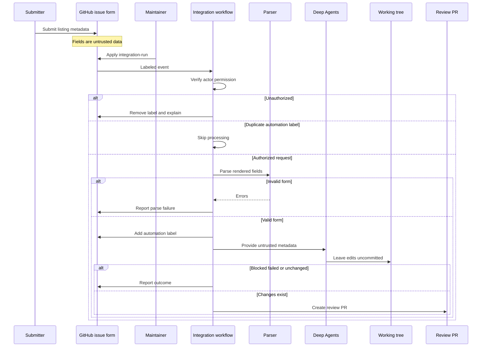

## Purpose and ownership boundaries

An **Integration listing** issue is the intake for a published third-party LangChain package. The form collects a display or class name, language, component, package name, documentation URL, repository, provider description, optional capability notes, and a publication confirmation. It applies `integration-submission` and `integration`; filing an issue does not start privileged automation.

The workflow turns a maintainer-approved request into a **review PR**, not an accepted listing or a package publication. Providers retain and publish their standalone integration packages. This repository records discoverability metadata and, only when eligible, hosts documentation.

The workflow crosses a deliberate trust boundary: rendered issue-form data is untrusted, while the GitHub Actions workflow has write permissions. The agent may make local documentation edits but must leave them uncommitted; the trusted workflow alone labels or comments on issues, creates the branch and PR, and comments on the PR.



This flow shows the maintainer gate and the separation between agent-owned working-tree changes and workflow-owned GitHub writes.

## Starting, authorizing, and parsing a submission

The workflow runs on an issue label event only when the label is `integration-run`, or from manual `workflow_dispatch` with an issue number. It serializes work in a per-issue concurrency group and deliberately does not cancel an active run. Before checkout, it queries the triggering actor's repository-collaborator permission; only `admin`, `maintain`, and `write` can proceed. For an unauthorized issue-label event it removes `integration-run`, explains why in a comment, and skips the job.

After authorization, the workflow retrieves the issue and skips it when it already has `integration-automation`. This label means automation is in progress or has already been attempted. It is added only after a successful parse, together with a start notification.

The parser maps the rendered `###` form headings to stable JSON keys. It strips optional no-response values, extracts checked confirmation text, and validates required sections plus a PyPI package for Python/Both or an npm package for TypeScript/Both. It does not execute or evaluate form values. Parse failure is reported on the issue and the agent is not run.

The workflow prompt and `submit-integration` skill both require treating every JSON field—including URLs, descriptions, and capability notes—as literal, **untrusted metadata**, not as instructions. The agent must not ask questions or wait for an author, may corroborate metadata with registries, READMEs, and public documentation, and should reserve `integration-submission-error.md` for a hard blocker where no reasonable listing can be made. It uses `submit-integration` from `.agents/skills/`; that directory takes precedence over the former `.deepagents/skills/` location.

## Decide the documentation outcome

A package with at least 50,000 monthly PyPI or npm downloads, or an explicit maintainer feature decision, may receive a hosted MDX guide. Below that threshold, the default is an **external listing**: no new hosted MDX page. Reaching the threshold does not itself make a guide `featured`; featured status is a maintainer decision.

| Outcome | Authored records | Generated or discovery surfaces | Key rule |
| --- | --- | --- | --- |
| Hosted guide | A matching `src/oss/{python,javascript}/integrations/<component>/TEMPLATE.mdx` derivative and its `integration:` frontmatter; relevant index or navigation changes | Component table snippets regenerated from frontmatter | Remove any duplicate external record for the same package. |
| External listing | A language/component row in `scripts/data/integration_external_docs.yaml`; optionally a qualifying `packages.yml` record | Component table snippets and applicable provider discovery cards | Do not create a hosted MDX page. |

These are distinct sources of truth:

- **External listing records** in `integration_external_docs.yaml` are canonical metadata for third-party rows: name, registry package, `docs_url`, and any verified component-specific flags.
- **Hosted guides** own their `integration:` frontmatter. The refresh script scans that frontmatter rather than using the external YAML for hosted rows.
- **Package metadata** in `packages.yml` is separate from both. It is the source of truth for LangChain package and repository records used by the package index and partner-package table; `highlight` is a maintainer-only override of download filtering.
- **Provider discovery cards** in the Python and JavaScript `all_providers.mdx` pages are authored MDX cards, not rows synthesized by the refresh script. The submission skill directs the agent to add an alphabetical card where applicable, with the supplied factual provider description and an existing provider icon or `icon="link"`.
- **Generator-owned artifacts** are the download and featured snippets under `src/snippets/oss/` and the Python provider overview regenerated by the scheduled workflow. Do not treat their rendered table text as the durable place to maintain an integration.

For an external row, the refresh script merges YAML entries with hosted-guide frontmatter for each language and component. External names link to `docs_url`; hosted names link to the local guide route. It sorts known download counts descending, then names. Chat, middleware, retriever, and vectorstore tables use their component-specific columns; unknown capability values remain unknown rather than being fabricated.

`docs_url` is a safety boundary. The generator permits `https://`, `http://`, and site-relative paths beginning with exactly one `/`; it rejects protocol-relative URLs and schemes such as `javascript:` or `data:`. The URL-check mode validates repository YAML without network access or writes. During collection, a missing external URL skips the row and an unsafe external URL raises an error rather than rendering an unsafe link.

## Agent handoff, outcomes, and review

For external listings, the skill measures registry downloads rather than inventing counts, prefers a valid supplied HTTP(S) documentation URL, and otherwise uses the documented fallback order. It can update the external YAML, the relevant download-table snippet, provider cards, and—when there is a public LangChain-related package and public `owner/repo`—`packages.yml`. Its instruction not to hand-edit generated overview tables means changes should be compatible with the refresh generator; the scheduled refresh will regenerate the snippets from YAML and hosted frontmatter after merge.

For hosted guides, it starts from the matching template, uses facts from the README, partner docs, and issue fields, updates appropriate index/navigation material, and removes any duplicate external YAML row. The PR is where maintainers review eligibility, URLs, generated output, provider cards, package records, and editorial judgment.

The workflow handles three no-PR outcomes:

- A present `integration-submission-error.md` is posted as a blocker explanation.
- An unsuccessful Deep Agents action produces a comment with the workflow run link.
- A successful action with neither staged nor unstaged changes produces a no-change comment.

For real changes, it removes a leftover blocker file and creates `integration/issue-<number>` with commit and title `docs: list <display name> integration`. The PR is labeled `integration`, assigned to the designated maintainer, closes the source issue, includes a review checklist, and mentions both the maintainer and issue author on the PR and source issue. A retry after parse failure, agent failure, or no-change requires removing `integration-automation` and having a maintainer apply `integration-run` again.

## Scheduled refresh and operations

`refresh_integration_downloads.py` is the generator for integration download and featured snippets. Its generated-file header says not to edit by hand. Run it after changing external YAML or hosted frontmatter when regenerated output needs to be included:

```bash
uv run python scripts/refresh_integration_downloads.py --write
```

The `update-package-downloads.yml` workflow runs every Sunday at 23:59 UTC and also supports manual dispatch. Its read-only generation job updates package download data, generates the partner package table, regenerates integration snippets, and checks external rows for hosted-docs candidates. It uploads `packages.yml`, the Python provider overview, and snippets as an artifact. A separate write-capable job creates and pushes a timestamped PR only when those tracked paths changed, then enables squash auto-merge.

The hosted-docs candidate task uses the same external YAML and 50,000-download threshold. With both `LINEAR_API_KEY` and `LINEAR_TEAM_KEY`, it creates Linear issues while deduplicating open issues by a stable title fragment; without either credential, the workflow performs a dry run.

Download fetching is deliberately resilient. npm and PyPI requests retry HTTP 429 up to six times with capped exponential backoff. Other request, parsing, or missing-data failures make that row's download data unavailable rather than failing collection of all tables.

Validate external documentation URLs locally before submitting a metadata change:

```bash
uv run python scripts/refresh_integration_downloads.py --check-docs-urls
```

CI runs the same check in a read-only job. Focused tests cover parser extraction and Python package requirements, plus accepted and rejected URL schemes, safe rendered links, validation of the repository YAML, and table-text normalization.

## Safe change checklist

1. Keep the maintainer authorization check before checkout and before any agent execution.
2. Preserve the distinction between untrusted issue data, agent-local edits, and GitHub writes performed only by the workflow.
3. Change external YAML or hosted frontmatter—not just generated output—then regenerate relevant snippets.
4. Do not merge an external row and hosted frontmatter that represent the same package.
5. Run the URL validation command and focused tests when touching parser or generator behavior.

## Related pages

- [Source Directory Map](/openwiki/architecture/source-map.md) — authored sources and generated artifacts.
- [GitHub Actions and CI/CD](/openwiki/integrations/github-actions.md) — workflow permissions and CI boundaries.
- [Adding pages](/openwiki/operations/adding-pages.md) — normal authored documentation changes.
- [Quickstart](/openwiki/quickstart.md) — setup and common checks.
- [Testing overview](/openwiki/testing/test-overview.md) — focused test conventions.
