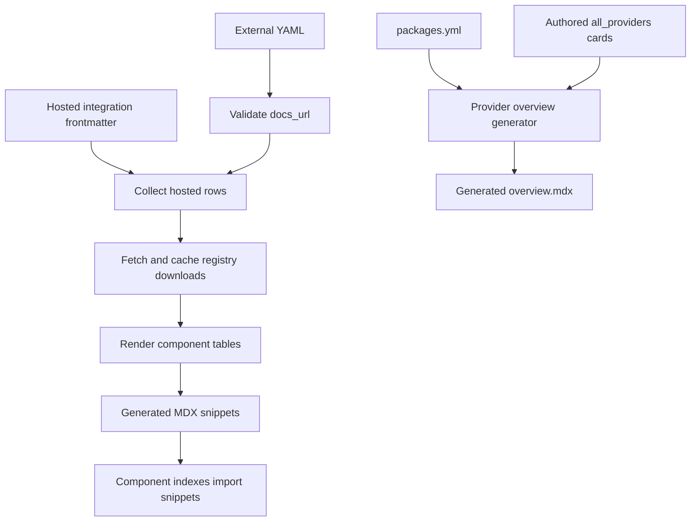
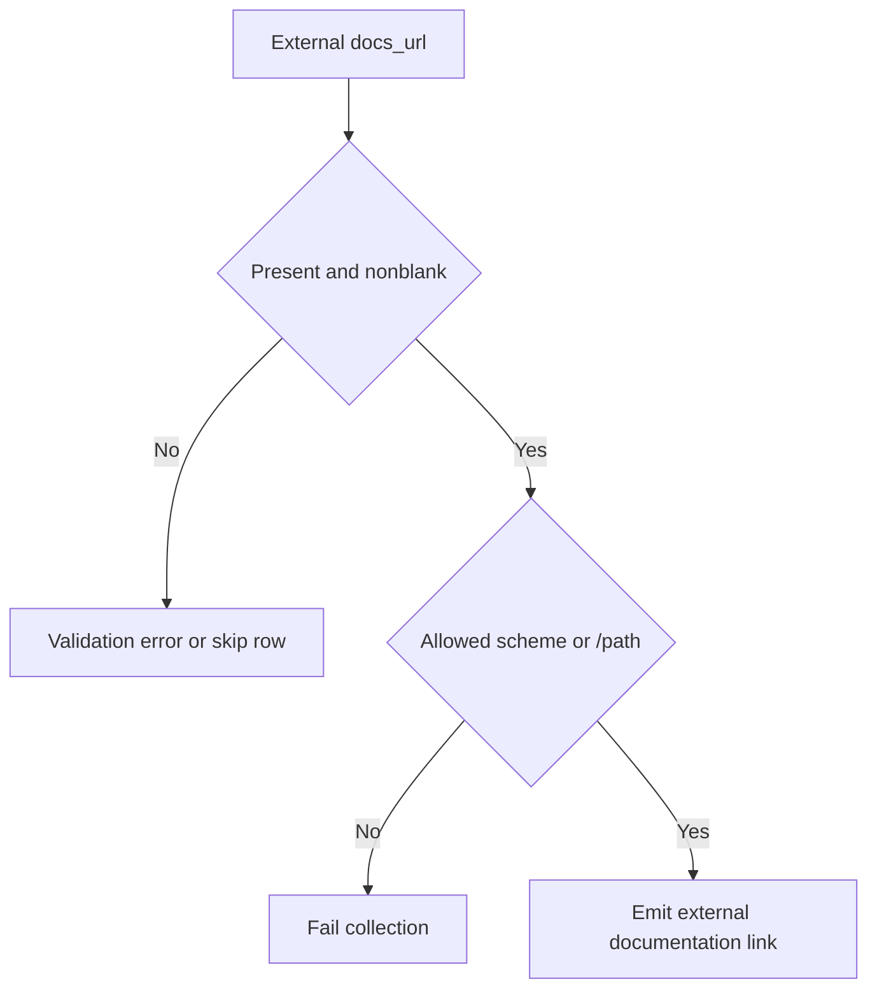
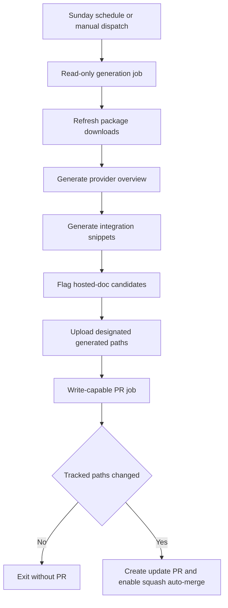

# Integration Listing Automation

Integration discovery is an input-to-output workflow. Maintainers edit listing metadata and authored provider cards; scripts render the public discovery surfaces. In particular, do not hand-edit generated download snippets or `src/oss/python/integrations/providers/overview.mdx`.

## Ownership and decision boundary

There are two paths to visibility:

- A package with at least 50,000 monthly downloads on its relevant registry—or an explicit maintainer featured decision—can receive a hosted MDX guide. Meeting the download threshold does **not** itself authorize `featured: true`.
- An integration below that threshold is an external listing: it is represented in external metadata and links readers to partner documentation rather than receiving a new hosted guide. When a listing is promoted, remove its duplicate external row.

Treat issue-form data, partner URLs, registry responses, and download values as untrusted inputs. The durable owners are:

| Owner | What it controls | Safe change |
| --- | --- | --- |
| `scripts/data/integration_external_docs.yaml` | External rows, grouped by language and component; names, registry packages, `docs_url`, and component-specific fields | Add, correct, or remove an external listing here. Prefer partner docs, then a public repository, then the registry page. |
| Hosted integration MDX frontmatter | The `integration:` metadata discovered from hosted pages under `src/oss/{python,javascript}/integrations/` | Change hosted-guide metadata here, rather than in a rendered table. |
| `packages.yml` | LangChain package and repository records, including downloads and maintainer-only `highlight` | Change package metadata here; `highlight` bypasses the overview cutoff and sorts ahead of ordinary entries. |
| `src/oss/python/integrations/providers/all_providers.mdx` | Authored provider cards and their links | Maintain cards when a provider should be discoverable or link resolution should use a partner destination. |

The external YAML is the canonical language/component source for external entries. A normal item has `name`, the relevant `pypi` or `npm` identifier, `docs_url`, and, where meaningful, capability values. The generator merges it with hosted `integration:` frontmatter, so a package omitted for one language can still be rendered as `N/A` rather than fabricated data.

## Listing-to-output flow


```mermaid
flowchart TD
    External["External YAML"] --> Validate["Validate docs_url"]
    Hosted["Hosted integration frontmatter"] --> Rows["Collect hosted rows"]
    Validate --> Rows
    Rows --> Fetch["Fetch and cache registry downloads"]
    Fetch --> Render["Render component tables"]
    Render --> Snippets["Generated MDX snippets"]
    Snippets --> Indexes["Component indexes import snippets"]
    Packages["packages.yml"] --> Overview["Provider overview generator"]
    Cards["Authored all_providers cards"] --> Overview
    Overview --> ProviderOutput["Generated overview.mdx"]
```

This shows the separate metadata owners feeding two generated discovery outputs.

`refresh_integration_downloads.py` supports Python and JavaScript and scans a fixed set of integration component directories. It ignores component `index.mdx` and templates, reads hosted frontmatter, adds the matching external rows, then sorts available counts descending and names secondarily; unavailable counts sort last. External names render as links to `docs_url`; hosted names resolve to the local integration route. The Python chat and document-loader landing pages, for example, import generated snippet MDX rather than duplicating the tables.

The table shape is component-aware. Chat tables render capability marks; middleware adds availability and source; retrievers add hosting and package fields; vectorstore capability columns appear only when at least one row provides that property. Numeric `data-sort-value` values give a usable initial/offline ordering while the client can refresh download badges. The generator writes an all-rows snippet for every nonempty supported component and a featured snippet for chat or a component with featured rows.

Run from the repository root:

```bash
uv run python scripts/refresh_integration_downloads.py --write
```

The generated header is an ownership marker, not a suggestion to patch the result. Review the regenerated diff for the right language/component, link destination, capability cells, and unavailable-download treatment; repair the input and rerun instead of editing a row in `src/snippets/oss/`.

## URL safety before emission

External URLs are a pre-emission security boundary. A `docs_url` must be `https://`, `http://`, or a site-relative path starting with exactly one `/`; protocol-relative `//…` paths and schemes such as `javascript:`, `data:`, and `vbscript:` are unsafe.


```mermaid
flowchart TD
    Value["External docs_url"] --> Present{"Present and nonblank"}
    Present -- No --> Missing["Validation error or skip row"]
    Present -- Yes --> Safe{"Allowed scheme or /path"}
    Safe -- No --> Reject["Fail collection"]
    Safe -- Yes --> Link["Emit external documentation link"]
```

This shows why an untrusted URL never becomes a generated external link.

During normal collection, a missing external URL is warned about and skipped; an unsafe URL raises an error. The dedicated validation mode reports both missing and unsafe entries without network calls or writes:

```bash
uv run python scripts/refresh_integration_downloads.py --check-docs-urls
```

CI runs this command with read-only repository permissions. Unit tests cover accepted and rejected schemes, fallback to an internal link when an unsafe value reaches rendering, repository-YAML validation, and table text normalization. The hosted-doc candidate flagger only requires a nonempty URL when collecting candidates; its Linear output is not evidence that the URL is safe to render.

Download lookup is deliberately best effort. npm and PyPI requests retry HTTP 429 up to six attempts with exponential backoff capped at 30 seconds, and lookup results are cached by registry/package during a run. Other request, parsing, or missing-data failures become unavailable download data for that row rather than terminating the entire table collection.

## Provider overview is a separate generated surface

`pipeline/tools/partner_pkg_table.py` generates `src/oss/python/integrations/providers/overview.mdx` from `packages.yml`. It excludes fixed core packages, includes records at 100,000 downloads or records marked `highlight`, orders highlighted records first and then downloads descending, and limits the result to 50 packages. A package cannot combine `has_reference_docs: true` with `integration: false`.

Provider-link resolution makes authored provider cards meaningful to generated output. The precedence is: an absolute `provider_page` in `packages.yml`, a hosted provider page from the explicit slug or short package name, a matching `all_providers.mdx` card href (including an external URL), the package repository, then PyPI. Thus, update the card or package metadata when correcting a provider destination, then regenerate:

```bash
uv run python pipeline/tools/partner_pkg_table.py
```

CI regenerates the overview and fails if the checked-in output changes. That check directs contributors to the generator or `packages.yml`, not manual edits to `overview.mdx`.

## Scheduled refresh and Linear follow-up


```mermaid
flowchart TD
    Trigger["Sunday schedule or manual dispatch"] --> Generator["Read-only generation job"]
    Generator --> Downloads["Refresh package downloads"]
    Downloads --> Provider["Generate provider overview"]
    Provider --> Tables["Generate integration snippets"]
    Tables --> Candidates["Flag hosted-doc candidates"]
    Candidates --> Artifact["Upload designated generated paths"]
    Artifact --> Writer["Write-capable PR job"]
    Writer --> Changed{"Tracked paths changed"}
    Changed -- No --> NoPR["Exit without PR"]
    Changed -- Yes --> PR["Create update PR and enable squash auto-merge"]
```

This shows the privilege boundary: generation has read-only contents access, while the later job is allowed to write a branch and pull request.

`update-package-downloads.yml` runs at 23:59 UTC every Sunday and can be manually dispatched. Its package refresher rejects duplicate package names, leaves records whose `downloads_updated_at` is less than 24 hours old unchanged, records a missing Pepy badge as zero, and timestamps refreshed records. The artifact handoff is intentionally narrow: `packages.yml`, the Python provider overview, and generated `*-downloads.mdx`/`*-featured.mdx` snippets. The writer job exits if those tracked paths are unchanged; otherwise it creates a timestamped `chore/update-package-downloads-…` branch, opens the PR, and enables squash auto-merge.

The same run evaluates external entries for hosted-guide follow-up. The candidate flagger defaults to the 50,000-download threshold, allows `--threshold`, and is dry-run unless both `LINEAR_API_KEY` and `LINEAR_TEAM_KEY` are available. Before creating a Linear issue, it searches using a stable title fragment that excludes the changing download count, preventing duplicate open work.

## Maintainer-triggered intake

The issue workflow is distinct from the weekly refresh. An Integration Listing form does not start privileged automation on issue creation: a maintainer must apply `integration-run`, and the workflow accepts only an actor with `admin`, `maintain`, or `write` permission. It uses a non-cancelling per-issue concurrency group and `integration-automation` to suppress duplicate processing.

After its parser succeeds, the workflow marks the issue, supplies the structured fields to the `submit-integration` agent as untrusted literal metadata, and requires the agent to leave working-tree changes uncommitted. The agent must not push, open a PR, or comment on GitHub. Hard blockers may produce `integration-submission-error.md`; soft uncertainty is left for PR review.

For a blocker file, an unsuccessful agent, or no diff, the workflow comments on the source issue and opens no pull request. For actual edits, it creates an `integration/issue-<number>` pull request with a checklist for the eligibility decision, docs URL/provider card, and generated surfaces, then comments with and mentions the PR. Retrying a parse, agent, or no-change outcome requires removing `integration-automation` and reapplying `integration-run`.

## Change checklist

1. Establish whether the integration is external or hosted from observed registry downloads and a maintainer feature decision; do not invent counts or capabilities.
2. Update the owning input—external YAML, hosted frontmatter, `packages.yml`, or an authored provider card—not a generated output.
3. For external metadata, run URL validation before regeneration:

   ```bash
   uv run python scripts/refresh_integration_downloads.py --check-docs-urls
   ```

4. Regenerate affected snippets with `--write`; also regenerate the provider overview when package metadata, provider-card matching, or its generator changes.
5. Review the generated diffs and run the focused URL tests when changing validation or rendering behavior:

   ```bash
   uv run pytest tests/unit_tests/test_refresh_integration_downloads.py
   ```

## Related pages

- [Source Directory Map](/openwiki/architecture/source-map.md)
- [GitHub Actions and CI/CD](/openwiki/integrations/github-actions.md)
- [CLI tools](/openwiki/operations/cli-tools.md)
- [Quickstart](/openwiki/quickstart.md)
- [Testing overview](/openwiki/testing/test-overview.md)
