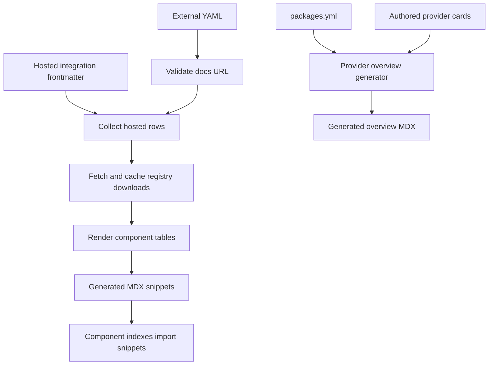
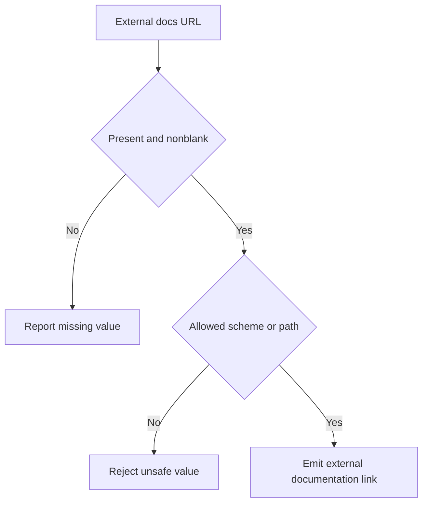
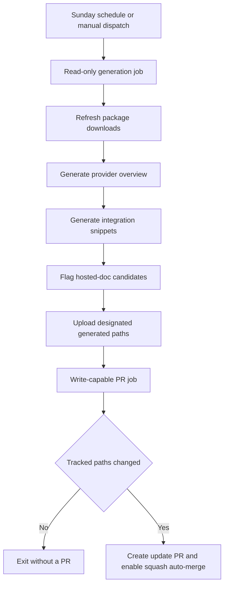

# Integration Listing Automation

Integration discovery is an input-to-output workflow. Maintainers change metadata and authored provider cards; generators render the public discovery surfaces. Do not hand-edit generated download snippets or `src/oss/python/integrations/providers/overview.mdx`: correct their inputs or generator and regenerate.

## Ownership and eligibility

There are two routes to visibility:

- A package with at least 50,000 monthly PyPI or npm downloads—or an explicit maintainer featured decision—can receive a hosted MDX guide. The threshold alone does **not** authorize `featured: true`.
- An integration below that threshold is an external listing: it links readers to partner documentation rather than receiving a hosted guide. When it is promoted to a hosted guide, remove the duplicate external YAML row.

| Owner | Controls | Safe change |
| --- | --- | --- |
| `scripts/data/integration_external_docs.yaml` | External entries grouped by language and component: name, registry package, `docs_url`, and optional component fields | Add, correct, or remove an external listing here. Prefer partner docs, then a public repository, then the registry page. |
| Hosted integration MDX frontmatter | `integration:` metadata discovered below `src/oss/{python,javascript}/integrations/` | Correct hosted-guide metadata here, not a rendered table. |
| `packages.yml` | LangChain package and repository records, including download counts and maintainer-only `highlight` | Correct package metadata here. `highlight` bypasses the overview download filter and sorts ahead of ordinary rows. |
| `src/oss/python/integrations/providers/all_providers.mdx` | Authored provider cards and destinations | Maintain a card when a provider should be discoverable or package link resolution should use its destination. |

The external YAML is the canonical source for external language/component rows. A typical row has `name`, the applicable `pypi` or `npm` identifier, `docs_url`, and known component capabilities. The download-table generator combines those rows with hosted `integration:` frontmatter; missing registry data renders as `N/A`, not invented data.

## From metadata to integration tables


```mermaid
flowchart TD
    External["External YAML"] --> Validate["Validate docs URL"]
    Hosted["Hosted integration frontmatter"] --> Collect["Collect hosted rows"]
    Validate --> Collect
    Collect --> Fetch["Fetch and cache registry downloads"]
    Fetch --> Render["Render component tables"]
    Render --> Snippets["Generated MDX snippets"]
    Snippets --> Indexes["Component indexes import snippets"]
    Packages["packages.yml"] --> Overview["Provider overview generator"]
    Cards["Authored provider cards"] --> Overview
    Overview --> Output["Generated overview MDX"]
```

This shows the separate ownership paths for generated table snippets and the provider overview.

`refresh_integration_downloads.py` scans supported component directories for Python and JavaScript, excluding `index.mdx`, templates, and example data. It reads hosted frontmatter, adds matching external rows, and sorts available download counts descending and names secondarily; unavailable values sort last. An external name links to its `docs_url`; a hosted name links to its local integration route. Python and JavaScript component landing pages import the resulting snippets, making those snippets public documentation dependencies rather than standalone files.

Tables are component-aware: chat has capability marks, middleware has availability and source, retrievers have hosting and package fields, and vectorstore columns appear only when a row declares them. The generator writes an all-rows snippet for every supported component that has rows and writes a featured snippet for chat or whenever a component has featured rows. Numeric `data-sort-value` attributes provide first-paint and offline ordering while the client can refresh badges.

Run from the repository root:

```bash
uv run python scripts/refresh_integration_downloads.py --write
```

By default the command prints generated tables instead of writing them. `--language` and `--component` can restrict a run to one supported language or component. The generated header is an ownership marker. Review the regenerated diff for language, component, link target, capability cells, and unavailable-download handling; repair metadata or generator logic and rerun rather than patching a row under `src/snippets/oss/`.

### URL validation is a pre-emission boundary

External URLs are untrusted input. A `docs_url` may be `https://`, `http://`, or a site-relative path beginning with exactly one `/`; protocol-relative `//…` paths and schemes such as `javascript:`, `data:`, and `vbscript:` are rejected.


```mermaid
flowchart TD
    Value["External docs URL"] --> Present{"Present and nonblank"}
    Present -- No --> Missing["Report missing value"]
    Present -- Yes --> Safe{"Allowed scheme or path"}
    Safe -- No --> Reject["Reject unsafe value"]
    Safe -- Yes --> Link["Emit external documentation link"]
```

This boundary prevents untrusted external URLs from becoming generated links.

During table collection, a missing external URL is warned about and that row is skipped; an unsafe URL stops collection with an error. The dedicated validation mode reports both missing and unsafe YAML entries without network calls or writes:

```bash
uv run python scripts/refresh_integration_downloads.py --check-docs-urls
```

CI runs that command in a read-only job. Focused unit tests cover accepted and rejected schemes, unsafe-link fallback, validation of repository YAML, and Markdown-cell text normalization.

Download lookup is deliberately best-effort. npm and PyPI fetches retry HTTP 429 up to six attempts with exponential backoff capped at 30 seconds. Results are cached by registry/package within a run; other request, parsing, or missing-data failures leave that row with unavailable downloads instead of aborting all table collection.

## Provider overview is a separate derived output

`pipeline/tools/partner_pkg_table.py` writes `src/oss/python/integrations/providers/overview.mdx` from `packages.yml`. It excludes fixed core packages, includes packages at 100,000 downloads or packages marked `highlight`, sorts highlighted packages first and then by downloads, and limits the result to 50. `has_reference_docs: true` cannot be combined with `integration: false`.

Provider links resolve in this order: an absolute `provider_page` in `packages.yml`; a hosted provider page from its configured slug or short package name; a matching `all_providers.mdx` card href, including an external URL; the declared repository; then PyPI. Therefore correct a provider destination in metadata or the authored card and regenerate:

```bash
uv run python pipeline/tools/partner_pkg_table.py
```

CI regenerates the overview and fails if it differs from the checked-in file, directing changes to `packages.yml` or `partner_pkg_table.py`, never manual edits to `overview.mdx`.

## Scheduled refresh and candidate follow-up


```mermaid
flowchart TD
    Trigger["Sunday schedule or manual dispatch"] --> Generation["Read-only generation job"]
    Generation --> Downloads["Refresh package downloads"]
    Downloads --> Provider["Generate provider overview"]
    Provider --> Tables["Generate integration snippets"]
    Tables --> Candidates["Flag hosted-doc candidates"]
    Candidates --> Artifact["Upload designated generated paths"]
    Artifact --> Writer["Write-capable PR job"]
    Writer --> Changed{"Tracked paths changed"}
    Changed -- No --> Stop["Exit without a PR"]
    Changed -- Yes --> PR["Create update PR and enable squash auto-merge"]
```

This shows the privilege boundary: generation has read-only contents permission, while the later job can write a branch and pull request.

`update-package-downloads.yml` runs at 23:59 UTC every Sunday and can also be manually dispatched. It first refreshes `packages.yml`, then generates the provider overview and integration snippets. The package refresher rejects duplicate package names, avoids refetching records updated in the preceding 24 hours, treats a missing Pepy badge as zero, and timestamps each refreshed record.

The artifact handoff is intentionally narrow: `packages.yml`, the Python provider overview, and generated `*-downloads.mdx` and `*-featured.mdx` snippets. The write-capable job exits when those tracked paths have no diff; otherwise it creates a timestamped `chore/update-package-downloads-…` branch, opens a PR, and enables squash auto-merge.

The same run flags external entries that meet the 50,000-download threshold for hosted-doc follow-up. The flagger permits `--threshold` and is dry-run unless both `LINEAR_API_KEY` and `LINEAR_TEAM_KEY` are configured. Before creating a Linear issue, it searches a stable title fragment that excludes the changing download count, preventing duplicate open work.

## Maintainer-triggered intake

The issue workflow is distinct from the weekly refresh. Applying `integration-run` starts an issue-triggered run only when its actor has `admin`, `maintain`, or `write` permission; issue creation alone cannot start it. A non-cancelling per-issue concurrency group plus the `integration-automation` label prevents duplicate processing.

After parsing succeeds, the workflow marks the issue and passes structured fields to the submission agent as untrusted literal metadata. The agent must leave edits uncommitted and must not push, open a PR, or comment. A blocker file, failed agent, or no diff results in an issue comment and no PR. For real edits, the workflow creates `integration/issue-<number>` with an eligibility, URL/provider-card, and generated-surface review checklist, then links and mentions the PR on the source issue.

## Safe change procedure

1. Decide whether the integration is external or hosted from registry downloads and a maintainer feature decision. Do not invent download counts or capabilities.
2. Change the owning input—external YAML, hosted frontmatter, `packages.yml`, an authored provider card, or generator code—not a derived output.
3. When external metadata changes, validate URLs:

   ```bash
   uv run python scripts/refresh_integration_downloads.py --check-docs-urls
   ```

4. Regenerate affected snippets with `--write`; regenerate the provider overview when package metadata, provider-card matching, or its generator changes.
5. Review the generated diff and, when changing validation or rendering behavior, run:

   ```bash
   uv run pytest tests/unit_tests/test_refresh_integration_downloads.py
   ```

## Related pages

- [Source Directory Map](/openwiki/architecture/source-map.md)
- [GitHub Actions and CI/CD](/openwiki/integrations/github-actions.md)
- [CLI tools](/openwiki/operations/cli-tools.md)
- [Quickstart](/openwiki/quickstart.md)
- [Testing overview](/openwiki/testing/test-overview.md)
